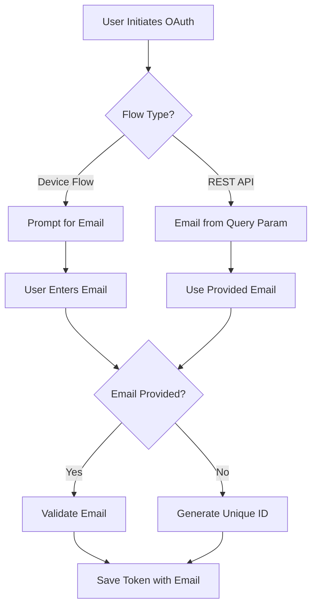

# Fix Qwen OAuth Email Tracking and Extraction

## Problem Summary

The Qwen OAuth token is being saved with a fallback email (`unknown@example.com`) instead of the actual user email. This makes it difficult to track and manage multiple tokens from different users.

### Current Behavior

1. OAuth callback receives token response from Qwen
2. Email extraction attempts to find email in token response
3. If not found, falls back to user info endpoint (`https://chat.qwen.ai/api/v1/user/info`)
4. User info endpoint returns 401 "session expired" error
5. Fallback email `unknown@example.com` is used
6. All tokens get the same email, making tracking impossible

### Log Evidence

```
2026/03/25 00:51:13 🐛 [DBG] [QwenEmailExtractor] Email not in token response, fetching from user info endpoint
2026/03/25 00:51:14 ℹ️  [INFO] [fetchEmailFromUserInfo] Response status code: 401
2026/03/25 00:51:14 ⚠️  [WARN] Failed to extract email for qwen: failed to fetch email from user info endpoint
2026/03/25 00:51:14 ℹ️  [INFO] Credentials saved successfully for provider qwen: unknown@example.com
```

## Root Cause Analysis

### Analysis of Reference Code

After analyzing code from another project that successfully handles Qwen OAuth, I found:

1. **Email is NOT in the OAuth token response** - The `QwenTokenResponse` struct only contains:
   - `access_token`
   - `refresh_token`
   - `token_type`
   - `resource_url`
   - `expires_in`

2. **User info endpoint doesn't work** - The 401 error confirms that the access token cannot be used to fetch user info

3. **The solution is to require user to provide email** - The reference project uses this approach:
   ```go
   email := ""
   if opts.Metadata != nil {
       email = opts.Metadata["email"]
       if email == "" {
           email = opts.Metadata["alias"]
       }
   }

   if email == "" && opts.Prompt != nil {
       email, err = opts.Prompt("Please input your email address or alias for Qwen:")
       if err != nil {
           return nil, err
       }
   }

   email = strings.TrimSpace(email)
   if email == "" {
       return nil, &EmailRequiredError{Prompt: "Please provide an email address or alias for Qwen."}
   }

   tokenStorage.Email = email
   ```

### Key Finding

**Qwen's OAuth does NOT provide email in any way**. The reference project:
- Does NOT try to extract email from token response
- Does NOT call user info endpoint
- **REQUIRES** user to provide email via metadata or prompt
- Returns error if email is not provided

## Solution Plan

### Approach: Require User to Provide Email

Since Qwen doesn't provide email via OAuth, we need to:
1. For **device flow** (interactive): Prompt user for email
2. For **REST API callback** (non-interactive): Accept email from query parameter or use unique identifier

### Phase 1: Update Device Flow to Prompt for Email

**Objective**: Prompt user for email when using device flow

**Files to modify**:
1. [`internal/provider/qwen/auth_device.go`](internal/provider/qwen/auth_device.go:134-138)

**Changes**:
```go
email, err := multiTokenMgr.ExtractEmail(ctx, "qwen", tokenResponse, oauth2Token.AccessToken)
if err != nil || email == "" {
    logger.InfoLog("[Qwen OAuth] Email not available from OAuth. Please provide your email for tracking.")
    fmt.Print("Please enter your email address (or leave empty for auto-generated ID): ")
    fmt.Scanln(&email)
    email = strings.TrimSpace(email)

    if email == "" {
        // Generate unique identifier based on token ID
        email = fmt.Sprintf("qwen-%s@local", uuid.New().String()[:8])
        logger.InfoLog("[Qwen OAuth] Using auto-generated email: %s", email)
    }
}
```

### Phase 2: Update REST API Callback to Accept Email Parameter

**Objective**: Accept email from query parameter in OAuth callback

**Files to modify**:
1. [`internal/restapi/rest_api.go`](internal/restapi/rest_api.go:726-815) - Update `handleCallback`

**Changes**:
```go
// Extract query parameters
code := r.URL.Query().Get("code")
state := r.URL.Query().Get("state")
errorCode := r.URL.Query().Get("error")
errorDesc := r.URL.Query().Get("error_description")
email := r.URL.Query().Get("email")  // NEW: Accept email from query parameter
```

```go
// Save credentials with email
if err := s.saveCredentials(oauthState.Provider, creds, tokenResponseMap, email); err != nil {
    s.logger.ErrorLog("[Callback] Failed to save credentials: %v", err)
    s.writeCallbackHTML(w, false, "save_failed", err.Error())
    return
}
```

2. Update `saveCredentials` to accept email parameter:
```go
func (s *Server) saveCredentials(providerID string, creds tokpkg.OAuthCreds, tokenResponse map[string]interface{}, providedEmail string) error {
    var email string

    // Use provided email if available
    if providedEmail != "" {
        email = strings.TrimSpace(providedEmail)
    } else {
        // Try to extract email from token
        extractedEmail, err := s.extractEmailFromToken(providerID, creds.AccessToken, tokenResponse)
        if err != nil {
            s.logger.WarnLog("Failed to extract email for %s: %v", providerID, err)
            // Generate unique identifier
            email = fmt.Sprintf("%s-%s@local", providerID, uuid.New().String()[:8])
        } else {
            email = extractedEmail
        }
    }

    // Validate email
    if email == "" {
        email = fmt.Sprintf("%s-%s@local", providerID, uuid.New().String()[:8])
    }

    // ... rest of function
}
```

### Phase 3: Update OAuth Authorization URL to Include Email

**Objective**: Include email parameter in authorization URL so it's available in callback

**Files to modify**:
1. [`internal/restapi/rest_api.go`](internal/restapi/rest_api.go) - Update OAuth flow initialization

**Changes**:
When generating authorization URL, include email parameter that will be passed back in callback:
```go
// Store email in state for later use
oauthState.Email = email  // Add Email field to OAuthState struct
```

### Phase 4: Update Dashboard to Accept Email Input

**Objective**: Allow user to enter email before OAuth flow

**Files to modify**:
1. [`internal/restapi/web/js/dashboard.js`](internal/restapi/web/js/dashboard.js) - Add email input field
2. [`internal/restapi/dashboard_handler.go`](internal/restapi/dashboard_handler.go) - Handle email parameter

**Changes**:
Add email input field to OAuth initiation:
```javascript
// Add email input before OAuth button
<input type="email" id="qwen-email" placeholder="Enter your email for tracking">

// Pass email to OAuth initiation
const email = document.getElementById('qwen-email').value;
const authUrl = `/auth/qwen?email=${encodeURIComponent(email)}`;
```

### Phase 5: Add Email Validation

**Objective**: Validate email format before saving

**Files to modify**:
1. [`internal/token/email_extraction.go`](internal/token/email_extraction.go:507-513) - Enhance `normalizeEmail`

**Changes**:
```go
func normalizeEmail(email string) string {
    if email == "" {
        return ""
    }
    email = strings.TrimSpace(strings.ToLower(email))

    // Basic email validation
    if !strings.Contains(email, "@") {
        return "" // Invalid email
    }

    return email
}
```

## Architecture Diagram



## Implementation Steps

### Step 1: Update Device Flow to Prompt for Email
- Modify [`internal/provider/qwen/auth_device.go`](internal/provider/qwen/auth_device.go) to prompt for email
- Add email validation
- Generate unique ID if email not provided

### Step 2: Update REST API Callback
- Modify [`internal/restapi/rest_api.go`](internal/restapi/rest_api.go) to accept email from query parameter
- Update `saveCredentials` to use provided email
- Generate unique ID if email not provided

### Step 3: Update OAuth State Management
- Add `Email` field to `OAuthState` struct
- Store email when initiating OAuth flow
- Retrieve email in callback

### Step 4: Update Dashboard UI
- Add email input field to dashboard
- Pass email to OAuth initiation endpoint
- Show email in token list

### Step 5: Test Both Flows
- Test device flow with email prompt
- Test REST API callback with email parameter
- Verify unique ID generation when email not provided
- Confirm email is saved correctly

### Step 6: Add Documentation
- Document that Qwen requires user to provide email
- Document email input requirements
- Document unique ID fallback behavior

## Risk Assessment

**Low Risk**:
- Prompting for email is backward compatible (can use unique ID fallback)
- Adding email parameter to callback is non-breaking
- Email validation is safe

**Medium Risk**:
- Device flow requires interactive terminal for email prompt
- Dashboard UI changes needed for email input

**Mitigation**:
- Keep unique ID fallback for non-interactive scenarios
- Make email prompt optional with unique ID fallback
- Test thoroughly with both flows

## Success Criteria

1. Device flow prompts user for email (interactive)
2. REST API callback accepts email from query parameter
3. Unique ID is generated when email not provided
4. Email is validated before saving
5. Multiple tokens can be distinguished by their email/identifier
6. Dashboard shows email for each token
7. Solution works for both REST API callback and device flow

## Related Files

- [`internal/restapi/rest_api.go`](internal/restapi/rest_api.go) - OAuth callback and token exchange
- [`internal/provider/qwen/auth_device.go`](internal/provider/qwen/auth_device.go) - Device flow authentication
- [`internal/token/email_extraction.go`](internal/token/email_extraction.go) - Email validation
- [`internal/restapi/web/js/dashboard.js`](internal/restapi/web/js/dashboard.js) - Dashboard UI
- [`internal/restapi/state_manager.go`](internal/restapi/state_manager.go) - OAuth state management

## Questions for User

1. Should email be required (error if not provided) or optional (use unique ID fallback)?
2. For device flow, should we prompt for email or always use unique ID?
3. Should we support both email and alias (like the reference project)?
