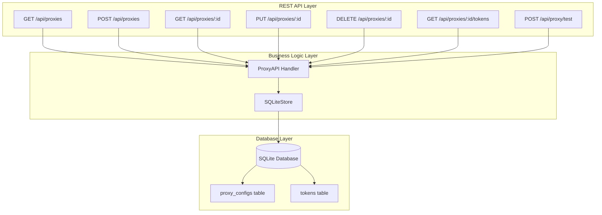

# Proxy Management - Backend Implementation Plan

## Overview
This plan covers the backend implementation for proxy management functionality, including database schema updates, CRUD operations, and REST API endpoints.

## Current State Analysis

### Existing Database Schema
The `proxy_configs` table already exists in the SQLite database:

```sql
CREATE TABLE IF NOT EXISTS proxy_configs (
    id TEXT PRIMARY KEY,
    host TEXT NOT NULL,
    port INTEGER NOT NULL,
    username TEXT,
    password TEXT,
    created_at INTEGER NOT NULL DEFAULT (strftime('%s', 'subsec') * 1000)
)
```

### Existing Token-Proxy Relationship
The `tokens` table has a `proxy_id` field that references proxy_configs:

```sql
-- tokens table has:
proxy_id TEXT
```

### What's Missing
1. `proxy_type` field in proxy_configs table (http, https, socks5)
2. CRUD operations for proxy_configs in SQLiteStore
3. REST API endpoints for proxy management

## Architecture Overview



## Implementation Plan

### Phase 1: Database Schema Updates

#### 1.1 Add Migration for proxy_type Field

**File:** `internal/token/sqlite_store.go`

Add a migration to add the `proxy_type` field to the proxy_configs table. This should be handled through the schema migrations system.

```go
// Migration to add proxy_type field
sqlAddProxyTypeMigration = `
    ALTER TABLE proxy_configs ADD COLUMN type TEXT NOT NULL DEFAULT 'http';
`
```

**Implementation Details:**
1. Check if the `type` column exists in proxy_configs table
2. If not, add the column with default value 'http'
3. Update the schema migrations table to track this change

#### 1.2 Update Schema Creation Statement

**File:** `internal/token/sqlite_store.go`

Update `sqlCreateProxyConfigsTable` to include the `type` field:

```go
sqlCreateProxyConfigsTable = `
    CREATE TABLE IF NOT EXISTS proxy_configs (
        id TEXT PRIMARY KEY,
        type TEXT NOT NULL DEFAULT 'http',
        host TEXT NOT NULL,
        port INTEGER NOT NULL,
        username TEXT,
        password TEXT,
        created_at INTEGER NOT NULL DEFAULT (strftime('%s', 'subsec') * 1000)
    )
`
```

#### 1.3 Ensure ProxyConfig Compatibility

**File:** `internal/token/proxy_config.go`

The existing `ProxyConfig` struct already has the `Type` field:

```go
type ProxyConfig struct {
    Type     ProxyType `json:"type"`
    Host     string    `json:"host"`
    Port     int       `json:"port"`
    Username string    `json:"username,omitempty"`
    Password string    `json:"password,omitempty"`
}
```

No changes needed here, but ensure database operations properly handle this field.

### Phase 2: Backend - Proxy CRUD Operations

#### 2.1 Add GetProxy Method

**File:** `internal/token/sqlite_store.go`

```go
// GetProxy retrieves a proxy configuration by ID
func (s *SQLiteStore) GetProxy(proxyID string) (*ProxyConfig, error) {
    s.mu.RLock()
    defer s.mu.RUnlock()

    query := `
        SELECT id, type, host, port, username, password, created_at
        FROM proxy_configs
        WHERE id = ?
    `

    var proxy ProxyConfig
    var createdAt int64
    var username, password sql.NullString

    err := s.db.QueryRow(query, proxyID).Scan(
        &proxy.ID,
        &proxy.Type,
        &proxy.Host,
        &proxy.Port,
        &username,
        &password,
        &createdAt,
    )

    if err == sql.ErrNoRows {
        return nil, fmt.Errorf("proxy not found: %s", proxyID)
    }
    if err != nil {
        return nil, fmt.Errorf("failed to get proxy: %w", err)
    }

    if username.Valid {
        proxy.Username = username.String
    }
    if password.Valid {
        proxy.Password = password.String
    }

    return &proxy, nil
}
```

#### 2.2 Add ListProxies Method

**File:** `internal/token/sqlite_store.go`

```go
// ListProxies retrieves all proxy configurations
func (s *SQLiteStore) ListProxies() ([]ProxyConfig, error) {
    s.mu.RLock()
    defer s.mu.RUnlock()

    query := `
        SELECT id, type, host, port, username, password, created_at
        FROM proxy_configs
        ORDER BY created_at DESC
    `

    rows, err := s.db.Query(query)
    if err != nil {
        return nil, fmt.Errorf("failed to list proxies: %w", err)
    }
    defer rows.Close()

    var proxies []ProxyConfig

    for rows.Next() {
        var proxy ProxyConfig
        var createdAt int64
        var username, password sql.NullString

        err := rows.Scan(
            &proxy.ID,
            &proxy.Type,
            &proxy.Host,
            &proxy.Port,
            &username,
            &password,
            &createdAt,
        )

        if err != nil {
            return nil, fmt.Errorf("failed to scan proxy: %w", err)
        }

        if username.Valid {
            proxy.Username = username.String
        }
        if password.Valid {
            proxy.Password = password.String
        }

        proxies = append(proxies, proxy)
    }

    if err = rows.Err(); err != nil {
        return nil, fmt.Errorf("error iterating proxies: %w", err)
    }

    return proxies, nil
}
```

#### 2.3 Add AddProxy Method

**File:** `internal/token/sqlite_store.go`

```go
// AddProxy adds a new proxy configuration
func (s *SQLiteStore) AddProxy(proxy ProxyConfig) error {
    s.mu.Lock()
    defer s.mu.Unlock()

    // Validate proxy configuration
    if err := proxy.Validate(); err != nil {
        return fmt.Errorf("invalid proxy configuration: %w", err)
    }

    // Generate ID if not provided
    if proxy.ID == "" {
        proxy.ID = uuid.New().String()
    }

    query := `
        INSERT INTO proxy_configs (id, type, host, port, username, password, created_at)
        VALUES (?, ?, ?, ?, ?, ?, ?)
    `

    result, err := s.db.Exec(
        query,
        proxy.ID,
        proxy.Type,
        proxy.Host,
        proxy.Port,
        nullString(proxy.Username),
        nullString(proxy.Password),
        time.Now().UnixMilli(),
    )

    if err != nil {
        return fmt.Errorf("failed to add proxy: %w", err)
    }

    rowsAffected, err := result.RowsAffected()
    if err != nil {
        return fmt.Errorf("failed to get rows affected: %w", err)
    }

    if rowsAffected == 0 {
        return fmt.Errorf("no rows affected when adding proxy")
    }

    return nil
}

// Helper function to convert string to sql.NullString
func nullString(s string) sql.NullString {
    if s == "" {
        return sql.NullString{Valid: false}
    }
    return sql.NullString{String: s, Valid: true}
}
```

#### 2.4 Add UpdateProxy Method

**File:** `internal/token/sqlite_store.go`

```go
// UpdateProxy updates an existing proxy configuration
func (s *SQLiteStore) UpdateProxy(proxyID string, proxy ProxyConfig) error {
    s.mu.Lock()
    defer s.mu.Unlock()

    // Validate proxy configuration
    if err := proxy.Validate(); err != nil {
        return fmt.Errorf("invalid proxy configuration: %w", err)
    }

    query := `
        UPDATE proxy_configs
        SET type = ?, host = ?, port = ?, username = ?, password = ?
        WHERE id = ?
    `

    result, err := s.db.Exec(
        query,
        proxy.Type,
        proxy.Host,
        proxy.Port,
        nullString(proxy.Username),
        nullString(proxy.Password),
        proxyID,
    )

    if err != nil {
        return fmt.Errorf("failed to update proxy: %w", err)
    }

    rowsAffected, err := result.RowsAffected()
    if err != nil {
        return fmt.Errorf("failed to get rows affected: %w", err)
    }

    if rowsAffected == 0 {
        return fmt.Errorf("proxy not found: %s", proxyID)
    }

    return nil
}
```

#### 2.5 Add DeleteProxy Method

**File:** `internal/token/sqlite_store.go`

```go
// DeleteProxy deletes a proxy configuration by ID
// This will cascade by setting proxy_id to NULL for all linked tokens
func (s *SQLiteStore) DeleteProxy(proxyID string) error {
    s.mu.Lock()
    defer s.mu.Unlock()

    // Start transaction
    tx, err := s.db.Begin()
    if err != nil {
        return fmt.Errorf("failed to begin transaction: %w", err)
    }
    defer tx.Rollback()

    // First, update all tokens that reference this proxy to set proxy_id to NULL
    updateTokensQuery := `
        UPDATE tokens
        SET proxy_id = NULL
        WHERE proxy_id = ?
    `

    _, err = tx.Exec(updateTokensQuery, proxyID)
    if err != nil {
        return fmt.Errorf("failed to unlink tokens from proxy: %w", err)
    }

    // Then delete the proxy
    deleteProxyQuery := `
        DELETE FROM proxy_configs
        WHERE id = ?
    `

    result, err := tx.Exec(deleteProxyQuery, proxyID)
    if err != nil {
        return fmt.Errorf("failed to delete proxy: %w", err)
    }

    rowsAffected, err := result.RowsAffected()
    if err != nil {
        return fmt.Errorf("failed to get rows affected: %w", err)
    }

    if rowsAffected == 0 {
        return fmt.Errorf("proxy not found: %s", proxyID)
    }

    // Commit transaction
    if err = tx.Commit(); err != nil {
        return fmt.Errorf("failed to commit transaction: %w", err)
    }

    return nil
}
```

#### 2.6 Add GetTokensByProxy Method

**File:** `internal/token/sqlite_store.go`

```go
// GetTokensByProxy retrieves all tokens linked to a specific proxy
func (s *SQLiteStore) GetTokensByProxy(proxyID string) ([]ProviderToken, error) {
    s.mu.RLock()
    defer s.mu.RUnlock()

    query := `
        SELECT id, access_token, refresh_token, token_type, expiry_date, email,
               resource_url, scope, api_key, project_id, healthy, health_score,
               last_used, created_at, error_count, last_error, proxy_id
        FROM tokens
        WHERE proxy_id = ?
        ORDER BY created_at DESC
    `

    rows, err := s.db.Query(query, proxyID)
    if err != nil {
        return nil, fmt.Errorf("failed to get tokens by proxy: %w", err)
    }
    defer rows.Close()

    var tokens []ProviderToken

    for rows.Next() {
        token, err := s.scanToken(rows)
        if err != nil {
            return nil, fmt.Errorf("failed to scan token: %w", err)
        }
        tokens = append(tokens, token)
    }

    if err = rows.Err(); err != nil {
        return nil, fmt.Errorf("error iterating tokens: %w", err)
    }

    return tokens, nil
}
```

#### 2.7 Add GetProxyTokenCount Method

**File:** `internal/token/sqlite_store.go`

```go
// GetProxyTokenCount returns the number of tokens linked to a proxy
func (s *SQLiteStore) GetProxyTokenCount(proxyID string) (int, error) {
    s.mu.RLock()
    defer s.mu.RUnlock()

    query := `
        SELECT COUNT(*)
        FROM tokens
        WHERE proxy_id = ?
    `

    var count int
    err := s.db.QueryRow(query, proxyID).Scan(&count)
    if err != nil {
        return 0, fmt.Errorf("failed to get proxy token count: %w", err)
    }

    return count, nil
}
```

### Phase 3: Backend - REST API Endpoints

#### 3.1 Create Proxy API Handler File

**File:** `internal/restapi/proxy_api.go` (NEW FILE)

Create a new file to handle all proxy-related API endpoints.

```go
// Package restapi provides REST API endpoints for proxy management
package restapi

import (
    "encoding/json"
    "fmt"
    "net/http"
    "strconv"

    tokpkg "github.com/sunbankio/qwencoder-proxy/internal/token"
    "github.com/google/uuid"
)

// ProxyInfo represents proxy information for API responses
type ProxyInfo struct {
    ID         string `json:"id"`
    Type       string `json:"type"`
    Host       string `json:"host"`
    Port       int    `json:"port"`
    Username   string `json:"username,omitempty"`
    CreatedAt  int64  `json:"created_at"`
    TokenCount int    `json:"token_count"`
}

// ProxyRequest represents a request to create or update a proxy
type ProxyRequest struct {
    Type     string `json:"type"`
    Host     string `json:"host"`
    Port     int    `json:"port"`
    Username string `json:"username,omitempty"`
    Password string `json:"password,omitempty"`
}

// ProxyTokensResponse represents the response for tokens linked to a proxy
type ProxyTokensResponse struct {
    ProxyID string                `json:"proxy_id"`
    Tokens  []ProviderTokenInfo   `json:"tokens"`
}
```

#### 3.2 GET /api/proxies - List All Proxies

```go
// handleListProxies handles GET /api/proxies
func (s *Server) handleListProxies(w http.ResponseWriter, r *http.Request) {
    if r.Method != http.MethodGet {
        WriteError(w, http.StatusMethodNotAllowed, "method_not_allowed", "Only GET method is allowed")
        return
    }

    // Get all stores (one per provider)
    // Since proxy_configs is shared across all providers, we can use any store
    store, err := s.getTokenStore("qwen") // Use qwen as default to get a store
    if err != nil {
        WriteError(w, http.StatusInternalServerError, "store_error", err.Error())
        return
    }

    // List all proxies
    proxies, err := store.ListProxies()
    if err != nil {
        WriteError(w, http.StatusInternalServerError, "list_failed", err.Error())
        return
    }

    // Build response with token counts
    proxyInfos := make([]ProxyInfo, 0, len(proxies))
    for _, proxy := range proxies {
        tokenCount, err := store.GetProxyTokenCount(proxy.ID)
        if err != nil {
            s.logger.WarnLog("Failed to get token count for proxy %s: %v", proxy.ID, err)
            tokenCount = 0
        }

        proxyInfos = append(proxyInfos, ProxyInfo{
            ID:         proxy.ID,
            Type:       string(proxy.Type),
            Host:       proxy.Host,
            Port:       proxy.Port,
            Username:   proxy.Username,
            CreatedAt:  0, // We don't have created_at in ProxyConfig
            TokenCount: tokenCount,
        })
    }

    WriteJSON(w, http.StatusOK, map[string]interface{}{
        "proxies": proxyInfos,
    })
}
```

#### 3.3 POST /api/proxies - Add New Proxy

```go
// handleAddProxy handles POST /api/proxies
func (s *Server) handleAddProxy(w http.ResponseWriter, r *http.Request) {
    if r.Method != http.MethodPost {
        WriteError(w, http.StatusMethodNotAllowed, "method_not_allowed", "Only POST method is allowed")
        return
    }

    // Parse request body
    var req ProxyRequest
    if err := ParseJSON(r, &req); err != nil {
        WriteError(w, http.StatusBadRequest, "invalid_request", err.Error())
        return
    }

    // Validate required fields
    if req.Host == "" {
        WriteError(w, http.StatusBadRequest, "invalid_request", "Host is required")
        return
    }

    if req.Port <= 0 || req.Port > 65535 {
        WriteError(w, http.StatusBadRequest, "invalid_request", "Port must be between 1 and 65535")
        return
    }

    // Set default proxy type
    if req.Type == "" {
        req.Type = "http"
    }

    // Validate proxy type
    proxyType := tokpkg.ProxyType(req.Type)
    if err := proxyType.Validate(); err != nil {
        WriteError(w, http.StatusBadRequest, "invalid_request", fmt.Sprintf("Invalid proxy type: %s", req.Type))
        return
    }

    // Create proxy configuration
    proxy := tokpkg.ProxyConfig{
        ID:       uuid.New().String(),
        Type:     proxyType,
        Host:     req.Host,
        Port:     req.Port,
        Username: req.Username,
        Password: req.Password,
    }

    // Get a store to add the proxy
    store, err := s.getTokenStore("qwen")
    if err != nil {
        WriteError(w, http.StatusInternalServerError, "store_error", err.Error())
        return
    }

    // Add proxy
    if err := store.AddProxy(proxy); err != nil {
        WriteError(w, http.StatusInternalServerError, "add_failed", err.Error())
        return
    }

    s.logger.InfoLog("[Proxy] Added proxy: %s (%s://%s:%d)", proxy.ID, proxy.Type, proxy.Host, proxy.Port)

    WriteJSON(w, http.StatusCreated, map[string]interface{}{
        "id":      proxy.ID,
        "message": "Proxy added successfully",
    })
}
```

#### 3.4 GET /api/proxies/{id} - Get Proxy Details

```go
// handleGetProxy handles GET /api/proxies/{id}
func (s *Server) handleGetProxy(w http.ResponseWriter, r *http.Request) {
    if r.Method != http.MethodGet {
        WriteError(w, http.StatusMethodNotAllowed, "method_not_allowed", "Only GET method is allowed")
        return
    }

    // Extract proxy ID from path
    proxyID := extractProxyID(r.URL.Path)
    if proxyID == "" {
        WriteError(w, http.StatusBadRequest, "invalid_request", "Proxy ID is required")
        return
    }

    // Get a store
    store, err := s.getTokenStore("qwen")
    if err != nil {
        WriteError(w, http.StatusInternalServerError, "store_error", err.Error())
        return
    }

    // Get proxy
    proxy, err := store.GetProxy(proxyID)
    if err != nil {
        WriteError(w, http.StatusNotFound, "not_found", err.Error())
        return
    }

    // Get token count
    tokenCount, err := store.GetProxyTokenCount(proxyID)
    if err != nil {
        s.logger.WarnLog("Failed to get token count for proxy %s: %v", proxyID, err)
        tokenCount = 0
    }

    WriteJSON(w, http.StatusOK, ProxyInfo{
        ID:         proxy.ID,
        Type:       string(proxy.Type),
        Host:       proxy.Host,
        Port:       proxy.Port,
        Username:   proxy.Username,
        TokenCount: tokenCount,
    })
}

// extractProxyID extracts the proxy ID from the URL path
func extractProxyID(path string) string {
    // Path format: /api/proxies/{id}
    parts := splitPath(path)
    if len(parts) >= 4 && parts[2] == "proxies" {
        return parts[3]
    }
    return ""
}

// splitPath splits a URL path into components
func splitPath(path string) []string {
    parts := []string{}
    current := ""
    for _, ch := range path {
        if ch == '/' {
            if current != "" {
                parts = append(parts, current)
                current = ""
            }
        } else {
            current += string(ch)
        }
    }
    if current != "" {
        parts = append(parts, current)
    }
    return parts
}
```

#### 3.5 PUT /api/proxies/{id} - Update Proxy

```go
// handleUpdateProxy handles PUT /api/proxies/{id}
func (s *Server) handleUpdateProxy(w http.ResponseWriter, r *http.Request) {
    if r.Method != http.MethodPut {
        WriteError(w, http.StatusMethodNotAllowed, "method_not_allowed", "Only PUT method is allowed")
        return
    }

    // Extract proxy ID from path
    proxyID := extractProxyID(r.URL.Path)
    if proxyID == "" {
        WriteError(w, http.StatusBadRequest, "invalid_request", "Proxy ID is required")
        return
    }

    // Parse request body
    var req ProxyRequest
    if err := ParseJSON(r, &req); err != nil {
        WriteError(w, http.StatusBadRequest, "invalid_request", err.Error())
        return
    }

    // Validate required fields
    if req.Host == "" {
        WriteError(w, http.StatusBadRequest, "invalid_request", "Host is required")
        return
    }

    if req.Port <= 0 || req.Port > 65535 {
        WriteError(w, http.StatusBadRequest, "invalid_request", "Port must be between 1 and 65535")
        return
    }

    // Validate proxy type
    proxyType := tokpkg.ProxyType(req.Type)
    if err := proxyType.Validate(); err != nil {
        WriteError(w, http.StatusBadRequest, "invalid_request", fmt.Sprintf("Invalid proxy type: %s", req.Type))
        return
    }

    // Create proxy configuration
    proxy := tokpkg.ProxyConfig{
        Type:     proxyType,
        Host:     req.Host,
        Port:     req.Port,
        Username: req.Username,
        Password: req.Password,
    }

    // Get a store
    store, err := s.getTokenStore("qwen")
    if err != nil {
        WriteError(w, http.StatusInternalServerError, "store_error", err.Error())
        return
    }

    // Update proxy
    if err := store.UpdateProxy(proxyID, proxy); err != nil {
        WriteError(w, http.StatusInternalServerError, "update_failed", err.Error())
        return
    }

    s.logger.InfoLog("[Proxy] Updated proxy: %s (%s://%s:%d)", proxyID, proxy.Type, proxy.Host, proxy.Port)

    WriteJSON(w, http.StatusOK, map[string]interface{}{
        "message": "Proxy updated successfully",
    })
}
```

#### 3.6 DELETE /api/proxies/{id} - Delete Proxy

```go
// handleDeleteProxy handles DELETE /api/proxies/{id}
func (s *Server) handleDeleteProxy(w http.ResponseWriter, r *http.Request) {
    if r.Method != http.MethodDelete {
        WriteError(w, http.StatusMethodNotAllowed, "method_not_allowed", "Only DELETE method is allowed")
        return
    }

    // Extract proxy ID from path
    proxyID := extractProxyID(r.URL.Path)
    if proxyID == "" {
        WriteError(w, http.StatusBadRequest, "invalid_request", "Proxy ID is required")
        return
    }

    // Get a store
    store, err := s.getTokenStore("qwen")
    if err != nil {
        WriteError(w, http.StatusInternalServerError, "store_error", err.Error())
        return
    }

    // Check if proxy exists
    proxy, err := store.GetProxy(proxyID)
    if err != nil {
        WriteError(w, http.StatusNotFound, "not_found", err.Error())
        return
    }

    // Get token count before deletion
    tokenCount, err := store.GetProxyTokenCount(proxyID)
    if err != nil {
        s.logger.WarnLog("Failed to get token count for proxy %s: %v", proxyID, err)
    }

    // Delete proxy (will cascade by setting proxy_id to NULL for linked tokens)
    if err := store.DeleteProxy(proxyID); err != nil {
        WriteError(w, http.StatusInternalServerError, "delete_failed", err.Error())
        return
    }

    s.logger.InfoLog("[Proxy] Deleted proxy: %s (%s://%s:%d) - unlinked %d tokens",
        proxyID, proxy.Type, proxy.Host, proxy.Port, tokenCount)

    WriteJSON(w, http.StatusOK, map[string]interface{}{
        "message": fmt.Sprintf("Proxy deleted successfully. %d tokens unlinked.", tokenCount),
    })
}
```

#### 3.7 GET /api/proxies/{id}/tokens - Get Linked Tokens

```go
// handleGetProxyTokens handles GET /api/proxies/{id}/tokens
func (s *Server) handleGetProxyTokens(w http.ResponseWriter, r *http.Request) {
    if r.Method != http.MethodGet {
        WriteError(w, http.StatusMethodNotAllowed, "method_not_allowed", "Only GET method is allowed")
        return
    }

    // Extract proxy ID from path
    proxyID := extractProxyID(r.URL.Path)
    if proxyID == "" {
        WriteError(w, http.StatusBadRequest, "invalid_request", "Proxy ID is required")
        return
    }

    // Get a store
    store, err := s.getTokenStore("qwen")
    if err != nil {
        WriteError(w, http.StatusInternalServerError, "store_error", err.Error())
        return
    }

    // Check if proxy exists
    _, err = store.GetProxy(proxyID)
    if err != nil {
        WriteError(w, http.StatusNotFound, "not_found", err.Error())
        return
    }

    // Get linked tokens
    tokens, err := store.GetTokensByProxy(proxyID)
    if err != nil {
        WriteError(w, http.StatusInternalServerError, "get_tokens_failed", err.Error())
        return
    }

    // Convert to token info
    tokenInfos := make([]ProviderTokenInfo, 0, len(tokens))
    for _, token := range tokens {
        tokenInfos = append(tokenInfos, s.providerTokenToInfo(token))
    }

    WriteJSON(w, http.StatusOK, ProxyTokensResponse{
        ProxyID: proxyID,
        Tokens:  tokenInfos,
    })
}
```

### Phase 4: Register API Routes

#### 4.1 Update registerRoutes Method

**File:** `internal/restapi/rest_api.go`

Add proxy API routes to the `registerRoutes` method:

```go
// registerRoutes registers all API routes
func (s *Server) registerRoutes(mux *http.ServeMux) {
    // Provider discovery
    mux.HandleFunc("/api/providers", s.handleProviders)
    mux.HandleFunc("/api/providers/", s.handleProviderConfig)

    // Device code flow
    mux.HandleFunc("/api/device/start", s.handleDeviceStart)
    mux.HandleFunc("/api/device/status/", s.handleDeviceStatus)

    // Authorization code flow
    mux.HandleFunc("/api/auth/start", s.handleAuthStart)
    mux.HandleFunc("/api/callback", s.handleCallback)

    // Token management
    mux.HandleFunc("/api/token/", s.handleToken)

    // Credentials management
    mux.HandleFunc("/api/credentials", s.handleCredentials)
    mux.HandleFunc("/api/credentials/", s.handleProviderCredentials)

    // Proxy management (NEW)
    mux.HandleFunc("/api/proxies", s.handleListProxies)
    mux.HandleFunc("/api/proxies/", s.handleProxy)

    // Proxy connection test
    mux.HandleFunc("/api/proxy/test", s.handleProxyTest)

    // Rate limit management
    if s.rateLimitManager != nil {
        rateLimitAPI := NewRateLimitAPI(s.rateLimitManager, s.logger, s.cacheInvalidator)
        rateLimitAPI.RegisterRoutes(mux)
        s.logger.InfoLog("[registerRoutes] Rate limit API routes registered")
    }

    // Cache management API
    if s.cacheInvalidator != nil {
        cacheAPI := NewCacheAPI(s.cacheInvalidator, s.logger)
        cacheAPI.RegisterRoutes(mux)
        s.logger.InfoLog("[registerRoutes] Cache management API routes registered")
    }
}
```

#### 4.2 Add handleProxy Router

**File:** `internal/restapi/proxy_api.go`

Add a router function to handle all /api/proxies/ routes:

```go
// handleProxy handles all /api/proxies/ routes
func (s *Server) handleProxy(w http.ResponseWriter, r *http.Request) {
    // Extract proxy ID from path
    proxyID := extractProxyID(r.URL.Path)

    // Check if this is a tokens request
    if len(r.URL.Path) > len("/api/proxies/") && strings.HasSuffix(r.URL.Path, "/tokens") {
        s.handleGetProxyTokens(w, r)
        return
    }

    // If no proxy ID, return 404
    if proxyID == "" {
        WriteError(w, http.StatusNotFound, "not_found", "Proxy ID is required")
        return
    }

    // Route based on method
    switch r.Method {
    case http.MethodGet:
        s.handleGetProxy(w, r)
    case http.MethodPut:
        s.handleUpdateProxy(w, r)
    case http.MethodDelete:
        s.handleDeleteProxy(w, r)
    default:
        WriteError(w, http.StatusMethodNotAllowed, "method_not_allowed", "Method not allowed")
    }
}
```

### Phase 5: Dashboard Handler Updates

#### 5.1 Add ServeProxies Method

**File:** `internal/restapi/dashboard_handler.go`

```go
// ServeProxies serves the proxy management page
func (h *DashboardHandler) ServeProxies(w http.ResponseWriter, r *http.Request) {
    // Only serve proxies.html for /proxies path
    if r.URL.Path != "/proxies" {
        http.NotFound(w, r)
        return
    }

    // Read proxies.html into memory
    proxiesHTML, err := fs.ReadFile(h.webFS, "web/proxies.html")
    if err != nil {
        http.NotFound(w, r)
        return
    }

    w.Header().Set("Content-Type", "text/html; charset=utf-8")
    w.WriteHeader(http.StatusOK)
    w.Write(proxiesHTML)
}
```

#### 5.2 Update DashboardHandler Constructor

**File:** `internal/restapi/dashboard_handler.go`

Update `NewDashboardHandler` to read proxies.html:

```go
// NewDashboardHandler creates a new dashboard handler
func NewDashboardHandler(logger logging.Logger) (*DashboardHandler, error) {
    // Create subdirectory filesystems
    cssFS, err := fs.Sub(webFS, "web/css")
    if err != nil {
        return nil, fmt.Errorf("failed to create CSS subdirectory: %w", err)
    }

    jsFS, err := fs.Sub(webFS, "web/js")
    if err != nil {
        return nil, fmt.Errorf("failed to create JS subdirectory: %w", err)
    }

    // Read HTML files into memory for faster serving
    indexHTML, err := fs.ReadFile(webFS, "web/index.html")
    if err != nil {
        return nil, fmt.Errorf("failed to read index.html: %w", err)
    }

    tokensHTML, err := fs.ReadFile(webFS, "web/tokens.html")
    if err != nil {
        return nil, fmt.Errorf("failed to read tokens.html: %w", err)
    }

    proxiesHTML, err := fs.ReadFile(webFS, "web/proxies.html")
    if err != nil {
        return nil, fmt.Errorf("failed to read proxies.html: %w", err)
    }

    return &DashboardHandler{
        logger:      logger,
        webFS:       webFS,
        cssFS:       cssFS,
        jsFS:        jsFS,
        indexHTML:   indexHTML,
        tokensHTML:  tokensHTML,
        proxiesHTML: proxiesHTML,
    }, nil
}
```

#### 5.3 Update DashboardHandler Struct

**File:** `internal/restapi/dashboard_handler.go`

Add proxiesHTML field:

```go
// DashboardHandler handles HTTP requests for the dashboard
type DashboardHandler struct {
    logger      logging.Logger
    webFS       fs.FS
    cssFS       fs.FS
    jsFS        fs.FS
    indexHTML   []byte
    tokensHTML  []byte
    proxiesHTML []byte
}
```

### Phase 6: Register Dashboard Route

#### 6.1 Update main.go

**File:** `cmd/main.go`

Register the /proxies route:

```go
// Create dashboard handler
dashboardHandler, err := restapi.NewDashboardHandler(logger)
if err != nil {
    logger.ErrorLog("Failed to create dashboard handler: %v", err)
} else {
    // Register dashboard routes
    mux.HandleFunc("/", dashboardHandler.ServeIndex)
    mux.HandleFunc("/tokens", dashboardHandler.ServeTokens)
    mux.HandleFunc("/proxies", dashboardHandler.ServeProxies)
    mux.HandleFunc("/css/", dashboardHandler.ServeCSS)
    mux.HandleFunc("/js/", dashboardHandler.ServeJS)
    logger.InfoLog("Dashboard routes registered")
}
```

## API Response Formats

### List Proxies Response
```json
{
  "proxies": [
    {
      "id": "550e8400-e29b-41d4-a716-446655440000",
      "type": "http",
      "host": "proxy.example.com",
      "port": 8080,
      "username": "user",
      "token_count": 3
    }
  ]
}
```

### Get Proxy Details Response
```json
{
  "id": "550e8400-e29b-41d4-a716-446655440000",
  "type": "http",
  "host": "proxy.example.com",
  "port": 8080,
  "username": "user",
  "token_count": 3
}
```

### Get Linked Tokens Response
```json
{
  "proxy_id": "550e8400-e29b-41d4-a716-446655440000",
  "tokens": [
    {
      "id": "token-1",
      "email": "user@example.com",
      "provider_id": "qwen",
      "healthy": true,
      "health_score": 1.0,
      "last_used": 1234567890000
    }
  ]
}
```

## Design Decisions

### 1. Proxy Deletion Behavior
**Decision:** When deleting a proxy, cascade the deletion by setting `proxy_id` to NULL for all linked tokens.

**Rationale:** This prevents orphaned references and allows tokens to continue working without a proxy.

### 2. Proxy ID Generation
**Decision:** Use UUID v4 for proxy IDs.

**Rationale:** Consistent with token IDs and provides uniqueness guarantees.

### 3. Proxy Type Default
**Decision:** Default to 'http' if not specified.

**Rationale:** HTTP is the most common proxy type and provides a sensible default.

### 4. Shared proxy_configs Table
**Decision:** The proxy_configs table is shared across all providers.

**Rationale:** Proxies are provider-agnostic and can be used by tokens from any provider.

## File Structure

```
internal/restapi/
├── proxy_api.go              # NEW: Proxy API endpoints
├── dashboard_handler.go      # UPDATE: Add ServeProxies method
└── rest_api.go               # UPDATE: Register proxy routes

internal/token/
└── sqlite_store.go           # UPDATE: Add proxy CRUD methods
```

## Testing Checklist

- [ ] Add proxy with all fields
- [ ] Add proxy with only required fields
- [ ] Edit existing proxy
- [ ] Delete proxy with no linked tokens
- [ ] Delete proxy with linked tokens (verify cascade)
- [ ] Get linked tokens for a proxy
- [ ] List all proxies
- [ ] Get proxy by ID
- [ ] Get non-existent proxy returns 404
- [ ] Update non-existent proxy returns 404
- [ ] Delete non-existent proxy returns 404
