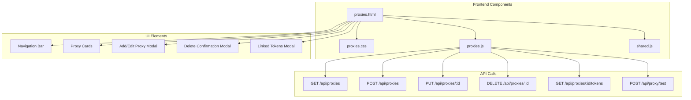

# Proxy Management - Frontend Implementation Plan

## Overview
This plan covers the frontend implementation for the proxy management page, including HTML, CSS, and JavaScript components.

## Architecture Overview



## Implementation Plan

### Phase 1: HTML Page Structure

#### 1.1 Create proxies.html

**File:** `internal/restapi/web/proxies.html` (NEW FILE)

```html
<!DOCTYPE html>
<html lang="en">
<head>
    <meta charset="UTF-8">
    <meta name="viewport" content="width=device-width, initial-scale=1.0">
    <title>Proxy Management - QWEncoder Proxy</title>
    <link rel="stylesheet" href="/css/dashboard.css">
    <link rel="stylesheet" href="/css/proxies.css">
</head>
<body>
    <div class="container">
        <nav class="main-nav">
            <div class="nav-brand">
                <h1>QWEncoder Proxy</h1>
            </div>
            <ul class="nav-links">
                <li><a href="/" class="nav-link">Providers</a></li>
                <li><a href="/tokens" class="nav-link">Tokens</a></li>
                <li><a href="/proxies" class="nav-link active">Proxies</a></li>
            </ul>
        </nav>

        <header>
            <h1>Proxy Management</h1>
            <p class="subtitle">Manage proxy configurations for your tokens</p>
        </header>

        <main>
            <!-- Loading Section -->
            <section id="loading" class="loading">
                <div class="spinner"></div>
                <p>Loading proxies...</p>
            </section>

            <!-- Error Section -->
            <section id="error" class="error hidden">
                <div class="error-icon">⚠️</div>
                <h2>Error Loading Proxies</h2>
                <p id="error-message">Unable to load proxies. Please try again.</p>
                <button id="retry-button" class="btn btn-primary">Retry</button>
            </section>

            <!-- Empty State -->
            <section id="empty" class="empty hidden">
                <div class="empty-icon">🌐</div>
                <h2>No Proxies Configured</h2>
                <p>Add a proxy to route your token requests through it.</p>
                <button id="add-proxy-btn-empty" class="btn btn-primary">
                    <span class="btn-icon">➕</span>
                    Add Proxy
                </button>
            </section>

            <!-- Proxies List -->
            <section id="proxies-container" class="proxies-container hidden">
                <div class="proxies-header">
                    <h2>All Proxies</h2>
                    <button id="add-proxy-btn" class="btn btn-primary">
                        <span class="btn-icon">➕</span>
                        Add Proxy
                    </button>
                </div>
                <div id="proxy-list" class="proxy-list">
                    <!-- Proxy cards will be loaded here -->
                </div>
            </section>
        </main>

        <footer>
            <p>QWEncoder Proxy &copy; 2024</p>
        </footer>
    </div>

    <!-- Add/Edit Proxy Modal -->
    <div id="proxy-modal" class="modal-overlay hidden">
        <div class="modal">
            <div class="modal-header">
                <h3 id="proxy-modal-title">Add Proxy</h3>
                <button class="modal-close" id="proxy-modal-close">&times;</button>
            </div>
            <div class="modal-body">
                <form id="proxy-form">
                    <div class="form-group">
                        <label for="proxy-type">Proxy Type</label>
                        <select id="proxy-type" name="type" class="form-control">
                            <option value="http">HTTP</option>
                            <option value="https">HTTPS</option>
                            <option value="socks5">SOCKS5</option>
                        </select>
                    </div>
                    <div class="form-group">
                        <label for="proxy-host">Host</label>
                        <input type="text" id="proxy-host" name="host" class="form-control" placeholder="proxy.example.com" required>
                    </div>
                    <div class="form-group">
                        <label for="proxy-port">Port</label>
                        <input type="number" id="proxy-port" name="port" class="form-control" placeholder="8080" min="1" max="65535" required>
                    </div>
                    <div class="form-group">
                        <label for="proxy-username">Username (Optional)</label>
                        <input type="text" id="proxy-username" name="username" class="form-control" placeholder="Username">
                    </div>
                    <div class="form-group">
                        <label for="proxy-password">Password (Optional)</label>
                        <input type="password" id="proxy-password" name="password" class="form-control" placeholder="Password">
                    </div>
                </form>
                <div id="test-result" class="test-result hidden">
                    <div id="test-result-icon"></div>
                    <div id="test-result-message"></div>
                </div>
            </div>
            <div class="modal-footer">
                <button id="test-proxy-btn" class="btn btn-secondary">
                    <span class="btn-icon">🔍</span>
                    Test Connection
                </button>
                <button id="save-proxy-btn" class="btn btn-primary">
                    <span class="btn-icon">💾</span>
                    Save Proxy
                </button>
                <button id="cancel-proxy-btn" class="btn btn-secondary">Cancel</button>
            </div>
        </div>
    </div>

    <!-- Delete Confirmation Modal -->
    <div id="delete-modal" class="modal-overlay hidden">
        <div class="modal modal-sm">
            <div class="modal-header">
                <h3>Delete Proxy</h3>
                <button class="modal-close" id="delete-modal-close">&times;</button>
            </div>
            <div class="modal-body">
                <p>Are you sure you want to delete this proxy?</p>
                <div id="delete-proxy-info" class="delete-info"></div>
                <div id="linked-tokens-warning" class="warning hidden">
                    <p>⚠️ This proxy is linked to <strong id="linked-tokens-count">0</strong> tokens.</p>
                    <p>Deleting this proxy will remove the proxy assignment from these tokens.</p>
                </div>
            </div>
            <div class="modal-footer">
                <button id="cancel-delete-btn" class="btn btn-secondary">Cancel</button>
                <button id="confirm-delete-btn" class="btn btn-danger">
                    <span class="btn-icon">🗑️</span>
                    Delete Proxy
                </button>
            </div>
        </div>
    </div>

    <!-- Linked Tokens Modal -->
    <div id="linked-tokens-modal" class="modal-overlay hidden">
        <div class="modal modal-lg">
            <div class="modal-header">
                <h3>Linked Tokens</h3>
                <button class="modal-close" id="linked-tokens-modal-close">&times;</button>
            </div>
            <div class="modal-body">
                <div id="linked-proxy-info" class="proxy-info"></div>
                <div id="linked-tokens-list" class="linked-tokens-list">
                    <!-- Tokens will be loaded here -->
                </div>
                <div id="no-linked-tokens" class="no-linked-tokens hidden">
                    <p>No tokens are currently using this proxy.</p>
                </div>
            </div>
            <div class="modal-footer">
                <button id="close-linked-tokens-btn" class="btn btn-primary">Close</button>
            </div>
        </div>
    </div>

    <script src="/js/shared.js"></script>
    <script src="/js/proxies.js"></script>
</body>
</html>
```

#### 1.2 Update Navigation in Existing Pages

**Files:** `internal/restapi/web/index.html`, `internal/restapi/web/tokens.html`

Add "Proxies" link to navigation bar:

```html
<ul class="nav-links">
    <li><a href="/" class="nav-link">Providers</a></li>
    <li><a href="/tokens" class="nav-link">Tokens</a></li>
    <li><a href="/proxies" class="nav-link">Proxies</a></li>
</ul>
```

### Phase 2: CSS Styling

#### 2.1 Create proxies.css

**File:** `internal/restapi/web/css/proxies.css` (NEW FILE)

```css
/* Proxy Management Page Styles */

/* Proxy List Container */
.proxies-container {
    max-width: 1200px;
    margin: 0 auto;
    padding: 20px;
}

.proxies-header {
    display: flex;
    justify-content: space-between;
    align-items: center;
    margin-bottom: 24px;
}

.proxies-header h2 {
    margin: 0;
    font-size: 24px;
    font-weight: 600;
}

/* Proxy List Grid */
.proxy-list {
    display: grid;
    grid-template-columns: repeat(auto-fill, minmax(350px, 1fr));
    gap: 20px;
}

/* Proxy Card */
.proxy-card {
    background: white;
    border: 1px solid #e0e0e0;
    border-radius: 8px;
    padding: 20px;
    transition: box-shadow 0.2s ease;
}

.proxy-card:hover {
    box-shadow: 0 4px 12px rgba(0, 0, 0, 0.1);
}

.proxy-card-header {
    display: flex;
    justify-content: space-between;
    align-items: flex-start;
    margin-bottom: 16px;
}

.proxy-card-title {
    display: flex;
    align-items: center;
    gap: 8px;
    margin: 0;
    font-size: 18px;
    font-weight: 600;
}

/* Proxy Type Badge */
.proxy-type-badge {
    display: inline-block;
    padding: 4px 8px;
    border-radius: 4px;
    font-size: 12px;
    font-weight: 600;
    text-transform: uppercase;
}

.proxy-type-badge.http {
    background: #e3f2fd;
    color: #1976d2;
}

.proxy-type-badge.https {
    background: #e8f5e9;
    color: #388e3c;
}

.proxy-type-badge.socks5 {
    background: #fff3e0;
    color: #f57c00;
}

/* Proxy Actions */
.proxy-card-actions {
    display: flex;
    gap: 8px;
}

.proxy-card-actions button {
    padding: 6px 12px;
    font-size: 14px;
}

/* Proxy Details */
.proxy-details {
    margin-bottom: 16px;
}

.proxy-detail-row {
    display: flex;
    justify-content: space-between;
    padding: 8px 0;
    border-bottom: 1px solid #f0f0f0;
}

.proxy-detail-row:last-child {
    border-bottom: none;
}

.proxy-detail-label {
    color: #666;
    font-size: 14px;
}

.proxy-detail-value {
    font-weight: 500;
    font-size: 14px;
}

/* Token Count Section */
.proxy-token-count {
    display: flex;
    align-items: center;
    justify-content: space-between;
    padding: 12px;
    background: #f5f5f5;
    border-radius: 6px;
    margin-top: 16px;
}

.proxy-token-count-info {
    display: flex;
    align-items: center;
    gap: 8px;
}

.proxy-token-count-icon {
    font-size: 18px;
}

.proxy-token-count-value {
    font-weight: 600;
    color: #1976d2;
}

.view-tokens-btn {
    background: white;
    border: 1px solid #d0d0d0;
    padding: 6px 12px;
    border-radius: 4px;
    cursor: pointer;
    font-size: 14px;
    transition: all 0.2s ease;
}

.view-tokens-btn:hover {
    background: #f0f0f0;
    border-color: #b0b0b0;
}

/* Empty State */
.empty-icon {
    font-size: 64px;
    margin-bottom: 16px;
}

/* Delete Info */
.delete-info {
    background: #f5f5f5;
    padding: 12px;
    border-radius: 6px;
    margin: 16px 0;
}

.delete-info-item {
    display: flex;
    justify-content: space-between;
    padding: 4px 0;
}

.delete-info-label {
    color: #666;
}

.delete-info-value {
    font-weight: 500;
}

/* Warning */
.warning {
    background: #fff3cd;
    border: 1px solid #ffc107;
    border-radius: 6px;
    padding: 12px;
    margin: 16px 0;
}

.warning p {
    margin: 4px 0;
}

/* Linked Tokens Modal */
.proxy-info {
    background: #f5f5f5;
    padding: 16px;
    border-radius: 6px;
    margin-bottom: 20px;
}

.proxy-info-title {
    font-weight: 600;
    margin-bottom: 12px;
    color: #333;
}

.proxy-info-row {
    display: flex;
    justify-content: space-between;
    padding: 4px 0;
}

.proxy-info-label {
    color: #666;
}

.proxy-info-value {
    font-weight: 500;
}

/* Linked Tokens List */
.linked-tokens-list {
    max-height: 400px;
    overflow-y: auto;
}

.linked-token-item {
    display: flex;
    justify-content: space-between;
    align-items: center;
    padding: 12px;
    background: white;
    border: 1px solid #e0e0e0;
    border-radius: 6px;
    margin-bottom: 8px;
}

.linked-token-info {
    flex: 1;
}

.linked-token-email {
    font-weight: 600;
    margin-bottom: 4px;
}

.linked-token-provider {
    font-size: 14px;
    color: #666;
}

.linked-token-status {
    display: flex;
    align-items: center;
    gap: 8px;
}

.status-badge {
    padding: 4px 8px;
    border-radius: 4px;
    font-size: 12px;
    font-weight: 600;
}

.status-badge.healthy {
    background: #e8f5e9;
    color: #388e3c;
}

.status-badge.unhealthy {
    background: #ffebee;
    color: #d32f2f;
}

.no-linked-tokens {
    text-align: center;
    padding: 40px 20px;
    color: #666;
}

/* Test Result */
.test-result {
    margin-top: 16px;
    padding: 12px;
    border-radius: 6px;
    display: flex;
    align-items: center;
    gap: 12px;
}

.test-result.success {
    background: #e8f5e9;
    border: 1px solid #388e3c;
}

.test-result.error {
    background: #ffebee;
    border: 1px solid #d32f2f;
}

.test-result-icon {
    font-size: 24px;
}

.test-result-message {
    flex: 1;
}

/* Responsive Design */
@media (max-width: 768px) {
    .proxy-list {
        grid-template-columns: 1fr;
    }

    .proxies-header {
        flex-direction: column;
        gap: 16px;
        align-items: stretch;
    }

    .proxies-header button {
        width: 100%;
    }
}
```

### Phase 3: JavaScript Logic

#### 3.1 Create proxies.js

**File:** `internal/restapi/web/js/proxies.js` (NEW FILE)

```javascript
// QWEncoder Proxy Management JavaScript
// Uses shared utilities from shared.js

// DOM Elements
const loadingSection = document.getElementById('loading');
const errorSection = document.getElementById('error');
const errorMessage = document.getElementById('error-message');
const retryButton = document.getElementById('retry-button');
const emptySection = document.getElementById('empty');
const proxiesContainer = document.getElementById('proxies-container');
const proxyList = document.getElementById('proxy-list');
const addProxyBtn = document.getElementById('add-proxy-btn');
const addProxyBtnEmpty = document.getElementById('add-proxy-btn-empty');

// Proxy Modal Elements
const proxyModal = document.getElementById('proxy-modal');
const proxyModalTitle = document.getElementById('proxy-modal-title');
const proxyModalClose = document.getElementById('proxy-modal-close');
const proxyForm = document.getElementById('proxy-form');
const proxyType = document.getElementById('proxy-type');
const proxyHost = document.getElementById('proxy-host');
const proxyPort = document.getElementById('proxy-port');
const proxyUsername = document.getElementById('proxy-username');
const proxyPassword = document.getElementById('proxy-password');
const testProxyBtn = document.getElementById('test-proxy-btn');
const saveProxyBtn = document.getElementById('save-proxy-btn');
const cancelProxyBtn = document.getElementById('cancel-proxy-btn');
const testResult = document.getElementById('test-result');
const testResultIcon = document.getElementById('test-result-icon');
const testResultMessage = document.getElementById('test-result-message');

// Delete Modal Elements
const deleteModal = document.getElementById('delete-modal');
const deleteModalClose = document.getElementById('delete-modal-close');
const deleteProxyInfo = document.getElementById('delete-proxy-info');
const linkedTokensWarning = document.getElementById('linked-tokens-warning');
const linkedTokensCount = document.getElementById('linked-tokens-count');
const cancelDeleteBtn = document.getElementById('cancel-delete-btn');
const confirmDeleteBtn = document.getElementById('confirm-delete-btn');

// Linked Tokens Modal Elements
const linkedTokensModal = document.getElementById('linked-tokens-modal');
const linkedTokensModalClose = document.getElementById('linked-tokens-modal-close');
const linkedProxyInfo = document.getElementById('linked-proxy-info');
const linkedTokensList = document.getElementById('linked-tokens-list');
const noLinkedTokens = document.getElementById('no-linked-tokens');
const closeLinkedTokensBtn = document.getElementById('close-linked-tokens-btn');

// State
let proxiesData = [];
let currentProxy = null; // For editing
let proxyToDelete = null;

// Initialize proxies page
document.addEventListener('DOMContentLoaded', () => {
    loadProxies();
    setupEventListeners();
});

// Setup event listeners
function setupEventListeners() {
    retryButton.addEventListener('click', loadProxies);
    addProxyBtn.addEventListener('click', showAddProxyModal);
    addProxyBtnEmpty.addEventListener('click', showAddProxyModal);

    // Proxy modal events
    proxyModalClose.addEventListener('click', hideProxyModal);
    cancelProxyBtn.addEventListener('click', hideProxyModal);
    testProxyBtn.addEventListener('click', testProxyConnection);
    saveProxyBtn.addEventListener('click', saveProxy);

    // Delete modal events
    deleteModalClose.addEventListener('click', hideDeleteModal);
    cancelDeleteBtn.addEventListener('click', hideDeleteModal);
    confirmDeleteBtn.addEventListener('click', deleteProxy);

    // Linked tokens modal events
    linkedTokensModalClose.addEventListener('click', hideLinkedTokensModal);
    closeLinkedTokensBtn.addEventListener('click', hideLinkedTokensModal);

    // Close modals on overlay click
    proxyModal.addEventListener('click', (e) => {
        if (e.target === proxyModal) hideProxyModal();
    });
    deleteModal.addEventListener('click', (e) => {
        if (e.target === deleteModal) hideDeleteModal();
    });
    linkedTokensModal.addEventListener('click', (e) => {
        if (e.target === linkedTokensModal) hideLinkedTokensModal();
    });
}

// Load all proxies from API
async function loadProxies() {
    showLoading();
    hideError();
    hideEmpty();
    hideProxiesContainer();

    try {
        const response = await fetch('/api/proxies');
        if (!response.ok) {
            throw new Error(`HTTP ${response.status}: ${response.statusText}`);
        }

        const data = await response.json();
        proxiesData = data.proxies || [];

        if (proxiesData.length === 0) {
            showEmpty();
        } else {
            renderProxies(proxiesData);
            showProxiesContainer();
        }
    } catch (error) {
        showError(error.message);
    }
}

// Render proxies list
function renderProxies(proxies) {
    proxyList.innerHTML = '';

    proxies.forEach(proxy => {
        const card = createProxyCard(proxy);
        proxyList.appendChild(card);
    });
}

// Create proxy card element
function createProxyCard(proxy) {
    const card = document.createElement('div');
    card.className = 'proxy-card';
    card.innerHTML = `
        <div class="proxy-card-header">
            <h3 class="proxy-card-title">
                <span class="proxy-type-badge ${proxy.type}">${proxy.type.toUpperCase()}</span>
            </h3>
            <div class="proxy-card-actions">
                <button class="btn btn-sm btn-secondary" onclick="editProxy('${proxy.id}')">
                    <span class="btn-icon">✏️</span> Edit
                </button>
                <button class="btn btn-sm btn-danger" onclick="showDeleteProxyModal('${proxy.id}')">
                    <span class="btn-icon">🗑️</span> Delete
                </button>
            </div>
        </div>
        <div class="proxy-details">
            <div class="proxy-detail-row">
                <span class="proxy-detail-label">Host:</span>
                <span class="proxy-detail-value">${escapeHtml(proxy.host)}</span>
            </div>
            <div class="proxy-detail-row">
                <span class="proxy-detail-label">Port:</span>
                <span class="proxy-detail-value">${proxy.port}</span>
            </div>
            ${proxy.username ? `
            <div class="proxy-detail-row">
                <span class="proxy-detail-label">Username:</span>
                <span class="proxy-detail-value">${escapeHtml(proxy.username)}</span>
            </div>
            ` : ''}
        </div>
        <div class="proxy-token-count">
            <div class="proxy-token-count-info">
                <span class="proxy-token-count-icon">🔑</span>
                <span class="proxy-token-count-value">${proxy.token_count} token${proxy.token_count !== 1 ? 's' : ''}</span>
            </div>
            ${proxy.token_count > 0 ? `
            <button class="view-tokens-btn" onclick="showLinkedTokens('${proxy.id}')">
                View Tokens
            </button>
            ` : ''}
        </div>
    `;
    return card;
}

// Show add proxy modal
function showAddProxyModal() {
    currentProxy = null;
    proxyModalTitle.textContent = 'Add Proxy';
    proxyForm.reset();
    proxyType.value = 'http';
    hideTestResult();
    showProxyModal();
}

// Edit proxy
async function editProxy(proxyId) {
    try {
        const response = await fetch(`/api/proxies/${proxyId}`);
        if (!response.ok) {
            throw new Error(`HTTP ${response.status}: ${response.statusText}`);
        }

        const proxy = await response.json();
        currentProxy = proxy;

        proxyModalTitle.textContent = 'Edit Proxy';
        proxyType.value = proxy.type;
        proxyHost.value = proxy.host;
        proxyPort.value = proxy.port;
        proxyUsername.value = proxy.username || '';
        proxyPassword.value = ''; // Don't populate password for security

        hideTestResult();
        showProxyModal();
    } catch (error) {
        showToast('error', 'Failed to load proxy details');
    }
}

// Test proxy connection
async function testProxyConnection() {
    const type = proxyType.value;
    const host = proxyHost.value.trim();
    const port = parseInt(proxyPort.value);
    const username = proxyUsername.value.trim();
    const password = proxyPassword.value;

    if (!host || !port) {
        showToast('error', 'Please enter host and port');
        return;
    }

    testProxyBtn.disabled = true;
    testProxyBtn.innerHTML = '<span class="btn-icon">⏳</span> Testing...';

    try {
        const response = await fetch('/api/proxy/test', {
            method: 'POST',
            headers: { 'Content-Type': 'application/json' },
            body: JSON.stringify({ type, host, port, username, password })
        });

        const data = await response.json();

        if (data.success) {
            showTestResult(true, `Connection successful (${data.latency_ms}ms)`);
        } else {
            showTestResult(false, data.message || 'Connection failed');
        }
    } catch (error) {
        showTestResult(false, error.message);
    } finally {
        testProxyBtn.disabled = false;
        testProxyBtn.innerHTML = '<span class="btn-icon">🔍</span> Test Connection';
    }
}

// Show test result
function showTestResult(success, message) {
    testResult.classList.remove('hidden', 'success', 'error');
    testResult.classList.add(success ? 'success' : 'error');
    testResultIcon.textContent = success ? '✓' : '✗';
    testResultMessage.textContent = message;
}

// Hide test result
function hideTestResult() {
    testResult.classList.add('hidden');
}

// Save proxy
async function saveProxy() {
    const type = proxyType.value;
    const host = proxyHost.value.trim();
    const port = parseInt(proxyPort.value);
    const username = proxyUsername.value.trim();
    const password = proxyPassword.value;

    if (!host || !port) {
        showToast('error', 'Please enter host and port');
        return;
    }

    if (port < 1 || port > 65535) {
        showToast('error', 'Port must be between 1 and 65535');
        return;
    }

    saveProxyBtn.disabled = true;
    saveProxyBtn.innerHTML = '<span class="btn-icon">⏳</span> Saving...';

    try {
        const url = currentProxy ? `/api/proxies/${currentProxy.id}` : '/api/proxies';
        const method = currentProxy ? 'PUT' : 'POST';

        const response = await fetch(url, {
            method: method,
            headers: { 'Content-Type': 'application/json' },
            body: JSON.stringify({ type, host, port, username, password })
        });

        if (!response.ok) {
            const data = await response.json();
            throw new Error(data.error || `HTTP ${response.status}`);
        }

        showToast('success', currentProxy ? 'Proxy updated successfully' : 'Proxy added successfully');
        hideProxyModal();
        loadProxies();
    } catch (error) {
        showToast('error', error.message);
    } finally {
        saveProxyBtn.disabled = false;
        saveProxyBtn.innerHTML = '<span class="btn-icon">💾</span> Save Proxy';
    }
}

// Show delete proxy modal
async function showDeleteProxyModal(proxyId) {
    const proxy = proxiesData.find(p => p.id === proxyId);
    if (!proxy) {
        showToast('error', 'Proxy not found');
        return;
    }

    proxyToDelete = proxy;

    deleteProxyInfo.innerHTML = `
        <div class="delete-info-item">
            <span class="delete-info-label">Type:</span>
            <span class="delete-info-value">${proxy.type.toUpperCase()}</span>
        </div>
        <div class="delete-info-item">
            <span class="delete-info-label">Host:</span>
            <span class="delete-info-value">${escapeHtml(proxy.host)}</span>
        </div>
        <div class="delete-info-item">
            <span class="delete-info-label">Port:</span>
            <span class="delete-info-value">${proxy.port}</span>
        </div>
    `;

    if (proxy.token_count > 0) {
        linkedTokensCount.textContent = proxy.token_count;
        linkedTokensWarning.classList.remove('hidden');
    } else {
        linkedTokensWarning.classList.add('hidden');
    }

    showDeleteModal();
}

// Delete proxy
async function deleteProxy() {
    if (!proxyToDelete) return;

    confirmDeleteBtn.disabled = true;
    confirmDeleteBtn.innerHTML = '<span class="btn-icon">⏳</span> Deleting...';

    try {
        const response = await fetch(`/api/proxies/${proxyToDelete.id}`, {
            method: 'DELETE'
        });

        if (!response.ok) {
            const data = await response.json();
            throw new Error(data.error || `HTTP ${response.status}`);
        }

        showToast('success', 'Proxy deleted successfully');
        hideDeleteModal();
        loadProxies();
    } catch (error) {
        showToast('error', error.message);
    } finally {
        confirmDeleteBtn.disabled = false;
        confirmDeleteBtn.innerHTML = '<span class="btn-icon">🗑️</span> Delete Proxy';
    }
}

// Show linked tokens
async function showLinkedTokens(proxyId) {
    const proxy = proxiesData.find(p => p.id === proxyId);
    if (!proxy) {
        showToast('error', 'Proxy not found');
        return;
    }

    linkedProxyInfo.innerHTML = `
        <div class="proxy-info-title">Proxy Details</div>
        <div class="proxy-info-row">
            <span class="proxy-info-label">Type:</span>
            <span class="proxy-info-value">${proxy.type.toUpperCase()}</span>
        </div>
        <div class="proxy-info-row">
            <span class="proxy-info-label">Host:</span>
            <span class="proxy-info-value">${escapeHtml(proxy.host)}:${proxy.port}</span>
        </div>
    `;

    linkedTokensList.innerHTML = '';
    noLinkedTokens.classList.add('hidden');

    try {
        const response = await fetch(`/api/proxies/${proxyId}/tokens`);
        if (!response.ok) {
            throw new Error(`HTTP ${response.status}: ${response.statusText}`);
        }

        const data = await response.json();

        if (data.tokens.length === 0) {
            noLinkedTokens.classList.remove('hidden');
        } else {
            data.tokens.forEach(token => {
                const tokenItem = createLinkedTokenItem(token);
                linkedTokensList.appendChild(tokenItem);
            });
        }

        showLinkedTokensModal();
    } catch (error) {
        showToast('error', 'Failed to load linked tokens');
    }
}

// Create linked token item
function createLinkedTokenItem(token) {
    const item = document.createElement('div');
    item.className = 'linked-token-item';
    item.innerHTML = `
        <div class="linked-token-info">
            <div class="linked-token-email">${escapeHtml(token.email)}</div>
            <div class="linked-token-provider">${escapeHtml(token.provider_id)}</div>
        </div>
        <div class="linked-token-status">
            <span class="status-badge ${token.healthy ? 'healthy' : 'unhealthy'}">
                ${token.healthy ? '✓ Healthy' : '✗ Unhealthy'}
            </span>
        </div>
    `;
    return item;
}

// UI State Management Functions
function showLoading() {
    loadingSection.classList.remove('hidden');
}

function hideLoading() {
    loadingSection.classList.add('hidden');
}

function showError(message) {
    errorMessage.textContent = message;
    errorSection.classList.remove('hidden');
}

function hideError() {
    errorSection.classList.add('hidden');
}

function showEmpty() {
    emptySection.classList.remove('hidden');
}

function hideEmpty() {
    emptySection.classList.add('hidden');
}

function showProxiesContainer() {
    proxiesContainer.classList.remove('hidden');
}

function hideProxiesContainer() {
    proxiesContainer.classList.add('hidden');
}

function showProxyModal() {
    proxyModal.classList.remove('hidden');
}

function hideProxyModal() {
    proxyModal.classList.add('hidden');
}

function showDeleteModal() {
    deleteModal.classList.remove('hidden');
}

function hideDeleteModal() {
    deleteModal.classList.add('hidden');
}

function showLinkedTokensModal() {
    linkedTokensModal.classList.remove('hidden');
}

function hideLinkedTokensModal() {
    linkedTokensModal.classList.add('hidden');
}

// Utility Functions
function escapeHtml(text) {
    const div = document.createElement('div');
    div.textContent = text;
    return div.innerHTML;
}
```

### Phase 4: Update shared.js (if needed)

Check if any additional utility functions are needed in `shared.js` that aren't already present:

- `showToast()` - Display toast notifications
- `escapeHtml()` - Escape HTML for security

These may already exist in `shared.js`. If not, add them.

## File Structure

```
internal/restapi/web/
├── proxies.html          # NEW: Proxy management page
├── css/
│   └── proxies.css       # NEW: Proxy page styles
└── js/
    └── proxies.js        # NEW: Proxy page logic
```

## UI/UX Features

### 1. Proxy Cards
- Display proxy type with color-coded badge
- Show host, port, and username (if configured)
- Display token count
- Edit and Delete buttons
- "View Tokens" button when tokens are linked

### 2. Add/Edit Proxy Modal
- Form with all proxy fields
- Test Connection button before saving
- Real-time validation
- Clear success/error feedback

### 3. Delete Confirmation Modal
- Show proxy details before deletion
- Warning if tokens are linked
- Clear confirmation message

### 4. Linked Tokens Modal
- Show proxy details at top
- List all linked tokens with:
  - Email
  - Provider
  - Health status
- Empty state when no tokens linked

### 5. Responsive Design
- Grid layout for proxy cards
- Single column on mobile
- Touch-friendly buttons

## Testing Checklist

- [ ] Add proxy with all fields
- [ ] Add proxy with only required fields
- [ ] Edit existing proxy
- [ ] Test proxy connection (success case)
- [ ] Test proxy connection (failure case)
- [ ] Delete proxy with no linked tokens
- [ ] Delete proxy with linked tokens (verify warning)
- [ ] View linked tokens for a proxy
- [ ] View linked tokens for proxy with no tokens
- [ ] Navigate between pages
- [ ] Responsive design on mobile
- [ ] Error handling for API failures
- [ ] Loading states during API calls
- [ ] Toast notifications for success/error

## Future Enhancements

1. **Proxy Health Monitoring** - Show health status on proxy cards
2. **Proxy Usage Analytics** - Display usage statistics
3. **Proxy Groups** - Group proxies by region or purpose
4. **Bulk Operations** - Add/delete multiple proxies at once
5. **Proxy Import/Export** - Import proxies from CSV/JSON
6. **Advanced Filtering** - Filter proxies by type, status, etc.
