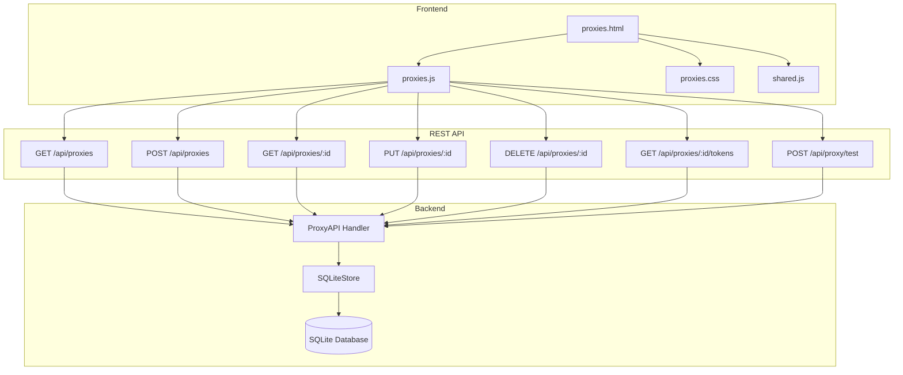
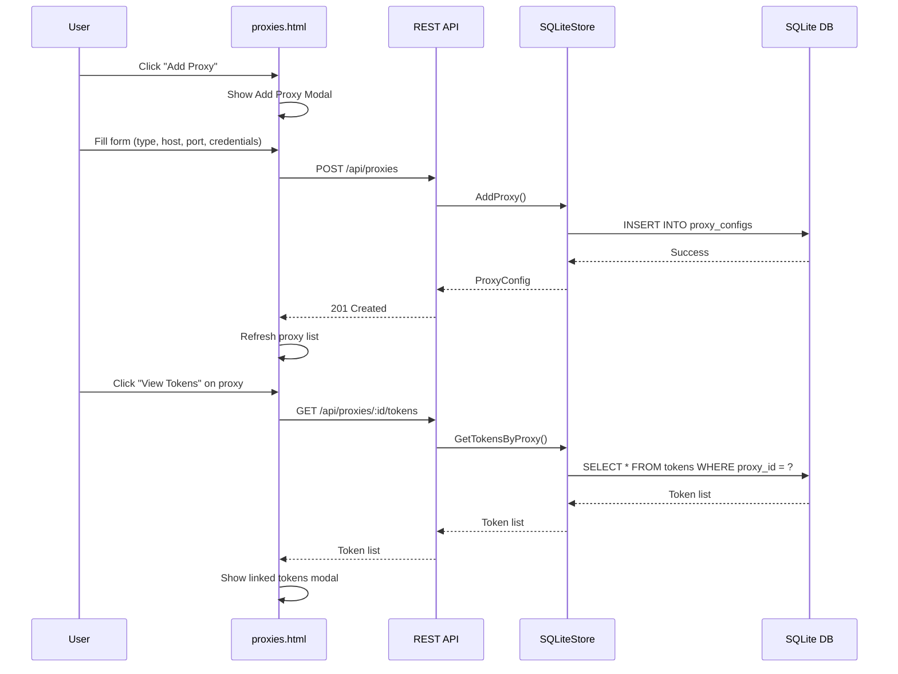

# Proxy Management Page Implementation Plan

## Overview
Create a dedicated proxy management page in the dashboard where users can:
- Add new proxy configurations
- Delete proxy configurations
- View all proxies with their details
- See which tokens are linked to each proxy
- Test proxy connections

## Architecture Overview

### Current State
The system already has:
- `proxy_configs` table in SQLite database (id, host, port, username, password, created_at)
- `tokens` table with `proxy_id` field that references proxy_configs
- Existing `/api/proxy/test` endpoint for testing proxy connections

### What's Missing
1. `proxy_type` field in proxy_configs table (http, https, socks5)
2. CRUD operations for proxy_configs in SQLiteStore
3. REST API endpoints for proxy management
4. UI page for proxy management

### Database Schema Changes

#### Existing proxy_configs table
```sql
CREATE TABLE IF NOT EXISTS proxy_configs (
    id TEXT PRIMARY KEY,
    host TEXT NOT NULL,
    port INTEGER NOT NULL,
    username TEXT,
    password TEXT,
    created_at INTEGER NOT NULL DEFAULT (strftime('%s', 'subsec') * 1000)
)
```

#### Updated proxy_configs table (after migration)
```sql
CREATE TABLE IF NOT EXISTS proxy_configs (
    id TEXT PRIMARY KEY,
    type TEXT NOT NULL DEFAULT 'http',  -- NEW: http, https, socks5
    host TEXT NOT NULL,
    port INTEGER NOT NULL,
    username TEXT,
    password TEXT,
    created_at INTEGER NOT NULL DEFAULT (strftime('%s', 'subsec') * 1000)
)
```

### System Architecture



### Data Flow



## Implementation Plan

### Phase 1: Database Schema Updates

#### 1.1 Add Migration for proxy_type Field
**File:** `internal/token/sqlite_store.go`

Add a new migration to add the `proxy_type` field to the proxy_configs table:

```go
// Migration to add proxy_type field
sqlAddProxyTypeMigration = `
    ALTER TABLE proxy_configs ADD COLUMN type TEXT NOT NULL DEFAULT 'http';
`
```

Update the schema migration system to track and apply this migration.

#### 1.2 Update ProxyConfig for Database Operations
**File:** `internal/token/proxy_config.go`

The existing `ProxyConfig` struct already has the `Type` field. We need to ensure it's properly handled in database operations.

#### 1.3 Update SQLiteStore Schema Creation
**File:** `internal/token/sqlite_store.go`

Update `sqlCreateProxyConfigsTable` to include the `type` field:

```go
sqlCreateProxyConfigsTable = `
    CREATE TABLE IF NOT EXISTS proxy_configs (
        id TEXT PRIMARY KEY,
        type TEXT NOT NULL DEFAULT 'http',
        host TEXT NOT NULL,
        port INTEGER NOT NULL,
        username TEXT,
        password TEXT,
        created_at INTEGER NOT NULL DEFAULT (strftime('%s', 'subsec') * 1000)
    )
`
```

### Phase 2: Backend - Proxy CRUD Operations

#### 2.1 Add GetProxy Method
**File:** `internal/token/sqlite_store.go`

```go
// GetProxy retrieves a proxy configuration by ID
func (s *SQLiteStore) GetProxy(proxyID string) (*ProxyConfig, error)
```

#### 2.2 Add ListProxies Method
**File:** `internal/token/sqlite_store.go`

```go
// ListProxies retrieves all proxy configurations
func (s *SQLiteStore) ListProxies() ([]ProxyConfig, error)
```

#### 2.3 Add AddProxy Method
**File:** `internal/token/sqlite_store.go`

```go
// AddProxy adds a new proxy configuration
func (s *SQLiteStore) AddProxy(proxy ProxyConfig) error
```

#### 2.4 Add UpdateProxy Method
**File:** `internal/token/sqlite_store.go`

```go
// UpdateProxy updates an existing proxy configuration
func (s *SQLiteStore) UpdateProxy(proxyID string, proxy ProxyConfig) error
```

#### 2.5 Add DeleteProxy Method
**File:** `internal/token/sqlite_store.go`

```go
// DeleteProxy deletes a proxy configuration by ID
// Option 1: Cascade delete - also remove proxy_id from linked tokens
// Option 2: Prevent delete if tokens are linked (return error)
func (s *SQLiteStore) DeleteProxy(proxyID string) error
```

#### 2.6 Add GetTokensByProxy Method
**File:** `internal/token/sqlite_store.go`

```go
// GetTokensByProxy retrieves all tokens linked to a specific proxy
func (s *SQLiteStore) GetTokensByProxy(proxyID string) ([]ProviderToken, error)
```

### Phase 3: Backend - REST API Endpoints

#### 3.1 Create Proxy API Handler
**File:** `internal/restapi/proxy_api.go` (NEW FILE)

Create a new file for proxy-related API endpoints.

#### 3.2 GET /api/proxies - List All Proxies
```go
func (s *Server) handleListProxies(w http.ResponseWriter, r *http.Request)
```

Response:
```json
{
  "proxies": [
    {
      "id": "uuid-1",
      "type": "http",
      "host": "proxy.example.com",
      "port": 8080,
      "username": "user",
      "created_at": 1234567890000,
      "token_count": 3
    }
  ]
}
```

#### 3.3 POST /api/proxies - Add New Proxy
```go
func (s *Server) handleAddProxy(w http.ResponseWriter, r *http.Request)
```

Request:
```json
{
  "type": "http",
  "host": "proxy.example.com",
  "port": 8080,
  "username": "user",
  "password": "pass"
}
```

#### 3.4 GET /api/proxies/{id} - Get Proxy Details
```go
func (s *Server) handleGetProxy(w http.ResponseWriter, r *http.Request)
```

#### 3.5 PUT /api/proxies/{id} - Update Proxy
```go
func (s *Server) handleUpdateProxy(w http.ResponseWriter, r *http.Request)
```

#### 3.6 DELETE /api/proxies/{id} - Delete Proxy
```go
func (s *Server) handleDeleteProxy(w http.ResponseWriter, r *http.Request)
```

#### 3.7 GET /api/proxies/{id}/tokens - Get Linked Tokens
```go
func (s *Server) handleGetProxyTokens(w http.ResponseWriter, r *http.Request)
```

Response:
```json
{
  "proxy_id": "uuid-1",
  "tokens": [
    {
      "id": "token-1",
      "email": "user@example.com",
      "provider_id": "qwen",
      "healthy": true
    }
  ]
}
```

### Phase 4: Dashboard Handler Updates

#### 4.1 Add ServeProxies Method
**File:** `internal/restapi/dashboard_handler.go`

```go
// ServeProxies serves the proxy management page
func (h *DashboardHandler) ServeProxies(w http.ResponseWriter, r *http.Request) {
    // Read proxies.html into memory
    proxiesHTML, err := fs.ReadFile(h.webFS, "web/proxies.html")
    if err != nil {
        http.NotFound(w, r)
        return
    }

    w.Header().Set("Content-Type", "text/html; charset=utf-8")
    w.WriteHeader(http.StatusOK)
    w.Write(proxiesHTML)
}
```

#### 4.2 Register Route
**File:** `cmd/main.go`

```go
mux.HandleFunc("/proxies", dashboardHandler.ServeProxies)
```

#### 4.3 Update Navigation
**Files:** `internal/restapi/web/index.html`, `internal/restapi/web/tokens.html`

Add "Proxies" link to navigation bar:
```html
<ul class="nav-links">
    <li><a href="/" class="nav-link">Providers</a></li>
    <li><a href="/tokens" class="nav-link">Tokens</a></li>
    <li><a href="/proxies" class="nav-link">Proxies</a></li>
</ul>
```

### Phase 5: Frontend - HTML Page

#### 5.1 Create proxies.html
**File:** `internal/restapi/web/proxies.html` (NEW FILE)

Structure:
```html
<!DOCTYPE html>
<html lang="en">
<head>
    <meta charset="UTF-8">
    <meta name="viewport" content="width=device-width, initial-scale=1.0">
    <title>Proxy Management - QWEncoder Proxy</title>
    <link rel="stylesheet" href="/css/dashboard.css">
    <link rel="stylesheet" href="/css/proxies.css">
</head>
<body>
    <div class="container">
        <nav class="main-nav">
            <!-- Navigation with active state -->
        </nav>

        <header>
            <h1>Proxy Management</h1>
            <p class="subtitle">Manage proxy configurations for your tokens</p>
        </header>

        <main>
            <!-- Loading section -->
            <section id="loading" class="loading">...</section>

            <!-- Error section -->
            <section id="error" class="error hidden">...</section>

            <!-- Empty state -->
            <section id="empty" class="empty hidden">
                <div class="empty-icon">🌐</div>
                <h2>No Proxies Configured</h2>
                <p>Add a proxy to route your token requests through it.</p>
                <button id="add-proxy-btn" class="btn btn-primary">Add Proxy</button>
            </section>

            <!-- Proxies list -->
            <section id="proxies-container" class="proxies-container hidden">
                <div class="proxies-header">
                    <h2>All Proxies</h2>
                    <button id="add-proxy-btn" class="btn btn-primary">
                        <span class="btn-icon">➕</span>
                        Add Proxy
                    </button>
                </div>
                <div id="proxy-list" class="proxy-list">
                    <!-- Proxy cards will be loaded here -->
                </div>
            </section>
        </main>

        <footer>...</footer>
    </div>

    <!-- Add/Edit Proxy Modal -->
    <div id="proxy-modal" class="modal-overlay hidden">
        <div class="modal">
            <div class="modal-header">
                <h3 id="proxy-modal-title">Add Proxy</h3>
                <button class="modal-close" id="proxy-modal-close">&times;</button>
            </div>
            <div class="modal-body">
                <form id="proxy-form">
                    <div class="form-group">
                        <label for="proxy-type">Proxy Type</label>
                        <select id="proxy-type" name="type" class="form-control">
                            <option value="http">HTTP</option>
                            <option value="https">HTTPS</option>
                            <option value="socks5">SOCKS5</option>
                        </select>
                    </div>
                    <div class="form-group">
                        <label for="proxy-host">Host</label>
                        <input type="text" id="proxy-host" name="host" class="form-control" placeholder="proxy.example.com">
                    </div>
                    <div class="form-group">
                        <label for="proxy-port">Port</label>
                        <input type="number" id="proxy-port" name="port" class="form-control" placeholder="8080" min="1" max="65535">
                    </div>
                    <div class="form-group">
                        <label for="proxy-username">Username (Optional)</label>
                        <input type="text" id="proxy-username" name="username" class="form-control" placeholder="Username">
                    </div>
                    <div class="form-group">
                        <label for="proxy-password">Password (Optional)</label>
                        <input type="password" id="proxy-password" name="password" class="form-control" placeholder="Password">
                    </div>
                </form>
            </div>
            <div class="modal-footer">
                <button id="test-proxy-btn" class="btn btn-secondary">Test Connection</button>
                <button id="save-proxy-btn" class="btn btn-primary">Save Proxy</button>
                <button id="cancel-proxy-btn" class="btn btn-secondary">Cancel</button>
            </div>
        </div>
    </div>

    <!-- Delete Confirmation Modal -->
    <div id="delete-modal" class="modal-overlay hidden">
        <div class="modal modal-sm">
            <div class="modal-header">
                <h3>Delete Proxy</h3>
                <button class="modal-close" id="delete-modal-close">&times;</button>
            </div>
            <div class="modal-body">
                <p>Are you sure you want to delete this proxy?</p>
                <div id="delete-proxy-info" class="delete-info"></div>
                <div id="linked-tokens-warning" class="warning hidden">
                    <p>⚠️ This proxy is linked to <strong id="linked-tokens-count">0</strong> tokens.</p>
                    <p>Deleting this proxy will remove the proxy assignment from these tokens.</p>
                </div>
            </div>
            <div class="modal-footer">
                <button id="cancel-delete-btn" class="btn btn-secondary">Cancel</button>
                <button id="confirm-delete-btn" class="btn btn-danger">Delete Proxy</button>
            </div>
        </div>
    </div>

    <!-- Linked Tokens Modal -->
    <div id="linked-tokens-modal" class="modal-overlay hidden">
        <div class="modal modal-lg">
            <div class="modal-header">
                <h3>Linked Tokens</h3>
                <button class="modal-close" id="linked-tokens-modal-close">&times;</button>
            </div>
            <div class="modal-body">
                <div id="linked-proxy-info" class="proxy-info"></div>
                <div id="linked-tokens-list" class="linked-tokens-list">
                    <!-- Tokens will be loaded here -->
                </div>
            </div>
            <div class="modal-footer">
                <button id="close-linked-tokens-btn" class="btn btn-primary">Close</button>
            </div>
        </div>
    </div>

    <script src="/js/shared.js"></script>
    <script src="/js/proxies.js"></script>
</body>
</html>
```

### Phase 6: Frontend - CSS Styling

#### 6.1 Create proxies.css
**File:** `internal/restapi/web/css/proxies.css` (NEW FILE)

Styles for:
- Proxy cards with type badges
- Linked tokens list
- Proxy status indicators
- Empty state styling

### Phase 7: Frontend - JavaScript Logic

#### 7.1 Create proxies.js
**File:** `internal/restapi/web/js/proxies.js` (NEW FILE)

Functions:
- `loadProxies()` - Fetch and display all proxies
- `renderProxies(proxies)` - Render proxy cards
- `showAddProxyModal()` - Show add proxy form
- `showEditProxyModal(proxy)` - Show edit proxy form
- `saveProxy()` - Handle form submission
- `testProxyConnection()` - Test proxy before saving
- `showDeleteProxyModal(proxy)` - Show delete confirmation
- `deleteProxy()` - Handle proxy deletion
- `showLinkedTokens(proxy)` - Show modal with linked tokens
- `formatProxyType(type)` - Format proxy type for display

### Phase 8: Integration & Testing

#### 8.1 Update shared.js
Add any shared utilities needed for proxy management (if not already present).

#### 8.2 Testing Checklist
- [ ] Add proxy with all fields
- [ ] Add proxy with only required fields
- [ ] Edit existing proxy
- [ ] Delete proxy with no linked tokens
- [ ] Delete proxy with linked tokens (verify cascade)
- [ ] View linked tokens for a proxy
- [ ] Test proxy connection before saving
- [ ] Navigate between pages
- [ ] Responsive design on mobile

## File Structure

```
internal/restapi/
├── web/
│   ├── proxies.html          # NEW: Proxy management page
│   ├── css/
│   │   └── proxies.css       # NEW: Proxy page styles
│   └── js/
│       └── proxies.js        # NEW: Proxy page logic
├── proxy_api.go              # NEW: Proxy API endpoints
├── dashboard_handler.go      # UPDATE: Add ServeProxies method
└── rest_api.go               # UPDATE: Register proxy routes

internal/token/
├── sqlite_store.go           # UPDATE: Add proxy CRUD methods
└── proxy_config.go           # UPDATE: Ensure database compatibility

cmd/
└── main.go                   # UPDATE: Register /proxies route
```

## API Response Formats

### List Proxies Response
```json
{
  "proxies": [
    {
      "id": "550e8400-e29b-41d4-a716-446655440000",
      "type": "http",
      "host": "proxy.example.com",
      "port": 8080,
      "username": "user",
      "created_at": 1234567890000,
      "token_count": 3
    }
  ]
}
```

### Get Proxy Details Response
```json
{
  "id": "550e8400-e29b-41d4-a716-446655440000",
  "type": "http",
  "host": "proxy.example.com",
  "port": 8080,
  "username": "user",
  "created_at": 1234567890000
}
```

### Get Linked Tokens Response
```json
{
  "proxy_id": "550e8400-e29b-41d4-a716-446655440000",
  "tokens": [
    {
      "id": "token-1",
      "email": "user@example.com",
      "provider_id": "qwen",
      "healthy": true,
      "health_score": 1.0,
      "last_used": 1234567890000
    }
  ]
}
```

## Design Decisions

### 1. Proxy Deletion Behavior
**Decision:** When deleting a proxy, cascade the deletion by setting `proxy_id` to NULL for all linked tokens.

**Rationale:** This prevents orphaned references and allows tokens to continue working without a proxy.

### 2. Proxy ID Generation
**Decision:** Use UUID v4 for proxy IDs.

**Rationale:** Consistent with token IDs and provides uniqueness guarantees.

### 3. Proxy Type Default
**Decision:** Default to 'http' if not specified.

**Rationale:** HTTP is the most common proxy type and provides a sensible default.

### 4. Password Handling
**Decision:** Store passwords in the database (encrypted at rest).

**Rationale:** Required for proxy authentication. Consider encryption in future.

### 5. Linked Tokens Display
**Decision:** Show linked tokens in a modal when clicking on a proxy.

**Rationale:** Keeps the main interface clean while providing detailed information on demand.

## Future Enhancements

1. **Proxy Health Monitoring** - Track proxy health and success/failure rates
2. **Proxy Rotation** - Automatic rotation between multiple proxies
3. **Proxy Groups** - Group proxies by region or purpose
4. **Proxy Testing Automation** - Periodic health checks
5. **Proxy Usage Analytics** - Track which proxies are used most
6. **Proxy Import/Export** - Bulk import/export proxy configurations
7. **Proxy Validation** - More robust validation on save
