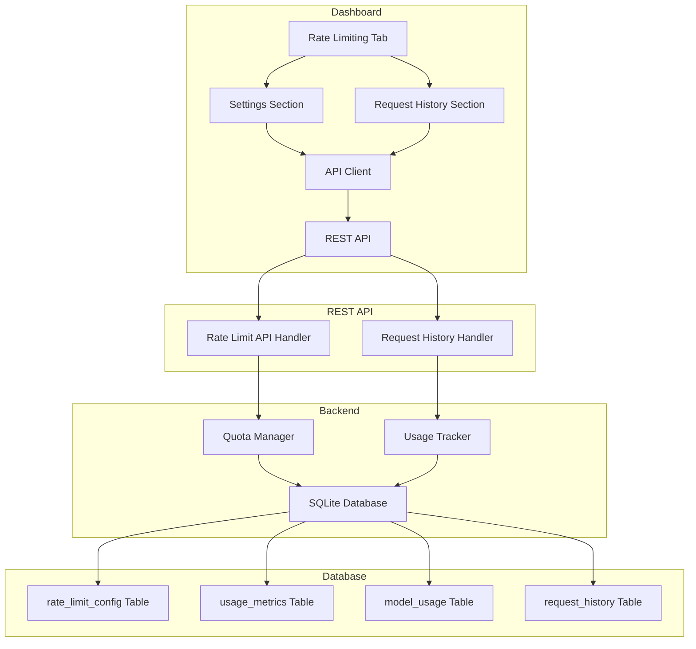
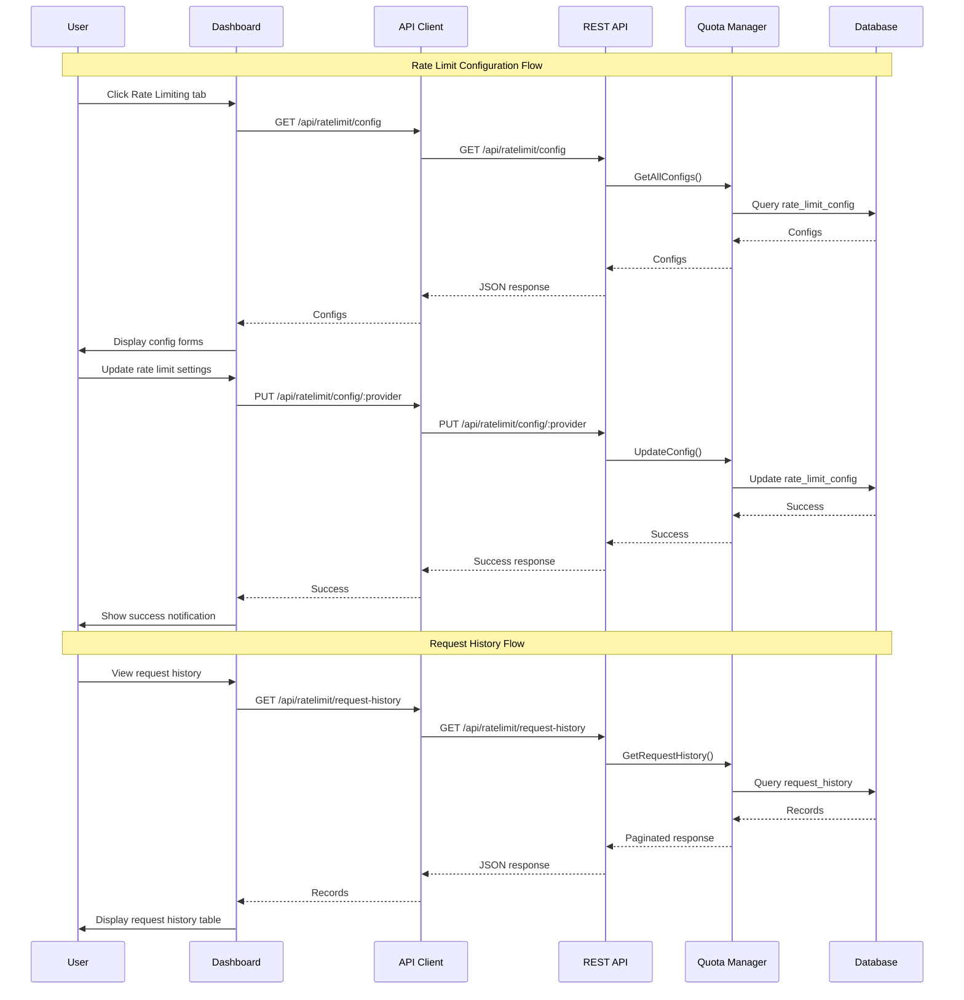

# Rate Limit & Request History Dashboard Integration Plan

## Overview

This plan details the integration of the existing Rate Limit and Request History REST APIs with the dashboard. The goal is to enable users to:
1. Configure rate limit settings for each provider from the dashboard
2. View request history showing how many requests each token made and which models were used

## Current State

### Backend APIs (Already Implemented)

The following REST API endpoints are already implemented in [`internal/restapi/rate_limit_api.go`](../internal/restapi/rate_limit_api.go):

#### Rate Limit Configuration Endpoints
- `GET /api/ratelimit/config` - Get all provider rate limit configurations
- `PUT /api/ratelimit/config/:provider` - Update rate limit configuration for a provider

#### Usage Tracking Endpoints
- `GET /api/ratelimit/usage` - Get all provider usage
- `GET /api/ratelimit/usage/:provider` - Get usage for a specific provider
- `GET /api/ratelimit/usage/:provider/:token` - Get usage for a specific token
- `POST /api/ratelimit/reset/:provider` - Reset usage for a provider
- `POST /api/ratelimit/reset/:provider/:token` - Reset usage for a token

#### Model Usage Endpoints
- `GET /api/ratelimit/model-usage` - Get all model usage
- `GET /api/ratelimit/model-usage/:provider` - Get model usage for a provider
- `GET /api/ratelimit/model-usage/:provider/:token` - Get model usage for a token
- `GET /api/ratelimit/model-usage/:provider/:token/:model` - Get usage for a specific model

#### Error Tracking Endpoints
- `GET /api/ratelimit/errors?provider_id=:provider` - Get errors for a provider
- `GET /api/ratelimit/errors/:provider/:token` - Get errors for a token
- `POST /api/ratelimit/errors/reset/:provider/:token` - Reset errors for a token

#### Request History Endpoints
- `GET /api/ratelimit/request-history` - Get all request history with filters
- `GET /api/ratelimit/request-history/:token` - Get request history for a token
- `GET /api/ratelimit/request-history/:token/:model` - Get request history for a token and model
- `GET /api/ratelimit/request-history/summary` - Get request history summary
- `POST /api/ratelimit/request-history/delete` - Delete request history records

### Dashboard State

The dashboard already has:
- Navigation tabs: Overview, Tokens, Proxy, Settings, Logs
- API client structure in [`web/dashboard/js/api/client.js`](../web/dashboard/js/api/client.js)
- Endpoint definitions in [`web/dashboard/js/api/endpoints.js`](../web/dashboard/js/api/endpoints.js)
- CSS styling system with components for forms, tables, and notifications

**Missing:**
- Rate Limiting tab
- API client methods for rate limit and request history endpoints
- UI components for rate limit settings
- UI components for request history display

## Architecture

### System Flow Diagram



### Data Flow



## Implementation Plan

### Phase 1: API Client Methods

Add rate limit and request history API methods to [`web/dashboard/js/api/client.js`](../web/dashboard/js/api/client.js).

#### Rate Limit Configuration Methods

```javascript
// Rate limit configuration
async getRateLimitConfigs() {
    return this.request('GET', ENDPOINTS.GET_RATE_LIMIT_CONFIGS);
}

async getRateLimitConfig(providerId) {
    return this.request('GET', ENDPOINTS.GET_RATE_LIMIT_CONFIG(providerId));
}

async updateRateLimitConfig(providerId, config) {
    return this.request('PUT', ENDPOINTS.UPDATE_RATE_LIMIT_CONFIG(providerId), config);
}
```

#### Usage Tracking Methods

```javascript
// Usage tracking
async getAllUsage() {
    return this.request('GET', ENDPOINTS.GET_ALL_USAGE);
}

async getProviderUsage(providerId) {
    return this.request('GET', ENDPOINTS.GET_PROVIDER_USAGE(providerId));
}

async getTokenUsage(providerId, tokenId) {
    return this.request('GET', ENDPOINTS.GET_TOKEN_USAGE(providerId, tokenId));
}

async resetProviderUsage(providerId) {
    return this.request('POST', ENDPOINTS.RESET_PROVIDER_USAGE(providerId));
}

async resetTokenUsage(providerId, tokenId) {
    return this.request('POST', ENDPOINTS.RESET_TOKEN_USAGE(providerId, tokenId));
}
```

#### Model Usage Methods

```javascript
// Model usage
async getAllModelUsage() {
    return this.request('GET', ENDPOINTS.GET_ALL_MODEL_USAGE);
}

async getProviderModelUsage(providerId) {
    return this.request('GET', ENDPOINTS.GET_PROVIDER_MODEL_USAGE(providerId));
}

async getTokenModelUsage(providerId, tokenId) {
    return this.request('GET', ENDPOINTS.GET_TOKEN_MODEL_USAGE(providerId, tokenId));
}

async getModelUsage(providerId, tokenId, model) {
    return this.request('GET', ENDPOINTS.GET_MODEL_USAGE(providerId, tokenId, model));
}
```

#### Error Tracking Methods

```javascript
// Error tracking
async getProviderErrors(providerId) {
    return this.request('GET', ENDPOINTS.GET_PROVIDER_ERRORS(providerId));
}

async getTokenErrors(providerId, tokenId) {
    return this.request('GET', ENDPOINTS.GET_TOKEN_ERRORS(providerId, tokenId));
}

async resetTokenErrors(providerId, tokenId) {
    return this.request('POST', ENDPOINTS.RESET_TOKEN_ERRORS(providerId, tokenId));
}
```

#### Request History Methods

```javascript
// Request history
async getRequestHistory(params = {}) {
    const queryParams = new URLSearchParams();
    if (params.tokenId) queryParams.append('token_id', params.tokenId);
    if (params.model) queryParams.append('model', params.model);
    if (params.startTime) queryParams.append('start_time', params.startTime);
    if (params.endTime) queryParams.append('end_time', params.endTime);
    if (params.minTokens) queryParams.append('min_tokens', params.minTokens);
    if (params.maxTokens) queryParams.append('max_tokens', params.maxTokens);
    if (params.page) queryParams.append('page', params.page);
    if (params.pageSize) queryParams.append('page_size', params.pageSize);
    
    const url = `${ENDPOINTS.GET_REQUEST_HISTORY}?${queryParams.toString()}`;
    return this.request('GET', url);
}

async getTokenRequestHistory(tokenId, params = {}) {
    const queryParams = new URLSearchParams();
    if (params.startTime) queryParams.append('start_time', params.startTime);
    if (params.endTime) queryParams.append('end_time', params.endTime);
    if (params.minTokens) queryParams.append('min_tokens', params.minTokens);
    if (params.maxTokens) queryParams.append('max_tokens', params.maxTokens);
    if (params.page) queryParams.append('page', params.page);
    if (params.pageSize) queryParams.append('page_size', params.pageSize);
    
    const url = `${ENDPOINTS.GET_TOKEN_REQUEST_HISTORY(tokenId)}?${queryParams.toString()}`;
    return this.request('GET', url);
}

async getTokenModelRequestHistory(tokenId, model, params = {}) {
    const queryParams = new URLSearchParams();
    if (params.startTime) queryParams.append('start_time', params.startTime);
    if (params.endTime) queryParams.append('end_time', params.endTime);
    if (params.minTokens) queryParams.append('min_tokens', params.minTokens);
    if (params.maxTokens) queryParams.append('max_tokens', params.maxTokens);
    if (params.page) queryParams.append('page', params.page);
    if (params.pageSize) queryParams.append('page_size', params.pageSize);
    
    const url = `${ENDPOINTS.GET_TOKEN_MODEL_REQUEST_HISTORY(tokenId, model)}?${queryParams.toString()}`;
    return this.request('GET', url);
}

async getRequestHistorySummary(params = {}) {
    const queryParams = new URLSearchParams();
    if (params.tokenId) queryParams.append('token_id', params.tokenId);
    if (params.model) queryParams.append('model', params.model);
    if (params.startTime) queryParams.append('start_time', params.startTime);
    if (params.endTime) queryParams.append('end_time', params.endTime);
    
    const url = `${ENDPOINTS.GET_REQUEST_HISTORY_SUMMARY}?${queryParams.toString()}`;
    return this.request('GET', url);
}

async deleteRequestHistory(params) {
    const queryParams = new URLSearchParams();
    if (params.tokenId) queryParams.append('token_id', params.tokenId);
    if (params.model) queryParams.append('model', params.model);
    if (params.startTime) queryParams.append('start_time', params.startTime);
    if (params.endTime) queryParams.append('end_time', params.endTime);
    
    const url = `${ENDPOINTS.DELETE_REQUEST_HISTORY}?${queryParams.toString()}`;
    return this.request('POST', url);
}
```

### Phase 2: Dashboard Tab Structure

Add a new "Rate Limiting" tab to the dashboard navigation in [`web/dashboard/index.html`](../web/dashboard/index.html):

```html
<button class="nav-tab" data-tab="ratelimit">
    ⚡ Rate Limiting
</button>
```

### Phase 3: Rate Limiting Tab HTML Structure

Create the Rate Limiting tab content in [`web/dashboard/templates/tabs.html`](../web/dashboard/templates/tabs.html):

```html
<!-- Rate Limiting Tab -->
<div class="tab-content" id="ratelimitTab">
    <!-- Rate Limit Settings Section -->
    <div class="ratelimit-section">
        <h2>⚡ Rate Limit Configuration</h2>
        <p class="section-description">Configure rate limits for each provider</p>
        
        <div class="ratelimit-configs-grid" id="ratelimitConfigsGrid">
            <!-- Provider rate limit config cards will be dynamically inserted here -->
        </div>
    </div>

    <!-- Usage Statistics Section -->
    <div class="ratelimit-section">
        <h2>📊 Usage Statistics</h2>
        <p class="section-description">Current usage across all providers</p>
        
        <div class="usage-summary" id="usageSummary">
            <!-- Usage summary stats will be dynamically inserted here -->
        </div>
    </div>

    <!-- Request History Section -->
    <div class="ratelimit-section">
        <h2>📋 Request History</h2>
        <p class="section-description">View detailed request history by token and model</p>
        
        <!-- Request History Filters -->
        <div class="filter-bar">
            <select class="filter-input" id="rhFilterToken">
                <option value="">All Tokens</option>
            </select>
            <select class="filter-input" id="rhFilterModel">
                <option value="">All Models</option>
            </select>
            <input type="datetime-local" class="filter-input" id="rhFilterStartTime" placeholder="Start Time">
            <input type="datetime-local" class="filter-input" id="rhFilterEndTime" placeholder="End Time">
            <input type="number" class="filter-input" id="rhFilterMinTokens" placeholder="Min Tokens">
            <input type="number" class="filter-input" id="rhFilterMaxTokens" placeholder="Max Tokens">
            <button class="btn btn-secondary" id="rhApplyFilters">Apply Filters</button>
            <button class="btn btn-secondary" id="rhClearFilters">Clear Filters</button>
        </div>

        <!-- Request History Summary Stats -->
        <div class="request-history-summary" id="requestHistorySummary">
            <!-- Summary stats will be dynamically inserted here -->
        </div>

        <!-- Request History Table -->
        <div class="table-container">
            <table id="requestHistoryTable">
                <thead>
                    <tr>
                        <th data-sort="timestamp">Timestamp <span class="sort-icon">⇅</span></th>
                        <th data-sort="token_id">Token ID <span class="sort-icon">⇅</span></th>
                        <th data-sort="model">Model <span class="sort-icon">⇅</span></th>
                        <th data-sort="request_count">Requests <span class="sort-icon">⇅</span></th>
                        <th data-sort="input_tokens">Input Tokens <span class="sort-icon">⇅</span></th>
                        <th data-sort="output_tokens">Output Tokens <span class="sort-icon">⇅</span></th>
                        <th data-sort="total_tokens">Total Tokens <span class="sort-icon">⇅</span></th>
                    </tr>
                </thead>
                <tbody id="requestHistoryTableBody">
                    <!-- Request history rows will be dynamically inserted here -->
                </tbody>
            </table>
        </div>

        <!-- Pagination Controls -->
        <div class="pagination-controls" id="paginationControls">
            <button class="btn btn-secondary" id="prevPage" disabled>Previous</button>
            <span class="page-info">Page <span id="currentPage">1</span> of <span id="totalPages">1</span></span>
            <button class="btn btn-secondary" id="nextPage" disabled>Next</button>
            <select class="page-size-select" id="pageSize">
                <option value="20">20 per page</option>
                <option value="50">50 per page</option>
                <option value="100">100 per page</option>
            </select>
        </div>
    </div>
</div>
```

### Phase 4: Rate Limit Config Card Template

Each provider rate limit config card will have the following structure:

```html
<div class="ratelimit-config-card" data-provider-id="gemini-cli">
    <div class="card-header">
        <h3>Gemini CLI</h3>
        <label class="toggle-switch">
            <input type="checkbox" id="ratelimit-enabled-gemini-cli" checked>
            <span class="slider"></span>
        </label>
    </div>
    
    <div class="card-body">
        <div class="form-group">
            <label for="ratelimit-rpd-gemini-cli">Requests Per Day</label>
            <input type="number" id="ratelimit-rpd-gemini-cli" value="15000" min="0">
        </div>
        
        <div class="form-group">
            <label for="ratelimit-rpm-gemini-cli">Requests Per Minute</label>
            <input type="number" id="ratelimit-rpm-gemini-cli" value="60" min="0">
        </div>
        
        <div class="form-group">
            <label for="ratelimit-tpm-gemini-cli">Tokens Per Minute</label>
            <input type="number" id="ratelimit-tpm-gemini-cli" value="32000" min="0">
        </div>
        
        <div class="current-usage">
            <h4>Current Usage</h4>
            <div class="usage-metrics">
                <div class="usage-metric">
                    <span class="metric-label">Today:</span>
                    <span class="metric-value" id="usage-today-gemini-cli">0 / 15000</span>
                    <div class="progress-bar">
                        <div class="progress-fill" id="progress-today-gemini-cli" style="width: 0%"></div>
                    </div>
                </div>
                <div class="usage-metric">
                    <span class="metric-label">Last Minute:</span>
                    <span class="metric-value" id="usage-minute-gemini-cli">0 / 60</span>
                    <div class="progress-bar">
                        <div class="progress-fill" id="progress-minute-gemini-cli" style="width: 0%"></div>
                    </div>
                </div>
                <div class="usage-metric">
                    <span class="metric-label">Tokens/Min:</span>
                    <span class="metric-value" id="usage-tokens-gemini-cli">0 / 32000</span>
                    <div class="progress-bar">
                        <div class="progress-fill" id="progress-tokens-gemini-cli" style="width: 0%"></div>
                    </div>
                </div>
            </div>
        </div>
        
        <div class="card-actions">
            <button class="btn btn-primary" data-action="save" data-provider="gemini-cli">Save</button>
            <button class="btn btn-secondary" data-action="reset" data-provider="gemini-cli">Reset Usage</button>
        </div>
    </div>
</div>
```

### Phase 5: CSS Styles

Add CSS styles for the Rate Limiting tab in a new file [`web/dashboard/css/ratelimit.css`](../web/dashboard/css/ratelimit.css):

```css
/* Rate Limiting Tab Styles */

.ratelimit-section {
    margin-bottom: 40px;
}

.ratelimit-section h2 {
    margin-bottom: 8px;
}

.section-description {
    color: #666;
    margin-bottom: 20px;
}

/* Rate Limit Config Grid */
.ratelimit-configs-grid {
    display: grid;
    grid-template-columns: repeat(auto-fill, minmax(350px, 1fr));
    gap: 20px;
}

.ratelimit-config-card {
    background: #fff;
    border: 1px solid #ddd;
    border-radius: 8px;
    padding: 20px;
    box-shadow: 0 2px 4px rgba(0,0,0,0.1);
}

.ratelimit-config-card .card-header {
    display: flex;
    justify-content: space-between;
    align-items: center;
    margin-bottom: 15px;
    padding-bottom: 15px;
    border-bottom: 1px solid #eee;
}

.ratelimit-config-card .card-header h3 {
    margin: 0;
    font-size: 18px;
}

/* Toggle Switch */
.toggle-switch {
    position: relative;
    display: inline-block;
    width: 50px;
    height: 24px;
}

.toggle-switch input {
    opacity: 0;
    width: 0;
    height: 0;
}

.toggle-switch .slider {
    position: absolute;
    cursor: pointer;
    top: 0;
    left: 0;
    right: 0;
    bottom: 0;
    background-color: #ccc;
    transition: .4s;
    border-radius: 24px;
}

.toggle-switch .slider:before {
    position: absolute;
    content: "";
    height: 18px;
    width: 18px;
    left: 3px;
    bottom: 3px;
    background-color: white;
    transition: .4s;
    border-radius: 50%;
}

.toggle-switch input:checked + .slider {
    background-color: #4CAF50;
}

.toggle-switch input:checked + .slider:before {
    transform: translateX(26px);
}

/* Current Usage Section */
.current-usage {
    margin-top: 20px;
    padding-top: 20px;
    border-top: 1px solid #eee;
}

.current-usage h4 {
    margin: 0 0 15px 0;
    font-size: 14px;
    color: #666;
}

.usage-metrics {
    display: flex;
    flex-direction: column;
    gap: 12px;
}

.usage-metric {
    display: flex;
    flex-direction: column;
    gap: 4px;
}

.usage-metric .metric-label {
    font-size: 12px;
    color: #666;
}

.usage-metric .metric-value {
    font-size: 14px;
    font-weight: 600;
}

.progress-bar {
    height: 8px;
    background-color: #f0f0f0;
    border-radius: 4px;
    overflow: hidden;
}

.progress-fill {
    height: 100%;
    background-color: #4CAF50;
    transition: width 0.3s ease;
}

.progress-fill.warning {
    background-color: #ff9800;
}

.progress-fill.danger {
    background-color: #f44336;
}

/* Card Actions */
.card-actions {
    display: flex;
    gap: 10px;
    margin-top: 20px;
    padding-top: 20px;
    border-top: 1px solid #eee;
}

.card-actions .btn {
    flex: 1;
}

/* Usage Summary */
.usage-summary {
    display: grid;
    grid-template-columns: repeat(auto-fit, minmax(200px, 1fr));
    gap: 20px;
    margin-bottom: 30px;
}

.usage-summary-card {
    background: #fff;
    border: 1px solid #ddd;
    border-radius: 8px;
    padding: 20px;
    text-align: center;
}

.usage-summary-card .metric-value {
    font-size: 32px;
    font-weight: bold;
    color: #333;
    margin-bottom: 8px;
}

.usage-summary-card .metric-label {
    font-size: 14px;
    color: #666;
}

/* Request History Summary */
.request-history-summary {
    display: grid;
    grid-template-columns: repeat(auto-fit, minmax(150px, 1fr));
    gap: 15px;
    margin-bottom: 20px;
}

.request-history-summary .summary-card {
    background: #f9f9f9;
    border: 1px solid #eee;
    border-radius: 6px;
    padding: 15px;
    text-align: center;
}

.request-history-summary .summary-card .value {
    font-size: 24px;
    font-weight: bold;
    color: #333;
}

.request-history-summary .summary-card .label {
    font-size: 12px;
    color: #666;
    margin-top: 4px;
}

/* Pagination Controls */
.pagination-controls {
    display: flex;
    justify-content: center;
    align-items: center;
    gap: 15px;
    margin-top: 20px;
    padding: 15px;
    background: #f9f9f9;
    border-radius: 8px;
}

.page-info {
    font-size: 14px;
    color: #666;
}

.page-size-select {
    padding: 6px 12px;
    border: 1px solid #ddd;
    border-radius: 4px;
    background: #fff;
}
```

### Phase 6: JavaScript Implementation

Add the Rate Limiting tab logic to [`web/dashboard/js/dashboard.js`](../web/dashboard/js/dashboard.js):

#### State Management

```javascript
// Rate Limiting state
this.rateLimitConfigs = {};
this.usageStats = {};
this.requestHistory = {
    records: [],
    totalCount: 0,
    page: 1,
    pageSize: 20,
    totalPages: 1
};
this.requestHistoryFilters = {
    tokenId: '',
    model: '',
    startTime: '',
    endTime: '',
    minTokens: '',
    maxTokens: ''
};
```

#### Load Rate Limit Data

```javascript
async loadRateLimitData() {
    try {
        this.loading.show();
        
        // Load rate limit configs
        const configsData = await this.api.getRateLimitConfigs();
        this.rateLimitConfigs = configsData || {};
        
        // Load usage stats
        const usageData = await this.api.getAllUsage();
        this.usageStats = usageData || {};
        
        // Render rate limit configs
        this.renderRateLimitConfigs();
    } catch (error) {
        this.log(`Failed to load rate limit data: ${error.message}`, 'error');
        this.toast.show('Failed to load rate limit data', 'error');
    } finally {
        this.loading.hide();
    }
}
```

#### Render Rate Limit Configs

```javascript
renderRateLimitConfigs() {
    const grid = document.getElementById('ratelimitConfigsGrid');
    if (!grid) return;
    
    grid.innerHTML = '';
    
    Object.entries(this.rateLimitConfigs).forEach(([providerId, config]) => {
        const usage = this.usageStats[providerId];
        const card = this.createRateLimitCard(providerId, config, usage);
        grid.appendChild(card);
    });
}

createRateLimitCard(providerId, config, usage) {
    const card = document.createElement('div');
    card.className = 'ratelimit-config-card';
    card.dataset.providerId = providerId;
    
    const rpdPercentage = usage ? (usage.requests_today / config.requests_per_day * 100) : 0;
    const rpmPercentage = usage ? (usage.requests_in_minute / config.requests_per_minute * 100) : 0;
    const tpmPercentage = usage ? (usage.tokens_in_minute / config.tokens_per_minute * 100) : 0;
    
    card.innerHTML = `
        <div class="card-header">
            <h3>${this.formatProviderName(providerId)}</h3>
            <label class="toggle-switch">
                <input type="checkbox" id="ratelimit-enabled-${providerId}" ${config.enabled ? 'checked' : ''}>
                <span class="slider"></span>
            </label>
        </div>
        
        <div class="card-body">
            <div class="form-group">
                <label for="ratelimit-rpd-${providerId}">Requests Per Day</label>
                <input type="number" id="ratelimit-rpd-${providerId}" value="${config.requests_per_day}" min="0">
            </div>
            
            <div class="form-group">
                <label for="ratelimit-rpm-${providerId}">Requests Per Minute</label>
                <input type="number" id="ratelimit-rpm-${providerId}" value="${config.requests_per_minute}" min="0">
            </div>
            
            <div class="form-group">
                <label for="ratelimit-tpm-${providerId}">Tokens Per Minute</label>
                <input type="number" id="ratelimit-tpm-${providerId}" value="${config.tokens_per_minute}" min="0">
            </div>
            
            <div class="current-usage">
                <h4>Current Usage</h4>
                <div class="usage-metrics">
                    <div class="usage-metric">
                        <span class="metric-label">Today:</span>
                        <span class="metric-value" id="usage-today-${providerId}">${usage?.requests_today || 0} / ${config.requests_per_day}</span>
                        <div class="progress-bar">
                            <div class="progress-fill ${this.getProgressClass(rpdPercentage)}" id="progress-today-${providerId}" style="width: ${rpdPercentage}%"></div>
                        </div>
                    </div>
                    <div class="usage-metric">
                        <span class="metric-label">Last Minute:</span>
                        <span class="metric-value" id="usage-minute-${providerId}">${usage?.requests_in_minute || 0} / ${config.requests_per_minute}</span>
                        <div class="progress-bar">
                            <div class="progress-fill ${this.getProgressClass(rpmPercentage)}" id="progress-minute-${providerId}" style="width: ${rpmPercentage}%"></div>
                        </div>
                    </div>
                    <div class="usage-metric">
                        <span class="metric-label">Tokens/Min:</span>
                        <span class="metric-value" id="usage-tokens-${providerId}">${usage?.tokens_in_minute || 0} / ${config.tokens_per_minute}</span>
                        <div class="progress-bar">
                            <div class="progress-fill ${this.getProgressClass(tpmPercentage)}" id="progress-tokens-${providerId}" style="width: ${tpmPercentage}%"></div>
                        </div>
                    </div>
                </div>
            </div>
            
            <div class="card-actions">
                <button class="btn btn-primary" data-action="save" data-provider="${providerId}">Save</button>
                <button class="btn btn-secondary" data-action="reset" data-provider="${providerId}">Reset Usage</button>
            </div>
        </div>
    `;
    
    // Bind event listeners
    card.querySelector('[data-action="save"]').addEventListener('click', () => this.saveRateLimitConfig(providerId));
    card.querySelector('[data-action="reset"]').addEventListener('click', () => this.resetProviderUsage(providerId));
    
    return card;
}
```

#### Save Rate Limit Config

```javascript
async saveRateLimitConfig(providerId) {
    try {
        const enabled = document.getElementById(`ratelimit-enabled-${providerId}`).checked;
        const requestsPerDay = parseInt(document.getElementById(`ratelimit-rpd-${providerId}`).value);
        const requestsPerMinute = parseInt(document.getElementById(`ratelimit-rpm-${providerId}`).value);
        const tokensPerMinute = parseInt(document.getElementById(`ratelimit-tpm-${providerId}`).value);
        
        const config = {
            provider_id: providerId,
            enabled: enabled,
            requests_per_day: requestsPerDay,
            requests_per_minute: requestsPerMinute,
            tokens_per_minute: tokensPerMinute
        };
        
        await this.api.updateRateLimitConfig(providerId, config);
        
        // Update local state
        this.rateLimitConfigs[providerId] = {
            ...this.rateLimitConfigs[providerId],
            ...config
        };
        
        this.toast.show(`Rate limit configuration saved for ${this.formatProviderName(providerId)}`, 'success');
    } catch (error) {
        this.log(`Failed to save rate limit config: ${error.message}`, 'error');
        this.toast.show('Failed to save rate limit configuration', 'error');
    }
}
```

#### Reset Provider Usage

```javascript
async resetProviderUsage(providerId) {
    if (!confirm(`Are you sure you want to reset usage for ${this.formatProviderName(providerId)}?`)) {
        return;
    }
    
    try {
        await this.api.resetProviderUsage(providerId);
        await this.loadRateLimitData(); // Reload to get updated usage
        this.toast.show(`Usage reset for ${this.formatProviderName(providerId)}`, 'success');
    } catch (error) {
        this.log(`Failed to reset usage: ${error.message}`, 'error');
        this.toast.show('Failed to reset usage', 'error');
    }
}
```

#### Load Request History

```javascript
async loadRequestHistory() {
    try {
        this.loading.show();
        
        const params = {
            ...this.requestHistoryFilters,
            page: this.requestHistory.page,
            pageSize: this.requestHistory.pageSize
        };
        
        // Convert datetime-local to timestamp
        if (params.startTime) {
            params.startTime = new Date(params.startTime).getTime();
        }
        if (params.endTime) {
            params.endTime = new Date(params.endTime).getTime();
        }
        
        const response = await this.api.getRequestHistory(params);
        
        this.requestHistory.records = response.records || [];
        this.requestHistory.totalCount = response.total_count || 0;
        this.requestHistory.totalPages = response.total_pages || 1;
        
        // Load summary
        await this.loadRequestHistorySummary();
        
        // Render
        this.renderRequestHistoryTable();
        this.updatePaginationControls();
    } catch (error) {
        this.log(`Failed to load request history: ${error.message}`, 'error');
        this.toast.show('Failed to load request history', 'error');
    } finally {
        this.loading.hide();
    }
}
```

#### Load Request History Summary

```javascript
async loadRequestHistorySummary() {
    try {
        const params = {
            tokenId: this.requestHistoryFilters.tokenId,
            model: this.requestHistoryFilters.model
        };
        
        if (this.requestHistoryFilters.startTime) {
            params.startTime = new Date(this.requestHistoryFilters.startTime).getTime();
        }
        if (this.requestHistoryFilters.endTime) {
            params.endTime = new Date(this.requestHistoryFilters.endTime).getTime();
        }
        
        const summary = await this.api.getRequestHistorySummary(params);
        this.renderRequestHistorySummary(summary);
    } catch (error) {
        this.log(`Failed to load request history summary: ${error.message}`, 'error');
    }
}
```

#### Render Request History Summary

```javascript
renderRequestHistorySummary(summary) {
    const container = document.getElementById('requestHistorySummary');
    if (!container) return;
    
    container.innerHTML = `
        <div class="summary-card">
            <div class="value">${summary.total_requests || 0}</div>
            <div class="label">Total Requests</div>
        </div>
        <div class="summary-card">
            <div class="value">${this.formatNumber(summary.total_input || 0)}</div>
            <div class="label">Input Tokens</div>
        </div>
        <div class="summary-card">
            <div class="value">${this.formatNumber(summary.total_output || 0)}</div>
            <div class="label">Output Tokens</div>
        </div>
        <div class="summary-card">
            <div class="value">${this.formatNumber(summary.total_tokens || 0)}</div>
            <div class="label">Total Tokens</div>
        </div>
        <div class="summary-card">
            <div class="value">${summary.average_tokens?.toFixed(1) || 0}</div>
            <div class="label">Avg Tokens/Request</div>
        </div>
    `;
}
```

#### Render Request History Table

```javascript
renderRequestHistoryTable() {
    const tbody = document.getElementById('requestHistoryTableBody');
    if (!tbody) return;
    
    tbody.innerHTML = '';
    
    if (this.requestHistory.records.length === 0) {
        tbody.innerHTML = '<tr><td colspan="7" class="no-data">No request history found</td></tr>';
        return;
    }
    
    this.requestHistory.records.forEach(record => {
        const row = document.createElement('tr');
        row.innerHTML = `
            <td>${this.formatTimestamp(record.timestamp)}</td>
            <td>${this.truncateTokenId(record.token_id)}</td>
            <td>${record.model}</td>
            <td>${record.request_count}</td>
            <td>${this.formatNumber(record.input_tokens)}</td>
            <td>${this.formatNumber(record.output_tokens)}</td>
            <td>${this.formatNumber(record.total_tokens)}</td>
        `;
        tbody.appendChild(row);
    });
}
```

#### Helper Functions

```javascript
formatProviderName(providerId) {
    const names = {
        'gemini-cli': 'Gemini CLI',
        'qwen': 'Qwen',
        'kiro': 'Kiro',
        'antigravity': 'Antigravity',
        'iflow': 'iFlow'
    };
    return names[providerId] || providerId;
}

getProgressClass(percentage) {
    if (percentage >= 90) return 'danger';
    if (percentage >= 70) return 'warning';
    return '';
}

formatNumber(num) {
    return num.toLocaleString();
}

formatTimestamp(timestamp) {
    const date = new Date(timestamp);
    return date.toLocaleString();
}

truncateTokenId(tokenId) {
    if (tokenId.length <= 12) return tokenId;
    return `${tokenId.substring(0, 6)}...${tokenId.substring(tokenId.length - 6)}`;
}
```

## Testing Checklist

- [ ] Verify rate limit configs load correctly
- [ ] Test updating rate limit settings
- [ ] Verify usage statistics display correctly
- [ ] Test progress bar colors (green, orange, red)
- [ ] Test reset usage functionality
- [ ] Verify request history loads with pagination
- [ ] Test request history filters (token, model, date range, token count)
- [ ] Verify request history summary statistics
- [ ] Test pagination controls (previous, next, page size)
- [ ] Verify error handling and user feedback
- [ ] Test responsive design on mobile devices

## Files to Modify

1. [`web/dashboard/js/api/endpoints.js`](../web/dashboard/js/api/endpoints.js) - Already has endpoint definitions
2. [`web/dashboard/js/api/client.js`](../web/dashboard/js/api/client.js) - Add API methods
3. [`web/dashboard/index.html`](../web/dashboard/index.html) - Add Rate Limiting tab to navigation
4. [`web/dashboard/templates/tabs.html`](../web/dashboard/templates/tabs.html) - Add Rate Limiting tab content
5. [`web/dashboard/css/ratelimit.css`](../web/dashboard/css/ratelimit.css) - New file for Rate Limiting styles
6. [`web/dashboard/index.html`](../web/dashboard/index.html) - Add CSS link for ratelimit.css
7. [`web/dashboard/js/dashboard.js`](../web/dashboard/js/dashboard.js) - Add Rate Limiting tab logic

## Dependencies

No new dependencies are required. The implementation uses:
- Existing REST API endpoints
- Existing dashboard infrastructure
- Standard HTML/CSS/JavaScript
