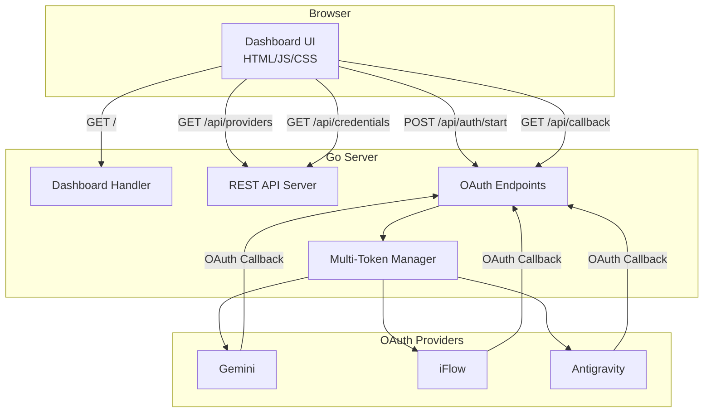

# Simple Dashboard Integration Plan

## Overview

This plan outlines the integration of a simple HTML/JS dashboard into the QWEncoder Proxy project. The dashboard will allow users to add OAuth tokens for each provider using the authorization code flow, with a clean, minimal design using vanilla CSS.

## Requirements

- **Dashboard URL**: Root path (`http://localhost:8143/`)
- **OAuth Flow**: Authorization code flow only (initially)
  - Supported providers: Gemini, iFlow, Antigravity
  - Device code flow (Qwen) to be added later
- **Tech Stack**: Pure HTML/JS/CSS (no npm, no external frameworks)
- **Design**: Clean, minimal vanilla CSS
- **Live Mode**: Dashboard should be available when the project is running

## Architecture Overview



## Directory Structure

```
qwencoder-proxy/
├── internal/
│   ├── dashboard/
│   │   ├── handler.go          # Dashboard HTTP handler
│   │   └── dashboard.go        # Dashboard configuration
│   └── restapi/
│       └── rest_api.go         # Modified to integrate dashboard
├── web/
│   ├── index.html              # Main dashboard HTML
│   ├── css/
│   │   └── dashboard.css       # Dashboard styles
│   └── js/
│       └── dashboard.js        # Dashboard JavaScript
└── cmd/
    └── main.go                 # Modified to serve dashboard
```

## Implementation Steps

### Step 1: Create Dashboard Directory Structure

Create the `internal/dashboard` and `web` directories with the following files:

- `internal/dashboard/handler.go` - HTTP handler for serving dashboard files
- `internal/dashboard/dashboard.go` - Dashboard configuration and initialization
- `web/index.html` - Main dashboard HTML
- `web/css/dashboard.css` - Dashboard styles
- `web/js/dashboard.js` - Dashboard JavaScript

### Step 2: Implement Dashboard HTML

**File**: `web/index.html`

Features:
- Header with project title
- Provider list showing supported OAuth providers
- OAuth flow UI for each provider:
  - "Add Token" button
  - Status indicator (authenticated/not authenticated)
  - Token list (email, expiry, health status)
- Loading states and error messages
- Responsive design

### Step 3: Implement Vanilla CSS

**File**: `web/css/dashboard.css`

Design principles:
- Clean, minimal aesthetic
- Responsive layout (mobile-friendly)
- Color scheme:
  - Primary: #2563eb (blue)
  - Success: #10b981 (green)
  - Error: #ef4444 (red)
  - Background: #f9fafb (light gray)
  - Text: #1f2937 (dark gray)
- Card-based layout for providers
- Smooth transitions and hover effects

### Step 4: Implement JavaScript for OAuth Flow

**File**: `web/js/dashboard.js`

Functionality:
- Fetch provider list from `/api/providers`
- Handle "Add Token" button clicks:
  - Call `/api/auth/start` with provider ID
  - Redirect to OAuth provider
  - Handle callback at `/api/callback`
- Poll for authentication status
- Display token information
- Handle errors gracefully
- Auto-refresh token list

### Step 5: Create Go Handler for Dashboard

**File**: `internal/dashboard/handler.go`

```go
package dashboard

import (
    "embed"
    "io/fs"
    "net/http"
    "path/filepath"
    "strings"
    
    "github.com/sunbankio/qwencoder-proxy/internal/logging"
)

//go:embed ../../web
var webFS embed.FS

type Handler struct {
    logger logging.Logger
}

func NewHandler(logger logging.Logger) (*Handler, error) {
    // Create subdirectories for CSS and JS
    webCSS, err := fs.Sub(webFS, "web/css")
    if err != nil {
        return nil, err
    }
    webJS, err := fs.Sub(webFS, "web/js")
    if err != nil {
        return nil, err
    }
    
    return &Handler{
        logger: logger,
        webCSS: webCSS,
        webJS:  webJS,
    }, nil
}

func (h *Handler) ServeIndex(w http.ResponseWriter, r *http.Request) {
    // Serve index.html
}

func (h *Handler) ServeCSS(w http.ResponseWriter, r *http.Request) {
    // Serve CSS files
}

func (h *Handler) ServeJS(w http.ResponseWriter, r *http.Request) {
    // Serve JS files
}
```

### Step 6: Integrate Dashboard into Main Server

**File**: `cmd/main.go`

Add dashboard initialization and route registration:

```go
// Create dashboard handler
dashboardHandler, err := dashboard.NewHandler(logger)
if err != nil {
    logger.ErrorLog("Failed to create dashboard handler: %v", err)
} else {
    // Register dashboard routes
    mux.HandleFunc("/", dashboardHandler.ServeIndex)
    mux.HandleFunc("/css/", dashboardHandler.ServeCSS)
    mux.HandleFunc("/js/", dashboardHandler.ServeJS)
}
```

### Step 7: Configure Callback URL

The callback URL for authorization code flow should be:
- `http://localhost:8143/api/callback`

This is already configured in the existing REST API server.

### Step 8: OAuth Flow Implementation

The dashboard will use the following API endpoints:

1. **GET /api/providers** - Get list of providers
   ```json
   {
     "providers": [
       {
         "id": "gemini-cli",
         "name": "Gemini (Google)",
         "flow": "authorization_code",
         "auth_url": "https://accounts.google.com/o/oauth2/v2/auth"
       }
     ]
   }
   ```

2. **POST /api/auth/start** - Start OAuth flow
   ```json
   {
     "provider_id": "gemini-cli",
     "callback_url": "http://localhost:8143/api/callback"
   }
   ```
   Response:
   ```json
   {
     "auth_url": "https://accounts.google.com/o/oauth2/v2/auth?...",
     "state": "random_state_value"
   }
   ```

3. **GET /api/callback** - OAuth callback (handled by server)

4. **GET /api/credentials** - Get provider credentials
   ```json
   {
     "provider_id": "gemini-cli",
     "tokens": [
       {
         "id": "token_id",
         "email": "user@example.com",
         "expiry_date": 1234567890,
         "healthy": true
       }
     ]
   }
   ```

## API Endpoints Used

| Endpoint | Method | Description |
|----------|--------|-------------|
| `/` | GET | Serve dashboard HTML |
| `/css/*` | GET | Serve CSS files |
| `/js/*` | GET | Serve JavaScript files |
| `/api/providers` | GET | List all providers |
| `/api/providers/{id}` | GET | Get provider configuration |
| `/api/auth/start` | POST | Start authorization code flow |
| `/api/callback` | GET | OAuth callback endpoint |
| `/api/credentials` | GET | Get provider credentials |
| `/api/credentials/{id}` | GET | Get credentials for specific provider |

## Testing Plan

1. **Start the server**: `go run cmd/main.go`
2. **Navigate to dashboard**: Open `http://localhost:8143/` in browser
3. **Test provider list**: Verify all authorization code providers are displayed
4. **Test OAuth flow for Gemini**:
   - Click "Add Token" for Gemini
   - Verify redirect to Google OAuth
   - Complete authentication
   - Verify token appears in dashboard
5. **Test OAuth flow for iFlow**: Repeat for iFlow
6. **Test OAuth flow for Antigravity**: Repeat for Antigravity
7. **Test token display**: Verify email, expiry, and health status are shown
8. **Test error handling**: Try invalid scenarios and verify error messages

## Future Enhancements

1. **Device Code Flow Support**: Add support for Qwen provider
2. **Token Management**: Add ability to delete tokens
3. **Proxy Configuration**: Add UI for configuring proxy settings per token
4. **Rate Limiting**: Display rate limit information
5. **Usage Analytics**: Show token usage statistics
6. **Settings Page**: Add configuration options

## Notes

- The dashboard uses Go's `embed` package to serve static files
- No build step required - files are embedded at compile time
- The dashboard will be available at the root path, so the proxy API routes need to be under `/api/*`
- The existing REST API endpoints are already configured correctly for this use case
