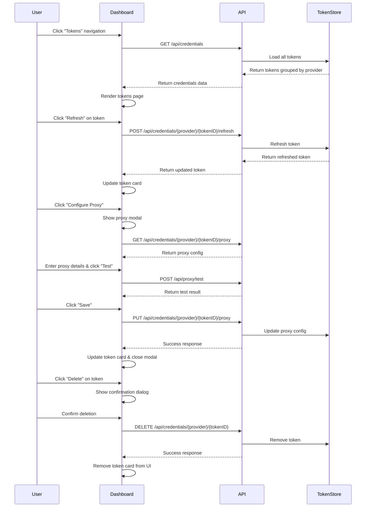

# Token Management Page Implementation Plan

## Overview
Create a dedicated token management page with separate files for better code organization. Users can view all tokens grouped by provider, delete tokens, refresh tokens, and assign proxy configurations.

## Architecture Decision: Separate Files
Instead of adding everything to a single `index.html` and `dashboard.js`, we will create separate files for each page:

- **HTML Files:** `index.html` (providers), `tokens.html` (token management), shared `modals.html` (optional)
- **CSS Files:** `dashboard.css` (shared styles), `tokens.css` (token page specific)
- **JS Files:** `dashboard.js` (providers page), `tokens.js` (token page), `shared.js` (common utilities)

**Benefits:**
- Better code organization and separation of concerns
- Easier to maintain and debug
- Smaller file sizes per page (faster loading)
- Better caching (each file cached separately)
- Easier to add new pages in the future
- Better for collaboration

## Current State Analysis

### Existing API Endpoints (Already Available)
- `GET /api/credentials` - List all credentials across all providers
- `GET /api/credentials/{provider}` - List all tokens for a specific provider
- `DELETE /api/credentials/{provider}/{tokenID}` - Delete a specific token
- `POST /api/credentials/{provider}/{tokenID}/refresh` - Refresh a specific token
- `GET /api/credentials/{provider}/{tokenID}/proxy` - Get proxy config for a token
- `PUT /api/credentials/{provider}/{tokenID}/proxy` - Update proxy config for a token
- `DELETE /api/credentials/{provider}/{tokenID}/proxy` - Remove proxy config for a token
- `POST /api/proxy/test` - Test a proxy connection

### Current Dashboard Structure
- Single-page application with provider cards
- Tokens shown inline within provider cards
- No dedicated token management interface
- Basic token display (email, expiry, health status)

## Implementation Plan

## New File Structure

```
internal/restapi/web/
├── index.html          # Providers page (existing, add navigation)
├── tokens.html         # NEW: Token management page
├── css/
│   ├── dashboard.css   # Shared styles (existing, add navigation)
│   └── tokens.css      # NEW: Token page specific styles
└── js/
    ├── shared.js       # NEW: Shared utilities (API client, helpers)
    ├── dashboard.js    # Providers page logic (existing, add navigation)
    └── tokens.js       # NEW: Token page logic
```

### Phase 1: Backend Handler Updates

#### 1.1 Update Dashboard Handler for Multiple Pages
**File:** `internal/restapi/dashboard_handler.go`
- Add `ServeTokens()` method to serve tokens.html
- Update `ServeIndex()` to serve index.html (providers page)
- Add route registration for `/tokens` path

**File:** `internal/restapi/rest_api.go`
- Add route: `mux.HandleFunc("/tokens", dashboardHandler.ServeTokens)`

### Phase 2: Create Shared JavaScript Utilities

#### 2.1 Create shared.js
**File:** `internal/restapi/web/js/shared.js`
- API client class for making HTTP requests
- Common utility functions:
  - `formatDate()` - Format timestamps
  - `formatExpiry()` - Format expiry with relative time
  - `showToast()` - Display toast notifications
  - `showConfirm()` - Display confirmation dialogs
  - `showLoading()` / `hideLoading()` - Loading state management
- Constants: API_BASE, timeout values

### Phase 3: Update Providers Page

#### 3.1 Add Navigation to index.html
**File:** `internal/restapi/web/index.html`
- Add navigation bar with links:
  - "Providers" → `/` (current page)
  - "Tokens" → `/tokens` (new page)
- Keep existing provider authentication sections

#### 3.2 Add Navigation Styles
**File:** `internal/restapi/web/css/dashboard.css`
- Add navigation bar styles
- Add active state styling for current page

#### 3.3 Update dashboard.js
**File:** `internal/restapi/web/js/dashboard.js`
- Import shared utilities from shared.js
- Keep existing provider authentication logic
- No token management logic here (separate file)

### Phase 4: Create Token Management Page

#### 4.1 Create tokens.html
**File:** `internal/restapi/web/tokens.html` (NEW)
- Navigation bar (shared with providers page)
- Page header with title and refresh button
- Token list container
- Empty state template
- Loading state template
- Proxy configuration modal

#### 4.2 Create tokens.css
**File:** `internal/restapi/web/css/tokens.css` (NEW)
- Token page layout styles
- Provider group styles (collapsible)
- Token card styles
- Status indicator colors:
  - Expiry: green (>7 days), yellow (1-7 days), red (<24 hours/expired)
  - Health: healthy/unhealthy badges
  - Proxy: configured/not configured indicators
- Proxy modal styles
- Responsive design

#### 4.3 Create tokens.js
**File:** `internal/restapi/web/js/tokens.js` (NEW)

**Functions to implement:**

**Token Loading:**
- `loadTokens()` - Fetch all credentials from `/api/credentials`
- `renderTokensPage(credentials)` - Render tokens grouped by provider
- `createProviderGroup(provider, tokens)` - Create provider section
- `createTokenCard(token, providerID)` - Create individual token card

**Token Card Features:**
- Display token email/identifier
- Show expiry date with visual indicator (expiring soon, expired)
- Show health status with color coding
- Show proxy status (configured/not configured)
- Action buttons: Refresh, Delete, Configure Proxy

**Token Deletion:**
- `deleteToken(providerID, tokenID)` - Delete token via API
- Confirm deletion with dialog
- Update UI after successful deletion
- Handle errors with user feedback

**Token Refresh:**
- `refreshToken(providerID, tokenID)` - Refresh token via API
- Show loading state during refresh
- Update token data after successful refresh
- Handle errors (no refresh token, refresh failed)

**Proxy Configuration:**
- `showProxyModal(token, providerID)` - Open proxy configuration modal
- `loadProxyConfig(providerID, tokenID)` - Load existing proxy config
- `testProxyConnection(config)` - Test proxy before saving
- `saveProxyConfig(providerID, tokenID, config)` - Save proxy configuration
- `removeProxyConfig(providerID, tokenID)` - Remove proxy configuration

**Proxy Modal Features:**
- Proxy type selector (none, http, https, socks5)
- Host and port fields
- Username/password fields (optional)
- Test connection button
- Save/Cancel buttons
- Display current proxy health status

### Phase 5: UI/UX Enhancements

#### 5.1 Add Toast Notifications
**File:** `internal/restapi/web/js/shared.js`
- `showToast(message, type)` - Display success/error/warning toasts
- Auto-dismiss after timeout

#### 5.2 Add Loading States
**File:** `internal/restapi/web/js/shared.js`
- Global loading overlay
- Per-element loading spinners

#### 5.3 Responsive Design
**File:** `internal/restapi/web/css/tokens.css`
- Mobile-friendly layout
- Collapsible provider groups
- Responsive token card grid

### Phase 6: Backend Enhancements (Optional)

#### 6.1 Review Existing Endpoints
All required endpoints already exist. Verify they work correctly with the new UI.

#### 6.2 Add Bulk Operations (Optional Enhancement)
- `DELETE /api/credentials/{provider}` - Delete all tokens for a provider
- `POST /api/credentials/{provider}/refresh-all` - Refresh all tokens for a provider

## File Changes Summary

### New Files to Create

1. **`internal/restapi/web/tokens.html`**
   - Token management page HTML
   - Navigation bar
   - Token list container
   - Proxy configuration modal

2. **`internal/restapi/web/css/tokens.css`**
   - Token page specific styles
   - Token card styles
   - Proxy modal styles
   - Status indicator colors

3. **`internal/restapi/web/js/shared.js`**
   - Shared API client
   - Common utility functions
   - Toast notifications
   - Loading state management

4. **`internal/restapi/web/js/tokens.js`**
   - Token loading logic
   - Token deletion logic
   - Token refresh logic
   - Proxy configuration logic

### Files to Modify

1. **`internal/restapi/web/index.html`**
   - Add navigation bar to providers page

2. **`internal/restapi/web/css/dashboard.css`**
   - Add navigation bar styles
   - Extract shared styles to avoid duplication

3. **`internal/restapi/web/js/dashboard.js`**
   - Import shared utilities
   - Keep existing provider logic

4. **`internal/restapi/dashboard_handler.go`**
   - Add `ServeTokens()` method
   - Update to serve multiple HTML files

5. **`internal/restapi/rest_api.go`**
   - Add route for `/tokens` page

## Data Flow Diagram



## UI Mockup Description

### Navigation Bar
```
┌─────────────────────────────────────────────────────────────┐
│  QWEncoder Proxy    [Providers] [Tokens]                    │
└─────────────────────────────────────────────────────────────┘
```

### Token Page Layout
```
┌─────────────────────────────────────────────────────────────┐
│  Tokens Management                           [Refresh All]   │
├─────────────────────────────────────────────────────────────┤
│                                                              │
│  ▼ Qwen (3 tokens)                                          │
│  ┌──────────────────────────────────────────────────────┐   │
│  │ user@example.com                    [Refresh] [Delete]│   │
│  │ Expires: 2024-04-01 14:30    ✓ Healthy              │   │
│  │ Proxy: socks5://proxy.example.com:1080  [Configure] │   │
│  └──────────────────────────────────────────────────────┘   │
│  ┌──────────────────────────────────────────────────────┐   │
│  │ another@example.com                 [Refresh] [Delete]│   │
│  │ Expires: 2024-03-28 09:15    ⚠ Expiring soon         │   │
│  │ Proxy: None                            [Configure]     │   │
│  └──────────────────────────────────────────────────────┘   │
│                                                              │
│  ▼ Gemini (2 tokens)                                         │
│  ┌──────────────────────────────────────────────────────┐   │
│  │ ...                                                    │   │
│  └──────────────────────────────────────────────────────┘   │
└─────────────────────────────────────────────────────────────┘
```

### Proxy Configuration Modal
```
┌─────────────────────────────────────────────────────────────┐
│  Configure Proxy                                    [X]      │
├─────────────────────────────────────────────────────────────┤
│                                                              │
│  Token: user@example.com                                     │
│                                                              │
│  Proxy Type: [HTTP ▼]                                        │
│                                                              │
│  Host: [proxy.example.com          ]                        │
│                                                              │
│  Port: [8080                     ]                           │
│                                                              │
│  Username: [user                  ] (optional)               │
│                                                              │
│  Password: [••••••••              ] (optional)               │
│                                                              │
│  Health Status: ✓ Healthy (last check: 5 min ago)           │
│                                                              │
│  [Test Connection]  [Save]  [Cancel]                         │
└─────────────────────────────────────────────────────────────┘
```

## Implementation Order

### Phase 1: Backend Setup
1. **Step 1:** Update `dashboard_handler.go` to add `ServeTokens()` method
2. **Step 2:** Update `rest_api.go` to add `/tokens` route

### Phase 2: Shared Utilities
3. **Step 3:** Create `js/shared.js` with API client and utilities

### Phase 3: Providers Page Updates
4. **Step 4:** Add navigation bar to `index.html`
5. **Step 5:** Add navigation styles to `dashboard.css`
6. **Step 6:** Update `dashboard.js` to import shared utilities

### Phase 4: Token Page - HTML & CSS
7. **Step 7:** Create `tokens.html` with page structure
8. **Step 8:** Create `tokens.css` with token page styles

### Phase 5: Token Page - JavaScript
9. **Step 9:** Create `tokens.js` with token loading logic
10. **Step 10:** Implement token deletion functionality
11. **Step 11:** Implement token refresh functionality
12. **Step 12:** Implement proxy configuration modal logic

### Phase 6: Testing & Polish
13. **Step 13:** Test all functionality and fix bugs
14. **Step 14:** Add responsive design improvements
15. **Step 15:** Add error handling and user feedback

## Testing Checklist

- [ ] Navigation between Providers and Tokens pages works
- [ ] All tokens load correctly grouped by provider
- [ ] Token deletion works with confirmation
- [ ] Token refresh updates token data correctly
- [ ] Proxy configuration modal opens and closes correctly
- [ ] Proxy test connection works
- [ ] Proxy save updates token correctly
- [ ] Proxy remove clears proxy configuration
- [ ] Expiry indicators show correct colors
- [ ] Health status displays correctly
- [ ] Loading states show during async operations
- [ ] Error messages display correctly
- [ ] Responsive design works on mobile

## Optional Enhancements

1. **Search/Filter:** Add search box to filter tokens by email
2. **Bulk Actions:** Select multiple tokens and perform bulk operations
3. **Token History:** Show last used timestamp
4. **Usage Statistics:** Display request count per token
5. **Export:** Export tokens to CSV/JSON
6. **Import:** Import tokens from file
7. **Token Health Graph:** Visual representation of token health over time
8. **Auto-refresh:** Periodically refresh token data in background
