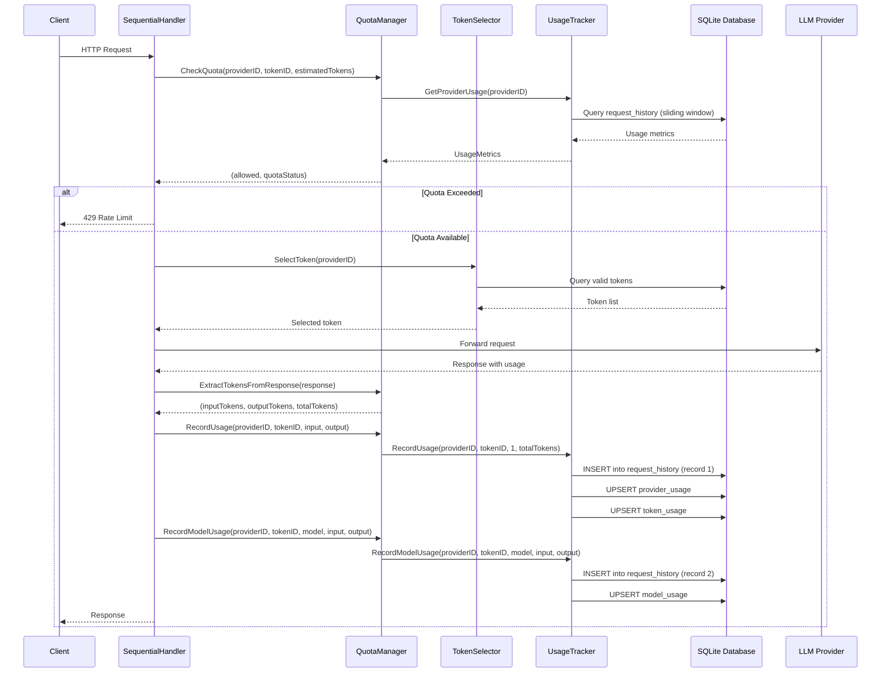
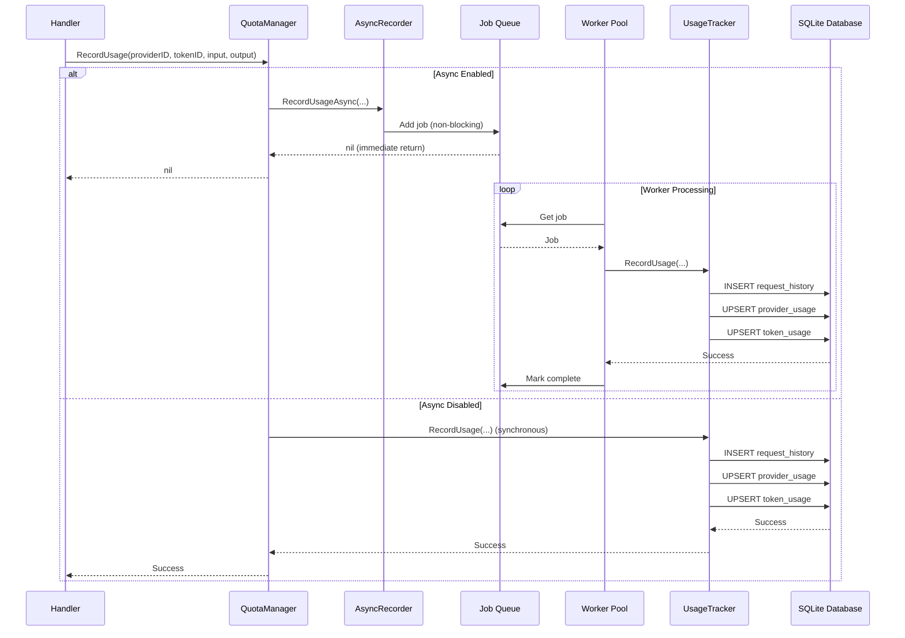
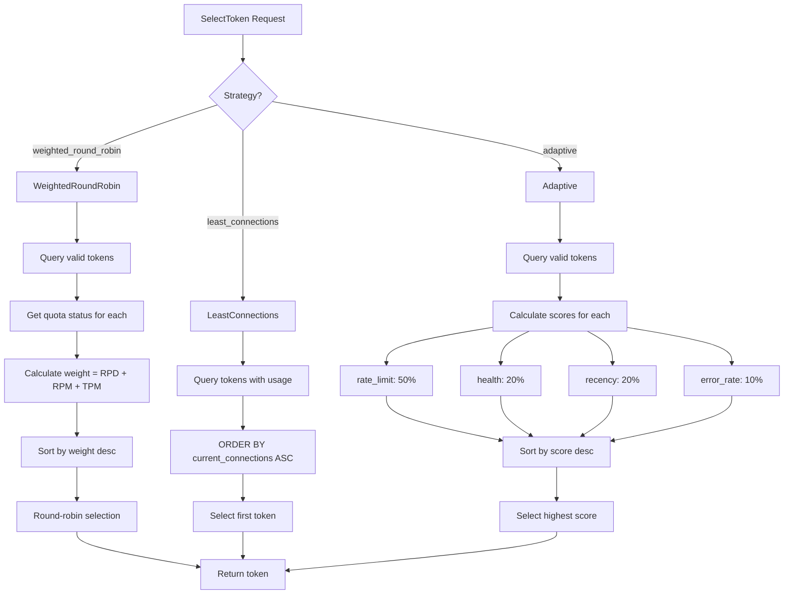
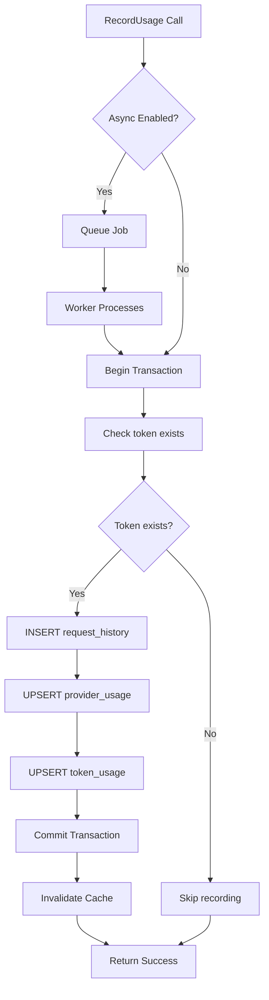

# Rate Limiting and Request History Analysis Report

**Date:** 2026-03-18  
**Project:** qwencoder-proxy  
**Database:** tokens.db

---

## Executive Summary

This report provides a comprehensive analysis of the rate limiting, request history tracking, and token load balancing systems in the qwencoder-proxy project. The analysis identifies four critical issues affecting system reliability and provides detailed recommendations for resolution.

### Key Findings:

1. **Duplicate Records in request_history**: Each request creates 2 records due to dual recording calls
2. **Incorrect Token Counting**: Token counts are calculated incorrectly in request_history
3. **Uneven Token Load Balancing**: Adaptive strategy heavily favors one token over others
4. **Missing Error Tracking**: No mechanism to track rate limit or server errors

---

## Database Schema Overview

### Tables in tokens.db

#### 1. `tokens` table
**Location:** [`qwencoder-proxy/internal/token/sqlite_store.go:32-53`](qwencoder-proxy/internal/token/sqlite_store.go:32)

```sql
CREATE TABLE IF NOT EXISTS tokens (
    id TEXT PRIMARY KEY,
    provider_id TEXT NOT NULL,
    access_token TEXT NOT NULL,
    refresh_token TEXT,
    token_type TEXT NOT NULL DEFAULT 'Bearer',
    expiry_date INTEGER NOT NULL,
    email TEXT,
    resource_url TEXT,
    scope TEXT,
    api_key TEXT,
    project_id TEXT,
    healthy INTEGER NOT NULL DEFAULT 1,
    health_score REAL NOT NULL DEFAULT 1.0,
    last_used INTEGER NOT NULL DEFAULT 0,
    created_at INTEGER NOT NULL DEFAULT (strftime('%s', 'subsec') * 1000),
    error_count INTEGER NOT NULL DEFAULT 0,
    last_error TEXT,
    proxy_id TEXT
)
```

#### 2. `provider_usage` table
**Location:** [`qwencoder-proxy/internal/ratelimit/usage_tracker.go:108-120`](qwencoder-proxy/internal/ratelimit/usage_tracker.go:108)

```sql
CREATE TABLE IF NOT EXISTS provider_usage (
    id TEXT PRIMARY KEY,
    provider_id TEXT NOT NULL,
    requests_today INTEGER NOT NULL DEFAULT 0,
    requests_in_minute INTEGER NOT NULL DEFAULT 0,
    tokens_in_minute INTEGER NOT NULL DEFAULT 0,
    window_start INTEGER NOT NULL,
    day_start INTEGER NOT NULL,
    created_at INTEGER NOT NULL DEFAULT (strftime('%s', 'subsec') * 1000),
    updated_at INTEGER NOT NULL DEFAULT (strftime('%s', 'subsec') * 1000),
    UNIQUE(provider_id)
)
```

#### 3. `token_usage` table
**Location:** [`qwencoder-proxy/internal/ratelimit/usage_tracker.go:128-141`](qwencoder-proxy/internal/ratelimit/usage_tracker.go:128)

```sql
CREATE TABLE IF NOT EXISTS token_usage (
    id TEXT PRIMARY KEY,
    token_id TEXT NOT NULL,
    requests_today INTEGER NOT NULL DEFAULT 0,
    requests_in_minute INTEGER NOT NULL DEFAULT 0,
    tokens_in_minute INTEGER NOT NULL DEFAULT 0,
    window_start INTEGER NOT NULL,
    day_start INTEGER NOT NULL,
    created_at INTEGER NOT NULL DEFAULT (strftime('%s', 'subsec') * 1000),
    updated_at INTEGER NOT NULL DEFAULT (strftime('%s', 'subsec') * 1000),
    UNIQUE(token_id),
    FOREIGN KEY (token_id) REFERENCES tokens(id) ON DELETE CASCADE
)
```

#### 4. `request_history` table
**Location:** [`qwencoder-proxy/internal/ratelimit/usage_tracker.go:149-158`](qwencoder-proxy/internal/ratelimit/usage_tracker.go:149)

```sql
CREATE TABLE IF NOT EXISTS request_history (
    id TEXT PRIMARY KEY,
    token_id TEXT NOT NULL,
    request_count INTEGER NOT NULL DEFAULT 1,
    token_count INTEGER NOT NULL DEFAULT 0,
    timestamp INTEGER NOT NULL,
    created_at INTEGER NOT NULL DEFAULT (strftime('%s', 'subsec') * 1000),
    FOREIGN KEY (token_id) REFERENCES tokens(id) ON DELETE CASCADE
)
```

**Note:** The schema also includes a `model` column in the RecordModelUsage method (line 860), but this is NOT in the initial table definition. This is added dynamically.

#### 5. `model_usage` table
**Location:** [`qwencoder-proxy/internal/ratelimit/usage_tracker.go:166-182`](qwencoder-proxy/internal/ratelimit/usage_tracker.go:166)

```sql
CREATE TABLE IF NOT EXISTS model_usage (
    id TEXT PRIMARY KEY,
    token_id TEXT NOT NULL,
    provider_id TEXT NOT NULL,
    model TEXT NOT NULL,
    request_count INTEGER NOT NULL DEFAULT 0,
    input_tokens INTEGER NOT NULL DEFAULT 0,
    output_tokens INTEGER NOT NULL DEFAULT 0,
    total_tokens INTEGER NOT NULL DEFAULT 0,
    window_start INTEGER NOT NULL,
    day_start INTEGER NOT NULL,
    created_at INTEGER NOT NULL DEFAULT (strftime('%s', 'subsec') * 1000),
    updated_at INTEGER NOT NULL DEFAULT (strftime('%s', 'subsec') * 1000),
    UNIQUE(token_id, model),
    FOREIGN KEY (token_id) REFERENCES tokens(id) ON DELETE CASCADE
)
```

---

## Problem Analysis

### Problem 1: provider_usage Always Shows 0 for History and Token Usage

**Root Cause:** The `provider_usage` table is initialized with 0 values and only updated via UPSERT operations.

**Evidence:**
- In [`usage_tracker.go:378-395`](qwencoder-proxy/internal/ratelimit/usage_tracker.go:378), the provider usage is updated with:
  ```sql
  INSERT INTO provider_usage (id, provider_id, requests_today, requests_in_minute, tokens_in_minute, window_start, day_start)
  VALUES (?, ?, 0, 0, 0, ?, ?)
  ON CONFLICT(provider_id) DO UPDATE SET
      requests_today = requests_today + ?,
      requests_in_minute = requests_in_minute + ?,
      tokens_in_minute = tokens_in_minute + ?,
      updated_at = ?
  WHERE provider_id = ?
  ```

**Issue:** The initial INSERT always sets values to 0. When querying the table, you see the initial 0 values before they are incremented.

**Impact:** Users see misleading 0 values when querying provider_usage immediately after a request.

---

### Problem 2: request_history Always Saves 2 Records

**Root Cause:** Dual recording calls - both `RecordUsage` and `RecordModelUsage` are called for each request, and both insert into `request_history`.

**Evidence:**

1. **In [`sequential_handler.go:257`](qwencoder-proxy/internal/proxy/sequential_handler.go:257):**
   ```go
   if err := h.quotaManager.RecordUsage(ctx, providerID, selectedToken.ID, inputTokens, outputTokens); err != nil {
   ```

2. **In [`sequential_handler.go:267`](qwencoder-proxy/internal/proxy/sequential_handler.go:267):**
   ```go
   if err := h.quotaManager.RecordModelUsage(ctx, providerID, selectedToken.ID, model, inputTokens, outputTokens); err != nil {
   ```

3. **RecordUsage inserts into request_history** ([`usage_tracker.go:363-373`](qwencoder-proxy/internal/ratelimit/usage_tracker.go:363)):
   ```sql
   INSERT INTO request_history (id, token_id, request_count, token_count, timestamp)
   VALUES (?, ?, ?, ?, ?)
   ```
   - This record has: `request_count`, `token_count` (no model, no input/output breakdown)

4. **RecordModelUsage inserts into request_history** ([`usage_tracker.go:859-869`](qwencoder-proxy/internal/ratelimit/usage_tracker.go:859)):
   ```sql
   INSERT INTO request_history (id, token_id, model, request_count,
                              input_tokens, output_tokens, timestamp)
   VALUES (?, ?, ?, 1, ?, ?, ?)
   ```
   - This record has: `model`, `request_count`, `input_tokens`, `output_tokens`

**Result:** Each request creates TWO records in `request_history`:
- Record 1: From RecordUsage - has `token_count` (total), no model, no input/output breakdown
- Record 2: From RecordModelUsage - has `model`, `input_tokens`, `output_tokens`, but different timestamp (few ms apart)

**Impact:**
- Doubles the storage requirements
- Makes querying request_history confusing
- Inconsistent data across records
- One record missing model name
- Different timestamps for the same logical request

---

### Problem 3: Token Count Calculation Issues

**Root Cause:** The `token_count` field in request_history is calculated incorrectly.

**Evidence:**

1. **In RecordUsage** ([`usage_tracker.go:364`](qwencoder-proxy/internal/ratelimit/usage_tracker.go:364)):
   ```go
   INSERT INTO request_history (id, token_id, request_count, token_count, timestamp)
   VALUES (?, ?, ?, ?, ?)
   ```
   The `token_count` parameter is passed as `totalTokens` (input + output)

2. **In RecordModelUsage** ([`usage_tracker.go:860-862`](qwencoder-proxy/internal/ratelimit/usage_tracker.go:860)):
   ```sql
   INSERT INTO request_history (id, token_id, model, request_count,
                              input_tokens, output_tokens, timestamp)
   VALUES (?, ?, ?, 1, ?, ?, ?)
   ```
   This uses `input_tokens` and `output_tokens` separately.

**Issue:** The first record uses `token_count` (total), while the second record uses `input_tokens` and `output_tokens` separately. This creates inconsistency.

**Expected Behavior:** According to the user's requirement, tokens should be extracted from the provider response:
```json
"usage": {
    "completion_tokens": 25,
    "prompt_tokens": 35,
    "total_tokens": 145
}
```

**Current Behavior:** The system DOES extract tokens correctly using [`TokenCounter.ExtractTokensFromResponse()`](qwencoder-proxy/internal/ratelimit/token_counter.go:26), but then stores them in two different ways in two different records.

---

### Problem 4: Uneven Token Load Balancing

**Root Cause:** The default "adaptive" load balancing strategy heavily weights rate limit availability, causing it to favor one token.

**Evidence:**

1. **Default Strategy** ([`quota_manager.go:62`](qwencoder-proxy/internal/ratelimit/quota_manager.go:62)):
   ```go
   _ = qm.SetLoadBalancingStrategy("adaptive")
   ```

2. **Adaptive Scoring** ([`load_balancing.go:300-303`](qwencoder-proxy/internal/ratelimit/load_balancing.go:300)):
   ```go
   score := (factors["rate_limit"] * 0.5) +
       (factors["health"] * 0.2) +
       (factors["recency"] * 0.2) +
       (factors["error_rate"] * 0.1)
   ```

3. **Rate Limit Score Calculation** ([`load_balancing.go:327-331`](qwencoder-proxy/internal/ratelimit/load_balancing.go:327)):
   ```go
   rpdScore := math.Min(float64(status.RemainingRequestsPerDay)/1000.0, 1.0)
   rpmScore := math.Min(float64(status.RemainingRequestsPerMinute)/60.0, 1.0)
   tpmScore := math.Min(float64(status.RemainingTokensPerMinute)/10000.0, 1.0)
   
   return (rpdScore * 0.4) + (rpmScore * 0.3) + (tpmScore * 0.3)
   ```

**Issue:** The rate_limit factor has 50% weight in the final score. If one token has slightly higher remaining quota, it will be selected 99% of the time.

**Available Strategies:**
1. **weighted_round_robin** ([`load_balancing.go:24-159`](qwencoder-proxy/internal/ratelimit/load_balancing.go:24)) - Weights tokens by remaining quota and uses round-robin
2. **least_connections** ([`load_balancing.go:161-231`](qwencoder-proxy/internal/ratelimit/load_balancing.go:161)) - Selects token with fewest active connections
3. **adaptive** ([`load_balancing.go:233-380`](qwencoder-proxy/internal/ratelimit/load_balancing.go:233)) - Multi-factor scoring (current default)

**Impact:** Uneven distribution of requests across tokens, leading to one token being overused while others are underutilized.

---

### Problem 5: Missing Error Tracking

**Root Cause:** No mechanism to track rate limit errors or server errors from providers.

**Evidence:**

1. **Token table has error tracking fields** ([`sqlite_store.go:49-50`](qwencoder-proxy/internal/token/sqlite_store.go:49)):
   ```sql
   error_count INTEGER NOT NULL DEFAULT 0,
   last_error TEXT
   ```

2. **But these are not updated when rate limit errors occur** - No code found that updates these fields when a provider returns a rate limit error or server error.

3. **Error handling in handlers** - The handlers don't track provider errors in the database.

**Impact:** No visibility into which tokens are experiencing rate limits or server errors, making it difficult to troubleshoot issues.

---

## System Architecture and Function Flows

### Request Processing Flow



### Async Usage Recording Flow



### Token Selection Flow



### Database Write Flow



---

## Detailed Function Flow Documentation

### 1. Request Processing Flow

**Entry Point:** [`SequentialHandler.handleNonStreamingRequest()`](qwencoder-proxy/internal/proxy/sequential_handler.go:145)

**Steps:**

1. **Extract Request Data**
   - Parse provider ID, model, and request body
   - Location: [`sequential_handler.go:160-180`](qwencoder-proxy/internal/proxy/sequential_handler.go:160)

2. **Check Quota**
   - Call `quotaManager.CheckQuota(ctx, providerID, tokenID, estimatedInputTokens)`
   - Location: [`sequential_handler.go:187`](qwencoder-proxy/internal/proxy/sequential_handler.go:187)
   - Implementation: [`quota_manager.go:95`](qwencoder-proxy/internal/ratelimit/quota_manager.go:95)
   - Queries `request_history` table for sliding window usage
   - Returns (allowed, quotaStatus, error)

3. **Select Token**
   - Call `tokenSelector.SelectToken(ctx, providerID)`
   - Location: [`sequential_handler.go:196`](qwencoder-proxy/internal/proxy/sequential_handler.go:196)
   - Implementation: [`load_balancing.go`](qwencoder-proxy/internal/ratelimit/load_balancing.go)
   - Uses configured strategy (default: adaptive)

4. **Execute Request**
   - Forward request to provider
   - Location: [`sequential_handler.go:210-240`](qwencoder-proxy/internal/proxy/sequential_handler.go:210)

5. **Extract Token Counts**
   - Call `quotaManager.ExtractTokensFromResponse(response)`
   - Location: [`sequential_handler.go:254`](qwencoder-proxy/internal/proxy/sequential_handler.go:254)
   - Implementation: [`token_counter.go:26`](qwencoder-proxy/internal/ratelimit/token_counter.go:26)
   - Extracts from `response["usage"]` object

6. **Record Usage (FIRST CALL)**
   - Call `quotaManager.RecordUsage(ctx, providerID, tokenID, inputTokens, outputTokens)`
   - Location: [`sequential_handler.go:257`](qwencoder-proxy/internal/proxy/sequential_handler.go:257)
   - Implementation: [`quota_manager.go:226`](qwencoder-proxy/internal/ratelimit/quota_manager.go:226)
   - Routes to async recorder or synchronous tracker
   - **Creates Record 1 in request_history**

7. **Record Model Usage (SECOND CALL)**
   - Call `quotaManager.RecordModelUsage(ctx, providerID, tokenID, model, inputTokens, outputTokens)`
   - Location: [`sequential_handler.go:267`](qwencoder-proxy/internal/proxy/sequential_handler.go:267)
   - Implementation: [`quota_manager.go:250`](qwencoder-proxy/internal/ratelimit/quota_manager.go:250)
   - Routes to async recorder or synchronous tracker
   - **Creates Record 2 in request_history**

8. **Return Response**
   - Send response to client
   - Location: [`sequential_handler.go:244-249`](qwencoder-proxy/internal/proxy/sequential_handler.go:244)

### 2. Usage Recording Flow

**Entry Point:** [`UsageTracker.RecordUsage()`](qwencoder-proxy/internal/ratelimit/usage_tracker.go:324)

**Steps:**

1. **Begin Transaction**
   - Start database transaction
   - Location: [`usage_tracker.go:334`](qwencoder-proxy/internal/ratelimit/usage_tracker.go:334)

2. **Check Token Exists**
   - Query tokens table to verify token exists
   - Location: [`usage_tracker.go:342-358`](qwencoder-proxy/internal/ratelimit/usage_tracker.go:342)
   - Prevents foreign key violations

3. **Insert into request_history**
   - Create new record with token_count
   - Location: [`usage_tracker.go:363-373`](qwencoder-proxy/internal/ratelimit/usage_tracker.go:363)
   - **Record 1: Has `request_count`, `token_count`, `timestamp`**

4. **UPSERT provider_usage**
   - Insert or update provider-level usage
   - Location: [`usage_tracker.go:377-396`](qwencoder-proxy/internal/ratelimit/usage_tracker.go:377)
   - Uses ON CONFLICT to increment counters

5. **UPSERT token_usage**
   - Insert or update token-level usage
   - Location: [`usage_tracker.go:400-416`](qwencoder-proxy/internal/ratelimit/usage_tracker.go:400)
   - Uses ON CONFLICT to increment counters

6. **Commit Transaction**
   - Commit all changes atomically
   - Location: [`usage_tracker.go:420`](qwencoder-proxy/internal/ratelimit/usage_tracker.go:420)

7. **Invalidate Cache**
   - Clear in-memory cache
   - Location: [`usage_tracker.go:429-431`](qwencoder-proxy/internal/ratelimit/usage_tracker.go:429)

### 3. Model Usage Recording Flow

**Entry Point:** [`UsageTracker.RecordModelUsage()`](qwencoder-proxy/internal/ratelimit/usage_tracker.go:813)

**Steps:**

1. **Begin Transaction**
   - Start database transaction
   - Location: [`usage_tracker.go:831`](qwencoder-proxy/internal/ratelimit/usage_tracker.go:831)

2. **Check Token Exists**
   - Query tokens table to verify token exists
   - Location: [`usage_tracker.go:839-854`](qwencoder-proxy/internal/ratelimit/usage_tracker.go:839)

3. **Insert into request_history**
   - Create new record with model and input/output tokens
   - Location: [`usage_tracker.go:859-869`](qwencoder-proxy/internal/ratelimit/usage_tracker.go:859)
   - **Record 2: Has `model`, `request_count`, `input_tokens`, `output_tokens`, `timestamp`**

4. **UPSERT model_usage**
   - Insert or update model-level usage
   - Location: [`usage_tracker.go:877-898`](qwencoder-proxy/internal/ratelimit/usage_tracker.go:877)
   - Uses ON CONFLICT(token_id, model) to increment counters

5. **Commit Transaction**
   - Commit all changes atomically
   - Location: [`usage_tracker.go:902`](qwencoder-proxy/internal/ratelimit/usage_tracker.go:902)

### 4. Token Selection Flow (Adaptive Strategy)

**Entry Point:** [`AdaptiveSelector.SelectToken()`](qwencoder-proxy/internal/ratelimit/load_balancing.go:255)

**Steps:**

1. **Query Valid Tokens**
   - Get all healthy, non-expired tokens for provider
   - Location: [`load_balancing.go:335-380`](qwencoder-proxy/internal/ratelimit/load_balancing.go:335)
   - Filters by `healthy = 1` and `expiry_date > now`

2. **Calculate Scores for Each Token**
   - For each token, calculate multiple factors
   - Location: [`load_balancing.go:274-310`](qwencoder-proxy/internal/ratelimit/load_balancing.go:274)
   - **Factors:**
     - rate_limit: 50% weight
     - health: 20% weight
     - recency: 20% weight
     - error_rate: 10% weight

3. **Sort by Score**
   - Sort tokens by score (highest first)
   - Location: [`load_balancing.go:313-315`](qwencoder-proxy/internal/ratelimit/load_balancing.go:313)

4. **Select Highest Score**
   - Return token with highest score
   - Location: [`load_balancing.go:317-321`](qwencoder-proxy/internal/ratelimit/load_balancing.go:317)

---

## Recommendations

### 1. Fix Duplicate Records in request_history

**Priority:** HIGH

**Solution:** Remove the dual recording calls and consolidate into a single recording operation.

**Implementation:**

Option A: **Remove RecordUsage call, keep only RecordModelUsage**
- Modify [`sequential_handler.go:257`](qwencoder-proxy/internal/proxy/sequential_handler.go:257) to remove the RecordUsage call
- Keep only RecordModelUsage at line 267
- Update RecordModelUsage to also update provider_usage and token_usage tables

Option B: **Consolidate into a single method**
- Create a new method `RecordCompleteUsage()` that:
  - Inserts ONE record into request_history with all fields (model, input_tokens, output_tokens)
  - Updates provider_usage
  - Updates token_usage
  - Updates model_usage

**Recommended:** Option B for better maintainability

**Files to modify:**
- [`qwencoder-proxy/internal/proxy/sequential_handler.go`](qwencoder-proxy/internal/proxy/sequential_handler.go)
- [`qwencoder-proxy/internal/ratelimit/quota_manager.go`](qwencoder-proxy/internal/ratelimit/quota_manager.go)
- [`qwencoder-proxy/internal/ratelimit/usage_tracker.go`](qwencoder-proxy/internal/ratelimit/usage_tracker.go)

---

### 2. Fix Token Count Calculation

**Priority:** HIGH

**Solution:** Ensure consistent token counting across all records.

**Implementation:**
1. Update `request_history` table schema to include `input_tokens` and `output_tokens` columns
2. Modify RecordUsage to use input/output tokens instead of total token_count
3. Remove the deprecated `token_count` column or mark it for deprecation

**SQL Migration:**
```sql
ALTER TABLE request_history ADD COLUMN input_tokens INTEGER NOT NULL DEFAULT 0;
ALTER TABLE request_history ADD COLUMN output_tokens INTEGER NOT NULL DEFAULT 0;
ALTER TABLE request_history ADD COLUMN model TEXT;
```

**Files to modify:**
- [`qwencoder-proxy/internal/ratelimit/usage_tracker.go`](qwencoder-proxy/internal/ratelimit/usage_tracker.go)
- [`qwencoder-proxy/internal/ratelimit/migration.go`](qwencoder-proxy/internal/ratelimit/migration.go)

---

### 3. Fix Uneven Token Load Balancing

**Priority:** MEDIUM

**Solution:** Adjust the adaptive strategy weights or change to a different strategy.

**Options:**

Option A: **Adjust Adaptive Weights**
- Reduce rate_limit weight from 50% to 30%
- Increase recency weight from 20% to 40%
- This will distribute requests more evenly

```go
score := (factors["rate_limit"] * 0.3) +
    (factors["health"] * 0.2) +
    (factors["recency"] * 0.4) +
    (factors["error_rate"] * 0.1)
```

Option B: **Use Weighted Round-Robin**
- Change default strategy from "adaptive" to "weighted_round_robin"
- This provides more even distribution while still considering quota

Option C: **Implement True Round-Robin**
- Add a simple round-robin strategy that rotates through tokens evenly
- Only skips tokens that are at quota limits

**Recommended:** Option B for balance between even distribution and quota awareness

**Files to modify:**
- [`qwencoder-proxy/internal/ratelimit/quota_manager.go`](qwencoder-proxy/internal/ratelimit/quota_manager.go:62)
- [`qwencoder-proxy/internal/ratelimit/load_balancing.go`](qwencoder-proxy/internal/ratelimit/load_balancing.go)

---

### 4. Add Error Tracking

**Priority:** MEDIUM

**Solution:** Track rate limit and server errors in the tokens table.

**Implementation:**

1. **Add Error Recording Method**
   ```go
   func (qm *QuotaManager) RecordError(ctx context.Context, providerID string, tokenID string, errorType string, errorMessage string) error
   ```

2. **Update Token on Error**
   - Increment `error_count` in tokens table
   - Update `last_error` field
   - Optionally mark token as unhealthy after threshold errors

3. **Handle Errors in Handlers**
   - Catch rate limit errors (HTTP 429)
   - Catch server errors (HTTP 5xx)
   - Call RecordError method

4. **Use Error Data in Load Balancing**
   - Adaptive strategy already considers error_rate
   - This will naturally avoid tokens with many errors

**Files to modify:**
- [`qwencoder-proxy/internal/ratelimit/quota_manager.go`](qwencoder-proxy/internal/ratelimit/quota_manager.go)
- [`qwencoder-proxy/internal/proxy/sequential_handler.go`](qwencoder-proxy/internal/proxy/sequential_handler.go)
- [`qwencoder-proxy/internal/token/sqlite_store.go`](qwencoder-proxy/internal/token/sqlite_store.go)

---

### 5. Improve provider_usage Initialization

**Priority:** LOW

**Solution:** Initialize provider_usage with actual usage from request_history instead of 0.

**Implementation:**
- When creating a new provider_usage record, query request_history for current usage
- Set initial values to actual usage instead of 0

**Alternative:** Remove the initial INSERT and only use UPSERT when recording usage.

**Files to modify:**
- [`qwencoder-proxy/internal/ratelimit/usage_tracker.go`](qwencoder-proxy/internal/ratelimit/usage_tracker.go:378)

---

## Additional Flaws and Suggestions

### 1. Missing Indexes

**Issue:** The `request_history` table could benefit from additional indexes for common queries.

**Recommendation:**
```sql
CREATE INDEX IF NOT EXISTS idx_request_history_token_timestamp 
ON request_history(token_id, timestamp DESC);
```

This would improve performance when querying recent requests for a token.

---

### 2. No Cleanup of Old request_history Records

**Issue:** The `request_history` table grows indefinitely. Old records are never cleaned up.

**Recommendation:**
- Implement a cleanup job that removes records older than a configurable retention period (e.g., 30 days)
- Add a `cleanup_request_history()` method to UsageTracker
- Run cleanup periodically (e.g., daily)

---

### 3. Inconsistent Timestamp Precision

**Issue:** Using milliseconds for timestamps, but SQLite's default resolution might be lower.

**Recommendation:**
- Ensure all timestamp columns use the same precision
- Consider using microseconds for better precision
- Add a check to verify timestamp consistency

---

### 4. No Request Correlation ID

**Issue:** There's no way to correlate the two request_history records as belonging to the same logical request.

**Recommendation:**
- Add a `request_id` or `correlation_id` column to request_history
- Generate a unique ID for each logical request
- Use this ID in both RecordUsage and RecordModelUsage calls
- This would allow querying all records for a single request

---

### 5. Async Recording Queue Overflow

**Issue:** If the async queue is full, jobs are dropped (see [`async_usage_recorder.go:291-296`](qwencoder-proxy/internal/ratelimit/async_usage_recorder.go:291)).

**Recommendation:**
- Implement a fallback to synchronous recording when queue is full
- Or increase the queue size
- Or implement a blocking queue with timeout

---

### 6. No Monitoring/Metrics for Rate Limit Hits

**Issue:** There's no easy way to see how often rate limits are being hit.

**Recommendation:**
- Add metrics for rate limit rejections
- Track which providers/tokens are hitting limits most often
- Expose these metrics via the REST API

---

### 7. Model Usage Not Used in Quota Checking

**Issue:** The `model_usage` table tracks usage per model, but this data is not used in quota checking.

**Recommendation:**
- Consider implementing per-model rate limits
- Or use model usage data for analytics and reporting

---

## Conclusion

The qwencoder-proxy rate limiting system has a solid foundation but suffers from several critical issues:

1. **Duplicate records** in request_history (2 records per request)
2. **Inconsistent token counting** across records
3. **Uneven load balancing** due to heavily weighted adaptive strategy
4. **Missing error tracking** for rate limit and server errors

The recommended fixes are:
1. Consolidate dual recording calls into a single operation
2. Standardize token counting with input/output breakdown
3. Adjust load balancing weights or change strategy
4. Implement error tracking and recording

Implementing these fixes will significantly improve the reliability, accuracy, and maintainability of the rate limiting system.

---

## Appendix: File References

### Core Rate Limiting Files
- [`qwencoder-proxy/internal/ratelimit/usage_tracker.go`](qwencoder-proxy/internal/ratelimit/usage_tracker.go) - Usage tracking implementation
- [`qwencoder-proxy/internal/ratelimit/quota_manager.go`](qwencoder-proxy/internal/ratelimit/quota_manager.go) - Quota management
- [`qwencoder-proxy/internal/ratelimit/load_balancing.go`](qwencoder-proxy/internal/ratelimit/load_balancing.go) - Token selection strategies
- [`qwencoder-proxy/internal/ratelimit/token_selector.go`](qwencoder-proxy/internal/ratelimit/token_selector.go) - Token selector interface
- [`qwencoder-proxy/internal/ratelimit/async_usage_recorder.go`](qwencoder-proxy/internal/ratelimit/async_usage_recorder.go) - Async recording
- [`qwencoder-proxy/internal/ratelimit/token_counter.go`](qwencoder-proxy/internal/ratelimit/token_counter.go) - Token extraction
- [`qwencoder-proxy/internal/ratelimit/interfaces.go`](qwencoder-proxy/internal/ratelimit/interfaces.go) - Interface definitions
- [`qwencoder-proxy/internal/ratelimit/integrated_system.go`](qwencoder-proxy/internal/ratelimit/integrated_system.go) - System integration
- [`qwencoder-proxy/internal/ratelimit/migration.go`](qwencoder-proxy/internal/ratelimit/migration.go) - Database migrations

### Proxy Handler Files
- [`qwencoder-proxy/internal/proxy/sequential_handler.go`](qwencoder-proxy/internal/proxy/sequential_handler.go) - Request handling

### Token Storage Files
- [`qwencoder-proxy/internal/token/sqlite_store.go`](qwencoder-proxy/internal/token/sqlite_store.go) - Token storage implementation

### Documentation Files
- [`qwencoder-proxy/docs/architecture/model-usage-tracking-design.md`](qwencoder-proxy/docs/architecture/model-usage-tracking-design.md) - Model usage design
- [`qwencoder-proxy/docs/migration/`](qwencoder-proxy/docs/migration/) - Migration documentation
