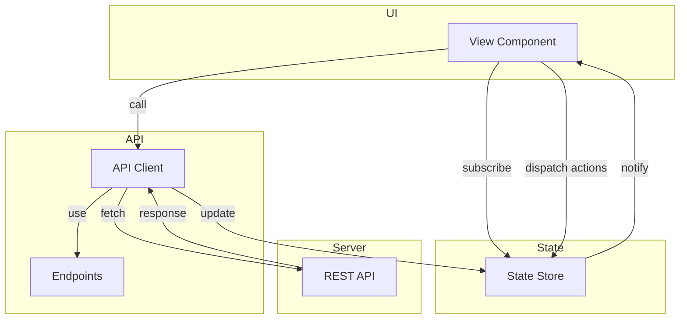

# Phase 2: API Client & State Management

**Priority:** CRITICAL  
**Estimated Time:** 1 day  
**Complexity:** Medium  
**Files to Create:** 5  
**Files to Modify:** 0

---

## Executive Summary

This phase implements the JavaScript infrastructure for API communication and state management. The API client provides a clean interface to all REST endpoints, while the state management system ensures consistent data flow throughout the application.

---

## Problem Description

The dashboard needs a robust way to communicate with the REST API and manage application state. Without proper abstraction, API calls and state updates become scattered and difficult to maintain.

### Requirements

- Clean API client with error handling
- Centralized endpoint definitions
- State management for reactive UI updates
- Request/response interceptors
- Automatic token refresh handling
- Loading states and error handling

---

## Solution Architecture

### Design Principles

1. **Single Source of Truth:** All API data flows through the state store
2. **Reactive Updates:** UI components subscribe to state changes
3. **Error Boundaries:** Errors are caught and displayed consistently
4. **Type Safety:** Use JSDoc for type hints
5. **Separation of Concerns:** API client, state, and UI are separate

### Component Overview

```
js/
├── main.js                 # Entry point
├── app.js                  # Main application class
├── api/
│   ├── client.js           # HTTP client wrapper
│   └── endpoints.js       # API endpoint definitions
└── state/
    └── store.js           # State management
```

### Architecture Diagram



---

## Implementation Plan

### Step 1: Create API Endpoints (js/api/endpoints.js)

Define all API endpoints as constants:

```javascript
/**
 * API Endpoints - Centralized API endpoint definitions
 * 
 * Provides a single source of truth for all API endpoint URLs
 * and helper functions for building dynamic endpoints.
 * 
 * Reference: qwencoder-proxy/docs/rest_api.md
 */

export const ENDPOINTS = {
    // Provider Discovery
    GET_PROVIDERS: '/api/providers',
    GET_PROVIDER_CONFIG: (providerId) => `/api/providers/${providerId}/config`,

    // Device Code Flow
    START_DEVICE_FLOW: '/api/device/start',
    GET_DEVICE_STATUS: (pollId) => `/api/device/status/${pollId}`,

    // Authorization Code Flow
    START_AUTH: '/api/auth/start',

    // Token Management
    GET_TOKEN: (providerId) => `/api/token/${providerId}`,
    REFRESH_TOKEN: (providerId) => `/api/token/${providerId}/refresh`,
    DELETE_TOKEN: (providerId) => `/api/token/${providerId}`,

    // Credentials Management
    GET_CREDENTIALS: '/api/credentials',
    CLEAR_ALL_CREDENTIALS: '/api/credentials',
    GET_PROVIDER_CREDENTIALS: (providerId) => `/api/credentials/${providerId}`,
    ADD_TOKEN: (providerId) => `/api/credentials/${providerId}`,
    DELETE_TOKEN_BY_ID: (providerId, tokenId) => `/api/credentials/${providerId}/${tokenId}`,
    REFRESH_TOKEN_BY_ID: (providerId, tokenId) => `/api/credentials/${providerId}/${tokenId}/refresh`,
    UPDATE_PROVIDER_SETTINGS: (providerId) => `/api/credentials/${providerId}/settings`,

    // Proxy Configuration
    GET_PROXY_CONFIG: (providerId, tokenId) => `/api/credentials/${providerId}/${tokenId}/proxy`,
    UPDATE_PROXY_CONFIG: (providerId, tokenId) => `/api/credentials/${providerId}/${tokenId}/proxy`,
    DELETE_PROXY_CONFIG: (providerId, tokenId) => `/api/credentials/${providerId}/${tokenId}/proxy`,

    // Proxy Connection Test
    TEST_PROXY_CONNECTION: '/api/proxy/test',

    // Rate Limit Configuration
    GET_RATE_LIMIT_CONFIGS: '/api/ratelimit/config',
    GET_RATE_LIMIT_CONFIG: (providerId) => `/api/ratelimit/config/${providerId}`,
    UPDATE_RATE_LIMIT_CONFIG: (providerId) => `/api/ratelimit/config/${providerId}`,

    // Usage Tracking
    GET_ALL_USAGE: '/api/ratelimit/usage',
    GET_PROVIDER_USAGE: (providerId) => `/api/ratelimit/usage/${providerId}`,
    GET_TOKEN_USAGE: (providerId, tokenId) => `/api/ratelimit/usage/${providerId}/${tokenId}`,
    RESET_PROVIDER_USAGE: (providerId) => `/api/ratelimit/reset/${providerId}`,
    RESET_TOKEN_USAGE: (providerId, tokenId) => `/api/ratelimit/reset/${providerId}/${tokenId}`,

    // Model Usage Tracking
    GET_ALL_MODEL_USAGE: '/api/ratelimit/model-usage',
    GET_PROVIDER_MODEL_USAGE: (providerId) => `/api/ratelimit/model-usage/${providerId}`,
    GET_TOKEN_MODEL_USAGE: (providerId, tokenId) => `/api/ratelimit/model-usage/${providerId}/${tokenId}`,
    GET_MODEL_USAGE: (providerId, tokenId, model) => `/api/ratelimit/model-usage/${providerId}/${tokenId}/${model}`,

    // Error Tracking
    GET_PROVIDER_ERRORS: (providerId) => `/api/ratelimit/errors?provider_id=${providerId}`,
    GET_TOKEN_ERRORS: (providerId, tokenId) => `/api/ratelimit/errors/${providerId}/${tokenId}`,
    RESET_TOKEN_ERRORS: (providerId, tokenId) => `/api/ratelimit/errors/reset/${providerId}/${tokenId}`,

    // Request History
    GET_REQUEST_HISTORY: '/api/ratelimit/request-history',
    GET_TOKEN_REQUEST_HISTORY: (tokenId) => `/api/ratelimit/request-history/${tokenId}`,
    GET_TOKEN_MODEL_REQUEST_HISTORY: (tokenId, model) => `/api/ratelimit/request-history/${tokenId}/${model}`,
    GET_REQUEST_HISTORY_SUMMARY: '/api/ratelimit/request-history/summary',
    DELETE_REQUEST_HISTORY: '/api/ratelimit/request-history/delete',

    // Cache Management
    INVALIDATE_ALL_CACHE: '/api/cache/invalidate',
    INVALIDATE_PROVIDER_CACHE: (providerId) => `/api/cache/invalidate/provider/${providerId}`,
    INVALIDATE_TOKEN_CACHE: (tokenId) => `/api/cache/invalidate/token/${tokenId}`,
    GET_CACHE_STATS: '/api/cache/stats'
};

/**
 * Build query string from parameters
 * @param {Object} params - Query parameters
 * @returns {string} Query string
 */
export function buildQueryString(params) {
    const searchParams = new URLSearchParams();
    for (const [key, value] of Object.entries(params)) {
        if (value !== undefined && value !== null) {
            searchParams.append(key, value);
        }
    }
    return searchParams.toString();
}

/**
 * Build URL with query string
 * @param {string} baseUrl - Base URL
 * @param {Object} params - Query parameters
 * @returns {string} Full URL with query string
 */
export function buildUrl(baseUrl, params = {}) {
    const queryString = buildQueryString(params);
    return queryString ? `${baseUrl}?${queryString}` : baseUrl;
}
```

**Verification:**
- [ ] All endpoints from REST API documented
- [ ] Helper functions work
- [ ] No typos in endpoint URLs

---

### Step 2: Create API Client (js/api/client.js)

Implement HTTP client with error handling:

```javascript
/**
 * API Client - HTTP client wrapper for REST API
 * 
 * Provides a clean interface for making HTTP requests to the REST API
 * with automatic error handling, loading states, and response parsing.
 */

import { ENDPOINTS, buildUrl } from './endpoints.js';

/**
 * API Error class
 */
export class APIError extends Error {
    constructor(message, code, status, details = {}) {
        super(message);
        this.name = 'APIError';
        this.code = code;
        this.status = status;
        this.details = details;
    }
}

/**
 * API Client class
 */
export class APIClient {
    constructor() {
        this.baseURL = window.location.origin;
        this.defaultHeaders = {
            'Content-Type': 'application/json',
        };
        this.requestInterceptors = [];
        this.responseInterceptors = [];
    }

    /**
     * Add request interceptor
     * @param {Function} interceptor - Interceptor function
     */
    addRequestInterceptor(interceptor) {
        this.requestInterceptors.push(interceptor);
    }

    /**
     * Add response interceptor
     * @param {Function} interceptor - Interceptor function
     */
    addResponseInterceptor(interceptor) {
        this.responseInterceptors.push(interceptor);
    }

    /**
     * Build full URL
     * @param {string} endpoint - API endpoint
     * @param {Object} params - Query parameters
     * @returns {string} Full URL
     */
    buildURL(endpoint, params = {}) {
        return buildUrl(`${this.baseURL}${endpoint}`, params);
    }

    /**
     * Make HTTP request
     * @param {string} method - HTTP method
     * @param {string} endpoint - API endpoint
     * @param {Object} options - Request options
     * @returns {Promise} Response data
     */
    async request(method, endpoint, options = {}) {
        const {
            params = {},
            body = null,
            headers = {},
            signal = null
        } = options;

        // Build URL with query parameters
        const url = this.buildURL(endpoint, params);

        // Build request config
        const config = {
            method,
            headers: { ...this.defaultHeaders, ...headers },
            signal
        };

        // Add body if present
        if (body !== null) {
            config.body = JSON.stringify(body);
        }

        // Apply request interceptors
        let finalConfig = config;
        for (const interceptor of this.requestInterceptors) {
            finalConfig = interceptor(finalConfig);
        }

        try {
            const response = await fetch(url, finalConfig);

            // Apply response interceptors
            let processedResponse = response;
            for (const interceptor of this.responseInterceptors) {
                processedResponse = interceptor(processedResponse);
            }

            // Handle non-JSON responses
            const contentType = response.headers.get('content-type');
            if (!contentType || !contentType.includes('application/json')) {
                if (!response.ok) {
                    throw new APIError(
                        response.statusText || 'Request failed',
                        'http_error',
                        response.status
                    );
                }
                return response;
            }

            // Parse JSON response
            const data = await response.json();

            // Handle error responses
            if (!response.ok) {
                const error = data.error || {};
                throw new APIError(
                    error.message || data.message || response.statusText,
                    error.code || 'api_error',
                    response.status,
                    error.details
                );
            }

            return data;

        } catch (error) {
            // Re-throw API errors
            if (error instanceof APIError) {
                throw error;
            }

            // Handle network errors
            if (error.name === 'AbortError') {
                throw new APIError('Request cancelled', 'cancelled', null);
            }

            // Handle other errors
            throw new APIError(
                error.message || 'Network error',
                'network_error',
                null
            );
        }
    }

    /**
     * GET request
     * @param {string} endpoint - API endpoint
     * @param {Object} options - Request options
     * @returns {Promise} Response data
     */
    async get(endpoint, options = {}) {
        return this.request('GET', endpoint, options);
    }

    /**
     * POST request
     * @param {string} endpoint - API endpoint
     * @param {Object} options - Request options
     * @returns {Promise} Response data
     */
    async post(endpoint, options = {}) {
        return this.request('POST', endpoint, options);
    }

    /**
     * PUT request
     * @param {string} endpoint - API endpoint
     * @param {Object} options - Request options
     * @returns {Promise} Response data
     */
    async put(endpoint, options = {}) {
        return this.request('PUT', endpoint, options);
    }

    /**
     * DELETE request
     * @param {string} endpoint - API endpoint
     * @param {Object} options - Request options
     * @returns {Promise} Response data
     */
    async delete(endpoint, options = {}) {
        return this.request('DELETE', endpoint, options);
    }

    // ========== Provider Discovery ==========

    /**
     * Get all providers
     * @returns {Promise<Object>} Providers list
     */
    async getProviders() {
        return this.get(ENDPOINTS.GET_PROVIDERS);
    }

    /**
     * Get provider configuration
     * @param {string} providerId - Provider ID
     * @returns {Promise<Object>} Provider config
     */
    async getProviderConfig(providerId) {
        return this.get(ENDPOINTS.GET_PROVIDER_CONFIG(providerId));
    }

    // ========== Device Code Flow ==========

    /**
     * Start device code flow
     * @param {string} provider - Provider ID
     * @returns {Promise<Object>} Device code response
     */
    async startDeviceFlow(provider) {
        return this.post(ENDPOINTS.START_DEVICE_FLOW, { body: { provider } });
    }

    /**
     * Get device code status
     * @param {string} pollId - Poll ID
     * @returns {Promise<Object>} Device status
     */
    async getDeviceStatus(pollId) {
        return this.get(ENDPOINTS.GET_DEVICE_STATUS(pollId));
    }

    // ========== Authorization Code Flow ==========

    /**
     * Start authorization code flow
     * @param {string} provider - Provider ID
     * @param {string} redirectUri - Redirect URI
     * @returns {Promise<Object>} Auth URL response
     */
    async startAuth(provider, redirectUri) {
        return this.post(ENDPOINTS.START_AUTH, { 
            body: { provider, redirect_uri: redirectUri } 
        });
    }

    // ========== Credentials Management ==========

    /**
     * Get all credentials
     * @returns {Promise<Object>} Credentials list
     */
    async getCredentials() {
        return this.get(ENDPOINTS.GET_CREDENTIALS);
    }

    /**
     * Get provider credentials
     * @param {string} providerId - Provider ID
     * @returns {Promise<Object>} Provider credentials
     */
    async getProviderCredentials(providerId) {
        return this.get(ENDPOINTS.GET_PROVIDER_CREDENTIALS(providerId));
    }

    /**
     * Add token to provider
     * @param {string} providerId - Provider ID
     * @param {Object} tokenData - Token data
     * @returns {Promise<Object>} Added token
     */
    async addToken(providerId, tokenData) {
        return this.post(ENDPOINTS.ADD_TOKEN(providerId), { body: tokenData });
    }

    /**
     * Delete token
     * @param {string} providerId - Provider ID
     * @param {string} tokenId - Token ID
     * @returns {Promise<Object>} Delete response
     */
    async deleteToken(providerId, tokenId) {
        return this.delete(ENDPOINTS.DELETE_TOKEN_BY_ID(providerId, tokenId));
    }

    /**
     * Refresh token
     * @param {string} providerId - Provider ID
     * @param {string} tokenId - Token ID
     * @returns {Promise<Object>} Refreshed token
     */
    async refreshToken(providerId, tokenId) {
        return this.post(ENDPOINTS.REFRESH_TOKEN_BY_ID(providerId, tokenId));
    }

    /**
     * Update provider settings
     * @param {string} providerId - Provider ID
     * @param {Object} settings - Settings data
     * @returns {Promise<Object>} Updated settings
     */
    async updateProviderSettings(providerId, settings) {
        return this.put(ENDPOINTS.UPDATE_PROVIDER_SETTINGS(providerId), { 
            body: settings 
        });
    }

    // ========== Proxy Configuration ==========

    /**
     * Get proxy configuration
     * @param {string} providerId - Provider ID
     * @param {string} tokenId - Token ID
     * @returns {Promise<Object>} Proxy config
     */
    async getProxyConfig(providerId, tokenId) {
        return this.get(ENDPOINTS.GET_PROXY_CONFIG(providerId, tokenId));
    }

    /**
     * Update proxy configuration
     * @param {string} providerId - Provider ID
     * @param {string} tokenId - Token ID
     * @param {Object} proxyData - Proxy configuration
     * @returns {Promise<Object>} Update response
     */
    async updateProxyConfig(providerId, tokenId, proxyData) {
        return this.put(ENDPOINTS.UPDATE_PROXY_CONFIG(providerId, tokenId), { 
            body: proxyData 
        });
    }

    /**
     * Delete proxy configuration
     * @param {string} providerId - Provider ID
     * @param {string} tokenId - Token ID
     * @returns {Promise<Object>} Delete response
     */
    async deleteProxyConfig(providerId, tokenId) {
        return this.delete(ENDPOINTS.DELETE_PROXY_CONFIG(providerId, tokenId));
    }

    /**
     * Test proxy connection
     * @param {Object} proxyData - Proxy configuration
     * @returns {Promise<Object>} Test result
     */
    async testProxy(proxyData) {
        return this.post(ENDPOINTS.TEST_PROXY_CONNECTION, { body: proxyData });
    }

    // ========== Rate Limit Configuration ==========

    /**
     * Get all rate limit configs
     * @returns {Promise<Object>} Rate limit configs
     */
    async getRateLimitConfigs() {
        return this.get(ENDPOINTS.GET_RATE_LIMIT_CONFIGS);
    }

    /**
     * Get rate limit config
     * @param {string} providerId - Provider ID
     * @returns {Promise<Object>} Rate limit config
     */
    async getRateLimitConfig(providerId) {
        return this.get(ENDPOINTS.GET_RATE_LIMIT_CONFIG(providerId));
    }

    /**
     * Update rate limit config
     * @param {string} providerId - Provider ID
     * @param {Object} config - Rate limit configuration
     * @returns {Promise<Object>} Update response
     */
    async updateRateLimitConfig(providerId, config) {
        return this.put(ENDPOINTS.UPDATE_RATE_LIMIT_CONFIG(providerId), { 
            body: config 
        });
    }

    // ========== Usage Tracking ==========

    /**
     * Get all usage
     * @returns {Promise<Object>} Usage data
     */
    async getAllUsage() {
        return this.get(ENDPOINTS.GET_ALL_USAGE);
    }

    /**
     * Get provider usage
     * @param {string} providerId - Provider ID
     * @returns {Promise<Object>} Usage data
     */
    async getProviderUsage(providerId) {
        return this.get(ENDPOINTS.GET_PROVIDER_USAGE(providerId));
    }

    /**
     * Get token usage
     * @param {string} providerId - Provider ID
     * @param {string} tokenId - Token ID
     * @returns {Promise<Object>} Usage data
     */
    async getTokenUsage(providerId, tokenId) {
        return this.get(ENDPOINTS.GET_TOKEN_USAGE(providerId, tokenId));
    }

    /**
     * Reset provider usage
     * @param {string} providerId - Provider ID
     * @returns {Promise<Object>} Reset response
     */
    async resetProviderUsage(providerId) {
        return this.post(ENDPOINTS.RESET_PROVIDER_USAGE(providerId));
    }

    /**
     * Reset token usage
     * @param {string} providerId - Provider ID
     * @param {string} tokenId - Token ID
     * @returns {Promise<Object>} Reset response
     */
    async resetTokenUsage(providerId, tokenId) {
        return this.post(ENDPOINTS.RESET_TOKEN_USAGE(providerId, tokenId));
    }

    // ========== Model Usage ==========

    /**
     * Get all model usage
     * @returns {Promise<Object>} Model usage data
     */
    async getAllModelUsage() {
        return this.get(ENDPOINTS.GET_ALL_MODEL_USAGE);
    }

    /**
     * Get provider model usage
     * @param {string} providerId - Provider ID
     * @returns {Promise<Object>} Model usage data
     */
    async getProviderModelUsage(providerId) {
        return this.get(ENDPOINTS.GET_PROVIDER_MODEL_USAGE(providerId));
    }

    /**
     * Get token model usage
     * @param {string} providerId - Provider ID
     * @param {string} tokenId - Token ID
     * @returns {Promise<Object>} Model usage data
     */
    async getTokenModelUsage(providerId, tokenId) {
        return this.get(ENDPOINTS.GET_TOKEN_MODEL_USAGE(providerId, tokenId));
    }

    // ========== Error Tracking ==========

    /**
     * Get provider errors
     * @param {string} providerId - Provider ID
     * @returns {Promise<Object>} Error data
     */
    async getProviderErrors(providerId) {
        return this.get(ENDPOINTS.GET_PROVIDER_ERRORS(providerId));
    }

    /**
     * Get token errors
     * @param {string} providerId - Provider ID
     * @param {string} tokenId - Token ID
     * @returns {Promise<Object>} Error data
     */
    async getTokenErrors(providerId, tokenId) {
        return this.get(ENDPOINTS.GET_TOKEN_ERRORS(providerId, tokenId));
    }

    /**
     * Reset token errors
     * @param {string} providerId - Provider ID
     * @param {string} tokenId - Token ID
     * @returns {Promise<Object>} Reset response
     */
    async resetTokenErrors(providerId, tokenId) {
        return this.post(ENDPOINTS.RESET_TOKEN_ERRORS(providerId, tokenId));
    }

    // ========== Request History ==========

    /**
     * Get request history
     * @param {Object} filters - Query filters
     * @returns {Promise<Object>} Request history
     */
    async getRequestHistory(filters = {}) {
        return this.get(ENDPOINTS.GET_REQUEST_HISTORY, { params: filters });
    }

    /**
     * Get token request history
     * @param {string} tokenId - Token ID
     * @param {Object} filters - Query filters
     * @returns {Promise<Object>} Request history
     */
    async getTokenRequestHistory(tokenId, filters = {}) {
        return this.get(ENDPOINTS.GET_TOKEN_REQUEST_HISTORY(tokenId), { params: filters });
    }

    /**
     * Get request history summary
     * @param {Object} filters - Query filters
     * @returns {Promise<Object>} Summary data
     */
    async getRequestHistorySummary(filters = {}) {
        return this.get(ENDPOINTS.GET_REQUEST_HISTORY_SUMMARY, { params: filters });
    }

    /**
     * Delete request history
     * @param {Object} filters - Delete filters
     * @returns {Promise<Object>} Delete response
     */
    async deleteRequestHistory(filters = {}) {
        return this.post(ENDPOINTS.DELETE_REQUEST_HISTORY, { body: filters });
    }

    // ========== Cache Management ==========

    /**
     * Invalidate all cache
     * @returns {Promise<Object>} Invalidation response
     */
    async invalidateAllCache() {
        return this.post(ENDPOINTS.INVALIDATE_ALL_CACHE);
    }

    /**
     * Invalidate provider cache
     * @param {string} providerId - Provider ID
     * @returns {Promise<Object>} Invalidation response
     */
    async invalidateProviderCache(providerId) {
        return this.post(ENDPOINTS.INVALIDATE_PROVIDER_CACHE(providerId));
    }

    /**
     * Invalidate token cache
     * @param {string} tokenId - Token ID
     * @returns {Promise<Object>} Invalidation response
     */
    async invalidateTokenCache(tokenId) {
        return this.post(ENDPOINTS.INVALIDATE_TOKEN_CACHE(tokenId));
    }

    /**
     * Get cache stats
     * @returns {Promise<Object>} Cache statistics
     */
    async getCacheStats() {
        return this.get(ENDPOINTS.GET_CACHE_STATS);
    }
}

// Create singleton instance
export const api = new APIClient();
```

**Verification:**
- [ ] All API methods implemented
- [ ] Error handling works
- [ ] Request/response interceptors work
- [ ] Query string building works

---

### Step 3: Create State Store (js/state/store.js)

Implement reactive state management:

```javascript
/**
 * State Store - Centralized state management
 * 
 * Provides a reactive state management system with subscriptions,
 * actions, and reducers. Components can subscribe to state changes
 * and dispatch actions to update state.
 */

/**
 * State Store class
 */
export class Store {
    constructor(initialState = {}) {
        this.state = { ...initialState };
        this.listeners = new Map();
        this.middleware = [];
    }

    /**
     * Get current state
     * @returns {Object} Current state
     */
    getState() {
        return { ...this.state };
    }

    /**
     * Get specific state value
     * @param {string} key - State key
     * @returns {*} State value
     */
    get(key) {
        return this.state[key];
    }

    /**
     * Add middleware
     * @param {Function} middleware - Middleware function
     */
    addMiddleware(middleware) {
        this.middleware.push(middleware);
    }

    /**
     * Subscribe to state changes
     * @param {string} key - State key to subscribe to
     * @param {Function} listener - Listener function
     * @returns {Function} Unsubscribe function
     */
    subscribe(key, listener) {
        if (!this.listeners.has(key)) {
            this.listeners.set(key, new Set());
        }
        this.listeners.get(key).add(listener);

        // Return unsubscribe function
        return () => {
            const listeners = this.listeners.get(key);
            if (listeners) {
                listeners.delete(listener);
                if (listeners.size === 0) {
                    this.listeners.delete(key);
                }
            }
        };
    }

    /**
     * Dispatch action
     * @param {Object} action - Action object with type and payload
     */
    dispatch(action) {
        // Apply middleware
        let finalAction = action;
        for (const middleware of this.middleware) {
            finalAction = middleware(finalAction, this.state);
            if (!finalAction) {
                return; // Middleware blocked the action
            }
        }

        // Get reducer for action type
        const reducer = this.reducers[finalAction.type];
        if (reducer) {
            const newState = reducer(this.state, finalAction.payload);
            this.updateState(newState);
        }
    }

    /**
     * Update state
     * @param {Object} newState - New state (partial or full)
     */
    updateState(newState) {
        const oldState = { ...this.state };
        this.state = { ...this.state, ...newState };

        // Notify listeners for changed keys
        for (const [key, listeners] of this.listeners) {
            if (oldState[key] !== this.state[key]) {
                for (const listener of listeners) {
                    listener(this.state[key], oldState[key]);
                }
            }
        }
    }

    /**
     * Register reducer
     * @param {string} type - Action type
     * @param {Function} reducer - Reducer function
     */
    registerReducer(type, reducer) {
        if (!this.reducers) {
            this.reducers = {};
        }
        this.reducers[type] = reducer;
    }
}

/**
 * Create store with initial state and reducers
 * @param {Object} initialState - Initial state
 * @param {Object} reducers - Reducers object
 * @returns {Store} Store instance
 */
export function createStore(initialState, reducers = {}) {
    const store = new Store(initialState);
    
    // Register all reducers
    for (const [type, reducer] of Object.entries(reducers)) {
        store.registerReducer(type, type, reducer);
    }

    return store;
}

// ========== Initial State ==========

const initialState = {
    // UI State
    loading: false,
    error: null,
    currentView: 'overview',
    theme: 'light',

    // Data State
    providers: [],
    credentials: [],
    rateLimitConfigs: {},
    usage: {},
    modelUsage: {},
    errors: {},
    requestHistory: [],
    cacheStats: null,

    // Selection State
    selectedProvider: null,
    selectedToken: null,

    // Modal State
    modal: null,
    modalData: null
};

// ========== Reducers ==========

const reducers = {
    // UI Reducers
    SET_LOADING: (state, loading) => ({ ...state, loading }),
    SET_ERROR: (state, error) => ({ ...state, error }),
    CLEAR_ERROR: (state) => ({ ...state, error: null }),
    SET_CURRENT_VIEW: (state, view) => ({ ...state, currentView: view }),
    SET_THEME: (state, theme) => ({ ...state, theme }),

    // Data Reducers
    SET_PROVIDERS: (state, providers) => ({ ...state, providers }),
    SET_CREDENTIALS: (state, credentials) => ({ ...state, credentials }),
    SET_RATE_LIMIT_CONFIGS: (state, configs) => ({ ...state, rateLimitConfigs: configs }),
    SET_USAGE: (state, usage) => ({ ...state, usage }),
    SET_MODEL_USAGE: (state, modelUsage) => ({ ...state, modelUsage }),
    SET_ERRORS: (state, errors) => ({ ...state, errors }),
    SET_REQUEST_HISTORY: (state, history) => ({ ...state, requestHistory: history }),
    SET_CACHE_STATS: (state, stats) => ({ ...state, cacheStats: stats }),

    // Selection Reducers
    SET_SELECTED_PROVIDER: (state, provider) => ({ ...state, selectedProvider: provider }),
    SET_SELECTED_TOKEN: (state, token) => ({ ...state, selectedToken: token }),

    // Modal Reducers
    OPEN_MODAL: (state, { modal, data }) => ({ 
        ...state, 
        modal, 
        modalData: data 
    }),
    CLOSE_MODAL: (state) => ({ 
        ...state, 
        modal: null, 
        modalData: null 
    }),

    // Update Reducers
    UPDATE_CREDENTIALS: (state, credentials) => {
        const index = state.credentials.findIndex(c => c.id === credentials.id);
        if (index >= 0) {
            const newCredentials = [...state.credentials];
            newCredentials[index] = credentials;
            return { ...state, credentials: newCredentials };
        }
        return { ...state, credentials: [...state.credentials, credentials] };
    },
    REMOVE_CREDENTIAL: (state, tokenId) => ({
        ...state,
        credentials: state.credentials.filter(c => c.id !== tokenId)
    }),
    UPDATE_RATE_LIMIT_CONFIG: (state, { providerId, config }) => ({
        ...state,
        rateLimitConfigs: {
            ...state.rateLimitConfigs,
            [providerId]: config
        }
    })
};

// ========== Action Creators ==========

export const actions = {
    // UI Actions
    setLoading: (loading) => ({ type: 'SET_LOADING', payload: loading }),
    setError: (error) => ({ type: 'SET_ERROR', payload: error }),
    clearError: () => ({ type: 'CLEAR_ERROR' }),
    setCurrentView: (view) => ({ type: 'SET_CURRENT_VIEW', payload: view }),
    setTheme: (theme) => ({ type: 'SET_THEME', payload: theme }),

    // Data Actions
    setProviders: (providers) => ({ type: 'SET_PROVIDERS', payload: providers }),
    setCredentials: (credentials) => ({ type: 'SET_CREDENTIALS', payload: credentials }),
    setRateLimitConfigs: (configs) => ({ type: 'SET_RATE_LIMIT_CONFIGS', payload: configs }),
    setUsage: (usage) => ({ type: 'SET_USAGE', payload: usage }),
    setModelUsage: (modelUsage) => ({ type: 'SET_MODEL_USAGE', payload: modelUsage }),
    setErrors: (errors) => ({ type: 'SET_ERRORS', payload: errors }),
    setRequestHistory: (history) => ({ type: 'SET_REQUEST_HISTORY', payload: history }),
    setCacheStats: (stats) => ({ type: 'SET_CACHE_STATS', payload: stats }),

    // Selection Actions
    setSelectedProvider: (provider) => ({ type: 'SET_SELECTED_PROVIDER', payload: provider }),
    setSelectedToken: (token) => ({ type: 'SET_SELECTED_TOKEN', payload: token }),

    // Modal Actions
    openModal: (modal, data) => ({ type: 'OPEN_MODAL', payload: { modal, data } }),
    closeModal: () => ({ type: 'CLOSE_MODAL' }),

    // Update Actions
    updateCredentials: (credentials) => ({ type: 'UPDATE_CREDENTIALS', payload: credentials }),
    removeCredential: (tokenId) => ({ type: 'REMOVE_CREDENTIAL', payload: tokenId }),
    updateRateLimitConfig: (providerId, config) => ({ 
        type: 'UPDATE_RATE_LIMIT_CONFIG', 
        payload: { providerId, config } 
    })
};

// ========== Create Store Instance ==========

export const store = createStore(initialState, reducers);

// ========== Selectors ==========

export const selectors = {
    isLoading: (state) => state.loading,
    getError: (state) => state.error,
    getCurrentView: (state) => state.currentView,
    getTheme: (state) => state.theme,
    getProviders: (state) => state.providers,
    getCredentials: (state) => state.credentials,
    getRateLimitConfigs: (state) => state.rateLimitConfigs,
    getUsage: (state) => state.usage,
    getModelUsage: (state) => state.modelUsage,
    getErrors: (state) => state.errors,
    getRequestHistory: (state) => state.requestHistory,
    getCacheStats: (state) => state.cacheStats,
    getSelectedProvider: (state) => state.selectedProvider,
    getSelectedToken: (state) => state.selectedToken,
    getModal: (state) => state.modal,
    getModalData: (state) => state.modalData,
    getProviderById: (state, providerId) => 
        state.providers.find(p => p.id === providerId),
    getTokenById: (state, tokenId) => 
        state.credentials.find(c => c.id === tokenId),
    getTokensByProvider: (state, providerId) => 
        state.credentials.filter(c => c.provider === providerId)
};
```

**Verification:**
- [ ] Store initializes correctly
- [ ] Subscriptions work
- [ ] Actions dispatch correctly
- [ ] Reducers update state
- [ ] Selectors return correct values

---

### Step 4: Create Main Entry Point (js/main.js)

Create the application entry point:

```javascript
/**
 * Main Entry Point
 * 
 * Initializes the dashboard application when DOM is ready.
 */

import { App } from './app.js';

document.addEventListener('DOMContentLoaded', () => {
    // Create and initialize app
    const app = new App();
    window.app = app;
    
    // Initialize app
    app.init().catch(error => {
        console.error('Failed to initialize app:', error);
        document.getElementById('loading').classList.add('hidden');
        document.getElementById('error').classList.remove('hidden');
        document.getElementById('errorMessage').textContent = error.message;
    });
});
```

**Verification:**
- [ ] Entry point loads correctly
- [ ] Error handling works
- [ ] App initializes

---

### Step 5: Create App Class (js/app.js)

Create the main application class:

```javascript
/**
 * Main Application Class
 * 
 * Orchestrates the dashboard application, handling initialization,
 * routing, and global event handling.
 */

import { api } from './api/client.js';
import { store, actions, selectors } from './state/store.js';

/**
 * App class
 */
export class App {
    constructor() {
        this.api = api;
        this.store = store;
        this.views = new Map();
        this.currentView = null;
    }

    /**
     * Initialize application
     */
    async init() {
        console.log('Initializing QWEncoder Proxy Dashboard...');

        // Load theme from localStorage
        this.loadTheme();

        // Setup event listeners
        this.setupEventListeners();

        // Load initial data
        await this.loadInitialData();

        // Setup router
        this.setupRouter();

        // Render initial view
        this.renderView('overview');

        // Hide loading screen
        document.getElementById('loading').classList.add('hidden');
        document.getElementById('main').classList.remove('hidden');

        console.log('Dashboard initialized successfully');
    }

    /**
     * Load theme from localStorage
     */
    loadTheme() {
        const savedTheme = localStorage.getItem('theme') || 'light';
        this.store.dispatch(actions.setTheme(savedTheme));
        document.documentElement.setAttribute('data-theme', savedTheme);
    }

    /**
     * Setup global event listeners
     */
    setupEventListeners() {
        // Refresh button
        document.getElementById('refreshBtn').addEventListener('click', () => {
            this.refreshData();
        });

        // Theme toggle button
        document.getElementById('themeBtn').addEventListener('click', () => {
            this.toggleTheme();
        });

        // Navigation
        document.querySelectorAll('.nav-item').forEach(item => {
            item.addEventListener('click', (e) => {
                const view = e.currentTarget.dataset.view;
                this.navigateTo(view);
            });
        });

        // Subscribe to state changes
        this.store.subscribe('currentView', (view) => {
            this.updateNavigation(view);
        });
    }

    /**
     * Setup client-side router
     */
    setupRouter() {
        // Simple hash-based routing
        window.addEventListener('hashchange', () => {
            const hash = window.location.hash.slice(1) || 'overview';
            this.navigateTo(hash);
        });

        // Handle initial hash
        const initialHash = window.location.hash.slice(1) || 'overview';
        this.navigateTo(initialHash);
    }

    /**
     * Navigate to view
     * @param {string} view - View name
     */
    navigateTo(view) {
        // Update URL hash
        window.location.hash = view;

        // Update state
        this.store.dispatch(actions.setCurrentView(view));

        // Render view
        this.renderView(view);
    }

    /**
     * Render view
     * @param {string} view - View name
     */
    async renderView(view) {
        const container = document.getElementById('viewContainer');
        container.innerHTML = '<div class="loading-spinner"><div class="spinner"></div></div>';

        try {
            // Import view module dynamically
            const viewModule = await import(`./views/${view}.js`);
            const ViewClass = viewModule.default;

            // Create and render view
            const viewInstance = new ViewClass(this);
            await viewInstance.render(container);

            this.currentView = viewInstance;

        } catch (error) {
            console.error(`Failed to load view: ${view}`, error);
            container.innerHTML = `
                <div class="error-message">
                    <h2>Failed to load view</h2>
                    <p>${error.message}</p>
                </div>
            `;
        }
    }

    /**
     * Update navigation active state
     * @param {string} view - Current view
     */
    updateNavigation(view) {
        document.querySelectorAll('.nav-item').forEach(item => {
            if (item.dataset.view === view) {
                item.classList.add('active');
            } else {
                item.classList.remove('active');
            }
        });
    }

    /**
     * Toggle theme
     */
    toggleTheme() {
        const currentTheme = this.store.get('theme');
        const newTheme = currentTheme === 'light' ? 'dark' : 'light';
        
        this.store.dispatch(actions.setTheme(newTheme));
        document.documentElement.setAttribute('data-theme', newTheme);
        localStorage.setItem('theme', newTheme);
    }

    /**
     * Load initial data
     */
    async loadInitialData() {
        this.store.dispatch(actions.setLoading(true));

        try {
            // Load providers
            const providersResponse = await this.api.getProviders();
            this.store.dispatch(actions.setProviders(providersResponse.providers));

            // Load credentials
            const credentialsResponse = await this.api.getCredentials();
            this.store.dispatch(actions.setCredentials(credentialsResponse.credentials));

            // Load rate limit configs
            const rateLimitResponse = await this.api.getRateLimitConfigs();
            this.store.dispatch(actions.setRateLimitConfigs(rateLimitResponse));

            // Load usage
            const usageResponse = await this.api.getAllUsage();
            this.store.dispatch(actions.setUsage(usageResponse));

        } catch (error) {
            console.error('Failed to load initial data:', error);
            this.store.dispatch(actions.setError(error.message));
        } finally {
            this.store.dispatch(actions.setLoading(false));
        }
    }

    /**
     * Refresh data
     */
    async refreshData() {
        await this.loadInitialData();
        this.showNotification('Data refreshed', 'success');
    }

    /**
     * Show notification
     * @param {string} message - Notification message
     * @param {string} type - Notification type
     */
    showNotification(message, type = 'info') {
        // This will be implemented in Phase 3
        console.log(`[${type.toUpperCase()}] ${message}`);
    }
}
```

**Verification:**
- [ ] App initializes correctly
- [ ] Navigation works
- [ ] Theme toggle works
- [ ] Data loading works
- [ ] Error handling works

---

## Testing Strategy

### Unit Tests
- [ ] API client methods work correctly
- [ ] State store updates correctly
- [ ] Reducers produce expected state
- [ ] Selectors return correct values

### Integration Tests
- [ ] API client integrates with state store
- [ ] App initializes correctly
- [ ] Navigation works end-to-end

### Manual Testing
- [ ] All API methods return correct data
- [ ] State updates trigger UI updates
- [ ] Error handling displays errors

---

## Verification Checklist

- [ ] All JavaScript files created
- [ ] API client implements all endpoints
- [ ] State store works correctly
- [ ] App class initializes
- [ ] Navigation works
- [ ] Theme toggle works
- [ ] Data loading works
- [ ] Error handling works
- [ ] No console errors

---

## Next Steps

After completing Phase 2, proceed to **Phase 3: Layout & Navigation** to implement the main layout components and navigation system.

---

**Last Updated:** 2026-03-19  
**Version:** 1.0
