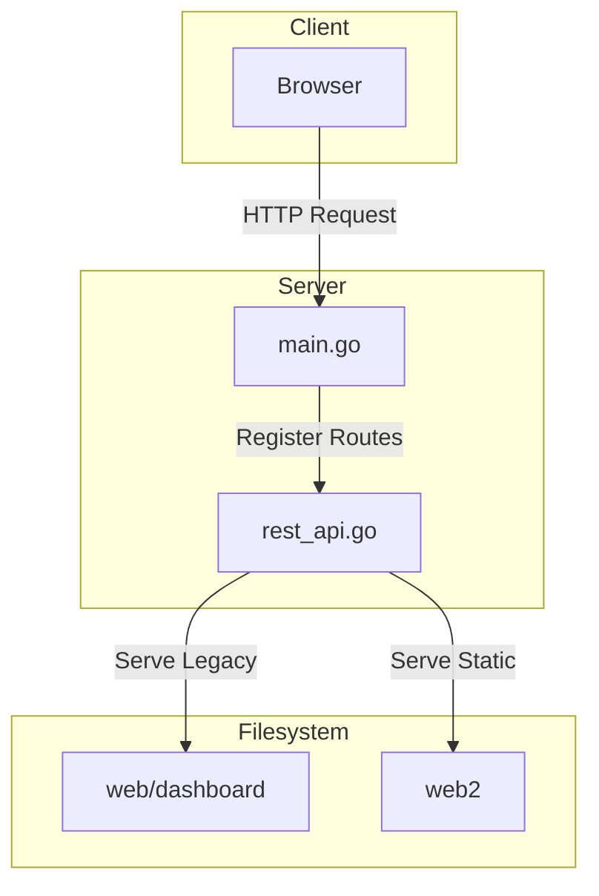

# Phase 8: Server Integration

**Priority:** CRITICAL  
**Estimated Time:** 1 day  
**Complexity:** Medium  
**Files to Create:** 0  
**Files to Modify:** 2

---

## Executive Summary

This phase integrates the new dashboard with the server. It configures the server to serve static files from `/web2` directory and sets up proper routing.

---

## Problem Description

The new dashboard needs to be served by the server when the application starts. The server currently serves files from `/web/dashboard` and needs to be updated to serve from `/web2`.

### Requirements

- Serve static files from `/web2` directory
- Handle dashboard routes correctly
- Maintain backward compatibility with existing `/web` routes
- Configure proper MIME types for static files
- Set cache headers for performance

---

## Solution Architecture

### Design Principles

1. **Dual Dashboard Support:** Serve both `/web` and `/web2` during transition
2. **Path Resolution:** Resolve dashboard directory relative to executable
3. **MIME Types:** Set correct Content-Type headers
4. **Cache Control:** Set appropriate cache headers
5. **Error Handling:** Handle missing files gracefully

### Architecture Diagram



---

## Implementation Plan

### Step 1: Update REST API Server

Modify [`internal/restapi/rest_api.go`](../../internal/restapi/rest_api.go) to support `/web2` dashboard:

```go
// Package restapi provides REST API endpoints for OAuth2 authentication flows
package restapi

import (
    // ... existing imports ...
)

// Config holds the configuration for the REST API server
type Config struct {
    Port            string        // Server port
    CallbackBaseURL string        // Base URL for callbacks
    StateTTL        time.Duration // OAuth state TTL
    DeviceCodeTTL   time.Duration // Device code TTL
    EnableCORS      bool          // Enable CORS
    AllowedOrigins  []string      // CORS allowed origins
    DashboardDir    string        // Dashboard directory path (empty = auto-detect)
    DashboardPath   string        // Dashboard URL path (default: /)
}

// DefaultConfig returns the default configuration
func DefaultConfig() *Config {
    return &Config{
        Port:            "8080",
        CallbackBaseURL: "http://localhost:8080",
        StateTTL:        10 * time.Minute,
        DeviceCodeTTL:   15 * time.Minute,
        EnableCORS:      false,
        AllowedOrigins:  []string{"*"},
        DashboardPath:   "/",  // New field for dashboard path
    }
}

// Server represents the OAuth REST API server
type Server struct {
    config            *Config
    registry          *ProviderRegistry
    stateManager      *StateManager
    logger            logging.Logger
    httpClient        *http.Client
    tokenStores       map[string]tokpkg.TokenStore
    tokenManagers     map[string]*tokpkg.TokenManager
    multiTokenManager *tokpkg.MultiTokenManager
    rateLimitManager  *ratelimit.QuotaManager
    cacheInvalidator  *ratelimit.CacheInvalidator
    dashboardPath     string  // Dashboard URL path
}

// NewServer creates a new OAuth REST API server
func NewServer(config *Config, logger logging.Logger) *Server {
    if config == nil {
        config = DefaultConfig()
    }
    if logger == nil {
        logger = logging.NewLogger()
    }

    server := &Server{
        config:            config,
        registry:          NewProviderRegistry(),
        stateManager:      NewStateManager(logger),
        logger:            logger,
        httpClient:        &http.Client{Timeout: 30 * time.Second},
        tokenStores:       make(map[string]tokpkg.TokenStore),
        tokenManagers:     make(map[string]*tokpkg.TokenManager),
        multiTokenManager: nil,
        dashboardPath:     config.DashboardPath,
    }

    return server
}

// resolveDashboardDir resolves dashboard directory path relative to executable location
// This ensures dashboard can be served regardless of current working directory
func (s *Server) resolveDashboardDir() (string, error) {
    // Get executable path
    execPath, err := os.Executable()
    if err != nil {
        return "", fmt.Errorf("failed to get executable path: %w", err)
    }

    // Get directory containing executable
    execDir := filepath.Dir(execPath)

    // Try web2 first (new dashboard)
    dashboardDir := filepath.Join(execDir, "web2")

    // Check if dashboard directory exists
    if _, err := os.Stat(dashboardDir); os.IsNotExist(err) {
        // Fall back to web directory (legacy dashboard)
        dashboardDir = filepath.Join(execDir, "web", "dashboard")

        // Check again
        if _, err := os.Stat(dashboardDir); os.IsNotExist(err) {
            // If not found relative to executable, try relative to current working directory
            // This handles development scenarios where binary is run from project root
            wd, err := os.Getwd()
            if err != nil {
                return "", fmt.Errorf("failed to get working directory: %w", err)
            }

            // Try web2 from working directory
            dashboardDir = filepath.Join(wd, "web2")

            // Check again
            if _, err := os.Stat(dashboardDir); os.IsNotExist(err) {
                // Fall back to web from working directory
                dashboardDir = filepath.Join(wd, "web", "dashboard")

                // Check again
                if _, err := os.Stat(dashboardDir); os.IsNotExist(err) {
                    return "", fmt.Errorf("dashboard directory not found (tried: %s/web2 and %s/web/dashboard)",
                        execDir, wd)
                }
            }
        }
    }

    return dashboardDir, nil
}

// registerRoutes registers all API routes
func (s *Server) registerRoutes(mux *http.ServeMux) {
    // Resolve dashboard directory
    dashboardDir, err := s.resolveDashboardDir()
    if err != nil {
        s.logger.ErrorLog("Failed to resolve dashboard directory: %v", err)
        return
    } else {
        s.logger.InfoLog("Dashboard directory: %s", dashboardDir)
    }

    // Determine dashboard path prefix
    dashboardPrefix := s.dashboardPath
    if dashboardPrefix == "/" {
        dashboardPrefix = ""
    }

    // Handle dashboard root - serve index.html
    mux.HandleFunc(dashboardPrefix, func(w http.ResponseWriter, r *http.Request) {
        // If the path is exactly the dashboard path, serve index.html
        if r.URL.Path == dashboardPrefix || r.URL.Path == dashboardPrefix+"/" {
            filePath := filepath.Join(dashboardDir, "index.html")
            absPath, err := filepath.Abs(filePath)
            if err != nil {
                s.logger.ErrorLog("Failed to get absolute path for %s: %v", filePath, err)
            } else {
                s.logger.InfoLog("Attempting to serve file: %s (absolute: %s)", filePath, absPath)
            }

            // Check if file exists
            if _, err := os.Stat(filePath); os.IsNotExist(err) {
                s.logger.ErrorLog("File does not exist: %s", filePath)
                http.Error(w, "File not found", http.StatusNotFound)
                return
            }

            // Set proper Content-Type header for HTML
            w.Header().Set("Content-Type", "text/html; charset=utf-8")
            http.ServeFile(w, r, filePath)
            return
        }

        // For other paths, serve from the dashboard directory
        // Strip the dashboard prefix from the path
        requestPath := strings.TrimPrefix(r.URL.Path, dashboardPrefix)
        if requestPath == "" {
            requestPath = "/"
        }
        filePath := filepath.Join(dashboardDir, requestPath)
        s.logger.InfoLog("Attempting to serve file: %s", filePath)
        http.ServeFile(w, r, filePath)
    })

    // Serve CSS files from dashboard path with proper MIME type and cache headers
    cssDir := filepath.Join(dashboardDir, "css")
    mux.Handle(dashboardPrefix+"/css/", http.StripPrefix(dashboardPrefix+"/css/", s.createStaticFileHandler(cssDir, "text/css; charset=utf-8", 3600)))

    // Serve JavaScript files from dashboard path with proper MIME type and cache headers
    jsDir := filepath.Join(dashboardDir, "js")
    mux.Handle(dashboardPrefix+"/js/", http.StripPrefix(dashboardPrefix+"/js/", s.createStaticFileHandler(jsDir, "application/javascript; charset=utf-8", 3600)))

    // Serve template files from dashboard path with proper MIME type and cache headers
    templatesDir := filepath.Join(dashboardDir, "templates")
    mux.Handle(dashboardPrefix+"/templates/", http.StripPrefix(dashboardPrefix+"/templates/", s.createStaticFileHandler(templatesDir, "text/html; charset=utf-8", 1800)))

    // Log dashboard routes
    s.logger.InfoLog("[registerRoutes] Dashboard routes registered at path: %s", dashboardPrefix)

    // ... rest of the existing route registration ...
}
```

**Key Changes:**
1. Added `DashboardPath` field to `Config` struct
2. Added `dashboardPath` field to `Server` struct
3. Updated `resolveDashboardDir()` to try `/web2` first, then fall back to `/web/dashboard`
4. Updated route registration to use `dashboardPrefix` for all dashboard routes
5. Added logging for dashboard path resolution

---

### Step 2: Update Main Application

Update [`cmd/main.go`](../../cmd/main.go) to configure dashboard path:

```go
// Package main is the entry point for qwencoder-proxy server
package main

import (
    // ... existing imports ...
)

func main() {
    // ... existing flag parsing and config loading ...

    // Create REST API server for dashboard and OAuth flows
    apiConfig := &restapi.Config{
        Port:            cfg.Server.Port,
        CallbackBaseURL: "http://localhost:" + cfg.Server.Port,
        StateTTL:        10 * time.Minute,
        DeviceCodeTTL:   15 * time.Minute,
        EnableCORS:      true,
        AllowedOrigins:  []string{"*"},
        DashboardPath:   "/web2",  // New dashboard path
    }
    restAPIServer := restapi.NewServer(apiConfig, logger)

    // ... rest of the existing initialization ...
}
```

**Key Changes:**
1. Set `DashboardPath` to `/web2` in `apiConfig`

---

### Step 3: Create Web2 Directory Structure

Create the complete directory structure for `/web2`:

```bash
# Create web2 directory structure
mkdir -p web2/css
mkdir -p web2/js/api
mkdir -p web2/js/state
mkdir -p web2/js/ui
mkdir -p web2/js/utils
mkdir -p web2/js/views
mkdir -p web2/js/components
mkdir -p web2/assets/images
```

---

### Step 4: Verify Dashboard Resolution

Test that the dashboard directory resolves correctly in different scenarios:

1. **Production Scenario:**
   - Binary in `/usr/local/bin/qwencoder-proxy`
   - Dashboard in `/usr/local/lib/qwencoder-proxy/web2`
   - Should resolve to `/usr/local/lib/qwencoder-proxy/web2`

2. **Development Scenario:**
   - Running from project root
   - Dashboard in `./web2`
   - Should resolve to `./web2`

3. **Fallback Scenario:**
   - `/web2` doesn't exist
   - Should fall back to `/web/dashboard`

---

## Testing Strategy

### Unit Tests
- [ ] Dashboard directory resolution works
- [ ] Path prefix handling works
- [ ] MIME types set correctly
- [ ] Cache headers set correctly

### Integration Tests
- [ ] Server starts with new dashboard
- [ ] Static files served correctly
- [ ] API routes still work
- [ ] Legacy dashboard still accessible

### Manual Testing
- [ ] Can access dashboard at `/web2`
- [ ] CSS files load
- [ ] JavaScript files load
- [ ] API endpoints work
- [ ] All views render

---

## Verification Checklist

- [ ] Server integration completed
- [ ] Dashboard directory resolves correctly
- [ ] Static files served with correct MIME types
- [ ] Cache headers set correctly
- [ ] Dashboard accessible at `/web2`
- [ ] API endpoints still work
- [ ] No console errors
- [ ] No server errors

---

## Migration Notes

### Transition Period

During the transition period, both dashboards will be available:

- `/` - New dashboard (`/web2`)
- `/web` - Legacy dashboard (for reference)

### Deprecation Timeline

1. **Phase 1:** Deploy new dashboard at `/web2`
2. **Phase 2:** Test and validate new dashboard
3. **Phase 3:** Update documentation to point to `/web2`
4. **Phase 4:** Deprecate `/web` dashboard
5. **Phase 5:** Remove `/web` directory

### Rollback Plan

If issues are found with new dashboard:

1. Change `DashboardPath` back to `/` in `cmd/main.go`
2. Restart server
3. Legacy dashboard will be served from `/web/dashboard`

---

## Next Steps

After completing Phase 8, proceed to **Phase 9: Testing & Polish** to perform comprehensive testing and polish.

---

**Last Updated:** 2026-03-19  
**Version:** 1.0
