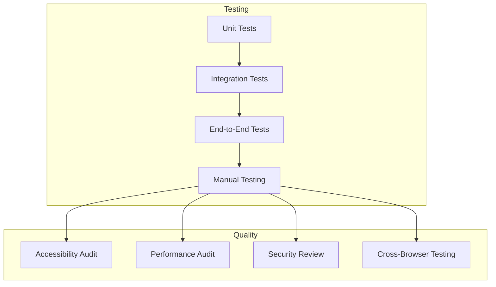

# Phase 9: Testing & Polish

**Priority:** HIGH  
**Estimated Time:** 2 days  
**Complexity:** Medium  
**Files to Create:** 0  
**Files to Modify:** 0

---

## Executive Summary

This phase performs comprehensive testing and polish of the dashboard. It includes cross-browser testing, accessibility validation, performance optimization, and documentation.

---

## Problem Description

Before releasing the dashboard, it needs thorough testing to ensure it works correctly across all scenarios and meets quality standards.

### Requirements

- Cross-browser compatibility testing
- Accessibility compliance (WCAG 2.1 AA)
- Performance optimization
- Responsive design validation
- Error handling validation
- Documentation completion

---

## Solution Architecture

### Design Principles

1. **Comprehensive Testing:** Test all features and edge cases
2. **Accessibility First:** Ensure accessibility compliance
3. **Performance:** Optimize for fast load times
4. **User Experience:** Polish interactions and animations
5. **Documentation:** Complete all documentation

### Testing Strategy

---

## Implementation Plan

### Step 1: Cross-Browser Testing

Test dashboard across all major browsers:

| Browser | Version | Status | Issues Found |
|----------|---------|--------|--------------|
| Chrome | Latest+ | | |
| Firefox | Latest+ | | |
| Safari | Latest+ | | |
| Edge | Latest+ | | |
| Mobile Safari | iOS 14+ | | |
| Chrome Mobile | Android 10+ | | |

**Test Areas:**
- [ ] All views render correctly
- [ ] Navigation works
- [ ] Forms submit correctly
- [ ] Modals open/close
- [ ] Toasts display
- [ ] Tables sort/filter
- [ ] OAuth flows complete
- [ ] API calls work

---

### Step 2: Accessibility Testing

Validate WCAG 2.1 AA compliance:

**Keyboard Navigation:**
- [ ] All interactive elements are keyboard accessible
- [ ] Tab order is logical
- [ ] Focus indicators are visible
- [ ] Escape key closes modals
- [ ] Enter/Space activates buttons

**Screen Reader Support:**
- [ ] All images have alt text
- [ ] Form fields have labels
- [ ] Error messages are announced
- [ ] Dynamic content changes are announced
- [ ] ARIA roles are correct

**Color Contrast:**
- [ ] Text contrast ratio >= 4.5:1
- [ ] UI elements have sufficient contrast
- [ ] Focus indicators are visible

**Other:**
- [ ] No seizure-inducing content
- [ ] Resizable text works
- [ ] Zoom works up to 200%

---

### Step 3: Performance Testing

Measure and optimize performance:

**Load Time Metrics:**
- [ ] Initial HTML load < 100ms
- [ ] First Contentful Paint < 1s
- [ ] Time to Interactive < 2s
- [ ] Total page load < 3s

**Resource Optimization:**
- [ ] CSS files minified
- [ ] JavaScript files minified (if needed)
- [ ] Images optimized
- [ ] Font loading optimized
- [ ] No blocking resources

**Runtime Performance:**
- [ ] No layout thrashing
- [ ] Efficient DOM updates
- [ ] Proper event delegation
- [ ] No memory leaks

---

### Step 4: Responsive Design Testing

Test across all screen sizes:

| Device | Resolution | Status |
|--------|-------------|--------|
| Desktop | 1920x1080 | |
| Desktop | 1366x768 | |
| Laptop | 1280x720 | |
| Tablet | 768x1024 | |
| Tablet | 640x960 | |
| Mobile | 375x667 | |
| Mobile | 320x568 | |

**Test Areas:**
- [ ] Layout adapts correctly
- [ ] Navigation works on mobile
- [ ] Tables scroll on mobile
- [ ] Modals fit on mobile
- [ ] Forms are usable on mobile
- [ ] Touch targets are large enough (44px min)

---

### Step 5: Error Handling Testing

Test error scenarios:

**API Errors:**
- [ ] Network errors display correctly
- [ ] Timeout errors display correctly
- [ ] 404 errors display correctly
- [ ] 500 errors display correctly
- [ ] Validation errors display correctly

**User Errors:**
- [ ] Invalid form inputs show errors
- [ ] Required fields show errors
- [ ] Confirmation dialogs work
- [ ] Cancel operations work

**Edge Cases:**
- [ ] Empty data states handled
- [ ] Large data sets handled
- [ ] Concurrent operations handled
- [ ] Browser back button handled

---

### Step 6: Security Testing

Validate security measures:

**Input Validation:**
- [ ] XSS prevention in user input
- [ ] HTML escaping in dynamic content
- [ ] URL validation
- [ ] File upload validation (if any)

**API Security:**
- [ ] No sensitive data in localStorage
- [ ] No credentials in URL
- [ ] CSRF protection (if needed)
- [ ] Content Security Policy headers

**Data Privacy:**
- [ ] No unnecessary data collection
- [ ] Clear data on logout
- [ ] Secure cookie handling (if any)

---

### Step 7: Integration Testing

Test integration with server:

**API Integration:**
- [ ] All API endpoints work
- [ ] Authentication works
- [ ] Token refresh works
- [ ] Error responses handled

**OAuth Flows:**
- [ ] Device code flow works
- [ ] Auth code flow works
- [ ] Manual token addition works
- [ ] Token refresh works

**State Management:**
- [ ] State updates correctly
- [ ] Subscriptions work
- [ ] Actions dispatch correctly
- [ ] No state corruption

---

### Step 8: Polish and Refinement

Apply final polish:

**UI Polish:**
- [ ] Consistent spacing
- [ ] Consistent colors
- [ ] Consistent typography
- [ ] Smooth animations
- [ ] Loading states
- [ ] Hover states

**UX Improvements:**
- [ ] Clear error messages
- [ ] Helpful tooltips
- [ ] Intuitive navigation
- [ ] Fast feedback on actions
- [ ] Undo/redo where appropriate

**Code Quality:**
- [ ] No console errors
- [ ] No console warnings
- [ ] Code is consistent
- [ ] Code is documented
- [ ] Code follows best practices

---

### Step 9: Documentation

Complete all documentation:

**Dashboard Documentation:**
- [ ] README.md created
- [ ] Installation guide
- [ ] User guide
- [ ] API reference
- [ ] Troubleshooting guide

**Code Documentation:**
- [ ] JSDoc comments complete
- [ ] Component documentation
- [ ] API client documentation
- [ ] State management documentation

**Deployment Documentation:**
- [ ] Build instructions (if needed)
- [ ] Deployment guide
- [ ] Configuration guide
- [ ] Migration guide

---

## Testing Checklist

### Functional Testing
- [ ] All views render correctly
- [ ] Navigation works
- [ ] Forms work
- [ ] Modals work
- [ ] Toasts work
- [ ] Tables work
- [ ] Filters work
- [ ] Sorting works
- [ ] Pagination works

### OAuth Testing
- [ ] Device code flow works
- [ ] Auth code flow works
- [ ] Manual token addition works
- [ ] Token refresh works
- [ ] Token deletion works

### Provider/Token Testing
- [ ] Can view providers
- [ ] Can add tokens
- [ ] Can view tokens
- [ ] Can filter tokens
- [ ] Can sort tokens
- [ ] Can refresh tokens
- [ ] Can delete tokens

### Proxy Testing
- [ ] Can view proxy configs
- [ ] Can add proxy
- [ ] Can edit proxy
- [ ] Can delete proxy
- [ ] Can test proxy
- [ ] Health status displays

### Rate Limit Testing
- [ ] Can view rate limits
- [ ] Can configure rate limits
- [ ] Can enable/disable rate limiting
- [ ] Can reset usage
- [ ] Usage displays correctly

### Usage Testing
- [ ] Can view request history
- [ ] Can filter history
- [ ] Can view model usage
- [ ] Can view errors
- [ ] Can view cache stats
- [ ] Can invalidate cache

### Cross-Browser Testing
- [ ] Chrome works
- [ ] Firefox works
- [ ] Safari works
- [ ] Edge works
- [ ] Mobile browsers work

### Accessibility Testing
- [ ] Keyboard navigation works
- [ ] Screen reader works
- [ ] Color contrast is sufficient
- [ ] Focus indicators are visible

### Performance Testing
- [ ] Load time is acceptable
- [ ] Runtime performance is good
- [ ] No memory leaks
- [ ] Animations are smooth

---

## Bug Tracking

Document any bugs found during testing:

| ID | Description | Severity | Status |
|----|-------------|----------|--------|
| | | | |

---

## Known Limitations

Document any known limitations:

| Area | Limitation | Workaround |
|-------|-------------|------------|
| | | |

---

## Next Steps

After completing Phase 9, the dashboard is ready for deployment. Refer to the master overview document for the complete implementation plan.

---

**Last Updated:** 2026-03-19  
**Version:** 1.0
