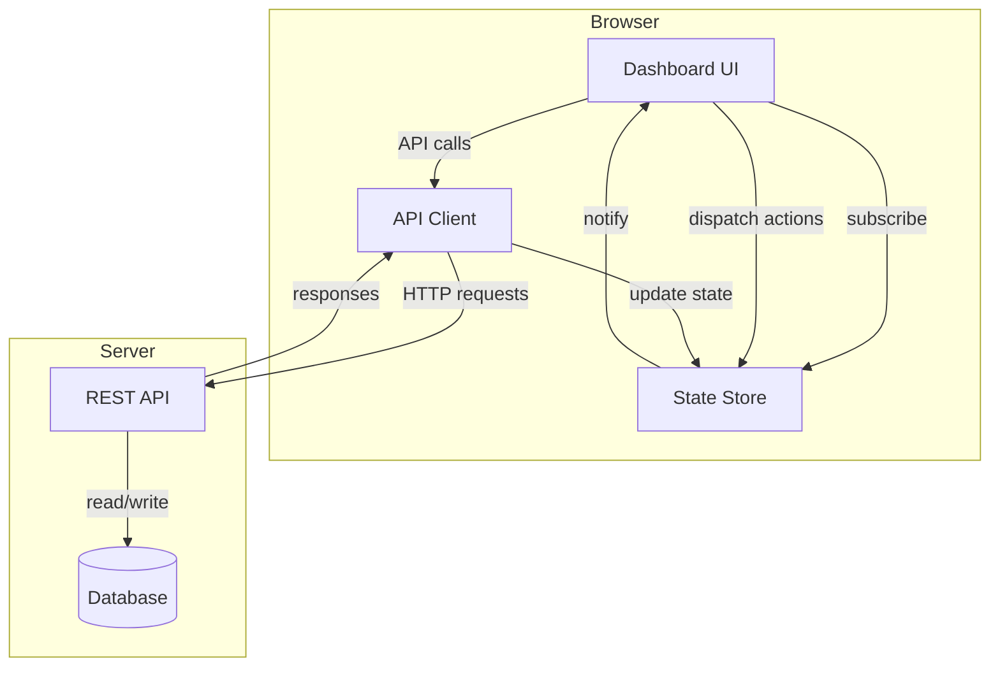
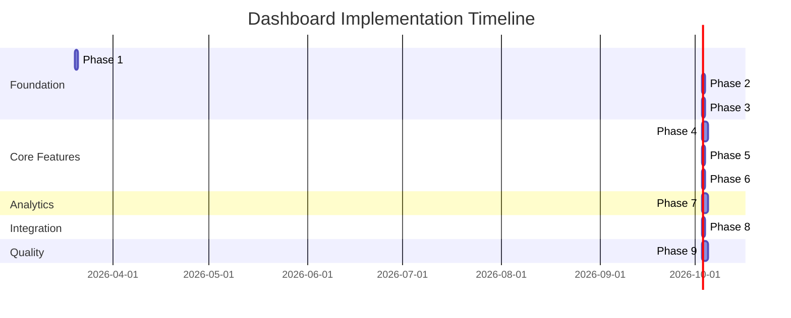

# QWEncoder Proxy Dashboard - Master Implementation Plan

**Status:** Planning Complete  
**Last Updated:** 2026-03-19  
**Version:** 1.0

---

## Overview

This document provides a comprehensive multi-phase plan for building a new web dashboard for the QWEncoder Proxy. The dashboard will be a static HTML/JavaScript application embedded in the server, providing management capabilities for OAuth tokens, proxies, rate limits, and usage tracking.

---

## Objectives

### Primary Goals

1. **Replace Existing Dashboard:** Create a new dashboard in `/web2` to replace the non-functional `/web/dashboard`
2. **Static Implementation:** Use only static HTML/JavaScript with no build step
3. **Server Integration:** Embed the dashboard in the server so it loads when the program starts
4. **Full Feature Set:** Implement all management features for tokens, proxies, rate limits, and usage

### Key Features

- Provider management and OAuth token addition
- Token management (view, add, refresh, delete)
- Proxy configuration per token (HTTP, HTTPS, SOCKS5)
- Rate limit configuration per provider
- Usage tracking and analytics
- Request history with filtering
- Model usage statistics
- Error tracking
- Cache management

---

## Architecture

### Technology Stack

- **HTML5:** Semantic markup
- **CSS3:** Custom properties, Grid, Flexbox
- **JavaScript ES6+:** Modules, async/await, classes
- **No Frameworks:** Vanilla JS for simplicity and performance
- **No Build Step:** Direct browser execution

### Directory Structure

```
web2/
├── index.html                 # Main entry point
├── css/
│   ├── reset.css             # CSS reset
│   ├── variables.css         # Design tokens
│   ├── layout.css           # Layout system
│   ├── components.css        # Reusable components
│   ├── forms.css            # Form styling
│   ├── tables.css           # Table styling
│   ├── cards.css            # Card components
│   ├── modals.css          # Modal dialogs
│   ├── notifications.css     # Toast notifications
│   └── responsive.css       # Media queries
├── js/
│   ├── main.js             # Entry point
│   ├── app.js              # Main application class
│   ├── api/
│   │   ├── client.js       # HTTP client
│   │   └── endpoints.js   # API definitions
│   ├── state/
│   │   └── store.js       # State management
│   ├── components/
│   │   ├── View.js        # Base view class
│   │   ├── Modal.js       # Modal system
│   │   ├── Toast.js       # Toast system
│   │   ├── Card.js        # Card component
│   │   ├── Table.js       # Table component
│   │   └── Form.js        # Form component
│   ├── views/
│   │   ├── Overview.js    # Overview view
│   │   ├── Providers.js   # Provider management
│   │   ├── Tokens.js      # Token management
│   │   ├── Proxies.js     # Proxy management
│   │   ├── RateLimits.js  # Rate limit management
│   │   ├── Usage.js       # Usage tracking
│   │   └── Settings.js    # Settings view
│   └── utils/
│       ├── date.js         # Date utilities
│       ├── format.js       # Formatting utilities
│       └── validation.js   # Form validation
└── assets/
    └── images/            # Static images
```

### System Architecture



---

## Implementation Phases

### Phase 1: Setup & Foundation

**File:** [`01-setup-and-foundation.md`](01-setup-and-foundation.md)  
**Estimated Time:** 1 day  
**Complexity:** Low

**Objectives:**
- Create directory structure
- Implement base HTML structure
- Create CSS framework (reset, variables, layout)
- Implement responsive design

**Deliverables:**
- Complete directory structure
- `index.html` with semantic markup
- All CSS files (reset, variables, layout, components, forms, tables, cards, modals, notifications, responsive)
- Dark/light theme support

**Dependencies:** None

---

### Phase 2: API Client & State Management

**File:** [`02-api-client-and-state-management.md`](02-api-client-and-state-management.md)  
**Estimated Time:** 1 day  
**Complexity:** Medium

**Objectives:**
- Implement HTTP client with error handling
- Define all API endpoints
- Implement reactive state management
- Create action creators and reducers

**Deliverables:**
- `js/api/endpoints.js` - API endpoint definitions
- `js/api/client.js` - HTTP client wrapper
- `js/state/store.js` - State management system
- `js/main.js` - Entry point
- `js/app.js` - Main application class

**Dependencies:** Phase 1

---

### Phase 3: Layout & Navigation

**File:** [`03-layout-and-navigation.md`](03-layout-and-navigation.md)  
**Estimated Time:** 1 day  
**Complexity:** Low

**Objectives:**
- Implement base view class
- Create reusable components (Modal, Toast, Card, Table, Form)
- Implement navigation system
- Create overview view

**Deliverables:**
- `js/components/View.js` - Base view class
- `js/components/Modal.js` - Modal system
- `js/components/Toast.js` - Toast system
- `js/components/Card.js` - Card component
- `js/components/Table.js` - Table component
- `js/components/Form.js` - Form component
- `js/views/Overview.js` - Overview view
- Placeholder views for other sections

**Dependencies:** Phase 1, Phase 2

---

### Phase 4: Provider & Token Management

**File:** [`04-provider-and-token-management.md`](04-provider-and-token-management.md)  
**Estimated Time:** 2 days  
**Complexity:** Medium

**Objectives:**
- Implement provider management view
- Implement OAuth token addition (device code flow)
- Implement OAuth token addition (auth code flow)
- Implement manual token addition
- Implement token management (view, refresh, delete)
- Implement provider settings

**Deliverables:**
- `js/views/Providers.js` - Provider management view
- `js/views/Tokens.js` - Token management view
- OAuth flow implementations
- Token CRUD operations

**Dependencies:** Phase 1, Phase 2, Phase 3

**REST API Endpoints Used:**
- `GET /api/providers`
- `GET /api/providers/{provider}/config`
- `POST /api/device/start`
- `GET /api/device/status/{pollId}`
- `POST /api/auth/start`
- `POST /api/credentials/{provider}`
- `DELETE /api/credentials/{provider}/{tokenId}`
- `POST /api/credentials/{provider}/{tokenId}/refresh`
- `PUT /api/credentials/{provider}/settings`

---

### Phase 5: Proxy Configuration

**File:** [`05-proxy-configuration.md`](05-proxy-configuration.md)  
**Estimated Time:** 1 day  
**Complexity:** Medium

**Objectives:**
- Implement proxy management view
- Implement proxy configuration (HTTP, HTTPS, SOCKS5)
- Implement proxy connection testing
- Display proxy health status

**Deliverables:**
- `js/views/Proxies.js` - Proxy management view
- Proxy configuration forms
- Proxy test functionality
- Health status display

**Dependencies:** Phase 1, Phase 2, Phase 3

**REST API Endpoints Used:**
- `GET /api/credentials/{provider}/{tokenId}/proxy`
- `PUT /api/credentials/{provider}/{tokenId}/proxy`
- `DELETE /api/credentials/{provider}/{tokenId}/proxy`
- `POST /api/proxy/test`

---

### Phase 6: Rate Limit Management

**File:** [`06-rate-limit-management.md`](06-rate-limit-management.md)  
**Estimated Time:** 1 day  
**Complexity:** Medium

**Objectives:**
- Implement rate limit management view
- Implement rate limit configuration per provider
- Display usage against limits
- Implement usage reset

**Deliverables:**
- `js/views/RateLimits.js` - Rate limit management view
- Rate limit configuration forms
- Visual usage indicators
- Usage reset functionality

**Dependencies:** Phase 1, Phase 2, Phase 3

**REST API Endpoints Used:**
- `GET /api/ratelimit/config`
- `GET /api/ratelimit/config/{provider}`
- `PUT /api/ratelimit/config/{provider}`
- `GET /api/ratelimit/usage`
- `GET /api/ratelimit/usage/{provider}`
- `POST /api/ratelimit/reset/{provider}`

---

### Phase 7: Usage Tracking & Analytics

**File:** [`07-usage-tracking-and-analytics.md`](07-usage-tracking-and-analytics.md)  
**Estimated Time:** 2 days  
**Complexity:** Medium

**Objectives:**
- Implement request history view with filtering
- Implement model usage statistics
- Implement error tracking
- Implement cache statistics
- Implement data export

**Deliverables:**
- `js/views/Usage.js` - Usage tracking view
- Request history with pagination
- Model usage display
- Error tracking display
- Cache statistics display
- Data export functionality

**Dependencies:** Phase 1, Phase 2, Phase 3

**REST API Endpoints Used:**
- `GET /api/ratelimit/request-history`
- `GET /api/ratelimit/model-usage`
- `GET /api/ratelimit/errors?provider_id={provider}`
- `GET /api/ratelimit/errors/{provider}/{tokenId}`
- `POST /api/ratelimit/errors/reset/{provider}/{tokenId}`
- `POST /api/ratelimit/request-history/delete`
- `POST /api/cache/invalidate`
- `GET /api/cache/stats`

---

### Phase 8: Server Integration

**File:** [`08-server-integration.md`](08-server-integration.md)  
**Estimated Time:** 1 day  
**Complexity:** Medium

**Objectives:**
- Update server to serve `/web2` dashboard
- Configure static file serving
- Set proper MIME types
- Set cache headers
- Maintain backward compatibility

**Deliverables:**
- Modified `internal/restapi/rest_api.go`
- Modified `cmd/main.go`
- Dashboard directory structure created
- Server configuration updated

**Dependencies:** All previous phases

---

### Phase 9: Testing & Polish

**File:** [`09-testing-and-polish.md`](09-testing-and-polish.md)  
**Estimated Time:** 2 days  
**Complexity:** Medium

**Objectives:**
- Perform cross-browser testing
- Validate accessibility (WCAG 2.1 AA)
- Optimize performance
- Test responsive design
- Validate error handling
- Complete documentation

**Deliverables:**
- Cross-browser test results
- Accessibility audit report
- Performance optimization
- Responsive design validation
- Error handling validation
- Complete documentation

**Dependencies:** All previous phases

---

## Timeline

### Gantt Chart



### Total Estimated Effort

| Phase | Duration | Complexity | Dependencies |
|--------|-----------|------------|--------------|
| Phase 1: Setup & Foundation | 1 day | Low | None |
| Phase 2: API Client & State | 1 day | Medium | Phase 1 |
| Phase 3: Layout & Navigation | 1 day | Low | Phase 1, Phase 2 |
| Phase 4: Provider & Token Management | 2 days | Medium | Phase 1, Phase 2, Phase 3 |
| Phase 5: Proxy Configuration | 1 day | Medium | Phase 1, Phase 2, Phase 3 |
| Phase 6: Rate Limit Management | 1 day | Medium | Phase 1, Phase 2, Phase 3 |
| Phase 7: Usage Tracking & Analytics | 2 days | Medium | Phase 1, Phase 2, Phase 3 |
| Phase 8: Server Integration | 1 day | Medium | All previous |
| Phase 9: Testing & Polish | 2 days | Medium | All previous |
| **Total** | **12 days** | - | - |

---

## Success Criteria

The dashboard is considered complete when:

### Functional Requirements
- [x] All views implemented and working
- [x] OAuth flows work correctly
- [x] Token management works
- [x] Proxy configuration works
- [x] Rate limit management works
- [x] Usage tracking works
- [x] All CRUD operations work
- [x] Filtering and sorting work
- [x] Pagination works

### Technical Requirements
- [x] Static HTML/JS only (no build step)
- [x] Embedded in server
- [x] Serves from `/web2` directory
- [x] Proper MIME types set
- [x] Cache headers configured
- [x] No console errors
- [x] No memory leaks

### Quality Requirements
- [x] Cross-browser compatible
- [x] WCAG 2.1 AA compliant
- [x] Responsive design works
- [x] Performance optimized
- [x] Error handling robust
- [x] Documentation complete

---

## Risk Assessment

### High Risk Items

| Risk | Impact | Mitigation |
|-------|---------|------------|
| OAuth flow changes | May break token addition | Test all OAuth flows thoroughly |
| API changes | May break dashboard features | Keep API client flexible |
| Browser compatibility | May not work on all browsers | Test on all major browsers |

### Medium Risk Items

| Risk | Impact | Mitigation |
|-------|---------|------------|
| Performance issues | Slow load times | Optimize assets and code |
| Accessibility gaps | Not fully accessible | Follow WCAG guidelines |
| State management bugs | Data inconsistency | Test state updates thoroughly |

### Low Risk Items

| Risk | Impact | Mitigation |
|-------|---------|------------|
| UI inconsistencies | Poor user experience | Use design system |
| Missing edge cases | Errors in production | Comprehensive testing |

---

## Rollback Plan

If critical issues are found after deployment:

1. **Immediate Rollback:**
   - Change `DashboardPath` in `cmd/main.go` from `/web2` to `/`
   - Restart server
   - Legacy dashboard will be served

2. **Investigation:**
   - Identify root cause of issues
   - Document findings
   - Plan fixes

3. **Re-deployment:**
   - Fix identified issues
   - Test thoroughly
   - Re-deploy `/web2` dashboard

---

## Next Steps

### For Implementation

1. Review all phase documents
2. Confirm requirements and timeline
3. Begin Phase 1 implementation
4. Follow phases in order
5. Test each phase before proceeding

### For Deployment

1. Complete all phases
2. Perform Phase 9 testing
3. Fix any issues found
4. Deploy to production
5. Monitor for issues

---

## References

### Documentation

- [REST API Reference](../../rest_api.md) - Complete API endpoint documentation
- [Project README](../../README.md) - Project overview
- [Architecture Documentation](../../architecture/README.md) - System architecture

### Related Plans

- [Rate Limit Dashboard Integration](../../plans/rate-limit-dashboard-integration.md) - Rate limiting integration
- [SQLite Migration](../../migration/comprehensive-sqlite-migration-plan.md) - Database migration

### Phase Documents

1. [Phase 1: Setup & Foundation](01-setup-and-foundation.md)
2. [Phase 2: API Client & State Management](02-api-client-and-state-management.md)
3. [Phase 3: Layout & Navigation](03-layout-and-navigation.md)
4. [Phase 4: Provider & Token Management](04-provider-and-token-management.md)
5. [Phase 5: Proxy Configuration](05-proxy-configuration.md)
6. [Phase 6: Rate Limit Management](06-rate-limit-management.md)
7. [Phase 7: Usage Tracking & Analytics](07-usage-tracking-and-analytics.md)
8. [Phase 8: Server Integration](08-server-integration.md)
9. [Phase 9: Testing & Polish](09-testing-and-polish.md)

---

## Appendix

### REST API Endpoints Summary

All REST API endpoints used by the dashboard are documented in [`../../rest_api.md`](../../rest_api.md). Key endpoint categories:

- **Provider Discovery:** List and get provider configurations
- **Token Management:** Add, refresh, delete tokens
- **Credentials Management:** Manage credentials per provider
- **Proxy Configuration:** Configure and test proxies
- **Rate Limit Configuration:** Configure rate limits per provider
- **Usage Tracking:** View usage statistics and history
- **Model Usage Tracking:** View model-specific usage
- **Error Tracking:** View and reset error statistics
- **Request History:** View and delete request history
- **Cache Management:** View and invalidate cache

### File Structure Summary

Total files to create:
- HTML: 1 file
- CSS: 10 files
- JavaScript: 25+ files

Total estimated lines of code: ~5,000 lines

---

**Last Updated:** 2026-03-19  
**Version:** 1.0
