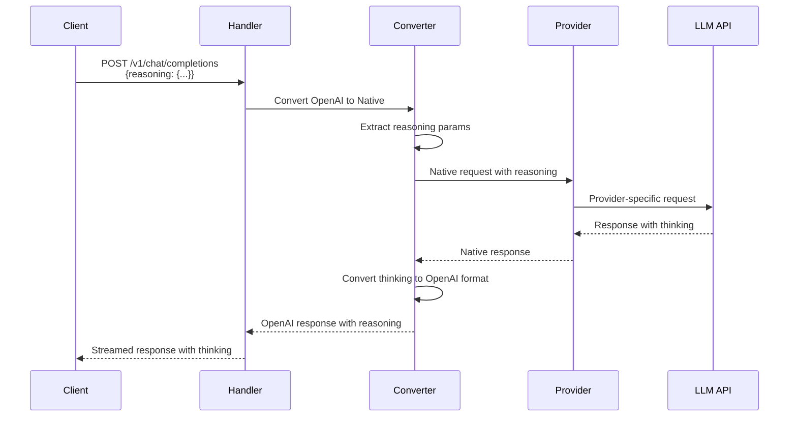
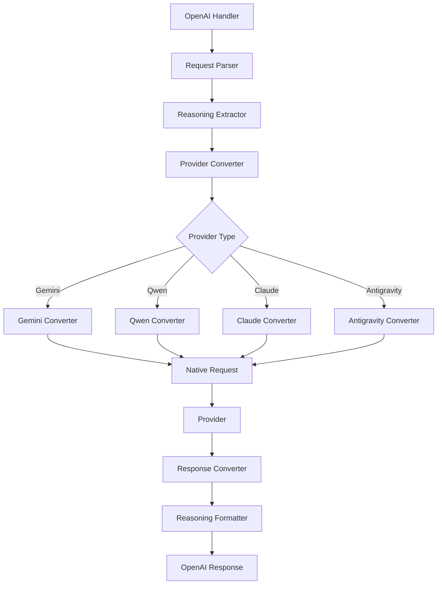

# Reasoning/Thinking Implementation Plan

## Overview

This plan outlines the implementation of reasoning/thinking capabilities across all providers (Gemini, Qwen, Kiro/Claude, Antigravity) with streaming support in OpenAI format via the `/v1/chat/completions` endpoint.

## Current State Analysis

### Existing Support

| Provider | Reasoning Support | Streaming | Notes |
|----------|------------------|------------|-------|
| **Antigravity** | Partial (thinkingConfig) | Yes | Only supports `-thinking` models via `thinkingBudget` |
| **Gemini** | No explicit support | Yes | Has `generationConfig` but no thinking fields |
| **Qwen** | No explicit support | Yes | Standard OpenAI-compatible format |
| **Kiro/Claude** | No explicit support | Yes | Standard Claude format |

### Current Limitations

1. **No unified reasoning parameter**: Each provider uses different parameters
2. **No thinking stream handling**: Thinking content is not separated from final response
3. **No OpenAI-compatible thinking format**: Doesn't follow OpenAI's reasoning format
4. **Limited model support**: Only specific `-thinking` models work

## Design Goals

1. **Unified Interface**: Single parameter set to enable reasoning across all providers
2. **OpenAI Compatibility**: Follow OpenAI's reasoning format for responses
3. **Streaming Support**: Stream thinking content separately from final response
4. **Provider Agnostic**: Work with all supported providers
5. **Backward Compatible**: Don't break existing functionality

## Architecture

### Request Flow



### Component Structure



## Implementation Plan

### Phase 1: Core Data Structures

#### 1.1 Define Unified Reasoning Parameters

Create a new file: `converter/reasoning.go`

```go
package converter

// ReasoningConfig represents reasoning configuration
type ReasoningConfig struct {
    Enabled      bool    `json:"enabled"`
    MaxTokens    *int    `json:"max_tokens,omitempty"`
    Budget       *int    `json:"budget,omitempty"`
    Temperature  *float64 `json:"temperature,omitempty"`
    StreamReasoning bool  `json:"stream_reasoning,omitempty"`
}

// ThinkingContent represents thinking content in response
type ThinkingContent struct {
    Content string `json:"content"`
    Tokens  int    `json:"tokens,omitempty"`
}

// OpenAIReasoningResponse represents OpenAI-compatible reasoning response
type OpenAIReasoningResponse struct {
    Reasoning []ThinkingContent `json:"reasoning,omitempty"`
    Content   string           `json:"content"`
}
```

#### 1.2 Extend Provider Types

Update `provider/gemini/types.go`:

```go
// Add to GenerationConfig
type GenerationConfig struct {
    Temperature      *float64 `json:"temperature,omitempty"`
    TopP             *float64 `json:"topP,omitempty"`
    TopK             *int     `json:"topK,omitempty"`
    MaxOutputTokens  *int     `json:"maxOutputTokens,omitempty"`
    StopSequences    []string `json:"stopSequences,omitempty"`
    CandidateCount   *int     `json:"candidateCount,omitempty"`
    ResponseMimeType string   `json:"responseMimeType,omitempty"`
    // NEW: Thinking configuration
    ThinkingConfig   *ThinkingConfig `json:"thinkingConfig,omitempty"`
}

type ThinkingConfig struct {
    ThinkingBudget *int `json:"thinkingBudget,omitempty"`
    ThinkingLevel  *int `json:"thinkingLevel,omitempty"`
}
```

Update `provider/kiro/types.go`:

```go
// Add to ClaudeRequest
type ClaudeRequest struct {
    Model         string         `json:"model"`
    Messages      []Message      `json:"messages"`
    MaxTokens     int            `json:"max_tokens"`
    System        string         `json:"system,omitempty"`
    Temperature   *float64       `json:"temperature,omitempty"`
    TopP          *float64       `json:"top_p,omitempty"`
    TopK          *int           `json:"top_k,omitempty"`
    StopSequences []string       `json:"stop_sequences,omitempty"`
    Stream        bool           `json:"stream,omitempty"`
    Metadata      *Metadata      `json:"metadata,omitempty"`
    Tools         []Tool         `json:"tools,omitempty"`
    ToolChoice    *ToolChoice    `json:"tool_choice,omitempty"`
    // NEW: Extended thinking
    ExtendedThinking *ExtendedThinkingConfig `json:"extended_thinking,omitempty"`
}

type ExtendedThinkingConfig struct {
    Enabled       bool `json:"enabled"`
    MaxTokens    int  `json:"max_tokens,omitempty"`
}
```

### Phase 2: Request Conversion

#### 2.1 Update OpenAI Request Parsing

Modify `converter/openai.go`:

```go
// FromOpenAIRequest converts OpenAI format to native format
func (c *OpenAIConverter) FromOpenAIRequest(req interface{}) (interface{}, error) {
    openAIReq, ok := req.(map[string]interface{})
    if !ok {
        return nil, fmt.Errorf("unexpected request type: %T", req)
    }

    // Extract reasoning configuration
    reasoningConfig := c.extractReasoningConfig(openAIReq)
    
    // Create native request based on provider
    // This will be delegated to provider-specific converters
    nativeReq := map[string]interface{}{
        "messages": openAIReq["messages"],
        "model": openAIReq["model"],
    }
    
    // Add reasoning config if present
    if reasoningConfig != nil {
        nativeReq["reasoning_config"] = reasoningConfig
    }
    
    return nativeReq, nil
}

func (c *OpenAIConverter) extractReasoningConfig(req map[string]interface{}) *ReasoningConfig {
    reasoning, ok := req["reasoning"].(map[string]interface{})
    if !ok {
        return nil
    }
    
    config := &ReasoningConfig{}
    if enabled, ok := reasoning["enabled"].(bool); ok {
        config.Enabled = enabled
    }
    if maxTokens, ok := reasoning["max_tokens"].(float64); ok {
        val := int(maxTokens)
        config.MaxTokens = &val
    }
    // ... extract other fields
    
    return config
}
```

#### 2.2 Update Provider-Specific Converters

**Gemini Converter** (`converter/gemini.go`):

```go
// FromOpenAIRequest converts OpenAI format to Gemini format
func (c *GeminiConverter) FromOpenAIRequest(req interface{}) (interface{}, error) {
    openAIReq, ok := req.(map[string]interface{})
    if !ok {
        return nil, fmt.Errorf("unexpected request type: %T", req)
    }

    geminiReq := &gemini.GeminiRequest{
        Contents: []gemini.Content{},
    }

    // Convert messages (existing code)
    // ...

    // Convert generation config (existing code)
    // ...

    // NEW: Handle reasoning configuration
    if reasoning, ok := openAIReq["reasoning"].(map[string]interface{}); ok {
        if enabled, ok := reasoning["enabled"].(bool); ok && enabled {
            if geminiReq.GenerationConfig == nil {
                geminiReq.GenerationConfig = &gemini.GenerationConfig{}
            }
            
            // Set thinking config for Gemini
            thinkingBudget := -1 // Default unlimited
            if budget, ok := reasoning["budget"].(float64); ok {
                thinkingBudget = int(budget)
            } else if maxTokens, ok := reasoning["max_tokens"].(float64); ok {
                thinkingBudget = int(maxTokens)
            }
            
            geminiReq.GenerationConfig.ThinkingConfig = &gemini.ThinkingConfig{
                ThinkingBudget: &thinkingBudget,
            }
        }
    }

    return geminiReq, nil
}
```

**Claude Converter** (`converter/claude.go`):

```go
// FromOpenAIRequest converts OpenAI format to Claude format
func (c *ClaudeConverter) FromOpenAIRequest(req interface{}) (interface{}, error) {
    openAIReq, ok := req.(map[string]interface{})
    if !ok {
        return nil, fmt.Errorf("unexpected request type: %T", req)
    }

    claudeReq := &kiro.ClaudeRequest{
        // ... existing fields
    }

    // NEW: Handle reasoning configuration
    if reasoning, ok := openAIReq["reasoning"].(map[string]interface{}); ok {
        if enabled, ok := reasoning["enabled"].(bool); ok && enabled {
            maxTokens := 200000 // Claude's default for extended thinking
            if mt, ok := reasoning["max_tokens"].(float64); ok {
                maxTokens = int(mt)
            }
            
            claudeReq.ExtendedThinking = &kiro.ExtendedThinkingConfig{
                Enabled:    true,
                MaxTokens: maxTokens,
            }
        }
    }

    return claudeReq, nil
}
```

**Qwen Converter** (`converter/qwen.go`):

```go
// FromOpenAIRequest converts OpenAI format to Qwen format
func (c *QwenConverter) FromOpenAIRequest(req interface{}) (interface{}, error) {
    openAIReq, ok := req.(map[string]interface{})
    if !ok {
        return nil, fmt.Errorf("unexpected request type: %T", req)
    }

    // Qwen uses OpenAI-compatible format
    // Just pass through with reasoning config
    qwenReq := make(map[string]interface{})
    
    // Copy all fields
    for k, v := range openAIReq {
        qwenReq[k] = v
    }
    
    // Qwen may need reasoning in a specific format
    // Add provider-specific handling here
    
    return qwenReq, nil
}
```

### Phase 3: Response Conversion

#### 3.1 Handle Thinking in Responses

**Gemini Converter** (`converter/gemini.go`):

```go
// ToOpenAIResponse converts Gemini format to OpenAI format
func (c *GeminiConverter) ToOpenAIResponse(native interface{}, model string) (interface{}, error) {
    geminiResp, ok := native.(*gemini.GeminiResponse)
    if !ok {
        // Handle map conversion
        // ...
    }

    openAIResp := map[string]interface{}{
        "id":      "chatcmpl-" + generateID(),
        "object":  "chat.completion",
        "created": getCurrentTimestamp(),
        "model":   model,
        "choices": []interface{}{},
    }

    // NEW: Extract thinking content
    var thinkingContent []string
    var finalContent string

    for _, candidate := range geminiResp.Candidates {
        if candidate.Content != nil {
            for _, part := range candidate.Content.Parts {
                if part.Text != "" {
                    // Check if this is thinking or final content
                    // Gemini may separate them in different parts or fields
                    if part.Thought != nil {
                        thinkingContent = append(thinkingContent, *part.Thought)
                    } else {
                        finalContent += part.Text
                    }
                }
            }
        }
    }

    // Build OpenAI response with reasoning
    choice := map[string]interface{}{
        "index": 0,
        "message": map[string]interface{}{
            "role": "assistant",
            "content": finalContent,
        },
        "finish_reason": convertFinishReason(geminiResp.Candidates[0].FinishReason),
    }

    // Add reasoning if present
    if len(thinkingContent) > 0 {
        choice["message"].(map[string]interface{})["reasoning"] = thinkingContent
    }

    openAIResp["choices"] = []interface{}{choice}

    // Add usage
    if geminiResp.UsageMetadata != nil {
        openAIResp["usage"] = map[string]interface{}{
            "prompt_tokens":     geminiResp.UsageMetadata.PromptTokenCount,
            "completion_tokens": geminiResp.UsageMetadata.CandidatesTokenCount,
            "total_tokens":      geminiResp.UsageMetadata.TotalTokenCount,
            "reasoning_tokens":  extractReasoningTokens(geminiResp),
        }
    }

    return openAIResp, nil
}
```

**Claude Converter** (`converter/claude.go`):

```go
// ToOpenAIResponse converts Claude format to OpenAI format
func (c *ClaudeConverter) ToOpenAIResponse(native interface{}, model string) (interface{}, error) {
    claudeResp, ok := native.(*kiro.ClaudeResponse)
    if !ok {
        // Handle map conversion
        // ...
    }

    openAIResp := map[string]interface{}{
        "id":      "chatcmpl-" + generateID(),
        "object":  "chat.completion",
        "created": getCurrentTimestamp(),
        "model":   model,
        "choices": []interface{}{},
    }

    // NEW: Extract thinking content
    var thinkingContent []string
    var finalContent string

    for _, block := range claudeResp.Content {
        if block.Type == "thinking" {
            thinkingContent = append(thinkingContent, block.Text)
        } else if block.Type == "text" {
            finalContent += block.Text
        }
    }

    choice := map[string]interface{}{
        "index": 0,
        "message": map[string]interface{}{
            "role": "assistant",
            "content": finalContent,
        },
        "finish_reason": convertStopReason(claudeResp.StopReason),
    }

    // Add reasoning if present
    if len(thinkingContent) > 0 {
        choice["message"].(map[string]interface{})["reasoning"] = thinkingContent
    }

    openAIResp["choices"] = []interface{}{choice}

    // Add usage with reasoning tokens
    if claudeResp.Usage != nil {
        openAIResp["usage"] = map[string]interface{}{
            "prompt_tokens":     claudeResp.Usage.InputTokens,
            "completion_tokens": claudeResp.Usage.OutputTokens,
            "total_tokens":      claudeResp.Usage.InputTokens + claudeResp.Usage.OutputTokens,
            "reasoning_tokens":  claudeResp.Usage.ReasoningTokens,
        }
    }

    return openAIResp, nil
}
```

### Phase 4: Streaming Support

#### 4.1 Stream Thinking Content

**Gemini Streaming** (`converter/gemini.go`):

```go
// ToOpenAIStreamChunk converts Gemini format to OpenAI format for streaming
func (c *GeminiConverter) ToOpenAIStreamChunk(native interface{}, model string) (interface{}, error) {
    geminiResp, ok := native.(*gemini.GeminiResponse)
    if !ok {
        // Handle map conversion
        // ...
    }

    openAIChunk := map[string]interface{}{
        "id":      "chatcmpl-stream",
        "object":  "chat.completion.chunk",
        "created": getCurrentTimestamp(),
        "model":   model,
        "choices": []interface{}{},
    }

    for i, candidate := range geminiResp.Candidates {
        choice := map[string]interface{}{
            "index":         i,
            "finish_reason": nil,
        }

        delta := map[string]interface{}{}

        // NEW: Handle thinking chunks
        if candidate.Content != nil {
            for _, part := range candidate.Content.Parts {
                if part.Thought != nil && *part.Thought != "" {
                    // Stream thinking separately
                    delta["reasoning"] = *part.Thought
                } else if part.Text != "" {
                    // Stream final content
                    delta["content"] = part.Text
                }
            }
        }

        choice["delta"] = delta

        if candidate.FinishReason != "" {
            choice["finish_reason"] = convertFinishReason(candidate.FinishReason)
        }

        openAIChunk["choices"] = append(openAIChunk["choices"].([]interface{}), choice)
    }

    return openAIChunk, nil
}
```

**Claude Streaming** (`converter/claude.go`):

```go
// ToOpenAIStreamChunk converts Claude format to OpenAI format for streaming
func (c *ClaudeConverter) ToOpenAIStreamChunk(native interface{}, model string) (interface{}, error) {
    claudeResp, ok := native.(*kiro.StreamEvent)
    if !ok {
        // Handle map conversion
        // ...
    }

    openAIChunk := map[string]interface{}{
        "id":      "chatcmpl-stream",
        "object":  "chat.completion.chunk",
        "created": getCurrentTimestamp(),
        "model":   model,
        "choices": []interface{}{},
    }

    choice := map[string]interface{}{
        "index":         claudeResp.Index,
        "finish_reason": nil,
    }

    delta := map[string]interface{}{}

    // NEW: Handle thinking chunks
    if claudeResp.ContentBlock != nil {
        if claudeResp.ContentBlock.Type == "thinking" {
            delta["reasoning"] = claudeResp.ContentBlock.Text
        } else if claudeResp.ContentBlock.Type == "text" {
            delta["content"] = claudeResp.ContentBlock.Text
        }
    } else if claudeResp.Delta != nil {
        if claudeResp.Delta.Type == "thinking_delta" {
            delta["reasoning"] = claudeResp.Delta.Text
        } else if claudeResp.Delta.Type == "text_delta" {
            delta["content"] = claudeResp.Delta.Text
        }
    }

    choice["delta"] = delta

    if claudeResp.Delta != nil && claudeResp.Delta.StopReason != "" {
        choice["finish_reason"] = convertStopReason(claudeResp.Delta.StopReason)
    }

    openAIChunk["choices"] = []interface{}{choice}

    // Handle usage
    if claudeResp.Usage != nil {
        openAIChunk["usage"] = map[string]interface{}{
            "prompt_tokens":     claudeResp.Usage.InputTokens,
            "completion_tokens": claudeResp.Usage.OutputTokens,
            "total_tokens":      claudeResp.Usage.InputTokens + claudeResp.Usage.OutputTokens,
            "reasoning_tokens":  claudeResp.Usage.ReasoningTokens,
        }
    }

    return openAIChunk, nil
}
```

#### 4.2 Update Stream Converter

Modify `proxy/stream_converter.go` to handle reasoning chunks:

```go
// readNextSSEChunk reads and converts the next SSE chunk from the native stream
func (sc *StreamConverter) readNextSSEChunk() ([]byte, error) {
    var buffer []string
    
    for sc.scanner.Scan() {
        line := sc.scanner.Text()
        
        if strings.HasPrefix(line, "data: ") {
            buffer = append(buffer, line[6:])
        } else if line == "" && len(buffer) > 0 {
            jsonData := strings.Join(buffer, "\n")
            
            // Parse the JSON data
            var nativeChunk interface{}
            if err := json.Unmarshal([]byte(jsonData), &nativeChunk); err != nil {
                sc.logger.DebugLog("[StreamConverter] Failed to parse SSE chunk: %v", err)
                buffer = []string{}
                continue
            }

            // Extract the actual response from the wrapper
            var nativeResp interface{}
            if responseMap, ok := nativeChunk.(map[string]interface{}); ok {
                if response, hasResponse := responseMap["response"]; hasResponse {
                    nativeResp = response
                } else {
                    nativeResp = nativeChunk
                }
            } else {
                nativeResp = nativeChunk
            }

            // Convert to OpenAI format (now handles reasoning)
            openAIChunk, err := sc.converter.ToOpenAIStreamChunk(nativeResp, sc.model)
            if err != nil {
                sc.logger.DebugLog("[StreamConverter] Failed to convert chunk: %v", err)
                buffer = []string{}
                continue
            }

            // Marshal to JSON
            chunkBytes, err := json.Marshal(openAIChunk)
            if err != nil {
                sc.logger.DebugLog("[StreamConverter] Failed to marshal chunk: %v", err)
                buffer = []string{}
                continue
            }

            // Format as SSE
            sseChunk := fmt.Sprintf("data: %s\n\n", string(chunkBytes))
            
            buffer = []string{}
            return []byte(sseChunk), nil
        }
    }

    if err := sc.scanner.Err(); err != nil {
        return nil, err
    }

    return nil, io.EOF
}
```

### Phase 5: Provider-Specific Implementation

#### 5.1 Gemini Provider Updates

Update `provider/gemini/types.go` to add thinking fields:

```go
// Part represents a part of content
type Part struct {
    Text       string  `json:"text,omitempty"`
    InlineData *InlineData `json:"inlineData,omitempty"`
    FileData   *FileData   `json:"fileData,omitempty"`
    // NEW: Thinking content
    Thought    *string `json:"thought,omitempty"`
    ThoughtType string  `json:"thoughtType,omitempty"` // "reasoning", "planning", etc.
}

// UsageMetadata represents token usage information
type UsageMetadata struct {
    PromptTokenCount     int `json:"promptTokenCount"`
    CandidatesTokenCount int `json:"candidatesTokenCount"`
    TotalTokenCount      int `json:"totalTokenCount"`
    // NEW: Reasoning token count
    ReasoningTokenCount  int `json:"reasoningTokenCount,omitempty"`
}
```

#### 5.2 Claude Provider Updates

Update `provider/kiro/types.go` to add thinking support:

```go
// ContentBlock represents a content block in a message
type ContentBlock struct {
    Type      string     `json:"type"`
    Text      string     `json:"text,omitempty"`
    Source    *Source    `json:"source,omitempty"`
    ID        string     `json:"id,omitempty"`
    Name      string     `json:"name,omitempty"`
    Input     interface{} `json:"input,omitempty"`
    ToolUseID string     `json:"tool_use_id,omitempty"`
    Content   string     `json:"content,omitempty"`
    // NEW: Thinking block
    Thinking  string     `json:"thinking,omitempty"`
    ThinkingSignature string `json:"thinking_signature,omitempty"`
}

// Usage represents token usage information
type Usage struct {
    InputTokens      int `json:"input_tokens"`
    OutputTokens     int `json:"output_tokens"`
    // NEW: Reasoning tokens
    ReasoningTokens int `json:"reasoning_tokens,omitempty"`
    CacheReadTokens int `json:"cache_read_tokens,omitempty"`
    CacheWriteTokens int `json:"cache_write_tokens,omitempty"`
}
```

#### 5.3 Qwen Provider Updates

Qwen uses OpenAI-compatible format, so minimal changes needed. Add support for reasoning in the request/response handling.

### Phase 6: Testing

#### 6.1 Unit Tests

Create test files for each converter:

- `converter/gemini_reasoning_test.go`
- `converter/claude_reasoning_test.go`
- `converter/qwen_reasoning_test.go`

Test cases:
- Request conversion with reasoning enabled
- Request conversion with reasoning disabled
- Response conversion with thinking content
- Response conversion without thinking content
- Streaming chunks with reasoning
- Streaming chunks without reasoning

#### 6.2 Integration Tests

Create integration tests in `cmd/integration-test/`:

- Test reasoning with each provider
- Test streaming reasoning with each provider
- Test error handling
- Test token counting

### Phase 7: Documentation

#### 7.1 API Documentation

Update `README.md` with reasoning examples:

```markdown
## Reasoning/Thinking Support

The proxy supports reasoning/thinking capabilities across all providers through a unified interface.

### Enabling Reasoning

To enable reasoning, include the `reasoning` parameter in your request:

```json
{
  "model": "gemini-2.5-pro",
  "messages": [
    {
      "role": "user",
      "content": "Solve this complex problem step by step"
    }
  ],
  "reasoning": {
    "enabled": true,
    "max_tokens": 10000
  },
  "stream": true
}
```

### Response Format

With reasoning enabled, responses include a `reasoning` field:

```json
{
  "id": "chatcmpl-xxx",
  "object": "chat.completion",
  "created": 1234567890,
  "model": "gemini-2.5-pro",
  "choices": [
    {
      "index": 0,
      "message": {
        "role": "assistant",
        "content": "Final answer here",
        "reasoning": ["Step 1...", "Step 2..."]
      },
      "finish_reason": "stop"
    }
  ],
  "usage": {
    "prompt_tokens": 100,
    "completion_tokens": 500,
    "total_tokens": 600,
    "reasoning_tokens": 300
  }
}
```

### Streaming Reasoning

When streaming with reasoning, you'll receive separate chunks for reasoning and content:

```
data: {"choices":[{"delta":{"reasoning":"Step 1..."},"index":0}]}

data: {"choices":[{"delta":{"reasoning":"Step 2..."},"index":0}]}

data: {"choices":[{"delta":{"content":"Final answer..."},"index":0}]}
```
```

#### 7.2 Provider-Specific Documentation

Document provider-specific reasoning capabilities:

- **Gemini**: Supports `thinkingConfig` with `thinkingBudget`
- **Claude**: Supports `extended_thinking` with `max_tokens`
- **Qwen**: Uses OpenAI-compatible reasoning format
- **Antigravity**: Supports `thinkingConfig` for `-thinking` models

## Implementation Tasks

### Task List

1. **Phase 1: Core Data Structures**
   - [ ] Create `converter/reasoning.go` with unified types
   - [ ] Update `provider/gemini/types.go` with ThinkingConfig
   - [ ] Update `provider/kiro/types.go` with ExtendedThinkingConfig
   - [ ] Update `provider/gemini/types.go` Part struct with Thought field
   - [ ] Update `provider/kiro/types.go` Usage struct with ReasoningTokens

2. **Phase 2: Request Conversion**
   - [ ] Update `converter/openai.go` with reasoning extraction
   - [ ] Update `converter/gemini.go` FromOpenAIRequest with reasoning
   - [ ] Update `converter/claude.go` FromOpenAIRequest with reasoning
   - [ ] Update `converter/qwen.go` FromOpenAIRequest with reasoning

3. **Phase 3: Response Conversion**
   - [ ] Update `converter/gemini.go` ToOpenAIResponse with thinking extraction
   - [ ] Update `converter/claude.go` ToOpenAIResponse with thinking extraction
   - [ ] Update `converter/qwen.go` ToOpenAIResponse with thinking extraction

4. **Phase 4: Streaming Support**
   - [ ] Update `converter/gemini.go` ToOpenAIStreamChunk with reasoning
   - [ ] Update `converter/claude.go` ToOpenAIStreamChunk with reasoning
   - [ ] Update `converter/qwen.go` ToOpenAIStreamChunk with reasoning
   - [ ] Update `proxy/stream_converter.go` for reasoning handling

5. **Phase 5: Provider Updates**
   - [ ] Update Gemini provider to handle thinking in responses
   - [ ] Update Claude provider to handle thinking in responses
   - [ ] Update Qwen provider to handle thinking in responses
   - [ ] Update Antigravity provider reasoning handling

6. **Phase 6: Testing**
   - [ ] Create unit tests for Gemini reasoning conversion
   - [ ] Create unit tests for Claude reasoning conversion
   - [ ] Create unit tests for Qwen reasoning conversion
   - [ ] Create integration tests for all providers
   - [ ] Create streaming reasoning tests

7. **Phase 7: Documentation**
   - [ ] Update README.md with reasoning documentation
   - [ ] Create reasoning examples
   - [ ] Document provider-specific capabilities
   - [ ] Add API reference for reasoning parameters

## Open Questions

1. **Token Counting**: How should reasoning tokens be counted and reported?
   - Proposal: Add `reasoning_tokens` field to usage object

2. **Streaming Order**: Should reasoning be streamed before, during, or after final content?
   - Proposal: Stream reasoning first, then final content (provider-dependent)

3. **Error Handling**: What happens if a provider doesn't support reasoning?
   - Proposal: Gracefully fallback to non-reasoning mode with warning

4. **Model Support**: Which models support reasoning?
   - Need to document per provider

5. **Reasoning Types**: Should we distinguish between different types of thinking?
   - Proposal: Add optional `thought_type` field (e.g., "planning", "analysis", "verification")

## Success Criteria

- [x] Unified reasoning parameter works across all providers
- [ ] Reasoning content is properly extracted and formatted
- [ ] Streaming reasoning works correctly
- [ ] Token counts are accurate
- [ ] Backward compatibility maintained
- [ ] All providers tested
- [ ] Documentation complete

## References

- OpenAI API: https://platform.openai.com/docs/api-reference/chat
- Gemini API: https://ai.google.dev/docs
- Claude API: https://docs.anthropic.com/
- Qwen API: https://help.aliyun.com/zh/dashscope/
