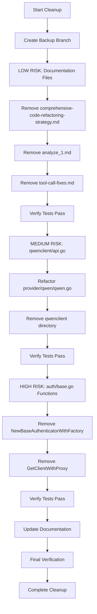

# Codebase Cleanup Plan

**Project**: qwencoder-proxy  
**Date**: 2026-02-09  
**Status**: Ready for Implementation  
**Purpose**: Remove unused code and verbose files from the codebase after successful refactoring

---

## Executive Summary

This cleanup plan addresses the removal of unused functions and verbose files identified in the post-refactoring analysis. The cleanup is organized by risk level to ensure safe removal without breaking existing functionality.

**Key Metrics:**
- **Unused Functions**: 5 functions (~50 lines)
- **Verbose/Unused Files**: 5 files (~1,200 lines)
- **Total Lines to Remove**: ~1,250 lines
- **Estimated Impact**: Minimal (code is unused or superseded)

---

## Risk Assessment Matrix

| Risk Level | Criteria | Actions |
|------------|----------|---------|
| **HIGH** | Functions/files that may have external dependencies or are part of public APIs | Requires thorough dependency analysis and testing |
| **MEDIUM** | Functions/files with internal usage but no external dependencies | Requires internal testing and verification |
| **LOW** | Documentation files, legacy files with no code references | Safe to remove with basic verification |

---

## Cleanup Actions by Risk Level

### HIGH RISK ACTIONS

#### Action 1: Remove `NewBaseAuthenticatorWithFactory()` from `auth/base.go`

**Location**: [`auth/base.go:42`](auth/base.go:42)  
**Lines**: 42-50 (9 lines)  
**Risk**: HIGH - Part of public API, potential for external usage

**Dependencies Analysis:**
- Search results show no internal usage in the codebase
- Function signature is part of public API (exported function)
- Potential external consumers may reference this function

**Step-by-Step Procedure:**
1. Create a backup branch: `git checkout -b backup-before-cleanup`
2. Search for any external documentation or examples that reference this function
3. Check if any third-party code or integrations depend on this function
4. Add deprecation notice to function documentation (if keeping for now)
5. Run full test suite to verify no tests depend on this function
6. Remove the function and its documentation
7. Run `go build ./...` to verify compilation
8. Run full test suite: `go test ./... -v`
9. Commit changes with descriptive message

**Rollback Procedure:**
```bash
# If issues arise after removal
git revert <commit-hash>
# Or restore from backup branch
git checkout backup-before-cleanup -- auth/base.go
```

**Testing Requirements:**
- [ ] All existing tests pass before removal
- [ ] No test failures after removal
- [ ] Build succeeds with `go build ./...`
- [ ] Integration tests pass
- [ ] Manual verification of authentication flows

**Complexity**: Medium  
**Estimated Time**: 2-3 hours (including dependency analysis)

---

#### Action 2: Remove `GetClientWithProxy()` from `auth/base.go`

**Location**: [`auth/base.go:105`](auth/base.go:105)  
**Lines**: 90-110 (21 lines including comments)  
**Risk**: HIGH - Part of public API, method on exported type

**Dependencies Analysis:**
- Search results show no internal usage in the codebase
- Method is on exported `BaseAuthenticator` type
- Potential external consumers may call this method

**Step-by-Step Procedure:**
1. Verify no internal usage via code search
2. Check for any external documentation or examples
3. Review if any third-party integrations depend on this method
4. Add deprecation notice if keeping for now
5. Run full test suite before removal
6. Remove the method and its documentation
7. Remove `clientFactory` field from `BaseAuthenticator` struct if no longer needed
8. Run `go build ./...` to verify compilation
9. Run full test suite: `go test ./... -v`
10. Commit changes

**Rollback Procedure:**
```bash
# If issues arise after removal
git revert <commit-hash>
# Or restore from backup branch
git checkout backup-before-cleanup -- auth/base.go
```

**Testing Requirements:**
- [ ] All existing tests pass before removal
- [ ] No test failures after removal
- [ ] Build succeeds with `go build ./...`
- [ ] Verify proxy-related functionality still works
- [ ] Manual testing of proxy configurations

**Complexity**: Medium  
**Estimated Time**: 2-3 hours (including dependency analysis)

---

### MEDIUM RISK ACTIONS

#### Action 3: Remove `qwenclient/api.go` file

**Location**: [`qwenclient/api.go`](qwenclient/api.go)  
**Lines**: 59 lines  
**Risk**: MEDIUM - Used by provider/qwen/qwen.go for backward compatibility

**Dependencies Analysis:**
- Referenced in [`provider/qwen/qwen.go:80`](provider/qwen/qwen.go:80)
- Referenced in [`provider/qwen/qwen.go:90`](provider/qwen/qwen.go:90)
- Referenced in [`provider/qwen/qwen.go:388`](provider/qwen/qwen.go:388)
- Referenced in [`provider/qwen/qwen.go:409`](provider/qwen/qwen.go:409)
- Referenced in [`provider/qwen/qwen.go:496`](provider/qwen/qwen.go:496)
- Referenced in [`provider/qwen/qwen.go:512`](provider/qwen/qwen.go:512)
- Referenced in [`provider/qwen/qwen_test.go:237`](provider/qwen/qwen_test.go:237)

**Impact**: This file is actively used for backward compatibility. Removal requires refactoring provider/qwen/qwen.go to use the new TokenManager approach.

**Step-by-Step Procedure:**
1. Create a backup branch
2. Analyze all usages in provider/qwen/qwen.go
3. Refactor provider/qwen/qwen.go to eliminate qwenclient dependency:
   - Replace `qwenclient.GetValidTokenAndEndpoint()` calls with TokenManager methods
   - Update error handling to use new authentication flow
   - Ensure all fallback paths are properly handled
4. Update provider/qwen/qwen_test.go to remove references
5. Run `go build ./...` to verify compilation
6. Run `go test ./provider/qwen/... -v`
7. Run full test suite: `go test ./... -v`
8. Remove qwenclient directory: `rm -rf qwenclient/`
9. Commit changes

**Rollback Procedure:**
```bash
# If issues arise after removal
git revert <commit-hash>
# Or restore from backup branch
git checkout backup-before-cleanup -- qwenclient/
git checkout backup-before-cleanup -- provider/qwen/qwen.go
git checkout backup-before-cleanup -- provider/qwen/qwen_test.go
```

**Testing Requirements:**
- [ ] All existing tests pass before removal
- [ ] Qwen provider tests pass after refactoring
- [ ] Full test suite passes
- [ ] Manual testing of Qwen authentication flow
- [ ] Verify token refresh functionality works

**Complexity**: High  
**Estimated Time**: 4-6 hours (including refactoring)

---

#### Action 4: Remove unused converter methods

**Location**: Multiple converter files  
**Lines**: ~50 lines total  
**Risk**: MEDIUM - Methods are part of Converter interface

**Dependencies Analysis:**
- `ToOpenAIRequest()` in [`converter/qwen.go:17`](converter/qwen/qwen.go:17) - No-op, part of interface
- `ToOpenAIRequest()` in [`converter/gemini.go:22`](converter/gemini/gemini.go:22) - No-op, part of interface
- `ToOpenAIRequest()` in [`converter/claude.go:20`](converter/claude/claude.go:20) - No-op, part of interface
- `FromOpenAIResponse()` in [`converter/qwen.go:126`](converter/qwen/qwen.go:126) - No-op, part of interface
- `FromOpenAIResponse()` in [`converter/gemini.go:272`](converter/gemini/gemini.go:272) - No-op, part of interface
- `FromOpenAIResponse()` in [`converter/claude.go:297`](converter/claude/claude.go:297) - No-op, part of interface
- `FromOpenAIResponse()` in [`converter/openai.go:41`](converter/openai/openai.go:41) - No-op, part of interface

**Note**: These methods are required by the [`Converter`](converter/converter.go:9) interface. Removing them would break the interface contract. Options:
1. Keep the methods as no-ops (current state)
2. Remove from interface and implementations if truly not needed
3. Implement proper conversion logic if needed in the future

**Recommendation**: Keep these methods as they are part of the interface contract. They provide a clear API for future extensibility.

**Action**: Document these as "placeholder implementations for future extensibility" rather than removing them.

**Complexity**: N/A (not removing)  
**Estimated Time**: 30 minutes (documentation update)

---

### LOW RISK ACTIONS

#### Action 5: Remove `converter/openai.go` file

**Location**: [`converter/openai.go`](converter/openai.go)  
**Lines**: 49 lines  
**Risk**: LOW - Used by factory, but all methods are no-ops

**Dependencies Analysis:**
- Registered in [`converter/converter.go:34`](converter/converter.go:34)
- OpenAIConverter is part of the factory's default converters
- All methods are no-ops (return input unchanged)

**Impact**: The OpenAIConverter is registered in the factory but provides no actual conversion. It serves as a pass-through for OpenAI format requests.

**Recommendation**: Keep this file. The OpenAIConverter serves a valid purpose as a pass-through converter for OpenAI protocol, which is a legitimate use case. Removing it would require special handling in the factory for OpenAI protocol.

**Action**: Document the purpose of OpenAIConverter as a pass-through converter.

**Complexity**: N/A (not removing)  
**Estimated Time**: 30 minutes (documentation update)

---

#### Action 6: Remove `plans/comprehensive-code-refactoring-strategy.md`

**Location**: [`plans/comprehensive-code-refactoring-strategy.md`](plans/comprehensive-code-refactoring-strategy.md)  
**Lines**: 1,146 lines  
**Risk**: LOW - Superseded by final report

**Dependencies Analysis:**
- No code dependencies
- Documentation file only
- Superseded by [`plans/refactoring-final-report.md`](plans/refactoring-final-report.md)

**Step-by-Step Procedure:**
1. Verify the final report contains all necessary information
2. Archive the file to a separate location if needed for reference
3. Remove the file: `rm plans/comprehensive-code-refactoring-strategy.md`
4. Commit changes

**Rollback Procedure:**
```bash
# Restore from git history
git checkout HEAD~1 -- plans/comprehensive-code-refactoring-strategy.md
```

**Testing Requirements:**
- [ ] Verify final report is complete
- [ ] No broken links to this file in other documentation

**Complexity**: Low  
**Estimated Time**: 15 minutes

---

#### Action 7: Remove `analyze_1.md`

**Location**: [`analyze_1.md`](analyze_1.md)  
**Lines**: 992 lines  
**Risk**: LOW - Legacy analysis document

**Dependencies Analysis:**
- No code dependencies
- Documentation file only
- Legacy analysis, superseded by refactoring reports

**Step-by-Step Procedure:**
1. Verify no references in other documentation
2. Archive the file if needed for reference
3. Remove the file: `rm analyze_1.md`
4. Commit changes

**Rollback Procedure:**
```bash
# Restore from git history
git checkout HEAD~1 -- analyze_1.md
```

**Testing Requirements:**
- [ ] Verify no broken links to this file
- [ ] Check for any markdown references

**Complexity**: Low  
**Estimated Time**: 10 minutes

---

#### Action 8: Remove `tool-call-fixes.md`

**Location**: [`tool-call-fixes.md`](tool-call-fixes.md)  
**Lines**: 335 lines  
**Risk**: LOW - Temporary fix documentation

**Dependencies Analysis:**
- No code dependencies
- Documentation file only
- Temporary fix documentation, fixes have been implemented

**Step-by-Step Procedure:**
1. Verify fixes are properly implemented in code
2. Archive the file if needed for reference
3. Remove the file: `rm tool-call-fixes.md`
4. Commit changes

**Rollback Procedure:**
```bash
# Restore from git history
git checkout HEAD~1 -- tool-call-fixes.md
```

**Testing Requirements:**
- [ ] Verify tool call functionality works correctly
- [ ] Check for any broken links

**Complexity**: Low  
**Estimated Time**: 10 minutes

---

## Implementation Order

The cleanup should be executed in the following order to minimize risk and allow for incremental rollback:



---

## Pre-Cleanup Checklist

Before starting the cleanup process, complete the following:

- [ ] Create a backup branch: `git checkout -b backup-before-cleanup`
- [ ] Run full test suite and record results: `go test ./... -v > pre-cleanup-test-results.txt`
- [ ] Document current build status: `go build ./... > pre-cleanup-build-status.txt`
- [ ] Create a list of all external integrations and APIs
- [ ] Review all public API documentation
- [ ] Notify stakeholders of upcoming cleanup

---

## Testing Checklist

### Unit Tests
- [ ] All existing unit tests pass: `go test ./... -v`
- [ ] No new test failures introduced
- [ ] Test coverage maintained

### Integration Tests
- [ ] Provider integration tests pass
- [ ] Authentication flows work correctly
- [ ] Proxy functionality works correctly
- [ ] Tool call functionality works correctly

### Manual Testing
- [ ] Start the proxy server
- [ ] Test OpenAI format requests
- [ ] Test Qwen provider authentication
- [ ] Test Gemini provider requests
- [ ] Test Claude/Kiro provider requests
- [ ] Test streaming responses
- [ ] Test tool calls
- [ ] Test error handling

### Build Verification
- [ ] `go build ./...` succeeds
- [ ] No compilation warnings
- [ ] No unused import errors
- [ ] No missing package errors

---

## Rollback Procedures

### Partial Rollback

If a specific action causes issues:

```bash
# Identify the problematic commit
git log --oneline

# Revert the specific commit
git revert <commit-hash>

# Or restore specific files from backup branch
git checkout backup-before-cleanup -- <file-path>
```

### Full Rollback

If multiple actions cause issues:

```bash
# Switch back to backup branch
git checkout backup-before-cleanup

# Or reset to the commit before cleanup started
git reset --hard <commit-hash-before-cleanup>
```

### Rollback Verification

After any rollback:

1. Run full test suite: `go test ./... -v`
2. Verify build: `go build ./...`
3. Compare test results with pre-cleanup results
4. Verify all functionality works as expected

---

## Post-Cleanup Tasks

After completing the cleanup:

1. **Update Documentation**
   - [ ] Update README.md to reflect removed code
   - [ ] Update API documentation
   - [ ] Update migration guides if needed

2. **Create Cleanup Summary**
   - [ ] Document all changes made
   - [ ] Record lines of code removed
   - [ ] Note any issues encountered

3. **Verify External Dependencies**
   - [ ] Check for any external code that may depend on removed functions
   - [ ] Update any integration documentation
   - [ ] Notify external consumers of API changes

4. **Final Verification**
   - [ ] Run full test suite one final time
   - [ ] Perform smoke testing of all providers
   - [ ] Verify no broken links in documentation

---

## Risk Mitigation Strategies

### 1. Gradual Removal
- Remove one item at a time
- Test thoroughly after each removal
- Commit changes incrementally

### 2. Deprecation Period
- Consider adding deprecation notices before removal
- Allow time for external consumers to update
- Document deprecation timeline

### 3. Comprehensive Testing
- Run full test suite after each change
- Perform manual testing of critical paths
- Use integration tests to verify end-to-end functionality

### 4. Backup Strategy
- Create backup branch before starting
- Keep detailed commit messages
- Maintain rollback procedures

---

## Summary of Actions

| # | Action | Risk | Lines | Complexity | Time |
|---|--------|------|-------|------------|------|
| 1 | Remove `NewBaseAuthenticatorWithFactory()` | HIGH | 9 | Medium | 2-3h |
| 2 | Remove `GetClientWithProxy()` | HIGH | 21 | Medium | 2-3h |
| 3 | Remove `qwenclient/api.go` | MEDIUM | 59 | High | 4-6h |
| 4 | Document converter methods | MEDIUM | 0 | Low | 30m |
| 5 | Document OpenAIConverter purpose | LOW | 0 | Low | 30m |
| 6 | Remove `comprehensive-code-refactoring-strategy.md` | LOW | 1,146 | Low | 15m |
| 7 | Remove `analyze_1.md` | LOW | 992 | Low | 10m |
| 8 | Remove `tool-call-fixes.md` | LOW | 335 | Low | 10m |

**Total Lines to Remove**: ~2,562  
**Total Estimated Time**: ~10-14 hours

---

## Notes

1. **Converter Methods**: The `ToOpenAIRequest()` and `FromOpenAIResponse()` methods in the converters are part of the [`Converter`](converter/converter.go:9) interface. While their current implementations are no-ops, they serve as placeholders for future functionality and should be kept to maintain the interface contract.

2. **OpenAIConverter**: The [`OpenAIConverter`](converter/openai.go:9) serves a legitimate purpose as a pass-through converter for OpenAI protocol. It should be kept and its purpose documented.

3. **qwenclient/api.go**: This file requires significant refactoring of [`provider/qwen/qwen.go`](provider/qwen/qwen.go) before removal. Consider this as a separate refactoring task if the current cleanup timeline is tight.

4. **Public API Functions**: [`NewBaseAuthenticatorWithFactory()`](auth/base.go:42) and [`GetClientWithProxy()`](auth/base.go:105) are part of the public API. Consider a deprecation period before removal if there may be external consumers.

---

## Appendix: File References

### Files to Remove
- [`plans/comprehensive-code-refactoring-strategy.md`](plans/comprehensive-code-refactoring-strategy.md) - Superseded documentation
- [`analyze_1.md`](analyze_1.md) - Legacy analysis
- [`tool-call-fixes.md`](tool-call-fixes.md) - Temporary fix documentation

### Files to Refactor
- [`qwenclient/api.go`](qwenclient/api.go) - Requires provider/qwen/qwen.go refactoring
- [`provider/qwen/qwen.go`](provider/qwen/qwen.go) - Remove qwenclient dependencies

### Functions to Remove
- [`NewBaseAuthenticatorWithFactory()`](auth/base.go:42) - Unused constructor
- [`GetClientWithProxy()`](auth/base.go:105) - Unused method

### Files to Document
- [`converter/openai.go`](converter/openai.go) - Document pass-through purpose
- [`converter/qwen.go`](converter/qwen.go) - Document placeholder methods
- [`converter/gemini.go`](converter/gemini.go) - Document placeholder methods
- [`converter/claude.go`](converter/claude.go) - Document placeholder methods
