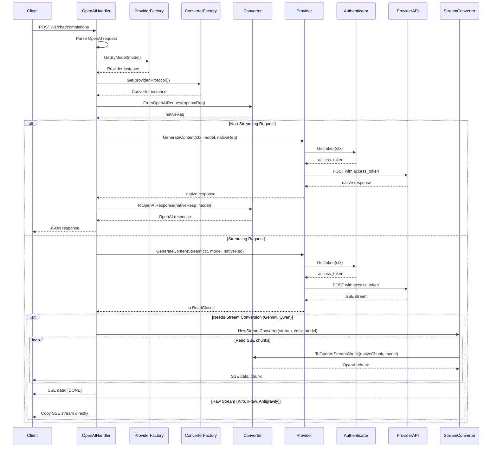
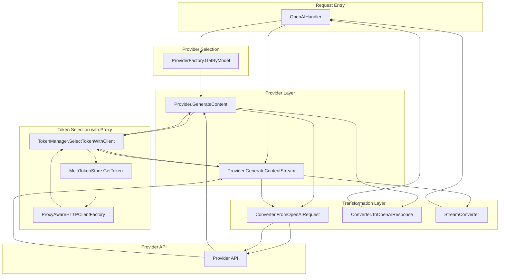
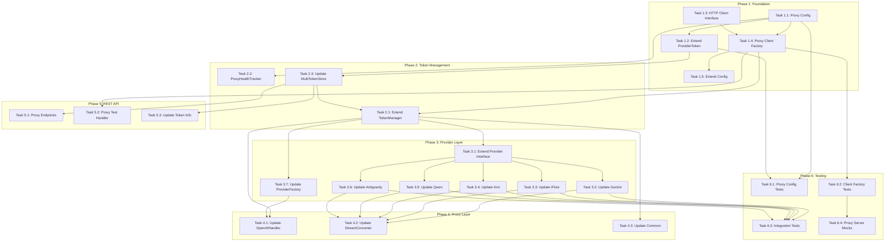

# Comprehensive Architectural Synthesis: Proxy-Per-Token Integration with Unified Request Handling

**Project**: qwencoder-proxy
**Document Date**: 2026-01-26
**Purpose**: Implementation strategy integrating per-OAuth/device token proxy design with unified request handling layer

---

## Executive Summary

This document synthesizes the proxy-per-token architecture ([`proxy-per-token-architecture.md`](proxy-per-token-architecture.md)) with the existing request transformation flow through the proxy layer. The analysis reveals that current providers use static HTTP clients for all requests, which must be refactored to support per-token proxy configuration while maintaining the existing transformation pipeline.

**Key Findings**:
- All providers currently use a single static `*http.Client` field
- Token retrieval is decoupled from HTTP client creation
- Streaming and non-streaming requests follow similar transformation paths
- Converter layer is protocol-agnostic and requires minimal changes
- Provider factory handles model-to-provider routing independently of authentication

---

## 1. Current Request Flow Analysis

### 1.1 Complete Request Flow Trace

The following diagram illustrates the complete flow of a chat request from [`OpenAIHandler.ServeHTTP()`](proxy/openai_handler.go:43) through to provider response:



### 1.2 Transformation Points

| Step | Location | Transformation | Input Format | Output Format |
|-------|-----------|---------------|---------------|----------------|
| 1 | [`openai_handler.go:165`](proxy/openai_handler.go:165) | Request conversion | OpenAI | Provider Native |
| 2 | Provider `GenerateContent()` | HTTP request with auth | Native + Token | Provider API Response |
| 3 | [`openai_handler.go:191`](proxy/openai_handler.go:191) | Response conversion | Provider Native | OpenAI |
| 4 | [`stream_converter.go:113`](proxy/stream_converter.go:113) | Stream chunk conversion | Provider Native SSE | OpenAI SSE |

### 1.3 Streaming vs Non-Streaming Handling

**Non-Streaming Flow**:
1. [`GenerateAndConvert()`](proxy/common.go:15) calls provider [`GenerateContent()`](provider/provider.go:46)
2. Provider uses static `httpClient` field for HTTP request
3. Response returned and converted via [`Converter.ToOpenAIResponse()`](converter/converter.go:12)
4. JSON response sent to client

**Streaming Flow**:
1. Handler checks [`needsStreamConversion()`](proxy/openai_handler.go:218) based on provider protocol
2. **If conversion needed** (Gemini, Qwen):
   - Calls [`ConvertedStreamResponse()`](proxy/stream_converter.go:149)
   - [`StreamConverter`](proxy/stream_converter.go:17) wraps provider stream
   - Each SSE chunk converted via [`ToOpenAIStreamChunk()`](converter/converter.go:13)
3. **If no conversion needed** (Kiro, iFlow, Antigravity):
   - Calls [`StreamResponse()`](proxy/common.go:60)
   - Raw SSE stream copied directly to client
4. `[DONE]` message sent at stream end

### 1.4 Model Selection and Provider Routing

Provider routing occurs in [`ProviderFactory.GetByModel()`](provider/factory.go):
- Model name determines provider type
- Provider factory maintains model-to-provider mapping
- Authentication is provider-specific, not model-specific
- Each provider has its own authenticator implementation

---

## 2. Provider-Specific Transformation Analysis

### 2.1 Gemini Provider

**File**: [`provider/gemini/gemini.go`](provider/gemini/gemini.go)

**Request Transformation**:
- Uses Cloud Code Assist API format with wrapper structure
- Wraps native request in `{model, project, request}` structure
- Project ID discovered via [`initializeProject()`](provider/gemini/gemini.go:152)
- Headers: `Authorization: Bearer {token}`, `Content-Type: application/json`

**Response Transformation**:
- Response wrapped in `{"response": {...}}` field
- Extracts actual Gemini response from wrapper
- Converter transforms to OpenAI format

**HTTP Client Usage**:
- Static client at line 39: `httpClient *http.Client`
- Timeout: 5 minutes
- Used for both streaming and non-streaming
- Token refresh on 401 with retry logic

**Integration Points for Proxy**:
- Line 204, 390: `p.httpClient.Do(req)` - needs proxy-aware client
- Line 545: `p.httpClient.Do(req)` for streaming - needs proxy-aware client
- Token retrieval via [`authenticator.GetToken()`](provider/gemini/gemini.go:162) - unchanged

### 2.2 iFlow Provider

**File**: [`provider/iflow/iflow.go`](provider/iflow/iflow.go)

**Request Transformation**:
- Uses OpenAI-compatible format directly
- No transformation needed for request body
- Headers: `Authorization: Bearer {token}`, `User-Agent: iflow-cli/0.4.8`

**Response Transformation**:
- Returns OpenAI-compatible response directly
- No conversion needed (ProtocolOpenAI)

**HTTP Client Usage**:
- Static client at line 47: `httpClient *http.Client`
- Timeout: 5 minutes
- Used for both streaming and non-streaming
- Token refresh on 401 with retry logic

**Integration Points for Proxy**:
- Line 153: `p.httpClient.Do(req)` - needs proxy-aware client
- Line 228: `p.httpClient.Do(req)` for streaming - needs proxy-aware client
- Token retrieval via [`authenticator.GetToken()`](provider/iflow/iflow.go:123) - unchanged

### 2.3 Kiro Provider

**File**: [`provider/kiro/kiro.go`](provider/kiro/kiro.go)

**Request Transformation**:
- Uses Kiro-specific format with conversation state
- [`buildKiroRequest()`](provider/kiro/kiro.go:388) transforms Claude request
- Headers include AWS-specific: `x-amzn-kiro-agent-mode`, `x-amz-user-agent`

**Response Transformation**:
- Non-streaming: AWS Event Stream binary format parsed to Claude response
- Streaming: [`convertBedrockStreamToOpenAI()`](provider/kiro/kiro.go:289) converts binary to OpenAI SSE
- Custom parsing for AWS Event Stream protocol

**HTTP Client Usage**:
- Static client at line 58: `httpClient *http.Client`
- Timeout: 5 minutes
- Used for both streaming and non-streaming
- No token refresh (social auth)

**Integration Points for Proxy**:
- Line 206: `p.httpClient.Do(req)` - needs proxy-aware client
- Line 274: `p.httpClient.Do(req)` for streaming - needs proxy-aware client
- Token retrieval via [`authenticator.GetToken()`](provider/kiro/kiro.go:164) - unchanged

### 2.4 Qwen Provider

**File**: [`provider/qwen/qwen.go`](provider/qwen/qwen.go)

**Request Transformation**:
- Uses OpenAI-compatible format with custom headers
- Headers: `X-DashScope-AuthType: qwen-oauth`, `X-DashScope-UserAgent`
- Endpoint from credentials includes `/v1` path

**Response Transformation**:
- Returns OpenAI-compatible response directly
- Converter minimal (ProtocolQwen)

**HTTP Client Usage**:
- Static client at line 36: `httpClient *http.Client`
- Timeout: 5 minutes
- Used for both streaming and non-streaming
- Token retrieval via [`qwenclient.GetValidTokenAndEndpoint()`](provider/qwen/qwen.go:200)

**Integration Points for Proxy**:
- Line 246: `p.httpClient.Do(req)` - needs proxy-aware client
- Line 312: `p.httpClient.Do(req)` for streaming - needs proxy-aware client
- Token uses `qwenclient` package - needs proxy integration

### 2.5 Antigravity Provider

**File**: [`provider/antigravity/antigravity.go`](provider/antigravity/antigravity.go)

**Request Transformation**:
- Uses Antigravity-specific format with project/session IDs
- [`geminiToAntigravity()`](provider/antigravity/antigravity.go:593) transforms request
- Headers: `User-Agent: antigravity/1.11.5`
- Model alias mapping for internal names

**Response Transformation**:
- Returns Gemini-compatible response
- Converter uses GeminiConverter
- Response wrapped in `{"response": {...}}` field

**HTTP Client Usage**:
- Static client at line 65: `httpClient *http.Client`
- Timeout: 5 minutes
- Used for both streaming and non-streaming
- [`doRequestWithRetry()`](provider/antigravity/antigravity.go:173) handles 401 retry

**Integration Points for Proxy**:
- Line 740: `p.httpClient.Do(req)` via `doRequestWithRetry()` - needs proxy-aware client
- Line 833: `p.httpClient.Do(req)` for streaming - needs proxy-aware client
- Token retrieval via [`authenticator.GetToken()`](provider/antigravity/antigravity.go:175) - unchanged

---

## 3. Unified Request Handling Layer Design

### 3.1 Architecture Overview

The unified request handling layer integrates proxy-per-token HTTP clients with the existing transformation pipeline:



### 3.2 Component Interaction Design

**Token Selection with Client**:
```
TokenManager.SelectTokenWithClient(providerType) -> (token, client, error)
  ├─ SelectionStrategy.SelectToken() -> ProviderToken
  ├─ MultiTokenStore.GetToken(tokenID) -> ProviderToken with ProxyConfig
  ├─ ProxyAwareHTTPClientFactory.GetClient(proxyConfig) -> *http.Client
  └─ Return (token, client)
```

**Provider Request Flow**:
```
Provider.GenerateContent(ctx, model, request)
  ├─ Get token and client from TokenManager
  ├─ Create HTTP request with context
  ├─ client.Do(req) -> response (through proxy if configured)
  ├─ Parse response
  └─ Return native response
```

**Proxy Configuration Propagation**:
```
ProviderToken
  ├─ access_token (used for Authorization header)
  ├─ ProxyConfig (used for HTTP client)
  │   ├─ Type: http/https/socks5/none
  │   ├─ Host, Port
  │   ├─ Username, Password (optional)
  │   └─ Enabled: bool
  └─ ProxyHealthScore: float64
```

### 3.3 Error Handling Strategy

**Proxy Connection Failures**:

| Error Type | Detection Point | Handling Strategy |
|------------|-----------------|------------------|
| Connection refused | `client.Do()` | Update proxy health, mark token unhealthy, return error |
| Timeout | `client.Do()` | Update proxy health, retry with alternative token if available |
| Authentication failed | Proxy handshake | Mark proxy unhealthy, disable proxy for token |
| DNS resolution failed | Proxy URL resolution | Mark proxy unhealthy, disable proxy for token |

**Error Propagation**:
```
Provider.GenerateContent()
  ├─ TokenManager.SelectTokenWithClient() error
  │   └─ Return "token selection failed"
  ├─ client.Do() proxy error
  │   ├─ Update ProxyHealthStatus
  │   ├─ Mark token unhealthy if consecutive failures > threshold
  │   └─ Return "proxy connection failed"
  ├─ API error (4xx, 5xx)
  │   └─ Return API error with status code
  └─ Return success response
```

### 3.4 Streaming Proxy Configuration

**Streaming Client Considerations**:
- Streaming requests use separate HTTP client to avoid timeout conflicts
- Proxy configuration applied to streaming client
- Connection pooling disabled for streaming (no reuse)
- Long-lived connection maintained through proxy

**Streaming Error Handling**:
```
Provider.GenerateContentStream()
  ├─ Get token and client (streaming variant)
  ├─ Create request with Accept: text/event-stream
  ├─ client.Do(req) -> response stream
  ├─ If proxy error during stream:
  │   ├─ Close stream
  │   ├─ Update proxy health
  │   └─ Return error
  └─ Return io.ReadCloser
```

---

## 4. Integration Architecture

### 4.1 TokenManager Integration

**Extended TokenManager Interface**:
```
TokenManager
  ├─ Existing: SelectToken() -> (token, error)
  ├─ New: SelectTokenWithClient() -> (token, *http.Client, error)
  ├─ New: GetTokenClient(tokenID) -> (*http.Client, error)
  ├─ New: UpdateProxyHealth(tokenID, healthy, error)
  └─ Fields:
      ├─ clientFactory: *ProxyAwareHTTPClientFactory
      └─ proxyHealthTracker: *ProxyHealthTracker
```

**SelectTokenWithClient() Flow**:
```
1. Call existing SelectionStrategy.SelectToken()
2. Get ProviderToken from MultiTokenStore
3. Extract ProxyConfig from token
4. Call ProxyAwareHTTPClientFactory.GetClient(proxyConfig)
5. Update proxy health metrics
6. Return (token, client)
```

### 4.2 Provider Interface Extension

**Extended Provider Interface**:
```
Provider (Extended)
  ├─ Existing methods...
  └─ New Optional: SetTokenManager(manager *TokenManager)
```

**Provider Implementation Pattern**:
```go
type Provider struct {
    authenticator  Authenticator
    tokenManager  *TokenManager  // New field
    httpClient    *http.Client  // Removed - use per-request client
    logger        *Logger
}

func (p *Provider) GenerateContent(ctx, model, request) (interface{}, error) {
    // Select token with proxy-aware client
    token, client, err := p.tokenManager.SelectTokenWithClient(p.Name())
    if err != nil {
        return nil, err
    }

    // Use client for request
    req, _ := http.NewRequestWithContext(ctx, "POST", url, body)
    req.Header.Set("Authorization", "Bearer " + token)
    resp, err := client.Do(req)
    // ... process response
}
```

### 4.3 ProxyAwareHTTPClientFactory Integration

**Factory Usage in Request Flow**:
```
ProxyAwareHTTPClientFactory
  ├─ GetClient(proxyConfig) -> *http.Client
  │   ├─ Check cache for existing client
  │   ├─ If not cached: CreateClientWithProxy()
  │   └─ Return cached or new client
  ├─ CreateClientWithProxy(proxyConfig)
  │   ├─ Create http.Transport with proxy URL
  │   ├─ Configure timeouts
  │   └─ Return &http.Client{Transport: transport}
  └─ Fields:
      ├─ proxyCache: map[ProxyConfigKey]*http.Client
      ├─ cacheLock: sync.RWMutex
      └─ logger: *Logger
```

**Client Caching Strategy**:
```
ProxyConfigKey
  ├─ Type: ProxyType
  ├─ Host: string
  ├─ Port: int
  └─ HasAuth: bool

Cache Behavior:
  ├─ Tokens with same proxy config share HTTP client
  ├─ Credentials excluded from cache key (security)
  ├─ LRU eviction when cache full (default: 50)
  └─ Cache cleared on proxy config change
```

### 4.4 Converter Layer Integration

**Converter Changes Required**:
- **Minimal**: Converter layer is protocol-agnostic
- **No changes needed**: Converter operates on transformed request/response
- **Proxy transparency**: Converter unaware of proxy configuration

**Converter Flow with Proxy**:
```
OpenAI Request
  ├─ Converter.FromOpenAIRequest() -> Native Request
  ├─ Provider uses proxy-aware client for API call
  ├─ Provider API Response
  └─ Converter.ToOpenAIResponse() -> OpenAI Response
```

### 4.5 Streaming Response Proxy Configuration

**StreamConverter Integration**:
```
StreamConverter
  ├─ stream: io.ReadCloser (from provider)
  ├─ converter: Converter
  ├─ model: string
  └─ logger: *Logger

No changes needed:
  ├─ StreamConverter reads from provider stream
  ├─ Provider stream uses proxy-aware client
  ├─ Conversion happens on already-retrieved data
  └─ Proxy configuration transparent to converter
```

**Kiro Bedrock Stream Conversion**:
```
Kiro.convertBedrockStreamToOpenAI()
  ├─ Receives io.ReadCloser from provider
  ├─ Provider stream already uses proxy-aware client
  ├─ Parses AWS Event Stream binary format
  ├─ Converts to OpenAI SSE format
  └─ Returns converted io.ReadCloser
```

---

## 5. Granular Task Decomposition

### 5.1 Foundation Layer Tasks

#### Task 1.1: Create Proxy Configuration Structures
**File**: `auth/proxy_config.go` (new)
**Changes**: Create new file
**Specific Changes**:
- Define `ProxyType` enum (none, http, https, socks5)
- Define `ProxyConfig` struct with Type, Host, Port, Username, Password, Enabled
- Define `ProxyHealth` struct with LastCheck, IsHealthy, LastError, ConsecutiveFailures, AverageLatencyMs
- Define `ProxyConfigKey` struct for cache key
- Implement `String()` method for ProxyConfigKey
- Implement validation methods for ProxyConfig
**Dependencies**: None
**Testing Requirements**:
- Test proxy config validation
- Test proxy config key generation
- Test proxy health tracking
**Risk Level**: Low

#### Task 1.2: Extend ProviderToken with Proxy Fields
**File**: `auth/multi_token_store.go`
**Changes**: Modify existing `ProviderToken` struct
**Specific Changes**:
- Add `Proxy *ProxyConfig` field with `json:"proxy,omitempty"`
- Add `ProxyHealthScore float64` field with `json:"proxy_health_score,omitempty"`
- Update JSON marshaling/unmarshaling to handle missing proxy fields
- Ensure backward compatibility with existing token files
**Dependencies**: Task 1.1
**Testing Requirements**:
- Test loading existing tokens without proxy config
- Test saving tokens with proxy config
- Test backward compatibility
**Risk Level**: Medium

#### Task 1.3: Create HTTP Client Interface
**File**: `config/http_client.go` (new)
**Changes**: Create new file
**Specific Changes**:
- Define `HTTPClient` interface with `Do(req *http.Request) (*http.Response, error)`
- Define `HTTPClientConfig` struct with timeout settings
- Ensure `*http.Client` implements HTTPClient interface
**Dependencies**: None
**Testing Requirements**:
- Test interface implementation
- Test mock client creation
**Risk Level**: Low

#### Task 1.4: Create ProxyAwareHTTPClientFactory
**File**: `config/proxy_client_factory.go` (new)
**Changes**: Create new file
**Specific Changes**:
- Define `ProxyAwareHTTPClientFactory` struct
- Implement `GetClient(proxyConfig *ProxyConfig) *http.Client` method
- Implement `CreateClientWithProxy(proxyConfig *ProxyConfig) *http.Client` method
- Implement `ClearCache()` method
- Implement client caching with `proxyCache` map
- Implement LRU cache eviction
- Create http.Transport with proxy URL based on ProxyConfig
- Handle SOCKS5 proxy using `golang.org/x/net/proxy`
- Handle HTTP/HTTPS proxy using `http.ProxyURL`
- Add logging for client creation and caching
**Dependencies**: Task 1.1, Task 1.3
**Testing Requirements**:
- Test client creation with different proxy types
- Test client caching behavior
- Test cache invalidation
- Test SOCKS5 proxy configuration
- Test HTTP/HTTPS proxy configuration
- Test no-proxy (direct connection) configuration
**Risk Level**: Medium

#### Task 1.5: Extend Config with Proxy Client Factory
**File**: `config/config.go`
**Changes**: Modify existing `Config` struct
**Specific Changes**:
- Add `ProxyClientFactory *ProxyAwareHTTPClientFactory` field
- Add `ProxyCacheMaxSize int` field with default value 50
- Update config initialization to create ProxyAwareHTTPClientFactory
**Dependencies**: Task 1.4
**Testing Requirements**:
- Test config loading with proxy factory
- Test default cache size
**Risk Level**: Low

### 5.2 Token Management Layer Tasks

#### Task 2.1: Extend TokenManager with Client Selection
**File**: `auth/token_selection.go`
**Changes**: Modify existing `TokenManager` struct
**Specific Changes**:
- Add `clientFactory *ProxyAwareHTTPClientFactory` field
- Add `proxyHealthTracker *ProxyHealthTracker` field
- Implement `SelectTokenWithClient() (*ProviderToken, *http.Client, error)` method
- Implement `GetTokenClient(tokenID string) (*http.Client, error)` method
- Implement `UpdateProxyHealth(tokenID string, healthy bool, err error)` method
- Update `NewTokenManager()` to accept clientFactory parameter
- Integrate proxy health tracking into token selection
**Dependencies**: Task 1.4, Task 1.5
**Testing Requirements**:
- Test token selection with proxy client
- Test token selection without proxy
- Test proxy health updates
- Test client caching integration
**Risk Level**: Medium

#### Task 2.2: Implement ProxyHealthTracker
**File**: `auth/proxy_health_tracker.go` (new)
**Changes**: Create new file
**Specific Changes**:
- Define `ProxyHealthTracker` struct
- Implement `UpdateHealth(tokenID string, healthy bool, err error)` method
- Implement `GetHealthScore(tokenID string) float64` method
- Implement `GetHealthStatus(tokenID string) *ProxyHealth` method
- Implement health score calculation logic
- Implement consecutive failure tracking
- Implement latency tracking
- Add periodic health check scheduling (optional)
**Dependencies**: Task 1.1
**Testing Requirements**:
- Test health score calculation
- Test consecutive failure tracking
- Test latency tracking
- Test health status retrieval
**Risk Level**: Low

#### Task 2.3: Update MultiTokenStore for Proxy CRUD
**File**: `auth/multi_token_store.go`
**Changes**: Modify existing `MultiTokenStore` methods
**Specific Changes**:
- Update `UpdateToken()` to handle proxy config changes
- Implement `UpdateProxyConfig(tokenID string, proxy *ProxyConfig)` method
- Implement `GetProxyConfig(tokenID string) (*ProxyConfig, error)` method
- Implement `DeleteProxyConfig(tokenID string)` method
- Add validation for proxy config updates
- Ensure proxy config changes trigger cache invalidation
**Dependencies**: Task 1.2
**Testing Requirements**:
- Test proxy config CRUD operations
- Test proxy config validation
- Test cache invalidation on proxy config change
**Risk Level**: Medium

### 5.3 Provider Layer Tasks

#### Task 3.1: Extend Provider Interface
**File**: `provider/provider.go`
**Changes**: Modify existing `Provider` interface
**Specific Changes**:
- Add optional `SetTokenManager(manager *TokenManager)` method
- Add documentation for new method
- Ensure backward compatibility (optional method)
**Dependencies**: Task 2.1
**Testing Requirements**:
- Test interface implementation
- Test optional method behavior
**Risk Level**: Low

#### Task 3.2: Update Gemini Provider for Proxy Support
**File**: `provider/gemini/gemini.go`
**Changes**: Modify existing `Provider` struct and methods
**Specific Changes**:
- Add `tokenManager *TokenManager` field
- Remove `httpClient *http.Client` field (or mark as deprecated)
- Add `SetTokenManager(manager *TokenManager)` method
- Update `GenerateContent()` to use `tokenManager.SelectTokenWithClient()`
- Update `GenerateContentStream()` to use `tokenManager.SelectTokenWithClient()`
- Update `initializeProject()` to use proxy-aware client
- Update all `p.httpClient.Do(req)` calls to use client from token manager
- Add error handling for proxy failures
- Update proxy health on success/failure
**Dependencies**: Task 2.1, Task 3.1
**Testing Requirements**:
- Test non-streaming requests with proxy
- Test streaming requests with proxy
- Test proxy failure handling
- Test proxy health updates
- Test backward compatibility with existing tokens
**Risk Level**: High

#### Task 3.3: Update iFlow Provider for Proxy Support
**File**: `provider/iflow/iflow.go`
**Changes**: Modify existing `Provider` struct and methods
**Specific Changes**:
- Add `tokenManager *TokenManager` field
- Remove `httpClient *http.Client` field (or mark as deprecated)
- Add `SetTokenManager(manager *TokenManager)` method
- Update `GenerateContent()` to use `tokenManager.SelectTokenWithClient()`
- Update `GenerateContentStream()` to use `tokenManager.SelectTokenWithClient()`
- Update all `p.httpClient.Do(req)` calls to use client from token manager
- Add error handling for proxy failures
- Update proxy health on success/failure
**Dependencies**: Task 2.1, Task 3.1
**Testing Requirements**:
- Test non-streaming requests with proxy
- Test streaming requests with proxy
- Test proxy failure handling
- Test proxy health updates
**Risk Level**: High

#### Task 3.4: Update Kiro Provider for Proxy Support
**File**: `provider/kiro/kiro.go`
**Changes**: Modify existing `Provider` struct and methods
**Specific Changes**:
- Add `tokenManager *TokenManager` field
- Remove `httpClient *http.Client` field (or mark as deprecated)
- Add `SetTokenManager(manager *TokenManager)` method
- Update `GenerateContent()` to use `tokenManager.SelectTokenWithClient()`
- Update `GenerateContentStream()` to use `tokenManager.SelectTokenWithClient()`
- Update all `p.httpClient.Do(req)` calls to use client from token manager
- Update `convertBedrockStreamToOpenAI()` to handle proxy errors
- Add error handling for proxy failures
- Update proxy health on success/failure
**Dependencies**: Task 2.1, Task 3.1
**Testing Requirements**:
- Test non-streaming requests with proxy
- Test streaming requests with proxy
- Test Bedrock stream conversion with proxy
- Test proxy failure handling
- Test proxy health updates
**Risk Level**: High

#### Task 3.5: Update Qwen Provider for Proxy Support
**File**: `provider/qwen/qwen.go`
**Changes**: Modify existing `Provider` struct and methods
**Specific Changes**:
- Add `tokenManager *TokenManager` field
- Remove `httpClient *http.Client` field (or mark as deprecated)
- Add `SetTokenManager(manager *TokenManager)` method
- Update `GenerateContent()` to use `tokenManager.SelectTokenWithClient()`
- Update `GenerateContentStream()` to use `tokenManager.SelectTokenWithClient()`
- Update all `p.httpClient.Do(req)` calls to use client from token manager
- Add error handling for proxy failures
- Update proxy health on success/failure
**Dependencies**: Task 2.1, Task 3.1
**Testing Requirements**:
- Test non-streaming requests with proxy
- Test streaming requests with proxy
- Test proxy failure handling
- Test proxy health updates
**Risk Level**: High

#### Task 3.6: Update Antigravity Provider for Proxy Support
**File**: `provider/antigravity/antigravity.go`
**Changes**: Modify existing `Provider` struct and methods
**Specific Changes**:
- Add `tokenManager *TokenManager` field
- Remove `httpClient *http.Client` field (or mark as deprecated)
- Add `SetTokenManager(manager *TokenManager)` method
- Update `GenerateContent()` to use `tokenManager.SelectTokenWithClient()`
- Update `GenerateContentStream()` to use `tokenManager.SelectTokenWithClient()`
- Update `doRequestWithRetry()` to use client from token manager
- Update `callAPI()` to use client from token manager
- Add error handling for proxy failures
- Update proxy health on success/failure
**Dependencies**: Task 2.1, Task 3.1
**Testing Requirements**:
- Test non-streaming requests with proxy
- Test streaming requests with proxy
- Test proxy failure handling
- Test proxy health updates
- Test initialization with proxy
**Risk Level**: High

#### Task 3.7: Update ProviderFactory to Inject TokenManager
**File**: `provider/factory.go`
**Changes**: Modify existing `Factory` struct and methods
**Specific Changes**:
- Add `tokenManager *TokenManager` field to `Factory`
- Update `NewFactory()` to accept tokenManager parameter
- Update provider creation methods to call `SetTokenManager()` on providers
- Ensure all providers receive token manager
**Dependencies**: Task 2.1, Task 3.1
**Testing Requirements**:
- Test factory creates providers with token manager
- Test all provider types receive token manager
**Risk Level**: Medium

### 5.4 Proxy Layer Tasks

#### Task 4.1: Update OpenAIHandler for Proxy Integration
**File**: `proxy/openai_handler.go`
**Changes**: Modify existing `OpenAIHandler` struct and methods
**Specific Changes**:
- Add `tokenManager *TokenManager` field to `OpenAIHandler`
- Update `NewOpenAIHandler()` to accept tokenManager parameter
- Update `handleChatCompletions()` to handle proxy errors
- Update `handleNonStreamCompletions()` to handle proxy errors
- Add proxy-specific error messages
- Update error handling to distinguish proxy errors from API errors
- Ensure streaming and non-streaming paths handle proxy errors
**Dependencies**: Task 2.1, Task 3.7
**Testing Requirements**:
- Test chat completions with proxy
- Test chat completions without proxy
- Test proxy error handling
- Test streaming with proxy
**Risk Level**: Medium

#### Task 4.2: Update StreamConverter Error Handling
**File**: `proxy/stream_converter.go`
**Changes**: Modify existing `StreamConverter` struct and methods
**Specific Changes**:
- Add error handling for proxy connection failures during stream
- Update `readNextSSEChunk()` to handle connection errors
- Ensure proxy errors are propagated correctly
- Add logging for proxy-related stream errors
**Dependencies**: Task 3.2, Task 3.3, Task 3.4, Task 3.5, Task 3.6
**Testing Requirements**:
- Test stream conversion with proxy
- Test stream conversion with proxy failure
- Test error propagation
**Risk Level**: Low

#### Task 4.3: Update Common Proxy Functions
**File**: `proxy/common.go`
**Changes**: Modify existing functions
**Specific Changes**:
- Update `GenerateAndConvert()` to handle proxy errors
- Update `StreamResponse()` to handle proxy errors
- Update `CopyStreamToResponse()` to handle proxy errors
- Add proxy-specific error logging
**Dependencies**: Task 2.1
**Testing Requirements**:
- Test generate and convert with proxy
- Test stream response with proxy
- Test error handling
**Risk Level**: Low

### 5.5 REST API Layer Tasks

#### Task 5.1: Add Proxy Configuration Endpoints
**File**: `restapi/rest_api.go`
**Changes**: Add new endpoints
**Specific Changes**:
- Add `GET /api/credentials/{provider}/{tokenID}/proxy` endpoint
- Add `PUT /api/credentials/{provider}/{tokenID}/proxy` endpoint
- Add `DELETE /api/credentials/{provider}/{tokenID}/proxy` endpoint
- Add `GET /api/credentials/{provider}/proxies` endpoint
- Add `POST /api/credentials/{provider}/proxy/test` endpoint
- Implement request validation for proxy configuration
- Implement error handling for proxy operations
- Add proxy config masking in responses (passwords)
**Dependencies**: Task 2.3
**Testing Requirements**:
- Test GET proxy config endpoint
- Test PUT proxy config endpoint
- Test DELETE proxy config endpoint
- Test list proxies endpoint
- Test proxy test endpoint
- Test request validation
**Risk Level**: Medium

#### Task 5.2: Add Proxy Test Handler
**File**: `restapi/proxy_test_handler.go` (new)
**Changes**: Create new file
**Specific Changes**:
- Implement `ProxyTestRequest` struct
- Implement `ProxyTestResponse` struct
- Implement `TestProxy()` function
- Implement proxy connection test logic
- Implement latency measurement
- Implement error classification
- Add timeout handling
**Dependencies**: Task 1.4
**Testing Requirements**:
- Test proxy connection test
- Test proxy latency measurement
- Test proxy error classification
- Test timeout handling
**Risk Level**: Medium

#### Task 5.3: Update Token Info Responses
**File**: `restapi/rest_api.go`
**Changes**: Modify existing endpoints
**Specific Changes**:
- Update `GET /api/credentials/{provider}` to include proxy config
- Update `GET /api/credentials/{provider}/{tokenID}` to include proxy config
- Add proxy health status to token info responses
- Mask proxy passwords in responses
**Dependencies**: Task 2.3
**Testing Requirements**:
- Test token info includes proxy config
- Test proxy config masked
- Test proxy health status included
**Risk Level**: Low

### 5.6 Testing Tasks

#### Task 6.1: Add Unit Tests for Proxy Config
**File**: `auth/proxy_config_test.go` (new)
**Changes**: Create new test file
**Specific Changes**:
- Test proxy config validation
- Test proxy config key generation
- Test proxy health tracking
- Test proxy config JSON marshaling/unmarshaling
**Dependencies**: Task 1.1, Task 1.2
**Risk Level**: Low

#### Task 6.2: Add Unit Tests for Proxy Client Factory
**File**: `config/proxy_client_factory_test.go` (new)
**Changes**: Create new test file
**Specific Changes**:
- Test client creation with different proxy types
- Test client caching behavior
- Test cache invalidation
- Test SOCKS5 proxy configuration
- Test HTTP/HTTPS proxy configuration
- Test no-proxy configuration
**Dependencies**: Task 1.4
**Risk Level**: Low

#### Task 6.3: Add Integration Tests for Proxy Support
**File**: `tests/proxy_integration_test.go` (new)
**Changes**: Create new test file
**Specific Changes**:
- Test end-to-end request with proxy
- Test token selection with proxy
- Test proxy health tracking
- Test proxy failure handling
- Test streaming with proxy
- Test all providers with proxy
**Dependencies**: Task 3.2, Task 3.3, Task 3.4, Task 3.5, Task 3.6
**Risk Level**: Medium

#### Task 6.4: Add Proxy Server Mock Tests
**File**: `tests/proxy_server_test.go` (new)
**Changes**: Create new test file
**Specific Changes**:
- Implement SOCKS5 test server
- Implement HTTP proxy test server
- Implement proxy failure scenarios
- Implement proxy authentication tests
**Dependencies**: Task 6.2
**Risk Level**: Medium

---

## 6. Implementation Sequencing

### 6.1 Dependency Graph



### 6.2 Phase-Based Implementation Order

**Phase 1: Foundation (Weeks 1-2)**
- Tasks: 1.1, 1.2, 1.3, 1.4, 1.5
- Objective: Establish core abstractions and data model
- Risk: Low to Medium
- Dependencies: None (within phase)

**Phase 2: Token Management (Weeks 2-3)**
- Tasks: 2.1, 2.2, 2.3
- Objective: Enable token selection with proxy-aware clients
- Risk: Low to Medium
- Dependencies: Phase 1

**Phase 3: Provider Layer (Weeks 3-5)**
- Tasks: 3.1, 3.2, 3.3, 3.4, 3.5, 3.6, 3.7
- Objective: Update providers to use proxy-aware clients
- Risk: High
- Dependencies: Phase 1, Phase 2

**Phase 4: Proxy Layer (Weeks 5-6)**
- Tasks: 4.1, 4.2, 4.3
- Objective: Update proxy handlers for proxy error handling
- Risk: Low to Medium
- Dependencies: Phase 2, Phase 3

**Phase 5: REST API (Weeks 6-7)**
- Tasks: 5.1, 5.2, 5.3
- Objective: Provide API endpoints for proxy configuration
- Risk: Low to Medium
- Dependencies: Phase 2

**Phase 6: Testing (Weeks 7-8)**
- Tasks: 6.1, 6.2, 6.3, 6.4
- Objective: Comprehensive testing of proxy functionality
- Risk: Low to Medium
- Dependencies: All previous phases

### 6.3 Critical Path Analysis

**Critical Path**:
1. Task 1.1 (Proxy Config) → Task 1.4 (Proxy Client Factory) → Task 2.1 (Extend TokenManager) → Task 3.1 (Extend Provider Interface) → Task 3.7 (Update ProviderFactory) → Task 4.1 (Update OpenAIHandler)

**Parallelizable Tasks**:
- Tasks 1.2, 1.3 can be done in parallel with 1.1
- Tasks 3.2, 3.3, 3.4, 3.5, 3.6 can be done in parallel after 3.1
- Tasks 6.1, 6.2 can be done in parallel with implementation
- Tasks 5.1, 5.2, 5.3 can be done in parallel with Phase 4

---

## 7. Risk Assessment

### 7.1 Task Risk Matrix

| Task ID | Task Name | Risk Level | Risk Factors | Mitigation |
|---------|-----------|-------------|--------------|------------|
| 1.1 | Create Proxy Config | Low | Data structure changes | Comprehensive unit tests |
| 1.2 | Extend ProviderToken | Medium | Backward compatibility | Extensive testing with existing tokens |
| 1.3 | HTTP Client Interface | Low | Interface changes | Ensure backward compatibility |
| 1.4 | Proxy Client Factory | Medium | SOCKS5 implementation | Use proven library, extensive testing |
| 1.5 | Extend Config | Low | Config changes | Minimal impact, well-tested |
| 2.1 | Extend TokenManager | Medium | Token selection logic | Preserve existing behavior |
| 2.2 | ProxyHealthTracker | Low | Health tracking | Simple logic, unit tests |
| 2.3 | Update MultiTokenStore | Medium | Data persistence | Backup existing tokens |
| 3.1 | Extend Provider Interface | Low | Interface changes | Optional method, backward compatible |
| 3.2 | Update Gemini | High | HTTP client removal | Incremental changes, thorough testing |
| 3.3 | Update iFlow | High | HTTP client removal | Incremental changes, thorough testing |
| 3.4 | Update Kiro | High | HTTP client removal, stream conversion | Incremental changes, thorough testing |
| 3.5 | Update Qwen | High | HTTP client removal | Incremental changes, thorough testing |
| 3.6 | Update Antigravity | High | HTTP client removal, initialization | Incremental changes, thorough testing |
| 3.7 | Update ProviderFactory | Medium | Factory changes | Test all provider types |
| 4.1 | Update OpenAIHandler | Medium | Error handling | Comprehensive error scenarios |
| 4.2 | Update StreamConverter | Low | Error handling | Minimal changes |
| 4.3 | Update Common | Low | Error handling | Minimal changes |
| 5.1 | Proxy Endpoints | Medium | API changes | Input validation, error handling |
| 5.2 | Proxy Test Handler | Medium | Proxy testing | Mock servers, timeout handling |
| 5.3 | Update Token Info | Low | Response changes | Ensure backward compatibility |
| 6.1 | Proxy Config Tests | Low | Test coverage | Comprehensive test cases |
| 6.2 | Client Factory Tests | Low | Test coverage | Mock servers, edge cases |
| 6.3 | Integration Tests | Medium | Test complexity | Real proxy servers, all providers |
| 6.4 | Proxy Server Mocks | Medium | Mock complexity | Use proven test libraries |

### 7.2 Overall Risk Assessment

**High-Risk Areas**:
1. **Provider HTTP Client Removal** (Tasks 3.2-3.6)
   - Risk: Breaking existing provider functionality
   - Mitigation: Incremental changes, comprehensive testing, fallback to old behavior

2. **Token Selection Changes** (Task 2.1)
   - Risk: Breaking token selection logic
   - Mitigation: Preserve existing selection strategies, add new method

3. **Backward Compatibility** (Task 1.2)
   - Risk: Breaking existing token files
   - Mitigation: Optional fields, default values, migration testing

**Medium-Risk Areas**:
1. **Proxy Client Factory** (Task 1.4)
   - Risk: SOCKS5 implementation bugs
   - Mitigation: Use proven library, extensive testing

2. **MultiTokenStore Changes** (Task 2.3)
   - Risk: Data corruption
   - Mitigation: Backup existing tokens, validation

3. **ProviderFactory Changes** (Task 3.7)
   - Risk: Breaking provider creation
   - Mitigation: Test all provider types, optional parameter

**Low-Risk Areas**:
1. **Data Structures** (Tasks 1.1, 1.3)
   - Risk: Minimal, new code
   - Mitigation: Simple logic, unit tests

2. **Converter Layer** (Tasks 4.2, 4.3)
   - Risk: Minimal, no changes to conversion logic
   - Mitigation: Error handling only

3. **Testing** (Tasks 6.1-6.4)
   - Risk: None, new code
   - Mitigation: Comprehensive test coverage

### 7.3 Rollback Strategy

**Rollback Triggers**:
- Critical bugs in provider functionality
- Performance degradation > 20%
- Data corruption in token store
- Proxy failures causing service outage

**Rollback Procedure**:
1. Revert to previous commit
2. Restore token store from backup
3. Disable proxy configuration features
4. Restart services

**Rollback Testing**:
- Verify existing functionality works
- Verify token selection works
- Verify all providers work
- Verify streaming works

---

## 8. Implementation Recommendations

### 8.1 Strategic Recommendations

1. **Incremental Implementation**: Implement changes incrementally with thorough testing at each phase
2. **Backward Compatibility**: Maintain backward compatibility with existing tokens and configurations
3. **Feature Flags**: Consider feature flags to enable/disable proxy functionality
4. **Monitoring**: Add comprehensive monitoring for proxy performance and health
5. **Documentation**: Document all changes, API endpoints, and configuration options
6. **Testing**: Prioritize testing, especially for high-risk provider changes

### 8.2 Technical Recommendations

1. **HTTP Client Caching**: Implement client caching to optimize resource usage
2. **Proxy Health Tracking**: Implement proactive health tracking and automatic proxy disabling
3. **Error Classification**: Classify errors to distinguish proxy errors from API errors
4. **Streaming Support**: Ensure streaming requests work correctly with proxy configuration
5. **Connection Pooling**: Leverage Go's http.Transport for connection pooling
6. **Timeout Configuration**: Configure appropriate timeouts for proxy connections

### 8.3 Operational Recommendations

1. **Migration Plan**: Create migration plan for existing tokens
2. **Monitoring**: Set up monitoring for proxy performance and health
3. **Alerting**: Configure alerts for proxy failures and health issues
4. **Documentation**: Create user documentation for proxy configuration
5. **Support**: Plan for user support for proxy configuration issues

---

## 9. Conclusion

This comprehensive implementation strategy provides a detailed roadmap for integrating per-OAuth/device token proxy support with the unified request handling layer. The strategy:

1. **Analyzes the current request flow** through the proxy layer
2. **Identifies all transformation points** for each provider
3. **Designs a unified request handling layer** that integrates proxy configuration
4. **Provides detailed integration architecture** for token selection and proxy configuration
5. **Decomposes the architecture into granular tasks** with specific file modifications
6. **Provides implementation sequencing** with dependency graph
7. **Assesses risks** for each task with mitigation strategies

The implementation follows a phased approach, starting with foundation components and progressing through token management, provider layer, proxy layer, REST API, and testing. Each phase builds on the previous one, with clear dependencies and risk mitigation strategies.

**Key Benefits**:
- Per-token proxy configuration without breaking existing functionality
- Backward compatible with existing tokens
- Optimized resource usage through client caching
- Comprehensive error handling for proxy failures
- Proactive health tracking for proxies
- Clear API endpoints for proxy management

**Next Steps**:
1. Review and approve this implementation strategy
2. Begin Phase 1 implementation (Foundation)
3. Progress through remaining phases
4. Conduct comprehensive testing at each phase
5. Deploy with monitoring and rollback plan

---

**End of Implementation Strategy**
