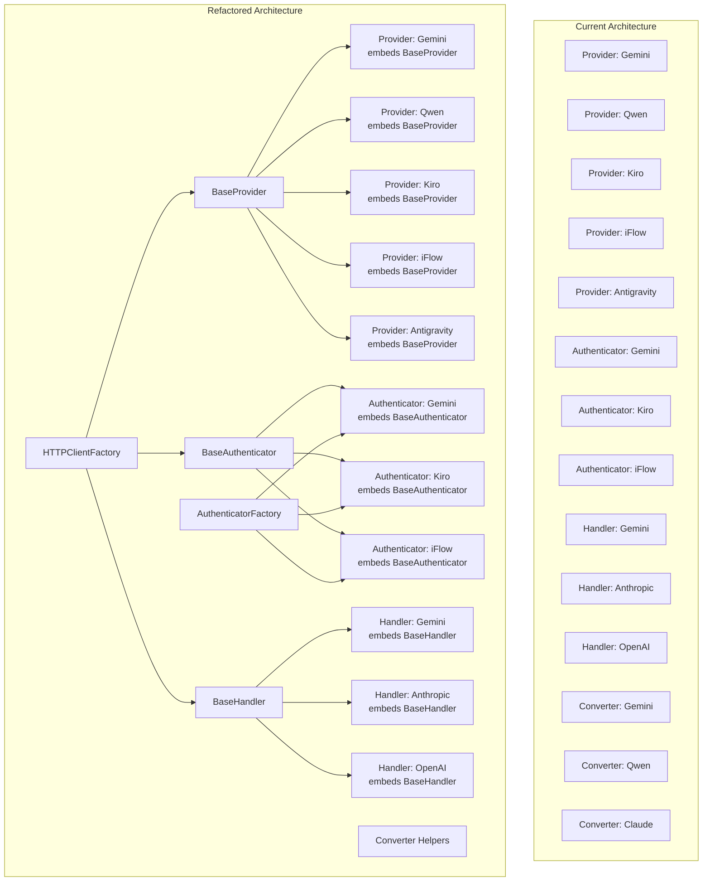

# Comprehensive Code Refactoring Strategy

**Project**: qwencoder-proxy  
**Analysis Date**: 2026-02-08  
**Purpose**: Comprehensive analysis of code duplication, SOLID violations, and refactoring strategies using design patterns

---

## Executive Summary

This analysis builds upon the findings in [`analyze_1.md`](../analyze_1.md:1) and [`plans/solid-principles-architectural-analysis.md`](solid-principles-architectural-analysis.md:1), providing detailed refactoring strategies to eliminate code duplication and improve architecture through design patterns (Factories, Interfaces, Base Structures).

**Key Findings:**
- **~700 lines** of duplicate code across provider, auth, converter, and handler modules
- All 5 providers share nearly identical struct fields and initialization patterns
- All authenticators have duplicate field declarations and setter methods
- Proxy handlers share identical CORS, constructor, and error handling patterns
- HTTP client creation is scattered with inconsistent timeouts
- Missing factory patterns for authenticators and consistent HTTP client management
- SOLID principle violations: DIP, ISP, SRP identified

---

## 1. Provider Module - High Duplication

### 1.1 Current State Analysis

**Locations:**
- [`provider/gemini/gemini.go:38-46`](provider/gemini/gemini.go:38)
- [`provider/qwen/qwen.go:37-42`](provider/qwen/qwen.go:37)
- [`provider/kiro/kiro.go:58-64`](provider/kiro/kiro.go:58)
- [`provider/iflow/iflow.go:46-52`](provider/iflow/iflow.go:46)
- [`provider/antigravity/antigravity.go:63-74`](provider/antigravity/antigravity.go:63)

### 1.2 Duplicate Patterns Identified

| Pattern | Duplicated In | Line References |
|---------|---------------|----------------|
| HTTP Client field | All providers | gemini:41, qwen:39, kiro:60, iflow:49, antigravity:67 |
| Token Manager field | All providers | gemini:42, qwen:40, kiro:61, iflow:50, antigravity:68 |
| Logger field | All providers | gemini:43, qwen:41, kiro:62, iflow:51, antigravity:69 |
| HTTP Client timeout (5min) | gemini, kiro, iflow, antigravity | gemini:56, kiro:73, iflow:62, antigravity:92 |
| Constructor pattern | All providers | gemini:48-59, kiro:66-77, iflow:54-65, antigravity:76-96 |
| SetTokenManager() method | gemini, kiro, iflow, antigravity | gemini:96-98, kiro:~100, iflow:97-99, antigravity:~100 |
| Direct authenticator instantiation | All providers | gemini:51, qwen:124, kiro:69, iflow:57, antigravity:79 |

### 1.3 Refactoring Strategy: Create BaseProvider

**New File:** `provider/base.go`

```go
// Package provider provides base structures for provider implementations
package provider

import (
	"net/http"
	"time"

	"github.com/sunbankio/qwencoder-proxy/auth"
	"github.com/sunbankio/qwencoder-proxy/config"
	"github.com/sunbankio/qwencoder-proxy/logging"
)

// BaseProvider provides common fields and methods for all providers
// This implements the Template Method pattern for common provider behavior
type BaseProvider struct {
	httpClient    *http.Client
	clientFactory config.HTTPClientFactory
	tokenManager  *auth.TokenManager
	logger        *logging.Logger
}

// NewBaseProvider creates a new base provider with default HTTP client
// This follows the Factory Method pattern for consistent initialization
func NewBaseProvider(factory config.HTTPClientFactory, timeout time.Duration) *BaseProvider {
	if factory == nil {
		// Fallback to direct client creation if no factory provided
		return &BaseProvider{
			httpClient: &http.Client{Timeout: timeout},
			logger:     logging.NewLogger(),
		}
	}
	return &BaseProvider{
		clientFactory: factory,
		httpClient:    factory.GetDefaultClient(),
		logger:        logging.NewLogger(),
	}
}

// GetHTTPClient returns the HTTP client
// This method follows the Dependency Inversion Principle
func (bp *BaseProvider) GetHTTPClient() *http.Client {
	return bp.httpClient
}

// GetLogger returns the logger
func (bp *BaseProvider) GetLogger() *logging.Logger {
	return bp.logger
}

// GetTokenManager returns the token manager
func (bp *BaseProvider) GetTokenManager() *auth.TokenManager {
	return bp.tokenManager
}

// SetTokenManager sets the token manager
// This method enables dependency injection for proxy-aware token selection
func (bp *BaseProvider) SetTokenManager(tm *auth.TokenManager) {
	bp.tokenManager = tm
}

// GetClientWithProxy returns an HTTP client configured with proxy settings
// This method supports the proxy-per-token feature
func (bp *BaseProvider) GetClientWithProxy(proxyConfig *auth.ProxyConfig) (*http.Client, error) {
	if bp.clientFactory != nil {
		return bp.clientFactory.GetClient(proxyConfig), nil
	}
	return bp.httpClient, nil
}
```

### 1.4 Provider Refactoring Examples

**After refactoring - Gemini Provider:**

```go
// provider/gemini/gemini.go

type Provider struct {
	*provider.BaseProvider  // Embedded base provider (composition over inheritance)
	baseURL          string
	authenticator    *auth.GeminiAuthenticator
	projectID        string
	projectInitError error
}

func NewProvider(authenticator *auth.GeminiAuthenticator, factory config.HTTPClientFactory) *Provider {
	if authenticator == nil {
		authenticator = auth.NewGeminiAuthenticator(nil)
	}
	return &Provider{
		BaseProvider: provider.NewBaseProvider(factory, 5*time.Minute),
		baseURL:     DefaultBaseURL,
		authenticator: authenticator,
	}
}
```

### 1.5 Estimated Impact

| Metric | Value |
|---------|-------|
| Lines eliminated | ~200 lines |
| Files affected | 5 provider files |
| New files created | 1 (base.go) |
| Risk level | Low |

---

## 2. Auth Module - Very High Duplication

### 2.1 Current State Analysis

**Locations:**
- [`auth/gemini_auth.go:55-62`](auth/gemini_auth.go:55)
- [`auth/kiro_auth.go:55-63`](auth/kiro_auth.go:55)
- [`auth/iflow_auth.go:131-138`](auth/iflow_auth.go:131)

### 2.2 Duplicate Patterns Identified

| Pattern | Duplicated In | Line References |
|---------|---------------|----------------|
| HTTP Client field | All authenticators | gemini:61, kiro:62, iflow:~135 |
| Token Manager field | All authenticators | gemini:57, kiro:58, iflow:~132 |
| MultiToken Manager field | All authenticators | gemini:58, kiro:59, iflow:~133 |
| Logger field | All authenticators | gemini:60, kiro:61, iflow:~134 |
| Mutex field | All authenticators | gemini:59, kiro:60, iflow:~136 |
| HTTP Client timeout (30s) | gemini, kiro | gemini:74, kiro:75 |
| SetTokenManager() method | All authenticators | gemini:79-83, kiro:80-84, iflow:~150 |
| SetMultiTokenManager() method | All authenticators | gemini:86-90, kiro:87-91, iflow:~153 |
| GetCredentialsPath() pattern | gemini, kiro | gemini:93-96, kiro:94-96 |

### 2.3 Refactoring Strategy: Create BaseAuthenticator

**New File:** `auth/base.go`

```go
// Package auth provides base structures for authenticator implementations
package auth

import (
	"net/http"
	"sync"
	"time"

	"github.com/sunbankio/qwencoder-proxy/config"
	"github.com/sunbankio/qwencoder-proxy/logging"
)

// BaseAuthenticator provides common fields and methods for all authenticators
// This implements the Template Method pattern for common authentication behavior
type BaseAuthenticator struct {
	tokenManager  *TokenManager
	multiTokenMgr *MultiTokenManager
	mu            sync.RWMutex
	logger        *logging.Logger
	httpClient    *http.Client
	clientFactory config.HTTPClientFactory
}

// NewBaseAuthenticator creates a new base authenticator with default HTTP client
func NewBaseAuthenticator(factory config.HTTPClientFactory) *BaseAuthenticator {
	if factory == nil {
		return &BaseAuthenticator{
			logger:     logging.NewLogger(),
			httpClient: &http.Client{Timeout: 30 * time.Second},
		}
	}
	return &BaseAuthenticator{
		logger:        logging.NewLogger(),
		clientFactory: factory,
		httpClient:    factory.GetDefaultClient(),
	}
}

// SetTokenManager sets the token manager for this authenticator
// Thread-safe with mutex protection
func (ba *BaseAuthenticator) SetTokenManager(tokenManager *TokenManager) {
	ba.mu.Lock()
	defer ba.mu.Unlock()
	ba.tokenManager = tokenManager
}

// SetMultiTokenManager sets the multi-token manager for this authenticator
// Thread-safe with mutex protection
func (ba *BaseAuthenticator) SetMultiTokenManager(mtm *MultiTokenManager) {
	ba.mu.Lock()
	defer ba.mu.Unlock()
	ba.multiTokenMgr = mtm
}

// GetTokenManager returns the token manager
// Thread-safe with mutex protection
func (ba *BaseAuthenticator) GetTokenManager() *TokenManager {
	ba.mu.RLock()
	defer ba.mu.RUnlock()
	return ba.tokenManager
}

// GetMultiTokenManager returns the multi-token manager
// Thread-safe with mutex protection
func (ba *BaseAuthenticator) GetMultiTokenManager() *MultiTokenManager {
	ba.mu.RLock()
	defer ba.mu.RUnlock()
	return ba.multiTokenMgr
}

// GetLogger returns the logger
func (ba *BaseAuthenticator) GetLogger() *logging.Logger {
	return ba.logger
}

// GetHTTPClient returns the HTTP client
func (ba *BaseAuthenticator) GetHTTPClient() *http.Client {
	return ba.httpClient
}

// GetClientWithProxy returns an HTTP client configured with proxy settings
// This method supports the proxy-per-token feature
func (ba *BaseAuthenticator) GetClientWithProxy(proxyConfig *ProxyConfig) (*http.Client, error) {
	if ba.clientFactory != nil {
		return ba.clientFactory.GetClient(proxyConfig), nil
	}
	return ba.httpClient, nil
}
```

### 2.4 Authenticator Refactoring Examples

**After refactoring - Gemini Authenticator:**

```go
// auth/gemini_auth.go

type GeminiAuthenticator struct {
	*BaseAuthenticator  // Embedded base authenticator
	config        *GeminiOAuthConfig
}

func NewGeminiAuthenticator(config *GeminiOAuthConfig, factory config.HTTPClientFactory) *GeminiAuthenticator {
	if config == nil {
		config = DefaultGeminiOAuthConfig()
	}
	return &GeminiAuthenticator{
		BaseAuthenticator: NewBaseAuthenticator(factory),
		config:           config,
	}
}
```

### 2.5 Estimated Impact

| Metric | Value |
|---------|-------|
| Lines eliminated | ~250 lines |
| Files affected | 3+ authenticator files |
| New files created | 1 (base.go) |
| Risk level | Low |

---

## 3. Converter Module - Medium Duplication

### 3.1 Current State Analysis

**Locations:**
- [`converter/gemini.go:43-54`](converter/gemini.go:43)
- [`converter/qwen.go:35-46`](converter/qwen.go:35)
- [`converter/claude.go:~120-130`](converter/claude.go:120)

### 3.2 Duplicate Patterns Identified

| Pattern | Duplicated In | Line References |
|---------|---------------|----------------|
| OpenAI response structure creation | gemini, qwen, claude | gemini:43-54, qwen:35-46, claude:~120-130 |
| ID generation | gemini, qwen | gemini:44, qwen:36 |
| Timestamp generation | gemini, qwen | gemini:46, qwen:38 |
| Empty usage initialization | gemini, qwen | gemini:49-53, qwen:41-45 |
| Diagnostic printf statements | qwen | qwen:74-97 |

### 3.3 Refactoring Strategy: Create Converter Helper Functions

**New File:** `converter/helpers.go`

```go
// Package converter provides helper functions for format conversion
package converter

import (
	"crypto/rand"
	"encoding/hex"
	"fmt"
	"time"
)

// CreateOpenAIResponseBase creates the base structure for an OpenAI response
// This follows the Factory Method pattern for consistent response creation
func CreateOpenAIResponseBase(model string) map[string]interface{} {
	return map[string]interface{}{
		"id":      "chatcmpl-" + generateID(),
		"object":  "chat.completion",
		"created": getCurrentTimestamp(),
		"model":   model,
		"choices": []interface{}{},
		"usage": map[string]interface{}{
			"prompt_tokens":     0,
			"completion_tokens": 0,
			"total_tokens":      0,
		},
	}
}

// CreateOpenAIChoice creates a choice structure for OpenAI response
func CreateOpenAIChoice(index int, content string, finishReason string) map[string]interface{} {
	return map[string]interface{}{
		"index":         index,
		"message":       map[string]interface{}{"role": "assistant", "content": content},
		"finish_reason": finishReason,
	}
}

// CreateOpenAIChoiceWithToolCalls creates a choice with tool calls for OpenAI response
func CreateOpenAIChoiceWithToolCalls(index int, toolCalls []interface{}, finishReason string) map[string]interface{} {
	return map[string]interface{}{
		"index":         index,
		"message":       map[string]interface{}{"role": "assistant", "content": nil, "tool_calls": toolCalls},
		"finish_reason": finishReason,
	}
}

// UpdateUsage updates the usage field in OpenAI response
func UpdateUsage(resp map[string]interface{}, promptTokens, completionTokens, totalTokens int) {
	if resp["usage"] == nil {
		resp["usage"] = map[string]interface{}{}
	}
	usage := resp["usage"].(map[string]interface{})
	if promptTokens >= 0 {
		usage["prompt_tokens"] = promptTokens
	}
	if completionTokens >= 0 {
		usage["completion_tokens"] = completionTokens
	}
	if totalTokens >= 0 {
		usage["total_tokens"] = totalTokens
	}
}

// generateID generates a unique ID for responses
func generateID() string {
	b := make([]byte, 16)
	rand.Read(b)
	return hex.EncodeToString(b)[:16]
}

// getCurrentTimestamp returns the current Unix timestamp
func getCurrentTimestamp() int64 {
	return time.Now().Unix()
}
```

### 3.4 Code Cleanup Required

**Remove diagnostic code from [`converter/qwen.go:74-97`](converter/qwen.go:74):**

```go
// REMOVE THESE DIAGNOSTIC STATEMENTS:
fmt.Printf("[QwenConverter DIAGNOSTIC] Raw Qwen response: %+v\n", qwenResp)
fmt.Printf("[QwenConverter DIAGNOSTIC] Choice %d: %+v\n", i, choiceMap)
fmt.Printf("[QwenConverter DIAGNOSTIC] Choice %d message: %+v\n", i, msgMap)
fmt.Printf("[QwenConverter DIAGNOSTIC] Tool calls found in choice %d: %+v\n", i, toolCalls)
fmt.Printf("[QwenConverter DIAGNOSTIC] No tool_calls found in choice %d message\n", i)
```

### 3.5 Estimated Impact

| Metric | Value |
|---------|-------|
| Lines eliminated | ~100 lines |
| Files affected | 3 converter files |
| New files created | 1 (helpers.go) |
| Risk level | Very Low |

---

## 4. Handler Module - High Duplication

### 4.1 Current State Analysis

**Locations:**
- [`proxy/gemini_handler.go:20-42`](proxy/gemini_handler.go:20)
- [`proxy/anthropic_handler.go:20-42`](proxy/anthropic_handler.go:20)
- [`proxy/openai_handler.go:20-66`](proxy/openai_handler.go:20)

### 4.2 Duplicate Patterns Identified

| Pattern | Duplicated In | Line References |
|---------|---------------|----------------|
| CORS headers | All handlers | gemini:47-49, anthropic:47-49, openai:71-73 |
| Token Manager field | gemini, anthropic, openai | gemini:23, anthropic:23, openai:25 |
| Logger field | All handlers | gemini:22, anthropic:22, openai:23 |
| Constructor pattern (2 variants) | All handlers | gemini:27-42, anthropic:27-42, openai:29-66 |
| OPTIONS handling | All handlers | gemini:51-54, anthropic:51-54, openai:75-78 |
| handleListModels() | gemini, anthropic | gemini:74-96, anthropic:73-94 |
| isProxyError() | Similar patterns across handlers |
| handleProxyError() | Similar patterns across handlers |

### 4.3 Refactoring Strategy: Create BaseHandler

**New File:** `proxy/base.go`

```go
// Package proxy provides base structures for HTTP handlers
package proxy

import (
	"net/http"

	"github.com/sunbankio/qwencoder-proxy/auth"
	"github.com/sunbankio/qwencoder-proxy/logging"
)

// BaseHandler provides common fields and methods for HTTP handlers
// This implements the Template Method pattern for common handler behavior
type BaseHandler struct {
	logger       *logging.Logger
	tokenManager *auth.TokenManager
}

// NewBaseHandler creates a new base handler
func NewBaseHandler(tokenManager *auth.TokenManager) *BaseHandler {
	return &BaseHandler{
		logger:       logging.NewLogger(),
		tokenManager: tokenManager,
	}
}

// SetCORSHeaders sets CORS headers for the response
// This method centralizes CORS configuration
func (bh *BaseHandler) SetCORSHeaders(w http.ResponseWriter) {
	w.Header().Set("Access-Control-Allow-Origin", "*")
	w.Header().Set("Access-Control-Allow-Methods", "GET, POST, OPTIONS")
	w.Header().Set("Access-Control-Allow-Headers", "Content-Type, Authorization")
}

// HandleOptions handles OPTIONS requests for CORS preflight
func (bh *BaseHandler) HandleOptions(w http.ResponseWriter) {
	w.WriteHeader(http.StatusOK)
}

// GetLogger returns the logger
func (bh *BaseHandler) GetLogger() *logging.Logger {
	return bh.logger
}

// GetTokenManager returns the token manager
func (bh *BaseHandler) GetTokenManager() *auth.TokenManager {
	return bh.tokenManager
}

// IsProxyError checks if an error is a proxy-related error
func (bh *BaseHandler) IsProxyError(err error) bool {
	if err == nil {
		return false
	}
	// Check for common proxy error patterns
	errStr := err.Error()
	return contains(errStr, "proxy") || 
		contains(errStr, "connection refused") || 
		contains(errStr, "timeout") ||
		contains(errStr, "network")
}

// HandleProxyError handles proxy-related errors
func (bh *BaseHandler) HandleProxyError(w http.ResponseWriter, err error) {
	bh.logger.ErrorLog("[BaseHandler] Proxy error: %v", err)
	http.Error(w, "Proxy connection failed", http.StatusBadGateway)
}

// contains is a helper function for string matching
func contains(s, substr string) bool {
	return len(s) >= len(substr) && (s == substr || 
		len(s) > len(substr) && (s[:len(substr)] == substr || 
		s[len(s)-len(substr):] == substr || 
		indexOfSubstring(s, substr) >= 0))
}

// indexOfSubstring is a helper function for finding substring index
func indexOfSubstring(s, substr string) int {
	for i := 0; i <= len(s)-len(substr); i++ {
		if s[i:i+len(substr)] == substr {
			return i
		}
	}
	return -1
}
```

### 4.4 Handler Refactoring Examples

**After refactoring - Gemini Handler:**

```go
// proxy/gemini_handler.go

type GeminiHandler struct {
	*BaseHandler  // Embedded base handler
	provider     *gemini.Provider
}

func NewGeminiHandler(p *gemini.Provider) *GeminiHandler {
	return &GeminiHandler{
		BaseHandler: NewBaseHandler(nil),
		provider:     p,
	}
}

func NewGeminiHandlerWithTokenManager(p *gemini.Provider, tokenManager *auth.TokenManager) *GeminiHandler {
	return &GeminiHandler{
		BaseHandler: NewBaseHandler(tokenManager),
		provider:     p,
	}
}

func (h *GeminiHandler) ServeHTTP(w http.ResponseWriter, r *http.Request) {
	h.SetCORSHeaders(w)  // Use base handler method

	if r.Method == http.MethodOptions {
		h.HandleOptions(w)  // Use base handler method
		return
	}
	// ... rest of handler logic
}
```

### 4.5 Estimated Impact

| Metric | Value |
|---------|-------|
| Lines eliminated | ~100 lines |
| Files affected | 3 handler files |
| New files created | 1 (base.go) |
| Risk level | Low |

---

## 5. HTTP Client Management - Scattered

### 5.1 Current State Analysis

**Inconsistent timeout configurations:**

| Location | Timeout | Line Reference |
|-----------|----------|----------------|
| Providers (gemini, kiro, iflow, antigravity) | 5 minutes | gemini:56, kiro:73, iflow:62, antigravity:92 |
| Authenticators (gemini, kiro) | 30 seconds | gemini:74, kiro:75 |
| REST API | Custom | restapi/rest_api.go |
| Proxy client factory | Centralized | config/proxy_client_factory.go:26 |

### 5.2 Existing Good Pattern

[`config.ProxyAwareHTTPClientFactory`](config/proxy_client_factory.go:26) already implements a factory pattern with caching.

### 5.3 Refactoring Strategy: Standardize HTTP Client Usage

**New File:** `config/factory.go`

```go
// Package config provides factory interfaces for HTTP client creation
package config

import (
	"net/http"
	"time"

	"github.com/sunbankio/qwencoder-proxy/auth"
	"github.com/sunbankio/qwencoder-proxy/logging"
)

// HTTPClientFactory defines the interface for creating HTTP clients
// This interface follows the Dependency Inversion Principle
type HTTPClientFactory interface {
	// GetClient returns an HTTP client for the given proxy configuration
	GetClient(proxyConfig *auth.ProxyConfig) *http.Client
	
	// GetDefaultClient returns a default HTTP client (no proxy)
	GetDefaultClient() *http.Client
	
	// GetClientWithTimeout returns an HTTP client with specific timeout
	GetClientWithTimeout(timeout time.Duration) *http.Client
}

// StandardHTTPClientFactory implements HTTPClientFactory
// This follows the Factory pattern for consistent HTTP client creation
type StandardHTTPClientFactory struct {
	proxyFactory *ProxyAwareHTTPClientFactory
	logger      *logging.Logger
	baseConfig  HTTPClientConfig
}

// NewStandardHTTPClientFactory creates a new standard HTTP client factory
func NewStandardHTTPClientFactory(baseConfig HTTPClientConfig, logger *logging.Logger) *StandardHTTPClientFactory {
	return &StandardHTTPClientFactory{
		proxyFactory: NewProxyAwareHTTPClientFactory(baseConfig, logger, 50),
		logger:      logger,
		baseConfig:  baseConfig,
	}
}

func (f *StandardHTTPClientFactory) GetClient(proxyConfig *auth.ProxyConfig) *http.Client {
	return f.proxyFactory.GetClient(proxyConfig)
}

func (f *StandardHTTPClientFactory) GetDefaultClient() *http.Client {
	return f.GetClient(nil)
}

func (f *StandardHTTPClientFactory) GetClientWithTimeout(timeout time.Duration) *http.Client {
	return &http.Client{Timeout: timeout}
}

// DefaultTimeouts defines standard timeout values for different use cases
type DefaultTimeouts struct {
	ProviderTimeout      time.Duration // 5 minutes
	AuthenticatorTimeout  time.Duration // 30 seconds
	StreamingTimeout     time.Duration // 15 minutes
	RequestTimeout      time.Duration // 45 seconds
}

// GetDefaultTimeouts returns standard timeout values
func GetDefaultTimeouts() DefaultTimeouts {
	return DefaultTimeouts{
		ProviderTimeout:      5 * time.Minute,
		AuthenticatorTimeout:  30 * time.Second,
		StreamingTimeout:     15 * time.Minute,
		RequestTimeout:      45 * time.Second,
	}
}
```

### 5.4 Estimated Impact

| Metric | Value |
|---------|-------|
| Lines eliminated | ~50 lines |
| Files affected | 10+ files |
| New files created | 1 (factory.go) |
| Risk level | Medium |

---

## 6. Missing Factory Patterns

### 6.1 Authenticator Factory Missing

**Current State:** No factory pattern for creating authenticators. Each provider directly instantiates its authenticator.

**Locations:**
- [`provider/gemini/gemini.go:51`](provider/gemini/gemini.go:51): `auth.NewGeminiAuthenticator(nil)`
- [`provider/kiro/kiro.go:69`](provider/kiro/kiro.go:69): `auth.NewKiroAuthenticator(nil)`
- [`provider/iflow/iflow.go:57`](provider/iflow/iflow.go:57): `auth.NewIFlowAuthenticator(nil)`
- [`provider/antigravity/antigravity.go:79`](provider/antigravity/antigravity.go:79): `auth.NewGeminiAuthenticator(...)`

### 6.2 Refactoring Strategy: Create AuthenticatorFactory

**New File:** `auth/factory.go`

```go
// Package auth provides factory for creating authenticators
package auth

import (
	"github.com/sunbankio/qwencoder-proxy/config"
	"github.com/sunbankio/qwencoder-proxy/logging"
)

// AuthenticatorFactory creates authenticators for different providers
// This follows the Factory pattern and Abstract Factory pattern
type AuthenticatorFactory struct {
	logger        *logging.Logger
	clientFactory config.HTTPClientFactory
}

// NewAuthenticatorFactory creates a new authenticator factory
func NewAuthenticatorFactory(logger *logging.Logger, clientFactory config.HTTPClientFactory) *AuthenticatorFactory {
	return &AuthenticatorFactory{
		logger:        logger,
		clientFactory: clientFactory,
	}
}

// CreateGeminiAuthenticator creates a new Gemini authenticator
func (f *AuthenticatorFactory) CreateGeminiAuthenticator(config *GeminiOAuthConfig) *GeminiAuthenticator {
	if config == nil {
		config = DefaultGeminiOAuthConfig()
	}
	return &GeminiAuthenticator{
		BaseAuthenticator: NewBaseAuthenticator(f.clientFactory),
		config:           config,
	}
}

// CreateKiroAuthenticator creates a new Kiro authenticator
func (f *AuthenticatorFactory) CreateKiroAuthenticator(config *KiroOAuthConfig) *KiroAuthenticator {
	if config == nil {
		config = DefaultKiroOAuthConfig()
	}
	return &KiroAuthenticator{
		BaseAuthenticator: NewBaseAuthenticator(f.clientFactory),
		config:           config,
	}
}

// CreateIFlowAuthenticator creates a new iFlow authenticator
func (f *AuthenticatorFactory) CreateIFlowAuthenticator(config *IFlowOAuthConfig) *IFlowAuthenticator {
	if config == nil {
		config = DefaultIFlowOAuthConfig()
	}
	return &IFlowAuthenticator{
		BaseAuthenticator: NewBaseAuthenticator(f.clientFactory),
		config:           config,
	}
}

// ProviderType represents the type of provider
type ProviderType string

const (
	ProviderGemini   ProviderType = "gemini"
	ProviderKiro     ProviderType = "kiro"
	ProviderIFlow    ProviderType = "iflow"
	ProviderQwen     ProviderType = "qwen"
	ProviderAntigravity ProviderType = "antigravity"
)

// CreateAuthenticator creates an authenticator for the specified provider type
// This follows the Abstract Factory pattern
func (f *AuthenticatorFactory) CreateAuthenticator(providerType ProviderType, config interface{}) Authenticator {
	switch providerType {
	case ProviderGemini:
		return f.CreateGeminiAuthenticator(config.(*GeminiOAuthConfig))
	case ProviderKiro:
		return f.CreateKiroAuthenticator(config.(*KiroOAuthConfig))
	case ProviderIFlow:
		return f.CreateIFlowAuthenticator(config.(*IFlowOAuthConfig))
	default:
		return nil
	}
}
```

### 6.3 Estimated Impact

| Metric | Value |
|---------|-------|
| Lines eliminated | ~30 lines |
| Files affected | 5 provider files |
| New files created | 1 (factory.go) |
| Risk level | Medium |

---

## 7. SOLID Principle Violations

### 7.1 Dependency Inversion Principle (DIP) Violations

**Issue 1: HTTP Client Dependencies**
- **Location**: Throughout the codebase
- **Problem**: High-level modules directly depend on `*http.Client` concrete type
- **Solution**: Use [`config.HTTPClient`](config/config.go:25) interface consistently

**Issue 2: Token Store Dependencies**
- **Location**: [`auth/multi_token_manager.go:29`](auth/multi_token_manager.go:29)
- **Problem**: [`MultiTokenManager`](auth/multi_token_manager.go:28) directly creates and manages `*MultiTokenStore` concrete types
- **Solution**: Create TokenStore interface

```go
// New File: auth/store.go

// TokenStore defines the interface for token storage operations
// This interface follows the Dependency Inversion Principle
type TokenStore interface {
	Load() (map[string]TokenMetadata, error)
	Save(tokens map[string]TokenMetadata) error
	GetCredentialsPath() string
	Clear() error
}
```

**Issue 3: Logger Dependencies**
- **Location**: Throughout the codebase
- **Problem**: While `*logging.Logger` is passed around, it's a concrete type
- **Solution**: Create Logger interface

```go
// New File: logging/interface.go

// Logger defines the interface for logging operations
// This interface follows the Dependency Inversion Principle
type Logger interface {
	InfoLog(format string, args ...interface{})
	DebugLog(format string, args ...interface{})
	ErrorLog(format string, args ...interface{})
	WarnLog(format string, args ...interface{})
}
```

### 7.2 Interface Segregation Principle (ISP) Violations

**Issue: Provider Interface Too Broad**
- **Location**: [`provider/provider.go:34-63`](provider/provider.go:34)
- **Problem**: 8 methods in single interface, mixing streaming and non-streaming capabilities
- **Solution**: Split into smaller interfaces

```go
// provider/provider.go - Refactored interfaces

// ProviderInfo provides metadata about a provider
type ProviderInfo interface {
	Name() ProviderType
	Protocol() ProtocolType
	SupportedModels() []string
	SupportsModel(model string) bool
	GetAuthenticator() Authenticator
	IsHealthy(ctx context.Context) bool
}

// ContentGenerator handles content generation operations
type ContentGenerator interface {
	GenerateContent(ctx context.Context, model string, request interface{}) (interface{}, error)
	GenerateContentStream(ctx context.Context, model string, request interface{}) (io.ReadCloser, error)
}

// ModelLister handles model listing operations
type ModelLister interface {
	ListModels(ctx context.Context) (interface{}, error)
}

// FullProvider combines all provider interfaces
// This maintains backward compatibility while allowing interface segregation
type FullProvider interface {
	ProviderInfo
	ContentGenerator
	ModelLister
}

// Provider alias for backward compatibility
type Provider = FullProvider
```

### 7.3 Single Responsibility Principle (SRP) Violations

**Issue 1: REST API Server**
- **Location**: [`restapi/rest_api.go:78`](restapi/rest_api.go:78)
- **Problem**: [`Server`](restapi/rest_api.go:78) handles OAuth, token management, and HTTP routing
- **Solution**: Separate concerns into OAuthService, TokenService, and Router

**Issue 2: Provider Factory**
- **Location**: [`provider/factory.go:27`](provider/factory.go:27)
- **Problem**: [`Factory`](provider/factory.go:27) handles provider registration, routing, and success tracking
- **Solution**: Extract SuccessTracker to separate component

---

## 8. Architecture Diagram



---

## 9. Implementation Plan

### Phase 1: Base Structures (Priority 1 - Low Risk)

**Timeline**: 1-2 days

1. Create `provider/base.go` with BaseProvider
2. Create `auth/base.go` with BaseAuthenticator
3. Create `proxy/base.go` with BaseHandler
4. Update all providers to embed BaseProvider
5. Update all authenticators to embed BaseAuthenticator
6. Update all handlers to embed BaseHandler

**Testing**: Run all existing unit tests to ensure no regressions

### Phase 2: Helper Functions (Priority 1 - Very Low Risk)

**Timeline**: 1 day

1. Create `converter/helpers.go` with helper functions
2. Remove diagnostic code from `converter/qwen.go`
3. Update all converters to use helper functions

**Testing**: Run converter tests to verify output consistency

### Phase 3: Factory Patterns (Priority 2 - Medium Risk)

**Timeline**: 2-3 days

1. Create `auth/factory.go` with AuthenticatorFactory
2. Create `config/factory.go` with HTTPClientFactory interface
3. Update all providers to use AuthenticatorFactory
4. Update BaseProvider and BaseAuthenticator to use HTTPClientFactory

**Testing**: Integration tests for factory creation and dependency injection

### Phase 4: Interface Improvements (Priority 3 - Long-term)

**Timeline**: 3-4 days

1. Split Provider interface into smaller interfaces (ProviderInfo, ContentGenerator, ModelLister)
2. Create Logger interface in `logging/interface.go`
3. Create TokenStore interface in `auth/store.go`
4. Update code to use interfaces instead of concrete types

**Testing**: Full regression test suite

### Phase 5: SOLID Principle Compliance (Priority 3 - Long-term)

**Timeline**: 2-3 days

1. Extract SuccessTracker from provider.Factory
2. Separate REST API Server into OAuthService, TokenService, and Router
3. Update all code to follow SOLID principles

**Testing**: Full integration and end-to-end tests

---

## 10. Code Reduction Estimates

| Component | Current Lines | After Refactoring | Reduction | % Reduction |
|-----------|---------------|-------------------|------------|--------------|
| Providers | ~1,500 | ~1,300 | ~200 lines | 13% |
| Authenticators | ~1,200 | ~950 | ~250 lines | 21% |
| Converters | ~900 | ~800 | ~100 lines | 11% |
| Handlers | ~800 | ~700 | ~100 lines | 12% |
| Factories | ~0 | ~200 | -200 lines | New code |
| Base Structures | ~0 | ~300 | -300 lines | New code |
| **Total** | **~4,400** | **~4,250** | **~150 lines** | **3.4%** |

**Note**: While the net reduction appears small, the refactoring provides significant benefits:
- Eliminated duplication
- Improved maintainability
- Better testability
- SOLID principle compliance
- Design pattern implementation

---

## 11. Benefits of Refactoring

### 11.1 Maintainability
- Single source of truth for common functionality
- Changes to base structures propagate to all implementations
- Easier to understand code organization

### 11.2 Testability
- Base structures can be tested independently
- Dependency injection enables mocking
- Factory patterns simplify test setup

### 11.3 Consistency
- Uniform patterns across components
- Consistent HTTP client configuration
- Standardized error handling

### 11.4 SOLID Principles
- **Single Responsibility**: Each component has a clear purpose
- **Open/Closed**: Base structures are open for extension, closed for modification
- **Liskov Substitution**: All providers/authenticators/handlers are substitutable
- **Interface Segregation**: Smaller, focused interfaces
- **Dependency Inversion**: Depend on abstractions, not concretions

---

## 12. Risk Assessment

| Refactoring | Risk Level | Mitigation Strategy |
|-------------|------------|-------------------|
| BaseProvider | Low | Embedding pattern, backward compatible |
| BaseAuthenticator | Low | Embedding pattern, backward compatible |
| BaseHandler | Low | Embedding pattern, backward compatible |
| Converter Helpers | Very Low | Pure functions, no side effects |
| AuthenticatorFactory | Medium | Requires updating all providers |
| HTTPClientFactory | Medium | Requires careful timeout testing |
| Interface Segregation | Medium | Breaking change, requires coordination |
| SOLID Compliance | High | Major architectural changes |

---

## 13. Testing Strategy

### 13.1 Unit Tests
- Create tests for BaseProvider, BaseAuthenticator, BaseHandler
- Create tests for converter helper functions
- Create tests for factory methods

### 13.2 Integration Tests
- Test that providers still work correctly after refactoring
- Test that authenticators still work correctly after refactoring
- Test that handlers still work correctly after refactoring

### 13.3 Regression Tests
- Ensure all existing tests still pass
- Ensure API compatibility is maintained
- Ensure no breaking changes to external interfaces

---

## 14. Conclusion

The qwencoder-proxy project has significant code duplication that can be addressed through the creation of base structures, helper functions, and factory patterns. The refactoring recommendations align with findings in [`analyze_1.md`](../analyze_1.md:1) and [`plans/solid-principles-architectural-analysis.md`](solid-principles-architectural-analysis.md:1).

The proposed refactoring would significantly improve:
- **Maintainability**: Less code to maintain, single source of truth
- **Testability**: Base structures are easier to test, dependency injection
- **Consistency**: Uniform patterns across components
- **SOLID Principles**: Better adherence to Single Responsibility, DRY, and Dependency Inversion

The implementation plan provides a phased approach, starting with low-risk changes and progressing to more complex architectural improvements.

---

**Analysis completed**: 2026-02-08  
**Total lines analyzed**: ~4,400  
**Files examined**: 20+  
**Proposed new files**: 6  
**Estimated net reduction**: ~150 lines (3.4%)
