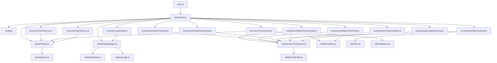

# Dashboard Modular Refactoring Architecture

## Executive Summary

This document defines the architecture for refactoring the QWEncoder Proxy Dashboard from a monolithic 3,861-line HTML file into a modular, maintainable structure. The refactoring separates concerns into distinct CSS, HTML, and JavaScript modules while preserving all existing functionality and enabling future enhancements.

## Current State Analysis

### File Breakdown
- **Total Lines:** 3,861
- **CSS Styles:** Lines 1-1573 (~1,573 lines)
- **HTML Structure:** Lines 1575-1883 (~308 lines)
- **JavaScript:** Lines 1885-3859 (~1,974 lines)

### Existing Components
- **5 Tabs:** Overview, Tokens, Proxy, Settings, Logs
- **5 Modals:** Device Code, Add Token, Proxy Config, Provider Settings
- **13 JavaScript Classes:** Provider, ProxyConfig, ProxyHealth, Token, ProviderCredentials, StoreSettings, APIClient, StateManager, EventEmitter, Component, ToastContainer, LoadingOverlay, Modal, Dashboard

---

## 1. Complete Directory Structure

```
web/
└── dashboard/
    ├── index.html                 # Main HTML entry point (simplified)
    ├── assets/
    │   └── images/                # Static images and icons
    │       └── .gitkeep
    ├── css/
    │   ├── main.css               # Base styles, CSS variables, reset
    │   ├── layout.css             # Header, nav, container, grid layouts
    │   ├── components.css         # Reusable UI components (buttons, cards, modals)
    │   ├── tabs.css               # Tab-specific styles
    │   ├── forms.css              # Form inputs, toggles, filters
    │   ├── tables.css             # Data table styles
    │   ├── notifications.css      # Toast notifications, loading overlay
    │   ├── charts.css             # Latency chart SVG styles
    │   └── responsive.css         # Media queries for mobile/tablet
    ├── js/
    │   ├── main.js                # Application entry point
    │   ├── config.js              # Application configuration constants
    │   ├── models/
    │   │   ├── Provider.js        # Provider data model
    │   │   ├── ProxyConfig.js     # Proxy configuration model
    │   │   ├── ProxyHealth.js     # Proxy health tracking model
    │   │   ├── Token.js           # Token data model
    │   │   ├── ProviderCredentials.js  # Provider credentials model
    │   │   └── StoreSettings.js   # Store settings model
    │   ├── api/
    │   │   ├── APIClient.js       # HTTP client for API communication
    │   │   ├── endpoints.js       # API endpoint definitions
    │   │   └── types.js           # API request/response type definitions
    │   ├── state/
    │   │   ├── StateManager.js    # Application state management
    │   │   ├── initialState.js    # Default state configuration
    │   │   └── storage.js         # LocalStorage wrapper
    │   ├── utils/
    │   │   ├── EventEmitter.js    # Event pub/sub system
    │   │   ├── formatters.js      # Date/time, duration formatting
    │   │   ├── validators.js      # Input validation utilities
    │   │   └── dom.js             # DOM manipulation helpers
    │   ├── components/
    │   │   ├── Component.js       # Base component class
    │   │   ├── Modal.js           # Modal component
    │   │   ├── ToastContainer.js  # Toast notifications
    │   │   ├── LoadingOverlay.js  # Loading overlay
    │   │   ├── tabs/
    │   │   │   ├── OverviewTab.js # Overview tab logic
    │   │   │   ├── TokensTab.js   # Tokens tab logic
    │   │   │   ├── ProxyTab.js    # Proxy tab logic
    │   │   │   ├── SettingsTab.js # Settings tab logic
    │   │   │   └── LogsTab.js     # Logs tab logic
    │   │   ├── modals/
    │   │   │   ├── DeviceCodeModal.js
    │   │   │   ├── AddTokenModal.js
    │   │   │   ├── ProxyConfigModal.js
    │   │   │   └── ProviderSettingsModal.js
    │   │   ├── cards/
    │   │   │   ├── StatCard.js
    │   │   │   ├── ProviderCard.js
    │   │   │   ├── TokenCard.js
    │   │   │   └── ProxyConfigCard.js
    │   │   └── charts/
    │   │       └── LatencyChart.js # SVG latency chart component
    │   ├── services/
    │   │   ├── OAuthService.js    # OAuth flow management
    │   │   ├── ProxyService.js    # Proxy configuration operations
    │   │   ├── TokenService.js    # Token management operations
    │   │   └── LogService.js      # Logging operations
    │   └── Dashboard.js           # Main dashboard orchestrator
    └── templates/
        ├── modals.html            # Modal HTML templates
        ├── tabs.html              # Tab HTML templates
        └── components.html        # Reusable component templates
```

---

## 2. CSS File Organization

### 2.1 `css/main.css` - Base Styles
**Lines 1-38 from original**

```css
/* CSS Variables & Base Styles */
:root { /* ... */ }
* { /* Reset */ }
body { /* Base styles */ }
.container { /* Main container */ }
.hidden { /* Utility class */ }
```

**Purpose:** Defines global CSS variables, base reset, and utility classes.

### 2.2 `css/layout.css` - Layout Styles
**Lines 46-237 from original**

```css
/* Header Styles */
header { /* ... */ }
.header-title { /* ... */ }
.header-actions { /* ... */ }
.server-status { /* ... */ }

/* Navigation Tabs */
.nav-tabs { /* ... */ }
.nav-tab { /* ... */ }

/* Content Area */
.content-area { /* ... */ }
.tab-content { /* ... */ }
```

**Purpose:** Header, navigation, and main layout structures.

### 2.3 `css/components.css` - UI Components
**Lines 110-174, 242-397, 1282-1298 from original**

```css
/* Buttons */
.btn { /* ... */ }
.btn-primary { /* ... */ }
.btn-secondary { /* ... */ }
.btn-danger { /* ... */ }
.btn-sm { /* ... */ }
.btn-icon { /* ... */ }

/* Status Indicators */
.status-dot { /* ... */ }
.status-dot.online { /* ... */ }
.status-dot.checking { /* ... */ }

/* Cards */
.stat-card { /* ... */ }
.provider-card { /* ... */ }
.token-item { /* ... */ }
.proxy-config-card { /* ... */ }
.settings-card { /* ... */ }

/* Empty State */
.empty-state { /* ... */ }
```

**Purpose:** Reusable UI components like buttons, cards, and status indicators.

### 2.4 `css/forms.css` - Form Elements
**Lines 696-721, 925-998 from original**

```css
/* Filter Bar */
.filter-bar { /* ... */ }
.filter-input { /* ... */ }

/* Form Groups */
.form-group { /* ... */ }
.form-group label { /* ... */ }
.form-group input { /* ... */ }
.form-group select { /* ... */ }
.form-group textarea { /* ... */ }

/* Toggle Switch */
.toggle-switch { /* ... */ }
.toggle-switch input { /* ... */ }
.toggle-switch .slider { /* ... */ }
```

**Purpose:** Form inputs, filters, and interactive form elements.

### 2.5 `css/tables.css` - Data Tables
**Lines 594-691 from original**

```css
.table-container { /* ... */ }
table { /* ... */ }
th, td { /* ... */ }
th:hover { /* ... */ }
tr:hover { /* ... */ }
.health-badge { /* ... */ }
.score-bar { /* ... */ }
```

**Purpose:** Data table styles for the Tokens tab.

### 2.6 `css/tabs.css` - Tab-Specific Styles
**Lines 242-280, 285-397, 726-853, 889-998, 1000-1066, 1371-1486 from original**

```css
/* Overview Tab */
.summary-stats { /* ... */ }
.providers-grid { /* ... */ }
.email-subsection { /* ... */ }

/* Tokens Tab */
.token-list { /* ... */ }
.token-details { /* ... */ }
.token-actions { /* ... */ }

/* Proxy Tab */
.proxy-summary { /* ... */ }
.proxy-config-list { /* ... */ }
.health-score-circle { /* ... */ }

/* Settings Tab */
.settings-section { /* ... */ }
.settings-grid { /* ... */ }

/* Logs Tab */
.log-entries { /* ... */ }
.log-entry { /* ... */ }
.log-level { /* ... */ }

/* Email Lists */
.email-list { /* ... */ }
.email-item { /* ... */ }
.email-provider-group { /* ... */ }
```

**Purpose:** Styles specific to each tab's content.

### 2.7 `css/notifications.css` - Notifications & Overlays
**Lines 1196-1280 from original**

```css
/* Toast Notifications */
.toast-container { /* ... */ }
.toast { /* ... */ }
.toast.success { /* ... */ }
.toast.error { /* ... */ }

/* Loading Overlay */
.loading-overlay { /* ... */ }
.loading-spinner { /* ... */ }

/* Modal Styles */
.modal-overlay { /* ... */ }
.modal { /* ... */ }
.modal-header { /* ... */ }
.modal-body { /* ... */ }
.modal-footer { /* ... */ }

/* Device Code Modal */
.device-code-display { /* ... */ }
.user-code { /* ... */ }
.polling-status { /* ... */ }
.spinner { /* ... */ }
```

**Purpose:** Toast notifications, loading overlay, and modal styles.

### 2.8 `css/charts.css` - Chart Styles
**Lines 855-887 from original**

```css
.latency-chart { /* ... */ }
.latency-chart svg { /* ... */ }
.latency-chart .chart-line { /* ... */ }
.latency-chart .chart-point { /* ... */ }
```

**Purpose:** SVG chart styles for latency visualization.

### 2.9 `css/responsive.css` - Responsive Design
**Lines 1300-1369, 1488-1572 from original**

```css
/* Responsive Design */
@media (max-width: 768px) { /* ... */ }
@media (max-width: 480px) { /* ... */ }

/* Collapsible Elements */
.section-toggle { /* ... */ }
.collapsible-content { /* ... */ }
.collapsible-panel { /* ... */ }
```

**Purpose:** Media queries and mobile-specific adjustments.

---

## 3. JavaScript Module Organization

### 3.1 `js/config.js` - Application Configuration
```javascript
export const CONFIG = {
    STORAGE_KEY: 'qwencoder_dashboard_state',
    API_BASE_URL: window.location.origin,
    AUTO_REFRESH_INTERVAL: 30,
    MAX_LOG_ENTRIES: 500,
    TOAST_DURATION: 5000,
    POLLING_INTERVAL: 3000,
    PROXY_HISTORY_LENGTH: 50
};

export const PROVIDER_ICONS = {
    qwen: '🤖',
    gemini: '✨',
    iflow: '🌊',
    kiro: '☁️'
};

export const FLOW_LABELS = {
    device_code: 'Device Code Flow',
    authorization_code: 'Authorization Code',
    external: 'External'
};
```

### 3.2 `js/models/` - Data Models

#### `js/models/Provider.js`
```javascript
export class Provider {
    constructor(id, name, flow, scopes, authUrl, tokenUrl, deviceAuthUrl) {
        this.id = id;
        this.name = name;
        this.flow = flow;
        this.scopes = scopes;
        this.authUrl = authUrl;
        this.tokenUrl = tokenUrl;
        this.deviceAuthUrl = deviceAuthUrl;
    }
}
```

#### `js/models/ProxyConfig.js`
```javascript
export class ProxyConfig {
    constructor(type, host, port, username, password, enabled) {
        this.type = type;
        this.host = host;
        this.port = port;
        this.username = username;
        this.password = password;
        this.enabled = enabled;
    }

    validate() {
        if (this.type === 'none') return { valid: true };
        if (!this.host || !this.host.trim()) {
            return { valid: false, message: 'Host is required' };
        }
        if (!this.port || this.port < 1 || this.port > 65535) {
            return { valid: false, message: 'Port must be between 1 and 65535' };
        }
        if ((this.username && !this.password) || (!this.username && this.password)) {
            return { valid: false, message: 'Username and password must both be provided or both empty' };
        }
        return { valid: true };
    }
}
```

#### `js/models/ProxyHealth.js`
```javascript
export class ProxyHealth {
    constructor(lastCheck, isHealthy, lastError, consecutiveFailures, averageLatencyMs, healthScore) {
        this.lastCheck = lastCheck;
        this.isHealthy = isHealthy;
        this.lastError = lastError;
        this.consecutiveFailures = consecutiveFailures;
        this.averageLatencyMs = averageLatencyMs;
        this.healthScore = healthScore;
    }
}
```

#### `js/models/Token.js`
```javascript
export class Token {
    constructor(id, accessToken, refreshToken, tokenType, expiryDate, email, resourceUrl, 
                healthy, healthScore, lastUsed, createdAt, errorCount, lastError, 
                proxy, proxyHealthScore) {
        this.id = id;
        this.accessToken = accessToken;
        this.refreshToken = refreshToken;
        this.tokenType = tokenType;
        this.expiryDate = expiryDate;
        this.email = email;
        this.resourceUrl = resourceUrl;
        this.healthy = healthy;
        this.healthScore = healthScore;
        this.lastUsed = lastUsed;
        this.createdAt = createdAt;
        this.errorCount = errorCount;
        this.lastError = lastError;
        this.proxy = proxy;
        this.proxyHealthScore = proxyHealthScore;
    }
}
```

#### `js/models/ProviderCredentials.js`
```javascript
export class ProviderCredentials {
    constructor(providerId, tokens, settings) {
        this.providerId = providerId;
        this.tokens = tokens;
        this.settings = settings;
    }
}
```

#### `js/models/StoreSettings.js`
```javascript
export class StoreSettings {
    constructor(selectionStrategy, refreshBufferSec, maxErrorCount) {
        this.selectionStrategy = selectionStrategy;
        this.refreshBufferSec = refreshBufferSec;
        this.maxErrorCount = maxErrorCount;
    }
}
```

### 3.3 `js/api/` - API Layer

#### `js/api/endpoints.js`
```javascript
export const ENDPOINTS = {
    // Provider discovery
    GET_PROVIDERS: '/api/providers',
    GET_PROVIDER_CONFIG: (providerId) => `/api/providers/${providerId}/config`,

    // Device code flow
    START_DEVICE_FLOW: '/api/device/start',
    GET_DEVICE_STATUS: (pollId) => `/api/device/status/${pollId}`,

    // Authorization code flow
    START_AUTH: '/api/auth/start',

    // Token management
    GET_TOKEN: (providerId) => `/api/token/${providerId}`,
    REFRESH_TOKEN: (providerId) => `/api/token/${providerId}/refresh`,
    DELETE_TOKEN: (providerId) => `/api/token/${providerId}`,

    // Credentials management
    GET_CREDENTIALS: '/api/credentials',
    CLEAR_ALL_CREDENTIALS: '/api/credentials',
    GET_PROVIDER_CREDENTIALS: (providerId) => `/api/credentials/${providerId}`,
    ADD_TOKEN: (providerId) => `/api/credentials/${providerId}`,
    DELETE_TOKEN_BY_ID: (providerId, tokenId) => `/api/credentials/${providerId}/${tokenId}`,
    REFRESH_TOKEN_BY_ID: (providerId, tokenId) => `/api/credentials/${providerId}/${tokenId}/refresh`,
    UPDATE_PROVIDER_SETTINGS: (providerId) => `/api/credentials/${providerId}/settings`,

    // Proxy configuration
    GET_PROXY_CONFIG: (providerId, tokenId) => `/api/credentials/${providerId}/${tokenId}/proxy`,
    UPDATE_PROXY_CONFIG: (providerId, tokenId) => `/api/credentials/${providerId}/${tokenId}/proxy`,
    DELETE_PROXY_CONFIG: (providerId, tokenId) => `/api/credentials/${providerId}/${tokenId}/proxy`
};
```

#### `js/api/APIClient.js`
```javascript
import { ENDPOINTS } from './endpoints.js';

export class APIClient {
    constructor(baseUrl = window.location.origin) {
        this.baseUrl = baseUrl.replace(/\/$/, '');
    }

    setBaseUrl(baseUrl) {
        this.baseUrl = baseUrl.replace(/\/$/, '');
    }

    async request(method, path, body = null) {
        const url = `${this.baseUrl}${path}`;
        const options = {
            method,
            headers: { 'Content-Type': 'application/json' },
        };
        if (body) options.body = JSON.stringify(body);

        const response = await fetch(url, options);
        const data = await response.json();

        if (!response.ok) {
            throw new Error(data.error?.message || data.message || `HTTP ${response.status}`);
        }
        return data;
    }

    // Provider discovery
    async getProviders() {
        return this.request('GET', ENDPOINTS.GET_PROVIDERS);
    }

    async getProviderConfig(providerId) {
        return this.request('GET', ENDPOINTS.GET_PROVIDER_CONFIG(providerId));
    }

    // Device code flow
    async startDeviceFlow(providerId) {
        return this.request('POST', ENDPOINTS.START_DEVICE_FLOW, { provider: providerId });
    }

    async getDeviceStatus(pollId) {
        return this.request('GET', ENDPOINTS.GET_DEVICE_STATUS(pollId));
    }

    // Authorization code flow
    async startAuth(providerId, redirectUri = null) {
        const body = { provider: providerId };
        if (redirectUri) body.redirect_uri = redirectUri;
        return this.request('POST', ENDPOINTS.START_AUTH, body);
    }

    // Token management
    async getToken(providerId) {
        return this.request('GET', ENDPOINTS.GET_TOKEN(providerId));
    }

    async refreshToken(providerId) {
        return this.request('POST', ENDPOINTS.REFRESH_TOKEN(providerId));
    }

    async deleteToken(providerId) {
        return this.request('DELETE', ENDPOINTS.DELETE_TOKEN(providerId));
    }

    // Credentials management
    async getCredentials() {
        return this.request('GET', ENDPOINTS.GET_CREDENTIALS);
    }

    async clearAllCredentials() {
        return this.request('DELETE', ENDPOINTS.CLEAR_ALL_CREDENTIALS);
    }

    async getProviderCredentials(providerId) {
        return this.request('GET', ENDPOINTS.GET_PROVIDER_CREDENTIALS(providerId));
    }

    async addToken(providerId, tokenData) {
        return this.request('POST', ENDPOINTS.ADD_TOKEN(providerId), tokenData);
    }

    async deleteTokenById(providerId, tokenId) {
        return this.request('DELETE', ENDPOINTS.DELETE_TOKEN_BY_ID(providerId, tokenId));
    }

    async refreshTokenById(providerId, tokenId) {
        return this.request('POST', ENDPOINTS.REFRESH_TOKEN_BY_ID(providerId, tokenId));
    }

    async updateProviderSettings(providerId, settings) {
        return this.request('PUT', ENDPOINTS.UPDATE_PROVIDER_SETTINGS(providerId), settings);
    }

    // Proxy configuration
    async getProxyConfig(providerId, tokenId) {
        return this.request('GET', ENDPOINTS.GET_PROXY_CONFIG(providerId, tokenId));
    }

    async updateProxyConfig(providerId, tokenId, proxyConfig) {
        return this.request('PUT', ENDPOINTS.UPDATE_PROXY_CONFIG(providerId, tokenId), proxyConfig);
    }

    async deleteProxyConfig(providerId, tokenId) {
        return this.request('DELETE', ENDPOINTS.DELETE_PROXY_CONFIG(providerId, tokenId));
    }
}
```

#### `js/api/types.js`
```javascript
// Type definitions for API requests/responses
export const API_TYPES = {
    ProxyConfig: {
        type: 'string',
        host: 'string',
        port: 'number',
        username: 'string',
        password: 'string',
        enabled: 'boolean'
    },
    TokenData: {
        access_token: 'string',
        refresh_token: 'string',
        email: 'string',
        expires_in: 'number'
    },
    ProviderSettings: {
        selection_strategy: 'string',
        refresh_buffer_sec: 'number',
        max_error_count: 'number'
    }
};
```

### 3.4 `js/state/` - State Management

#### `js/state/initialState.js`
```javascript
export const getInitialState = () => ({
    apiBaseUrl: window.location.origin,
    activeTab: 'overview',
    autoRefreshInterval: 30,
    providers: [],
    credentials: [],
    filters: {
        provider: 'all',
        health: 'all',
        search: ''
    },
    sort: {
        field: 'createdAt',
        direction: 'desc'
    },
    logLevel: 'all',
    logs: []
});
```

#### `js/state/storage.js`
```javascript
export class Storage {
    constructor(key) {
        this.key = key;
    }

    get() {
        const stored = localStorage.getItem(this.key);
        if (!stored) return null;
        try {
            return JSON.parse(stored);
        } catch (e) {
            return null;
        }
    }

    set(value) {
        localStorage.setItem(this.key, JSON.stringify(value));
    }

    remove() {
        localStorage.removeItem(this.key);
    }
}
```

#### `js/state/StateManager.js`
```javascript
import { CONFIG } from '../config.js';
import { getInitialState } from './initialState.js';
import { Storage } from './storage.js';

export class StateManager {
    constructor() {
        this.storage = new Storage(CONFIG.STORAGE_KEY);
        this.state = this.loadState();
    }

    loadState() {
        const stored = this.storage.get();
        if (!stored) {
            return getInitialState();
        }
        try {
            return { ...getInitialState(), ...stored };
        } catch (e) {
            return getInitialState();
        }
    }

    saveState() {
        this.storage.set(this.state);
    }

    // Getters
    getApiBaseUrl() { return this.state.apiBaseUrl; }
    getActiveTab() { return this.state.activeTab; }
    getAutoRefreshInterval() { return this.state.autoRefreshInterval; }
    getProviders() { return this.state.providers; }
    getCredentials() { return this.state.credentials; }
    getFilters() { return this.state.filters; }
    getSort() { return this.state.sort; }
    getLogLevel() { return this.state.logLevel; }
    getLogs() { return this.state.logs; }

    // Setters
    setApiBaseUrl(url) {
        this.state.apiBaseUrl = url;
        this.saveState();
    }

    setActiveTab(tab) {
        this.state.activeTab = tab;
        this.saveState();
    }

    setAutoRefreshInterval(interval) {
        this.state.autoRefreshInterval = interval;
        this.saveState();
    }

    setProviders(providers) {
        this.state.providers = providers;
        this.saveState();
    }

    setCredentials(credentials) {
        this.state.credentials = credentials;
        this.saveState();
    }

    setFilters(filters) {
        this.state.filters = { ...this.state.filters, ...filters };
        this.saveState();
    }

    setSort(sort) {
        this.state.sort = { ...this.state.sort, ...sort };
        this.saveState();
    }

    setLogLevel(level) {
        this.state.logLevel = level;
        this.saveState();
    }

    addLog(log) {
        this.state.logs.unshift(log);
        if (this.state.logs.length > CONFIG.MAX_LOG_ENTRIES) {
            this.state.logs = this.state.logs.slice(0, CONFIG.MAX_LOG_ENTRIES);
        }
        this.saveState();
    }

    clearLogs() {
        this.state.logs = [];
        this.saveState();
    }

    reset() {
        this.storage.remove();
        this.state = getInitialState();
    }
}
```

### 3.5 `js/utils/` - Utility Functions

#### `js/utils/EventEmitter.js`
```javascript
export class EventEmitter {
    constructor() {
        this.events = {};
    }

    on(event, callback) {
        if (!this.events[event]) {
            this.events[event] = [];
        }
        this.events[event].push(callback);
    }

    off(event, callback) {
        if (!this.events[event]) return;
        this.events[event] = this.events[event].filter(cb => cb !== callback);
    }

    emit(event, data) {
        if (!this.events[event]) return;
        this.events[event].forEach(callback => callback(data));
    }
}
```

#### `js/utils/formatters.js`
```javascript
export const formatters = {
    formatExpiresIn(seconds) {
        if (!seconds || seconds < 0) return 'Expired';
        if (seconds < 60) return `${Math.floor(seconds)}s`;
        if (seconds < 3600) return `${Math.floor(seconds / 60)}m`;
        return `${Math.floor(seconds / 3600)}h`;
    },

    formatDuration(ms) {
        if (!ms || ms < 0) return 'Expired';
        const seconds = Math.floor(ms / 1000);
        if (seconds < 60) return `${seconds}s`;
        if (seconds < 3600) return `${Math.floor(seconds / 60)}m`;
        if (seconds < 86400) return `${Math.floor(seconds / 3600)}h`;
        return `${Math.floor(seconds / 86400)}d`;
    },

    formatTimestamp(timestamp) {
        if (!timestamp) return 'Never';
        const date = new Date(timestamp);
        const now = new Date();
        const diff = now - date;

        if (diff < 60000) return 'Just now';
        if (diff < 3600000) return `${Math.floor(diff / 60000)}m ago`;
        if (diff < 86400000) return `${Math.floor(diff / 3600000)}h ago`;
        if (diff < 604800000) return `${Math.floor(diff / 86400000)}d ago`;

        return date.toLocaleDateString();
    }
};
```

#### `js/utils/validators.js`
```javascript
export const validators = {
    validateProxyConfig(config) {
        if (config.type === 'none') return { valid: true };
        if (!config.host || !config.host.trim()) {
            return { valid: false, message: 'Host is required' };
        }
        if (!config.port || config.port < 1 || config.port > 65535) {
            return { valid: false, message: 'Port must be between 1 and 65535' };
        }
        if ((config.username && !config.password) || (!config.username && config.password)) {
            return { valid: false, message: 'Username and password must both be provided or both empty' };
        }
        return { valid: true };
    },

    validateUrl(url) {
        try {
            new URL(url);
            return { valid: true };
        } catch {
            return { valid: false, message: 'Invalid URL format' };
        }
    },

    validateEmail(email) {
        const regex = /^[^\s@]+@[^\s@]+\.[^\s@]+$/;
        return regex.test(email);
    }
};
```

#### `js/utils/dom.js`
```javascript
export const dom = {
    escapeHtml(text) {
        const div = document.createElement('div');
        div.textContent = text;
        return div.innerHTML;
    },

    createElement(tag, className = '', innerHTML = '') {
        const element = document.createElement(tag);
        if (className) element.className = className;
        if (innerHTML) element.innerHTML = innerHTML;
        return element;
    }
};
```

### 3.6 `js/components/` - UI Components

#### `js/components/Component.js`
```javascript
import { EventEmitter } from '../utils/EventEmitter.js';

export class Component {
    constructor(containerId) {
        this.container = document.getElementById(containerId);
        this.events = new EventEmitter();
    }

    render() {
        // To be implemented by subclasses
    }

    destroy() {
        if (this.container) {
            this.container.innerHTML = '';
        }
    }
}
```

#### `js/components/Modal.js`
```javascript
import { Component } from './Component.js';

export class Modal extends Component {
    constructor(modalId) {
        super(modalId);
        this.isOpen = false;
    }

    open() {
        this.isOpen = true;
        this.container.classList.add('active');
    }

    close() {
        this.isOpen = false;
        this.container.classList.remove('active');
    }

    toggle() {
        if (this.isOpen) {
            this.close();
        } else {
            this.open();
        }
    }
}
```

#### `js/components/ToastContainer.js`
```javascript
import { Component } from './Component.js';
import { CONFIG } from '../config.js';
import { dom } from '../utils/dom.js';

export class ToastContainer extends Component {
    constructor() {
        super('toastContainer');
        if (!this.container) {
            this.createContainer();
        }
    }

    createContainer() {
        this.container = document.createElement('div');
        this.container.id = 'toastContainer';
        this.container.className = 'toast-container';
        document.body.appendChild(this.container);
    }

    show(message, type = 'info') {
        const toast = document.createElement('div');
        toast.className = `toast ${type}`;
        toast.innerHTML = `<span>${this.getIcon(type)}</span><span>${dom.escapeHtml(message)}</span>`;
        this.container.appendChild(toast);

        setTimeout(() => {
            toast.style.animation = 'slideIn 0.3s ease reverse';
            setTimeout(() => this.container.removeChild(toast), 300);
        }, CONFIG.TOAST_DURATION);
    }

    getIcon(type) {
        const icons = { success: '✓', error: '✕', warning: '⚠', info: 'ℹ' };
        return icons[type] || 'ℹ';
    }
}
```

#### `js/components/LoadingOverlay.js`
```javascript
import { Component } from './Component.js';

export class LoadingOverlay extends Component {
    constructor() {
        super('loadingOverlay');
        if (!this.container) {
            this.createContainer();
        }
    }

    createContainer() {
        this.container = document.createElement('div');
        this.container.id = 'loadingOverlay';
        this.container.className = 'loading-overlay';
        this.container.innerHTML = '<div class="loading-spinner"></div>';
        document.body.appendChild(this.container);
    }

    show() {
        this.container.classList.add('active');
    }

    hide() {
        this.container.classList.remove('active');
    }
}
```

#### `js/components/tabs/OverviewTab.js`
```javascript
import { Component } from '../Component.js';
import { PROVIDER_ICONS, FLOW_LABELS } from '../../config.js';
import { formatters } from '../../utils/formatters.js';

export class OverviewTab extends Component {
    constructor(dashboard) {
        super('overviewTab');
        this.dashboard = dashboard;
    }

    render() {
        this.renderSummaryStats();
        this.renderProviderCards();
        this.renderEmailList();
    }

    renderSummaryStats() {
        const container = document.getElementById('summaryStats');
        // ... implementation from original lines 2603-2652
    }

    renderProviderCards() {
        const grid = document.getElementById('providersGrid');
        // ... implementation from original lines 2654-2752
    }

    renderEmailList() {
        const container = document.getElementById('summaryEmailList');
        // ... implementation from original lines 2801-2848
    }
}
```

#### `js/components/tabs/TokensTab.js`
```javascript
import { Component } from '../Component.js';
import { formatters } from '../../utils/formatters.js';

export class TokensTab extends Component {
    constructor(dashboard) {
        super('tokensTab');
        this.dashboard = dashboard;
    }

    render() {
        this.renderTokensTable();
    }

    renderTokensTable() {
        const tableBody = document.getElementById('tokensTableBody');
        const tokens = this.getFilteredAndSortedTokens();
        // ... implementation from original lines 2850-2904
    }

    getFilteredAndSortedTokens() {
        // ... implementation from original lines 2906-2974
    }
}
```

#### `js/components/tabs/ProxyTab.js`
```javascript
import { Component } from '../Component.js';

export class ProxyTab extends Component {
    constructor(dashboard) {
        super('proxyTab');
        this.dashboard = dashboard;
    }

    render() {
        this.renderProxySummary();
        this.renderProxyConfigList();
    }

    renderProxySummary() {
        const container = document.getElementById('proxySummary');
        // ... implementation from original lines 2981-3029
    }

    renderProxyConfigList() {
        const container = document.getElementById('proxyConfigList');
        // ... implementation from original lines 3031-3126
    }
}
```

#### `js/components/tabs/SettingsTab.js`
```javascript
import { Component } from '../Component.js';

export class SettingsTab extends Component {
    constructor(dashboard) {
        super('settingsTab');
        this.dashboard = dashboard;
    }

    render() {
        this.renderGlobalSettings();
        this.renderProviderSettings();
    }

    renderGlobalSettings() {
        // ... implementation from original lines 3162-3165
    }

    renderProviderSettings() {
        // ... implementation from original lines 3167-3208
    }
}
```

#### `js/components/tabs/LogsTab.js`
```javascript
import { Component } from '../Component.js';
import { dom } from '../../utils/dom.js';

export class LogsTab extends Component {
    constructor(dashboard) {
        super('logsTab');
        this.dashboard = dashboard;
    }

    render() {
        const container = document.getElementById('logEntries');
        const logs = this.getFilteredLogs();
        // ... implementation from original lines 3210-3251
    }

    getFilteredLogs() {
        // ... implementation from original lines 3232-3251
    }
}
```

#### `js/components/charts/LatencyChart.js`
```javascript
export class LatencyChart {
    constructor(containerId) {
        this.container = document.getElementById(containerId);
    }

    render(history) {
        if (history.length < 2) return '';

        const maxLatency = Math.max(...history.map(h => h.AverageLatencyMs));
        const minLatency = Math.min(...history.map(h => h.AverageLatencyMs));
        const range = maxLatency - minLatency || 1;

        const points = history.map((h, i) => {
            const x = (i / (history.length - 1)) * 100;
            const y = 80 - ((h.AverageLatencyMs - minLatency) / range) * 60;
            return `${x},${y}`;
        }).join(' ');

        return `
            <div class="latency-chart">
                <svg viewBox="0 0 100 80" preserveAspectRatio="none">
                    <polyline class="chart-line" points="${points}"/>
                    ${history.map((h, i) => {
                        const x = (i / (history.length - 1)) * 100;
                        const y = 80 - ((h.AverageLatencyMs - minLatency) / range) * 60;
                        return `<circle class="chart-point" cx="${x}" cy="${y}"
                                data-latency="${h.AverageLatencyMs}" data-time="${new Date(h.timestamp).toLocaleTimeString()}"/>`;
                    }).join('')}
                </svg>
            </div>
        `;
    }
}
```

### 3.7 `js/services/` - Business Logic Services

#### `js/services/OAuthService.js`
```javascript
export class OAuthService {
    constructor(api, log, toast) {
        this.api = api;
        this.log = log;
        this.toast = toast;
    }

    async startAuth(providerId) {
        try {
            this.log(`Starting authorization for ${providerId}`, 'info');
            const data = await this.api.startAuth(providerId);

            const width = 600;
            const height = 700;
            const left = (window.screen.width - width) / 2;
            const top = (window.screen.height - height) / 2;

            const popup = window.open(
                data.auth_url,
                'oauth',
                `width=${width},height=${height},left=${left},top=${top},resizable,scrollbars`
            );

            if (!popup) {
                this.toast.show('Popup blocked. Please allow popups for this site.', 'warning');
                this.log('Popup blocked for authorization', 'warning');
            } else {
                this.log(`Opened authorization window for ${providerId}`, 'info');
            }
        } catch (error) {
            this.log(`Authorization failed for ${providerId}: ${error.message}`, 'error');
            this.toast.show('Failed to start authorization', 'error');
        }
    }

    async startDeviceFlow(providerId, onPollComplete) {
        try {
            this.log(`Starting device flow for ${providerId}`, 'info');
            const data = await this.api.startDeviceFlow(providerId);
            return data;
        } catch (error) {
            this.log(`Device flow failed for ${providerId}: ${error.message}`, 'error');
            this.toast.show('Failed to start device flow', 'error');
            throw error;
        }
    }

    async pollDeviceStatus(pollId, providerId, onAuthorized, onError) {
        const poll = async () => {
            try {
                const data = await this.api.getDeviceStatus(pollId);

                if (data.status === 'authorized') {
                    this.log(`Device authorization completed for ${providerId}`, 'success');
                    this.toast.show('Authorization successful!', 'success');
                    onAuthorized();
                } else if (data.status === 'error') {
                    this.log(`Device authorization failed for ${providerId}: ${data.error}`, 'error');
                    this.toast.show(`Authorization failed: ${data.error}`, 'error');
                    onError(data.error);
                }
            } catch (error) {
                this.log(`Polling error for ${providerId}: ${error.message}`, 'error');
                onError(error.message);
            }
        };

        const interval = setInterval(poll, 3000);
        await poll();
        return interval;
    }
}
```

#### `js/services/ProxyService.js`
```javascript
import { validators } from '../utils/validators.js';

export class ProxyService {
    constructor(api, log, toast) {
        this.api = api;
        this.log = log;
        this.toast = toast;
    }

    async getProxyConfig(providerId, tokenId) {
        try {
            return await this.api.getProxyConfig(providerId, tokenId);
        } catch (error) {
            this.log(`Failed to load proxy config: ${error.message}`, 'error');
            this.toast.show('Failed to load proxy configuration', 'error');
            throw error;
        }
    }

    async updateProxyConfig(providerId, tokenId, proxyConfig) {
        const validation = validators.validateProxyConfig(proxyConfig);
        if (!validation.valid) {
            throw new Error(validation.message);
        }

        try {
            this.log('Saving proxy configuration...', 'info');
            await this.api.updateProxyConfig(providerId, tokenId, proxyConfig);
            this.log('Proxy configuration saved successfully', 'success');
            this.toast.show('Proxy configuration saved', 'success');
        } catch (error) {
            this.log(`Failed to save proxy config: ${error.message}`, 'error');
            this.toast.show('Failed to save proxy configuration', 'error');
            throw error;
        }
    }

    async deleteProxyConfig(providerId, tokenId) {
        try {
            this.log(`Deleting proxy config for token ${tokenId}`, 'info');
            await this.api.deleteProxyConfig(providerId, tokenId);
            this.log('Proxy configuration removed', 'success');
            this.toast.show('Proxy configuration removed', 'success');
        } catch (error) {
            this.log(`Failed to delete proxy config: ${error.message}`, 'error');
            this.toast.show('Failed to remove proxy configuration', 'error');
            throw error;
        }
    }

    async toggleProxyEnabled(providerId, tokenId) {
        try {
            this.log(`Toggling proxy for token ${tokenId}`, 'info');
            const data = await this.api.getProxyConfig(providerId, tokenId);
            const proxy = data.proxy || { type: 'none', host: '', port: 0, username: '', password: '', enabled: false };
            proxy.enabled = !proxy.enabled;
            await this.api.updateProxyConfig(providerId, tokenId, proxy);
            this.log(`Proxy ${proxy.enabled ? 'enabled' : 'disabled'} for token ${tokenId}`, 'success');
            this.toast.show(`Proxy ${proxy.enabled ? 'enabled' : 'disabled'}`, 'success');
        } catch (error) {
            this.log(`Failed to toggle proxy: ${error.message}`, 'error');
            this.toast.show('Failed to toggle proxy', 'error');
            throw error;
        }
    }
}
```

#### `js/services/TokenService.js`
```javascript
export class TokenService {
    constructor(api, log, toast) {
        this.api = api;
        this.log = log;
        this.toast = toast;
    }

    async addToken(providerId, tokenData) {
        try {
            this.log('Adding token...', 'info');
            await this.api.addToken(providerId, tokenData);
            this.log('Token added successfully', 'success');
            this.toast.show('Token added successfully', 'success');
        } catch (error) {
            this.log(`Failed to add token: ${error.message}`, 'error');
            this.toast.show('Failed to add token', 'error');
            throw error;
        }
    }

    async refreshTokenById(providerId, tokenId) {
        try {
            this.log(`Refreshing token ${tokenId} for ${providerId}`, 'info');
            await this.api.refreshTokenById(providerId, tokenId);
            this.log(`Token ${tokenId} refreshed successfully`, 'success');
            this.toast.show('Token refreshed successfully', 'success');
        } catch (error) {
            this.log(`Failed to refresh token: ${error.message}`, 'error');
            this.toast.show('Failed to refresh token', 'error');
            throw error;
        }
    }

    async deleteTokenById(providerId, tokenId) {
        try {
            this.log(`Deleting token ${tokenId} for ${providerId}`, 'info');
            await this.api.deleteTokenById(providerId, tokenId);
            this.log(`Token ${tokenId} deleted successfully`, 'success');
            this.toast.show('Token deleted successfully', 'success');
        } catch (error) {
            this.log(`Failed to delete token: ${error.message}`, 'error');
            this.toast.show('Failed to delete token', 'error');
            throw error;
        }
    }
}
```

#### `js/services/LogService.js`
```javascript
export class LogService {
    constructor(stateManager) {
        this.state = stateManager;
    }

    log(message, level = 'info', provider = null) {
        const logEntry = {
            timestamp: Date.now(),
            level: level,
            message: message,
            provider: provider
        };
        this.state.addLog(logEntry);
    }

    exportLogs() {
        const logs = this.state.getLogs();
        const exportData = logs.map(log =>
            `${new Date(log.timestamp).toISOString()} [${log.level.toUpperCase()}] ${log.provider || 'SYSTEM'}: ${log.message}`
        ).join('\n');

        const blob = new Blob([exportData], { type: 'text/plain' });
        const url = URL.createObjectURL(blob);
        const a = document.createElement('a');
        a.href = url;
        a.download = `dashboard-logs-${new Date().toISOString().split('T')[0]}.txt`;
        a.click();
        URL.revokeObjectURL(url);

        this.log('Logs exported', 'success');
    }
}
```

### 3.8 `js/Dashboard.js` - Main Orchestrator
```javascript
import { CONFIG } from './config.js';
import { APIClient } from './api/APIClient.js';
import { StateManager } from './state/StateManager.js';
import { ToastContainer } from './components/ToastContainer.js';
import { LoadingOverlay } from './components/LoadingOverlay.js';
import { OverviewTab } from './components/tabs/OverviewTab.js';
import { TokensTab } from './components/tabs/TokensTab.js';
import { ProxyTab } from './components/tabs/ProxyTab.js';
import { SettingsTab } from './components/tabs/SettingsTab.js';
import { LogsTab } from './components/tabs/LogsTab.js';
import { OAuthService } from './services/OAuthService.js';
import { ProxyService } from './services/ProxyService.js';
import { TokenService } from './services/TokenService.js';
import { LogService } from './services/LogService.js';

export class Dashboard {
    constructor() {
        this.api = new APIClient();
        this.state = new StateManager();
        this.toast = new ToastContainer();
        this.loading = new LoadingOverlay();

        // Services
        this.oauthService = new OAuthService(this.api, this.log.bind(this), this.toast);
        this.proxyService = new ProxyService(this.api, this.log.bind(this), this.toast);
        this.tokenService = new TokenService(this.api, this.log.bind(this), this.toast);
        this.logService = new LogService(this.state);

        // Tabs
        this.overviewTab = new OverviewTab(this);
        this.tokensTab = new TokensTab(this);
        this.proxyTab = new ProxyTab(this);
        this.settingsTab = new SettingsTab(this);
        this.logsTab = new LogsTab(this);

        this.providers = [];
        this.credentials = [];
        this.pollingIntervals = new Map();
        this.refreshInterval = null;
        this.currentProviderId = null;
        this.currentTokenId = null;
        this.proxyHistory = new Map();

        this.init();
    }

    async init() {
        this.api.setBaseUrl(this.state.getApiBaseUrl());
        document.getElementById('apiBaseUrl').value = this.state.getApiBaseUrl();

        this.bindEvents();
        await this.loadData();
        this.startPeriodicRefresh();
        this.render();
    }

    async loadData() {
        try {
            this.loading.show();

            const providersData = await this.api.getProviders();
            this.providers = providersData.providers || [];
            this.state.setProviders(this.providers);

            const credentialsData = await this.api.getCredentials();
            this.credentials = credentialsData.credentials || [];
            this.state.setCredentials(this.credentials);

            await this.checkServerStatus();
        } catch (error) {
            this.log(`Failed to load data: ${error.message}`, 'error');
            this.toast.show('Failed to load data', 'error');
        } finally {
            this.loading.hide();
        }
    }

    bindEvents() {
        // Navigation tabs
        document.querySelectorAll('.nav-tab').forEach(tab => {
            tab.addEventListener('click', (e) => {
                const tabName = e.currentTarget.dataset.tab;
                this.setActiveTab(tabName);
            });
        });

        // Global refresh
        document.getElementById('refreshBtn').addEventListener('click', () => {
            this.loadData();
        });

        // Settings button
        document.getElementById('settingsBtn').addEventListener('click', () => {
            this.setActiveTab('settings');
        });

        // ... additional event bindings
    }

    setActiveTab(tabName) {
        this.state.setActiveTab(tabName);
        this.render();
    }

    render() {
        const activeTab = this.state.getActiveTab();

        document.querySelectorAll('.nav-tab').forEach(tab => {
            tab.classList.toggle('active', tab.dataset.tab === activeTab);
        });

        document.querySelectorAll('.tab-content').forEach(content => {
            content.classList.remove('active');
        });

        document.getElementById(`${activeTab}Tab`).classList.add('active');

        switch (activeTab) {
            case 'overview':
                this.overviewTab.render();
                break;
            case 'tokens':
                this.tokensTab.render();
                break;
            case 'proxy':
                this.proxyTab.render();
                break;
            case 'settings':
                this.settingsTab.render();
                break;
            case 'logs':
                this.logsTab.render();
                break;
        }
    }

    log(message, level = 'info', provider = null) {
        this.logService.log(message, level, provider);
    }

    async checkServerStatus() {
        const statusDot = document.getElementById('statusDot');
        const statusText = document.getElementById('statusText');

        statusDot.className = 'status-dot checking';
        statusText.textContent = 'Checking...';

        try {
            await this.api.getProviders();
            statusDot.className = 'status-dot online';
            statusText.textContent = 'Online';
        } catch (error) {
            statusDot.className = 'status-dot';
            statusText.textContent = 'Offline';
        }
    }

    startPeriodicRefresh() {
        const interval = this.state.getAutoRefreshInterval() * 1000;
        this.refreshInterval = setInterval(() => {
            this.checkServerStatus();
        }, interval);
    }

    stopPeriodicRefresh() {
        if (this.refreshInterval) {
            clearInterval(this.refreshInterval);
            this.refreshInterval = null;
        }
    }
}
```

### 3.9 `js/main.js` - Application Entry Point
```javascript
import { Dashboard } from './Dashboard.js';

document.addEventListener('DOMContentLoaded', () => {
    window.dashboard = new Dashboard();
});
```

---

## 4. HTML Structure (`index.html`)

```html
<!DOCTYPE html>
<html lang="en">
<head>
    <meta charset="UTF-8">
    <meta name="viewport" content="width=device-width, initial-scale=1.0">
    <title>QWEncoder Proxy Dashboard</title>
    
    <!-- CSS Files (loaded in dependency order) -->
    <link rel="stylesheet" href="css/main.css">
    <link rel="stylesheet" href="css/layout.css">
    <link rel="stylesheet" href="css/components.css">
    <link rel="stylesheet" href="css/forms.css">
    <link rel="stylesheet" href="css/tables.css">
    <link rel="stylesheet" href="css/tabs.css">
    <link rel="stylesheet" href="css/notifications.css">
    <link rel="stylesheet" href="css/charts.css">
    <link rel="stylesheet" href="css/responsive.css">
</head>
<body>
    <div class="container">
        <!-- Header -->
        <header>
            <div class="header-title">
                <span>🔐</span>
                <h1>QWEncoder Proxy Dashboard</h1>
            </div>
            <div class="header-actions">
                <div class="server-status">
                    <div class="status-dot" id="statusDot"></div>
                    <span id="statusText">Checking...</span>
                </div>
                <button class="btn btn-secondary" id="refreshBtn" aria-label="Refresh">
                    <span>🔄</span> Refresh
                </button>
                <button class="btn-icon" id="settingsBtn" aria-label="Settings" title="Settings">
                    ⚙️
                </button>
            </div>
        </header>

        <!-- Navigation Tabs -->
        <nav class="nav-tabs" id="navTabs">
            <button class="nav-tab active" data-tab="overview">📊 Overview</button>
            <button class="nav-tab" data-tab="tokens">🔑 Tokens</button>
            <button class="nav-tab" data-tab="proxy">🌐 Proxy</button>
            <button class="nav-tab" data-tab="settings">⚙️ Settings</button>
            <button class="nav-tab" data-tab="logs">📋 Logs</button>
        </nav>

        <!-- Main Content Area -->
        <main class="content-area" id="contentArea">
            <!-- Overview Tab -->
            <div class="tab-content active" id="overviewTab">
                <div class="summary-stats" id="summaryStats"></div>
                <div class="providers-grid" id="providersGrid"></div>
                <div class="email-subsection">
                    <h3>📧 Email Addresses</h3>
                    <div id="summaryEmailList"></div>
                </div>
            </div>

            <!-- Tokens Tab -->
            <div class="tab-content" id="tokensTab">
                <div class="filter-bar">
                    <select class="filter-input" id="filterProvider">
                        <option value="all">All Providers</option>
                    </select>
                    <select class="filter-input" id="filterHealth">
                        <option value="all">All Health Status</option>
                        <option value="healthy">Healthy Only</option>
                        <option value="unhealthy">Unhealthy Only</option>
                    </select>
                    <input type="text" class="filter-input" id="filterSearch" placeholder="Search by email...">
                    <select class="filter-input" id="sortField">
                        <option value="createdAt">Sort by Created</option>
                        <option value="email">Sort by Email</option>
                        <option value="health">Sort by Health</option>
                        <option value="expiry">Sort by Expiry</option>
                    </select>
                </div>
                <div class="table-container">
                    <table id="tokensTable">
                        <thead>
                            <tr>
                                <th data-sort="provider">Provider <span class="sort-icon">⇅</span></th>
                                <th data-sort="email">Email <span class="sort-icon">⇅</span></th>
                                <th data-sort="health">Health <span class="sort-icon">⇅</span></th>
                                <th data-sort="healthScore">Health Score <span class="sort-icon">⇅</span></th>
                                <th data-sort="expiry">Expiry Date <span class="sort-icon">⇅</span></th>
                                <th data-sort="lastUsed">Last Used <span class="sort-icon">⇅</span></th>
                                <th data-sort="createdAt">Created <span class="sort-icon">⇅</span></th>
                                <th>Actions</th>
                            </tr>
                        </thead>
                        <tbody id="tokensTableBody"></tbody>
                    </table>
                </div>
            </div>

            <!-- Proxy Tab -->
            <div class="tab-content" id="proxyTab">
                <div class="proxy-summary" id="proxySummary"></div>
                <div class="proxy-config-list" id="proxyConfigList"></div>
            </div>

            <!-- Settings Tab -->
            <div class="tab-content" id="settingsTab">
                <div class="settings-section">
                    <h2>Global Settings</h2>
                    <div class="form-group">
                        <label for="apiBaseUrl">API Base URL</label>
                        <input type="text" id="apiBaseUrl" placeholder="http://localhost:8080">
                    </div>
                    <div class="form-group">
                        <label for="autoRefreshInterval">Auto-refresh Interval (seconds)</label>
                        <input type="number" id="autoRefreshInterval" value="30" min="10" max="300">
                    </div>
                    <button class="btn btn-primary" id="saveGlobalSettings">Save Global Settings</button>
                </div>
                <div class="settings-section">
                    <h2>Provider Settings</h2>
                    <div class="settings-grid" id="providerSettingsGrid"></div>
                </div>
            </div>

            <!-- Logs Tab -->
            <div class="tab-content" id="logsTab">
                <div class="filter-bar">
                    <select class="filter-input" id="logLevelFilter">
                        <option value="all">All Levels</option>
                        <option value="info">Info</option>
                        <option value="success">Success</option>
                        <option value="warning">Warning</option>
                        <option value="error">Error</option>
                    </select>
                    <select class="filter-input" id="logProviderFilter">
                        <option value="all">All Providers</option>
                    </select>
                    <input type="text" class="filter-input" id="logSearch" placeholder="Search logs...">
                    <button class="btn btn-secondary" id="clearLogsBtn">Clear Logs</button>
                    <button class="btn btn-secondary" id="exportLogsBtn">Export Logs</button>
                </div>
                <div class="log-entries" id="logEntries"></div>
            </div>
        </main>
    </div>

    <!-- Device Code Modal -->
    <div class="modal-overlay" id="deviceCodeModal">
        <div class="modal">
            <div class="modal-header">
                <h3 id="deviceCodeTitle">Device Authorization</h3>
                <button class="modal-close" id="deviceCodeClose">&times;</button>
            </div>
            <div class="modal-body">
                <p>Enter this code on your device:</p>
                <div class="device-code-display">
                    <div class="user-code" id="userCode">ABCD-EFGH</div>
                    <p>Or visit: <a href="#" class="verification-link" id="verificationLink" target="_blank">https://example.com/device</a></p>
                </div>
                <div class="polling-status hidden" id="pollingStatus">
                    <div class="spinner"></div>
                    <span>Waiting for authorization...</span>
                </div>
            </div>
            <div class="modal-footer">
                <button class="btn btn-secondary" id="deviceCodeCancel">Cancel</button>
            </div>
        </div>
    </div>

    <!-- Add Token Modal -->
    <div class="modal-overlay" id="addTokenModal">
        <div class="modal">
            <div class="modal-header">
                <h3 id="addTokenTitle">Add Token</h3>
                <button class="modal-close" id="addTokenClose">&times;</button>
            </div>
            <div class="modal-body">
                <div class="form-group">
                    <label for="accessToken">Access Token *</label>
                    <textarea id="accessToken" placeholder="Paste access token here..."></textarea>
                </div>
                <div class="form-group">
                    <label for="refreshToken">Refresh Token (optional)</label>
                    <input type="text" id="refreshToken" placeholder="Refresh token">
                </div>
                <div class="form-group">
                    <label for="tokenEmail">Email (optional)</label>
                    <input type="email" id="tokenEmail" placeholder="user@example.com">
                </div>
                <div class="form-group">
                    <label for="expiresIn">Expires In (seconds, optional)</label>
                    <input type="number" id="expiresIn" placeholder="3600">
                </div>
            </div>
            <div class="modal-footer">
                <button class="btn btn-secondary" id="addTokenCancel">Cancel</button>
                <button class="btn btn-primary" id="addTokenSave">Add Token</button>
            </div>
        </div>
    </div>

    <!-- Proxy Config Modal -->
    <div class="modal-overlay" id="proxyConfigModal">
        <div class="modal large">
            <div class="modal-header">
                <h3 id="proxyConfigTitle">Configure Proxy</h3>
                <button class="modal-close" id="proxyConfigClose">&times;</button>
            </div>
            <div class="modal-body">
                <div class="form-group">
                    <label for="proxyType">Proxy Type</label>
                    <select id="proxyType">
                        <option value="none">None</option>
                        <option value="http">HTTP</option>
                        <option value="https">HTTPS</option>
                        <option value="socks5">SOCKS5</option>
                    </select>
                </div>
                <div id="proxyConnectionFields">
                    <div class="form-group">
                        <label for="proxyHost">Host *</label>
                        <input type="text" id="proxyHost" placeholder="proxy.example.com">
                    </div>
                    <div class="form-group">
                        <label for="proxyPort">Port *</label>
                        <input type="number" id="proxyPort" placeholder="8080" min="1" max="65535">
                    </div>
                    <div class="form-group">
                        <label for="proxyUsername">Username (optional)</label>
                        <input type="text" id="proxyUsername" placeholder="username">
                    </div>
                    <div class="form-group">
                        <label for="proxyPassword">Password (optional)</label>
                        <input type="password" id="proxyPassword" placeholder="password">
                    </div>
                </div>
                <div class="form-group">
                    <label class="toggle-switch">
                        <input type="checkbox" id="proxyEnabled" checked>
                        <span class="slider"></span>
                        <span>Enable Proxy</span>
                    </label>
                </div>
                <div id="proxyValidationError" style="color: var(--error-color); font-size: 0.875rem; margin-top: 0.5rem;"></div>
            </div>
            <div class="modal-footer">
                <button class="btn btn-secondary" id="proxyTestBtn">Test Connection</button>
                <button class="btn btn-secondary" id="proxyConfigCancel">Cancel</button>
                <button class="btn btn-primary" id="proxyConfigSave">Save</button>
            </div>
        </div>
    </div>

    <!-- Provider Settings Modal -->
    <div class="modal-overlay" id="providerSettingsModal">
        <div class="modal">
            <div class="modal-header">
                <h3 id="providerSettingsTitle">Provider Settings</h3>
                <button class="modal-close" id="providerSettingsClose">&times;</button>
            </div>
            <div class="modal-body">
                <div class="form-group">
                    <label for="selectionStrategy">Selection Strategy</label>
                    <select id="selectionStrategy">
                        <option value="random">Random</option>
                        <option value="round_robin">Round Robin</option>
                        <option value="least_used">Least Used</option>
                    </select>
                </div>
                <div class="form-group">
                    <label for="refreshBuffer">Refresh Buffer (seconds)</label>
                    <input type="number" id="refreshBuffer" placeholder="1800" min="0">
                </div>
                <div class="form-group">
                    <label for="maxErrorCount">Max Error Count</label>
                    <input type="number" id="maxErrorCount" placeholder="3" min="0">
                </div>
            </div>
            <div class="modal-footer">
                <button class="btn btn-secondary" id="providerSettingsCancel">Cancel</button>
                <button class="btn btn-primary" id="providerSettingsSave">Save</button>
            </div>
        </div>
    </div>

    <!-- Toast Container -->
    <div class="toast-container" id="toastContainer"></div>

    <!-- Loading Overlay -->
    <div class="loading-overlay" id="loadingOverlay">
        <div class="loading-spinner"></div>
    </div>

    <!-- JavaScript Module -->
    <script type="module" src="js/main.js"></script>
</body>
</html>
```

---

## 5. Loading Order & Dependencies

### 5.1 CSS Loading Order
```html
<!-- 1. Base styles (CSS variables, reset) -->
<link rel="stylesheet" href="css/main.css">

<!-- 2. Layout (header, nav, containers) -->
<link rel="stylesheet" href="css/layout.css">

<!-- 3. Components (buttons, cards, status indicators) -->
<link rel="stylesheet" href="css/components.css">

<!-- 4. Forms (inputs, filters, toggles) -->
<link rel="stylesheet" href="css/forms.css">

<!-- 5. Tables (data table styles) -->
<link rel="stylesheet" href="css/tables.css">

<!-- 6. Tabs (tab-specific content styles) -->
<link rel="stylesheet" href="css/tabs.css">

<!-- 7. Notifications (toasts, modals, loading overlay) -->
<link rel="stylesheet" href="css/notifications.css">

<!-- 8. Charts (SVG chart styles) -->
<link rel="stylesheet" href="css/charts.css">

<!-- 9. Responsive (media queries, mobile adjustments) -->
<link rel="stylesheet" href="css/responsive.css">
```

### 5.2 JavaScript Module Dependency Graph



---

## 6. Proxy Management UI Enhancements

### 6.1 Enhanced Proxy Configuration Modal

#### New Features:
1. **Proxy Test Endpoint Integration**
   - Real connection testing via API endpoint
   - Display actual latency measurement
   - Show test result status (success/failure) with details

2. **Proxy Pool Management**
   - Add multiple proxy configurations per token
   - Enable/disable individual proxies
   - Set proxy priority/order
   - Auto-failover configuration

3. **Proxy Health Dashboard**
   - Real-time health monitoring per proxy
   - Historical latency charts
   - Connection success/failure rates
   - Last error details

#### Enhanced Proxy Config Modal HTML:
```html
<div class="modal-overlay" id="proxyConfigModal">
    <div class="modal extra-large">
        <div class="modal-header">
            <h3 id="proxyConfigTitle">Configure Proxy</h3>
            <button class="modal-close" id="proxyConfigClose">&times;</button>
        </div>
        <div class="modal-body">
            <!-- Proxy Type Selection -->
            <div class="form-group">
                <label for="proxyType">Proxy Type</label>
                <select id="proxyType">
                    <option value="none">None</option>
                    <option value="http">HTTP</option>
                    <option value="https">HTTPS</option>
                    <option value="socks5">SOCKS5</option>
                </select>
            </div>

            <!-- Connection Fields -->
            <div id="proxyConnectionFields">
                <div class="form-group">
                    <label for="proxyHost">Host *</label>
                    <input type="text" id="proxyHost" placeholder="proxy.example.com">
                </div>
                <div class="form-group">
                    <label for="proxyPort">Port *</label>
                    <input type="number" id="proxyPort" placeholder="8080" min="1" max="65535">
                </div>
                <div class="form-group">
                    <label for="proxyUsername">Username (optional)</label>
                    <input type="text" id="proxyUsername" placeholder="username">
                </div>
                <div class="form-group">
                    <label for="proxyPassword">Password (optional)</label>
                    <input type="password" id="proxyPassword" placeholder="password">
                </div>
            </div>

            <!-- Advanced Settings -->
            <div class="collapsible-panel">
                <div class="collapsible-panel-header">
                    <span>Advanced Settings</span>
                    <span class="collapsible-panel-icon">▼</span>
                </div>
                <div class="collapsible-panel-content">
                    <div class="collapsible-panel-body">
                        <div class="form-group">
                            <label for="proxyTimeout">Connection Timeout (seconds)</label>
                            <input type="number" id="proxyTimeout" value="30" min="1" max="300">
                        </div>
                        <div class="form-group">
                            <label for="proxyMaxRetries">Max Retries</label>
                            <input type="number" id="proxyMaxRetries" value="3" min="0" max="10">
                        </div>
                        <div class="form-group">
                            <label for="proxyPriority">Priority (lower = higher priority)</label>
                            <input type="number" id="proxyPriority" value="1" min="1" max="100">
                        </div>
                    </div>
                </div>
            </div>

            <!-- Enable Toggle -->
            <div class="form-group">
                <label class="toggle-switch">
                    <input type="checkbox" id="proxyEnabled" checked>
                    <span class="slider"></span>
                    <span>Enable Proxy</span>
                </label>
            </div>

            <!-- Validation Error -->
            <div id="proxyValidationError"></div>

            <!-- Test Results -->
            <div id="proxyTestResults" class="proxy-test-results hidden">
                <h4>Connection Test Results</h4>
                <div class="test-result-item">
                    <span class="test-result-label">Status:</span>
                    <span class="test-result-value" id="testStatus">-</span>
                </div>
                <div class="test-result-item">
                    <span class="test-result-label">Latency:</span>
                    <span class="test-result-value" id="testLatency">-</span>
                </div>
                <div class="test-result-item">
                    <span class="test-result-label">Error:</span>
                    <span class="test-result-value" id="testError">-</span>
                </div>
            </div>
        </div>
        <div class="modal-footer">
            <button class="btn btn-secondary" id="proxyTestBtn">Test Connection</button>
            <button class="btn btn-secondary" id="proxyConfigCancel">Cancel</button>
            <button class="btn btn-primary" id="proxyConfigSave">Save</button>
        </div>
    </div>
</div>
```

### 6.2 New Proxy Health Dashboard Section

#### HTML Structure:
```html
<div class="proxy-health-dashboard">
    <h3>Proxy Health Monitoring</h3>
    
    <!-- Overall Stats -->
    <div class="proxy-health-summary">
        <div class="health-stat-card">
            <div class="health-stat-value" id="totalProxies">0</div>
            <div class="health-stat-label">Total Proxies</div>
        </div>
        <div class="health-stat-card">
            <div class="health-stat-value success" id="healthyProxies">0</div>
            <div class="health-stat-label">Healthy</div>
        </div>
        <div class="health-stat-card">
            <div class="health-stat-value error" id="unhealthyProxies">0</div>
            <div class="health-stat-label">Unhealthy</div>
        </div>
        <div class="health-stat-card">
            <div class="health-stat-value" id="avgLatency">0ms</div>
            <div class="health-stat-label">Avg Latency</div>
        </div>
    </div>

    <!-- Proxy Health List -->
    <div class="proxy-health-list" id="proxyHealthList">
        <!-- Dynamic proxy health items -->
    </div>
</div>
```

#### CSS for Proxy Health Dashboard:
```css
/* Proxy Health Dashboard */
.proxy-health-dashboard {
    margin-top: 2rem;
}

.proxy-health-summary {
    display: grid;
    grid-template-columns: repeat(auto-fit, minmax(150px, 1fr));
    gap: 1rem;
    margin-bottom: 1.5rem;
}

.health-stat-card {
    background: var(--card-bg);
    border: 1px solid var(--border-color);
    border-radius: 8px;
    padding: 1rem;
    text-align: center;
}

.health-stat-value {
    font-size: 1.5rem;
    font-weight: 700;
    color: var(--primary-color);
}

.health-stat-value.success {
    color: var(--success-color);
}

.health-stat-value.error {
    color: var(--error-color);
}

.health-stat-label {
    font-size: 0.75rem;
    color: var(--text-secondary);
    margin-top: 0.25rem;
}

.proxy-health-list {
    display: grid;
    gap: 1rem;
}

.proxy-health-item {
    background: var(--card-bg);
    border: 1px solid var(--border-color);
    border-radius: 8px;
    padding: 1rem;
    display: flex;
    align-items: center;
    gap: 1rem;
}

.proxy-health-status {
    width: 12px;
    height: 12px;
    border-radius: 50%;
    flex-shrink: 0;
}

.proxy-health-status.healthy {
    background: var(--success-color);
}

.proxy-health-status.unhealthy {
    background: var(--error-color);
}

.proxy-health-info {
    flex: 1;
}

.proxy-health-address {
    font-weight: 600;
    margin-bottom: 0.25rem;
}

.proxy-health-metrics {
    display: flex;
    gap: 1rem;
    font-size: 0.8125rem;
    color: var(--text-secondary);
}

.proxy-health-actions {
    display: flex;
    gap: 0.5rem;
}

/* Proxy Test Results */
.proxy-test-results {
    margin-top: 1rem;
    padding: 1rem;
    background: var(--bg-color);
    border-radius: 6px;
}

.proxy-test-results h4 {
    margin-bottom: 0.75rem;
    font-size: 0.875rem;
}

.test-result-item {
    display: flex;
    justify-content: space-between;
    margin-bottom: 0.25rem;
    font-size: 0.8125rem;
}

.test-result-label {
    color: var(--text-secondary);
}

.test-result-value {
    font-weight: 500;
}

.test-result-value.success {
    color: var(--success-color);
}

.test-result-value.error {
    color: var(--error-color);
}
```

### 6.3 New JavaScript Components for Proxy Management

#### `js/components/ProxyHealthDashboard.js`
```javascript
export class ProxyHealthDashboard {
    constructor(containerId) {
        this.container = document.getElementById(containerId);
    }

    render(proxies) {
        this.renderSummary(proxies);
        this.renderList(proxies);
    }

    renderSummary(proxies) {
        const total = proxies.length;
        const healthy = proxies.filter(p => p.healthScore >= 0.8).length;
        const unhealthy = total - healthy;
        const avgLatency = proxies.reduce((sum, p) => sum + (p.averageLatencyMs || 0), 0) / total;

        document.getElementById('totalProxies').textContent = total;
        document.getElementById('healthyProxies').textContent = healthy;
        document.getElementById('unhealthyProxies').textContent = unhealthy;
        document.getElementById('avgLatency').textContent = `${Math.round(avgLatency)}ms`;
    }

    renderList(proxies) {
        const container = document.getElementById('proxyHealthList');
        container.innerHTML = proxies.map(proxy => `
            <div class="proxy-health-item">
                <div class="proxy-health-status ${proxy.healthScore >= 0.8 ? 'healthy' : 'unhealthy'}"></div>
                <div class="proxy-health-info">
                    <div class="proxy-health-address">${proxy.host}:${proxy.port}</div>
                    <div class="proxy-health-metrics">
                        <span>Latency: ${Math.round(proxy.averageLatencyMs || 0)}ms</span>
                        <span>Score: ${Math.round(proxy.healthScore * 100)}%</span>
                    </div>
                </div>
                <div class="proxy-health-actions">
                    <button class="btn btn-sm btn-primary" onclick="dashboard.testProxy('${proxy.providerId}', '${proxy.tokenId}')">
                        Test
                    </button>
                    <button class="btn btn-sm btn-secondary" onclick="dashboard.toggleProxy('${proxy.providerId}', '${proxy.tokenId}')">
                        ${proxy.enabled ? 'Disable' : 'Enable'}
                    </button>
                </div>
            </div>
        `).join('');
    }
}
```

#### `js/services/ProxyTestService.js`
```javascript
export class ProxyTestService {
    constructor(api, log, toast) {
        this.api = api;
        this.log = log;
        this.toast = toast;
    }

    async testProxyConnection(providerId, tokenId, proxyConfig) {
        const resultsContainer = document.getElementById('proxyTestResults');
        const statusEl = document.getElementById('testStatus');
        const latencyEl = document.getElementById('testLatency');
        const errorEl = document.getElementById('testError');

        resultsContainer.classList.remove('hidden');
        statusEl.textContent = 'Testing...';
        statusEl.className = 'test-result-value';
        latencyEl.textContent = '-';
        errorEl.textContent = '-';

        const startTime = Date.now();

        try {
            // Call proxy test endpoint (to be implemented)
            const result = await this.api.testProxyConnection(providerId, tokenId, proxyConfig);
            
            const latency = Date.now() - startTime;
            
            if (result.success) {
                statusEl.textContent = 'Success';
                statusEl.classList.add('success');
                latencyEl.textContent = `${latency}ms`;
                latencyEl.classList.add('success');
                errorEl.textContent = '-';
                this.toast.show('Proxy connection successful', 'success');
            } else {
                statusEl.textContent = 'Failed';
                statusEl.classList.add('error');
                latencyEl.textContent = `${latency}ms`;
                errorEl.textContent = result.error || 'Unknown error';
                errorEl.classList.add('error');
                this.toast.show('Proxy connection failed', 'error');
            }
        } catch (error) {
            const latency = Date.now() - startTime;
            statusEl.textContent = 'Error';
            statusEl.classList.add('error');
            latencyEl.textContent = `${latency}ms`;
            errorEl.textContent = error.message;
            errorEl.classList.add('error');
            this.toast.show('Proxy test error', 'error');
        }
    }
}
```

---

## 7. Browser Caching & Performance Optimization

### 7.1 CSS Optimization
- **File Splitting:** Separate CSS files enable browser caching of unchanged styles
- **Critical CSS:** Inline critical styles in `<head>` for above-the-fold content
- **Minification:** Use CSS minification in production builds
- **Compression:** Enable gzip/brotli compression on server

### 7.2 JavaScript Optimization
- **ES Modules:** Use native ES6 modules for tree-shaking
- **Code Splitting:** Load tab-specific JavaScript on-demand
- **Lazy Loading:** Load non-critical JavaScript after initial render
- **Minification:** Use terser or similar for production builds

### 7.3 Asset Loading Strategy
```html
<!-- Preload critical CSS -->
<link rel="preload" href="css/main.css" as="style">
<link rel="preload" href="css/layout.css" as="style">

<!-- Defer non-critical CSS -->
<link rel="preload" href="css/tabs.css" as="style" onload="this.onload=null;this.rel='stylesheet'">

<!-- Module type script with defer -->
<script type="module" src="js/main.js" defer></script>
```

### 7.4 Service Worker (Optional)
For enhanced offline capability and caching:
```javascript
// sw.js
const CACHE_NAME = 'qwencoder-dashboard-v1';
const urlsToCache = [
    '/css/main.css',
    '/css/layout.css',
    '/js/main.js',
    '/index.html'
];

self.addEventListener('install', event => {
    event.waitUntil(
        caches.open(CACHE_NAME)
            .then(cache => cache.addAll(urlsToCache))
    );
});
```

---

## 8. Implementation Roadmap

### Phase 1: Directory Structure Setup
1. Create directory structure
2. Move CSS files to `css/` directory
3. Move JavaScript files to `js/` directory
4. Update `index.html` with new file paths

### Phase 2: CSS Modularization
1. Split inline CSS into separate files
2. Test loading order and styles
3. Verify responsive behavior

### Phase 3: JavaScript Modularization
1. Extract models to `js/models/`
2. Extract API layer to `js/api/`
3. Extract state management to `js/state/`
4. Extract utilities to `js/utils/`
5. Extract components to `js/components/`
6. Extract services to `js/services/`
7. Create main orchestrator in `js/Dashboard.js`

### Phase 4: HTML Simplification
1. Remove inline styles
2. Remove inline scripts
3. Verify all functionality works

### Phase 5: Proxy Management Enhancements
1. Implement enhanced proxy config modal
2. Add proxy health dashboard
3. Implement proxy test service
4. Add real-time health monitoring

### Phase 6: Testing & Optimization
1. Test all functionality
2. Verify browser compatibility
3. Implement performance optimizations
4. Add error handling improvements

---

## 9. Migration Guide

### Step-by-Step Migration
1. **Backup existing file:** Copy `index.html` to `index.html.backup`
2. **Create directory structure:** Follow Section 1 directory layout
3. **Extract CSS:** Copy CSS lines 1-1573 to separate CSS files
4. **Extract JavaScript:** Copy JavaScript lines 1885-3859 to separate JS files
5. **Update HTML:** Replace `index.html` with new simplified version
6. **Test:** Verify all functionality works correctly

### Verification Checklist
- [ ] All 5 tabs render correctly
- [ ] All 5 modals open and close properly
- [ ] Token management works (add, refresh, delete)
- [ ] Proxy configuration works (add, edit, delete, test)
- [ ] Provider settings work
- [ ] Logs display correctly
- [ ] Toast notifications appear
- [ ] Loading overlay shows/hides
- [ ] Server status updates
- [ ] Responsive design works on mobile

---

## 10. Future Enhancements

### 10.1 Additional Features
1. **Dark Mode Support**
   - Add CSS variables for dark theme
   - Implement theme toggle in settings
   - Persist theme preference

2. **Real-time Updates**
   - WebSocket integration for live updates
   - Server-Sent Events (SSE) for notifications
   - Auto-refresh without full page reload

3. **Advanced Analytics**
   - Proxy usage statistics
   - Token usage patterns
   - Performance metrics dashboard

4. **Export/Import**
   - Export configuration to JSON
   - Import configuration from file
   - Backup/restore functionality

### 10.2 Code Quality Improvements
1. **TypeScript Migration**
   - Add type definitions
   - Enable strict type checking
   - Improve IDE support

2. **Testing**
   - Unit tests for models and services
   - Integration tests for API layer
   - E2E tests with Playwright/Cypress

3. **Build Pipeline**
   - Webpack/Vite bundling
   - CSS/JS minification
   - Asset optimization

---

## Appendix A: File Reference Table

| Original Lines | New File | Description |
|----------------|------------|-------------|
| 7-38 | `css/main.css` | CSS variables, base styles |
| 46-174 | `css/layout.css` | Header, nav, containers |
| 110-174 | `css/components.css` | Buttons, cards, status |
| 242-280 | `css/tabs.css` | Overview tab styles |
| 285-397 | `css/tabs.css` | Provider cards, token list |
| 594-691 | `css/tables.css` | Data table styles |
| 696-721 | `css/forms.css` | Filter bar, inputs |
| 726-853 | `css/tabs.css` | Proxy tab styles |
| 855-887 | `css/charts.css` | Latency chart styles |
| 889-998 | `css/tabs.css` | Settings tab styles |
| 1000-1066 | `css/tabs.css` | Logs tab styles |
| 1068-1148 | `css/notifications.css` | Modal styles |
| 1196-1247 | `css/notifications.css` | Toast notifications |
| 1249-1280 | `css/notifications.css` | Loading overlay |
| 1300-1369 | `css/responsive.css` | Media queries |
| 1371-1486 | `css/tabs.css` | Email lists |
| 1488-1572 | `css/responsive.css` | Collapsible elements |
| 1575-1883 | `index.html` | HTML structure |
| 1890-1974 | `js/models/` | Data model classes |
| 1980-2085 | `js/api/APIClient.js` | API client |
| 2091-2203 | `js/state/StateManager.js` | State management |
| 2209-2230 | `js/utils/EventEmitter.js` | Event system |
| 2236-2340 | `js/components/` | UI components |
| 2346-3859 | `js/Dashboard.js` | Main orchestrator |

---

## Appendix B: API Endpoint Reference

| Method | Endpoint | Purpose |
|--------|-----------|---------|
| GET | `/api/providers` | List all providers |
| GET | `/api/providers/{id}/config` | Get provider config |
| POST | `/api/device/start` | Start device flow |
| GET | `/api/device/status/{id}` | Get device status |
| POST | `/api/auth/start` | Start auth flow |
| GET | `/api/token/{provider}` | Get provider token |
| POST | `/api/token/{provider}/refresh` | Refresh token |
| DELETE | `/api/token/{provider}` | Delete token |
| GET | `/api/credentials` | List all credentials |
| DELETE | `/api/credentials` | Clear all credentials |
| GET | `/api/credentials/{provider}` | Get provider credentials |
| POST | `/api/credentials/{provider}` | Add token |
| DELETE | `/api/credentials/{provider}/{id}` | Delete token by ID |
| POST | `/api/credentials/{provider}/{id}/refresh` | Refresh token by ID |
| PUT | `/api/credentials/{provider}/settings` | Update provider settings |
| GET | `/api/credentials/{provider}/{id}/proxy` | Get proxy config |
| PUT | `/api/credentials/{provider}/{id}/proxy` | Update proxy config |
| DELETE | `/api/credentials/{provider}/{id}/proxy` | Delete proxy config |

---

*End of Architecture Document*