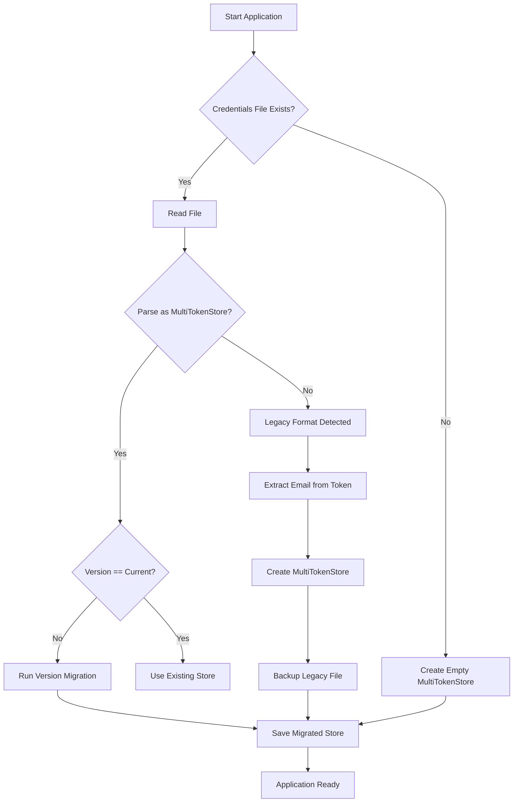
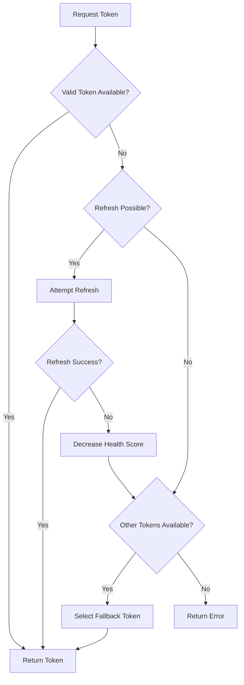
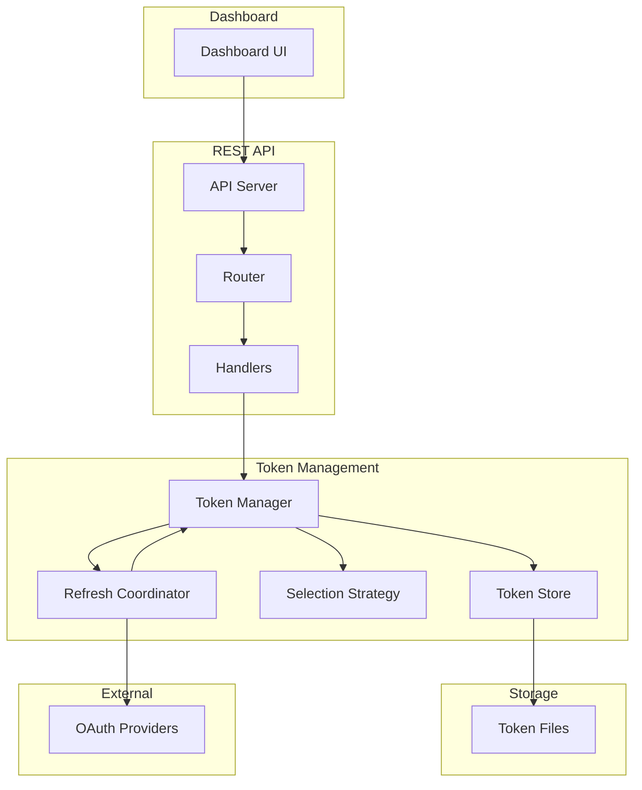
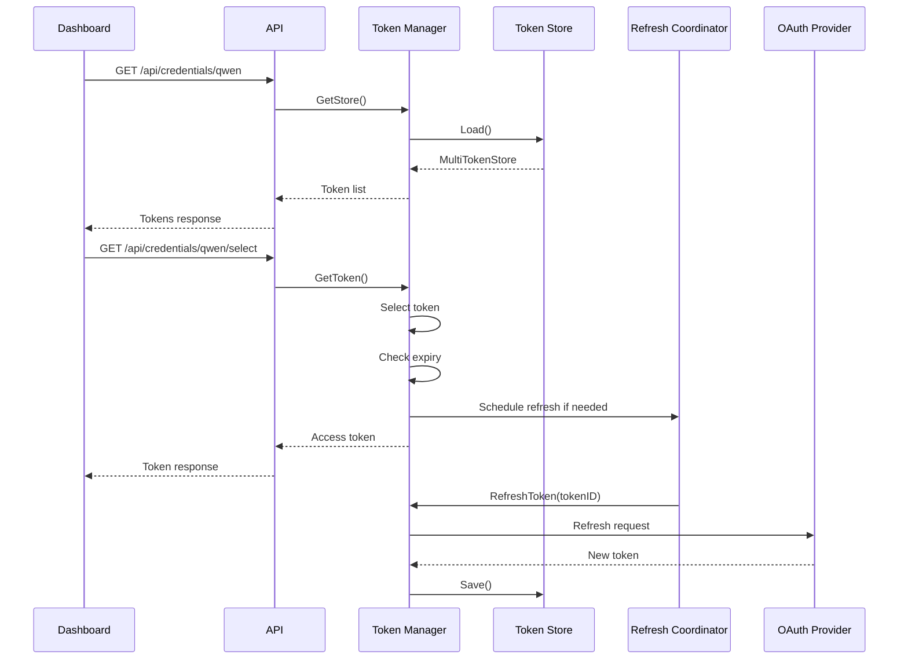

# Multi-Token Storage Architecture

## Overview

This document describes the architecture for implementing multi-token storage per OAuth provider in the qwencoder-proxy project. The design supports storing multiple OAuth/device flow tokens per provider with random token selection, automatic refresh, email extraction, and dashboard management.

## Table of Contents

1. [Data Structure Design](#1-data-structure-design)
2. [File Structure Design](#2-file-structure-design)
3. [Token Selection Algorithm](#3-token-selection-algorithm)
4. [Refresh Mechanism Design](#4-refresh-mechanism-design)
5. [Email Extraction Design](#5-email-extraction-design)
6. [API Design](#6-api-design)
7. [Dashboard UI Design](#7-dashboard-ui-design)
8. [Migration Strategy](#8-migration-strategy)
9. [Security Considerations](#9-security-considerations)
10. [Error Handling](#10-error-handling)
11. [Testing Strategy](#11-testing-strategy)

---

## 1. Data Structure Design

### 1.1 Core Multi-Token Structures

The new data structures maintain backward compatibility with existing single-token formats while supporting multiple tokens per provider.

```go
// TokenMetadata stores metadata about a token
type TokenMetadata struct {
    ID          string    `json:"id"`           // Unique token identifier (UUID)
    Email       string    `json:"email"`        // User email from OAuth
    CreatedAt   time.Time `json:"created_at"`   // When token was first created
    LastUsed    time.Time `json:"last_used"`    // Last time this token was selected
    LastRefresh time.Time `json:"last_refresh"` // Last successful refresh
    HealthScore int       `json:"health_score"` // Token health score (0-100)
}

// ProviderToken represents a single token with its metadata
type ProviderToken struct {
    Metadata    TokenMetadata `json:"metadata"`
    AccessToken string        `json:"access_token"`
    TokenType   string        `json:"token_type"`
    RefreshToken string        `json:"refresh_token,omitempty"`
    ExpiryDate  int64         `json:"expiry_date"`
    // Provider-specific fields
    ResourceURL string `json:"resource_url,omitempty"`     // Qwen
    Scope       string `json:"scope,omitempty"`           // Gemini/iFlow
    APIKey      string `json:"apiKey,omitempty"`          // iFlow
    ClientID    string `json:"clientId,omitempty"`        // Kiro
    ClientSecret string `json:"clientSecret,omitempty"`   // Kiro
    AuthMethod  string `json:"authMethod,omitempty"`     // Kiro
    Region      string `json:"region,omitempty"`         // Kiro
    ProfileArn  string `json:"profileArn,omitempty"`     // Kiro
}

// MultiTokenStore contains all tokens for a provider
type MultiTokenStore struct {
    Provider   string          `json:"provider"`   // Provider ID (qwen, gemini, etc.)
    Version    int             `json:"version"`    // Schema version for migration
    Tokens     []ProviderToken  `json:"tokens"`    // Array of tokens
    LastSync   time.Time       `json:"last_sync"`  // Last time store was synchronized
    Settings   ProviderSettings `json:"settings"`   // Provider-specific settings
}

// ProviderSettings contains configuration for token management
type ProviderSettings struct {
    SelectionStrategy string `json:"selection_strategy"` // "random", "round_robin", "least_used"
    AutoRefresh     bool   `json:"auto_refresh"`      // Enable automatic refresh
    RefreshBuffer   int    `json:"refresh_buffer"`    // Seconds before expiry to refresh (default: 1800)
    MaxTokens      int    `json:"max_tokens"`       // Maximum tokens allowed (default: 10)
}
```

### 1.2 Backward Compatibility

To maintain backward compatibility, the system will detect legacy single-token formats and automatically migrate them:

```go
// Legacy formats for backward compatibility
type LegacyOAuthCreds struct {
    AccessToken  string `json:"access_token"`
    TokenType    string `json:"token_type"`
    RefreshToken string `json:"refresh_token"`
    ResourceURL  string `json:"resource_url,omitempty"`
    ExpiryDate   int64  `json:"expiry_date"`
}

// MigrateFromLegacy converts legacy single-token format to multi-token format
func (mts *MultiTokenStore) MigrateFromLegacy(legacy LegacyOAuthCreds, email string) {
    token := ProviderToken{
        Metadata: TokenMetadata{
            ID:          generateUUID(),
            Email:       email,
            CreatedAt:   time.Now(),
            LastUsed:    time.Now(),
            LastRefresh: time.Now(),
            HealthScore: 100,
        },
        AccessToken:  legacy.AccessToken,
        TokenType:    legacy.TokenType,
        RefreshToken: legacy.RefreshToken,
        ExpiryDate:   legacy.ExpiryDate,
        ResourceURL:  legacy.ResourceURL,
    }
    mts.Tokens = append(mts.Tokens, token)
    mts.Version = CurrentSchemaVersion
}
```

### 1.3 Provider-Specific Adapters

Each provider will have an adapter to convert between its native format and the unified `ProviderToken` format:

```go
// TokenAdapter interface for provider-specific conversions
type TokenAdapter interface {
    ToProviderToken(creds interface{}, email string) ProviderToken
    FromProviderToken(token ProviderToken) interface{}
    GetUserInfoURL() string
    ExtractEmailFromTokenResponse(response []byte) (string, error)
}

// QwenTokenAdapter implements TokenAdapter for Qwen
type QwenTokenAdapter struct{}

func (a *QwenTokenAdapter) ToProviderToken(creds OAuthCreds, email string) ProviderToken {
    return ProviderToken{
        Metadata: TokenMetadata{
            ID:          generateUUID(),
            Email:       email,
            CreatedAt:   time.Now(),
            LastUsed:    time.Now(),
            LastRefresh: time.Now(),
            HealthScore: 100,
        },
        AccessToken:  creds.AccessToken,
        TokenType:    creds.TokenType,
        RefreshToken: creds.RefreshToken,
        ExpiryDate:   creds.ExpiryDate,
        ResourceURL:  creds.ResourceURL,
    }
}

// Similar adapters for Gemini, iFlow, Kiro...
```

---

## 2. File Structure Design

### 2.1 Storage Location Strategy

The design uses a **single file per provider** approach for atomicity and simplicity:

```
~/.qwen/tokens.json           # Multi-token store for Qwen
~/.gemini/tokens.json        # Multi-token store for Gemini
~/.iflow/tokens.json         # Multi-token store for iFlow
~/.aws/sso/cache/kiro-tokens.json  # Multi-token store for Kiro
```

### 2.2 File Format

```json
{
  "provider": "qwen",
  "version": 2,
  "tokens": [
    {
      "metadata": {
        "id": "550e8400-e29b-41d4-a716-446655440000",
        "email": "user1@example.com",
        "created_at": "2024-01-15T10:30:00Z",
        "last_used": "2024-01-15T12:00:00Z",
        "last_refresh": "2024-01-15T11:00:00Z",
        "health_score": 95
      },
      "access_token": "ya29.a0AfH6...",
      "token_type": "Bearer",
      "refresh_token": "1//0g...",
      "expiry_date": 1705339200000,
      "resource_url": "https://api.qwen.ai"
    },
    {
      "metadata": {
        "id": "660e8400-e29b-41d4-a716-446655440001",
        "email": "user2@example.com",
        "created_at": "2024-01-15T11:00:00Z",
        "last_used": "2024-01-15T11:30:00Z",
        "last_refresh": "2024-01-15T11:00:00Z",
        "health_score": 100
      },
      "access_token": "ya29.a0AfH6...",
      "token_type": "Bearer",
      "refresh_token": "1//0g...",
      "expiry_date": 1705342800000,
      "resource_url": "https://api.qwen.ai"
    }
  ],
  "last_sync": "2024-01-15T12:00:00Z",
  "settings": {
    "selection_strategy": "random",
    "auto_refresh": true,
    "refresh_buffer": 1800,
    "max_tokens": 10
  }
}
```

### 2.3 File Locking Strategy

File locking uses `github.com/gofrs/flock` for cross-platform atomic operations:

```go
type TokenStoreManager struct {
    storePath  string
    lock       *flock.Flock
    mu         sync.RWMutex
    inMemory   *MultiTokenStore
    adapters   map[string]TokenAdapter
}

func (tm *TokenStoreManager) Load() (*MultiTokenStore, error) {
    lockPath := tm.storePath + ".lock"
    tm.lock = flock.New(lockPath)
    
    locked, err := tm.lock.TryLock()
    if err != nil {
        return nil, fmt.Errorf("failed to acquire file lock: %w", err)
    }
    if !locked {
        return nil, fmt.Errorf("another process is holding the lock")
    }
    defer tm.lock.Unlock()
    
    // Read and parse file
    data, err := os.ReadFile(tm.storePath)
    if err != nil {
        if os.IsNotExist(err) {
            // Return empty store for new installations
            return &MultiTokenStore{
                Provider: tm.providerID,
                Version:  CurrentSchemaVersion,
                Tokens:   []ProviderToken{},
                Settings: DefaultSettings(),
            }, nil
        }
        return nil, err
    }
    
    var store MultiTokenStore
    if err := json.Unmarshal(data, &store); err != nil {
        // Try legacy migration
        return tm.migrateLegacyFormat(data)
    }
    
    return &store, nil
}

func (tm *TokenStoreManager) Save(store *MultiTokenStore) error {
    tm.mu.Lock()
    defer tm.mu.Unlock()
    
    lockPath := tm.storePath + ".lock"
    tm.lock = flock.New(lockPath)
    
    locked, err := tm.lock.TryLock()
    if err != nil || !locked {
        return fmt.Errorf("failed to acquire file lock")
    }
    defer tm.lock.Unlock()
    
    // Write to temp file first
    tmpPath := tm.storePath + ".tmp"
    data, err := json.MarshalIndent(store, "", "  ")
    if err != nil {
        return err
    }
    
    if err := os.WriteFile(tmpPath, data, 0600); err != nil {
        return err
    }
    
    // Atomic rename
    return os.Rename(tmpPath, tm.storePath)
}
```

---

## 3. Token Selection Algorithm

### 3.1 Selection Strategies

The system supports multiple token selection strategies:

```go
type SelectionStrategy interface {
    Select(tokens []ProviderToken) (*ProviderToken, error)
}

// RandomSelectionStrategy selects a token randomly
type RandomSelectionStrategy struct {
    rng *rand.Rand
}

func (s *RandomSelectionStrategy) Select(tokens []ProviderToken) (*ProviderToken, error) {
    if len(tokens) == 0 {
        return nil, fmt.Errorf("no tokens available")
    }
    
    // Filter valid tokens
    validTokens := filterValidTokens(tokens)
    if len(validTokens) == 0 {
        return nil, fmt.Errorf("no valid tokens available")
    }
    
    idx := s.rng.Intn(len(validTokens))
    return &validTokens[idx], nil
}

// RoundRobinSelectionStrategy selects tokens in round-robin fashion
type RoundRobinSelectionStrategy struct {
    counter int
    mu      sync.Mutex
}

func (s *RoundRobinSelectionStrategy) Select(tokens []ProviderToken) (*ProviderToken, error) {
    s.mu.Lock()
    defer s.mu.Unlock()
    
    validTokens := filterValidTokens(tokens)
    if len(validTokens) == 0 {
        return nil, fmt.Errorf("no valid tokens available")
    }
    
    idx := s.counter % len(validTokens)
    s.counter++
    return &validTokens[idx], nil
}

// LeastUsedSelectionStrategy selects the least recently used token
type LeastUsedSelectionStrategy struct{}

func (s *LeastUsedSelectionStrategy) Select(tokens []ProviderToken) (*ProviderToken, error) {
    validTokens := filterValidTokens(tokens)
    if len(validTokens) == 0 {
        return nil, fmt.Errorf("no valid tokens available")
    }
    
    // Find token with oldest last_used timestamp
    selected := &validTokens[0]
    for i := 1; i < len(validTokens); i++ {
        if validTokens[i].Metadata.LastUsed.Before(selected.Metadata.LastUsed) {
            selected = &validTokens[i]
        }
    }
    return selected, nil
}
```

### 3.2 Thread-Safe Token Manager

```go
type TokenManager struct {
    provider    string
    store       *TokenStoreManager
    strategy    SelectionStrategy
    refreshChan chan string
    mu          sync.RWMutex
    logger      *logging.Logger
}

func (tm *TokenManager) GetToken(ctx context.Context) (string, error) {
    tm.mu.RLock()
    defer tm.mu.RUnlock()
    
    // Load store if not in memory
    if tm.store.inMemory == nil {
        store, err := tm.store.Load()
        if err != nil {
            return "", err
        }
        tm.store.inMemory = store
    }
    
    // Select token using configured strategy
    token, err := tm.strategy.Select(tm.store.inMemory.Tokens)
    if err != nil {
        return "", err
    }
    
    // Update last_used timestamp
    token.Metadata.LastUsed = time.Now()
    
    // Check if token needs refresh
    if tm.needsRefresh(token) {
        tm.refreshChan <- token.Metadata.ID
    }
    
    return token.AccessToken, nil
}

func (tm *TokenManager) needsRefresh(token *ProviderToken) bool {
    buffer := time.Duration(tm.store.inMemory.Settings.RefreshBuffer) * time.Second
    expiry := time.UnixMilli(token.ExpiryDate)
    return time.Until(expiry) < buffer
}
```

### 3.3 Token Health Tracking

```go
type HealthTracker struct {
    scores map[string]int // token ID -> health score
    mu     sync.RWMutex
}

func (ht *HealthTracker) RecordSuccess(tokenID string) {
    ht.mu.Lock()
    defer ht.mu.Unlock()
    
    if score, ok := ht.scores[tokenID]; ok {
        ht.scores[tokenID] = min(100, score+5)
    } else {
        ht.scores[tokenID] = 100
    }
}

func (ht *HealthTracker) RecordFailure(tokenID string) {
    ht.mu.Lock()
    defer ht.mu.Unlock()
    
    if score, ok := ht.scores[tokenID]; ok {
        ht.scores[tokenID] = max(0, score-20)
    } else {
        ht.scores[tokenID] = 50
    }
}

func (ht *HealthTracker) GetScore(tokenID string) int {
    ht.mu.RLock()
    defer ht.mu.RUnlock()
    return ht.scores[tokenID]
}
```

---

## 4. Refresh Mechanism Design

### 4.1 Automatic Refresh Coordinator

```go
type RefreshCoordinator struct {
    managers map[string]*TokenManager // provider ID -> manager
    queue    chan RefreshTask
    workers  int
    wg       sync.WaitGroup
    logger   *logging.Logger
}

type RefreshTask struct {
    ProviderID string
    TokenID    string
    Priority   int // Higher = more urgent
}

func (rc *RefreshCoordinator) Start() {
    for i := 0; i < rc.workers; i++ {
        rc.wg.Add(1)
        go rc.worker()
    }
}

func (rc *RefreshCoordinator) worker() {
    defer rc.wg.Done()
    
    for task := range rc.queue {
        rc.processTask(task)
    }
}

func (rc *RefreshCoordinator) processTask(task RefreshTask) {
    manager, ok := rc.managers[task.ProviderID]
    if !ok {
        rc.logger.ErrorLog("Unknown provider: %s", task.ProviderID)
        return
    }
    
    if err := manager.RefreshToken(task.TokenID); err != nil {
        rc.logger.ErrorLog("Failed to refresh token %s: %v", task.TokenID, err)
    }
}
```

### 4.2 Refresh Prioritization

```go
type PriorityQueue struct {
    items []RefreshTask
    mu    sync.Mutex
}

func (pq *PriorityQueue) Push(task RefreshTask) {
    pq.mu.Lock()
    defer pq.mu.Unlock()
    
    pq.items = append(pq.items, task)
    pq.heapifyUp(len(pq.items) - 1)
}

func (pq *PriorityQueue) Pop() RefreshTask {
    pq.mu.Lock()
    defer pq.mu.Unlock()
    
    if len(pq.items) == 0 {
        return RefreshTask{}
    }
    
    task := pq.items[0]
    pq.items[0] = pq.items[len(pq.items)-1]
    pq.items = pq.items[:len(pq.items)-1]
    pq.heapifyDown(0)
    return task
}

// Priority calculation
func calculatePriority(token ProviderToken) int {
    expiry := time.UnixMilli(token.ExpiryDate)
    timeUntilExpiry := time.Until(expiry).Minutes()
    
    // Higher priority for tokens expiring soon
    if timeUntilExpiry < 5 {
        return 100 // Critical
    } else if timeUntilExpiry < 15 {
        return 75 // High
    } else if timeUntilExpiry < 30 {
        return 50 // Medium
    }
    return 25 // Low
}
```

### 4.3 Refresh with Fallback

```go
func (tm *TokenManager) RefreshToken(tokenID string) error {
    tm.mu.Lock()
    defer tm.mu.Unlock()
    
    store := tm.store.inMemory
    
    // Find token
    var token *ProviderToken
    for i := range store.Tokens {
        if store.Tokens[i].Metadata.ID == tokenID {
            token = &store.Tokens[i]
            break
        }
    }
    
    if token == nil {
        return fmt.Errorf("token not found: %s", tokenID)
    }
    
    // Attempt refresh
    refreshed, err := tm.attemptRefresh(token)
    if err != nil {
        // Decrease health score
        token.Metadata.HealthScore = max(0, token.Metadata.HealthScore-20)
        
        // If health score is too low, mark as unhealthy
        if token.Metadata.HealthScore < 30 {
            tm.logger.WarningLog("Token %s is unhealthy (score: %d)", tokenID, token.Metadata.HealthScore)
        }
        
        return err
    }
    
    // Update token
    *token = refreshed
    token.Metadata.LastRefresh = time.Now()
    token.Metadata.HealthScore = min(100, token.Metadata.HealthScore+10)
    
    // Save to file
    return tm.store.Save(store)
}

func (tm *TokenManager) attemptRefresh(token *ProviderToken) (ProviderToken, error) {
    // Use provider-specific refresh logic
    config, err := tm.registry.GetConfig(tm.provider)
    if err != nil {
        return ProviderToken{}, err
    }
    
    switch tm.provider {
    case "qwen":
        return tm.refreshQwen(token, config)
    case "gemini":
        return tm.refreshGemini(token, config)
    case "iflow":
        return tm.refreshIFlow(token, config)
    case "kiro":
        return tm.refreshKiro(token, config)
    default:
        return ProviderToken{}, fmt.Errorf("unsupported provider: %s", tm.provider)
    }
}
```

### 4.4 Background Refresh Scheduler

```go
type RefreshScheduler struct {
    coordinator *RefreshCoordinator
    ticker      *time.Ticker
    done        chan struct{}
}

func (rs *RefreshScheduler) Start() {
    rs.ticker = time.NewTicker(1 * time.Minute)
    
    go func() {
        for {
            select {
            case <-rs.ticker.C:
                rs.checkAndScheduleRefreshes()
            case <-rs.done:
                rs.ticker.Stop()
                return
            }
        }
    }()
}

func (rs *RefreshScheduler) checkAndScheduleRefreshes() {
    for providerID, manager := range rs.coordinator.managers {
        store := manager.GetStore()
        if store == nil {
            continue
        }
        
        for _, token := range store.Tokens {
            if manager.needsRefresh(&token) {
                priority := calculatePriority(token)
                rs.coordinator.Enqueue(RefreshTask{
                    ProviderID: providerID,
                    TokenID:    token.Metadata.ID,
                    Priority:   priority,
                })
            }
        }
    }
}
```

---

## 5. Email Extraction Design

### 5.1 Provider-Specific Email Extraction

```go
type EmailExtractor interface {
    ExtractEmail(accessToken string) (string, error)
    GetUserInfoEndpoint() string
}

// QwenEmailExtractor extracts email from Qwen OAuth
type QwenEmailExtractor struct {
    httpClient *http.Client
}

func (e *QwenEmailExtractor) GetUserInfoEndpoint() string {
    return "https://portal.qwen.ai/v1/user/info"
}

func (e *QwenEmailExtractor) ExtractEmail(accessToken string) (string, error) {
    req, err := http.NewRequest("GET", e.GetUserInfoEndpoint(), nil)
    if err != nil {
        return "", err
    }
    
    req.Header.Set("Authorization", "Bearer "+accessToken)
    
    resp, err := e.httpClient.Do(req)
    if err != nil {
        return "", err
    }
    defer resp.Body.Close()
    
    var result struct {
        Data struct {
            Email string `json:"email"`
        } `json:"data"`
    }
    
    if err := json.NewDecoder(resp.Body).Decode(&result); err != nil {
        return "", err
    }
    
    return result.Data.Email, nil
}

// GeminiEmailExtractor extracts email from Google OAuth
type GeminiEmailExtractor struct {
    httpClient *http.Client
}

func (e *GeminiEmailExtractor) GetUserInfoEndpoint() string {
    return "https://www.googleapis.com/oauth2/v3/userinfo"
}

func (e *GeminiEmailExtractor) ExtractEmail(accessToken string) (string, error) {
    req, err := http.NewRequest("GET", e.GetUserInfoEndpoint(), nil)
    if err != nil {
        return "", err
    }
    
    req.Header.Set("Authorization", "Bearer "+accessToken)
    
    resp, err := e.httpClient.Do(req)
    if err != nil {
        return "", err
    }
    defer resp.Body.Close()
    
    var result struct {
        Email string `json:"email"`
    }
    
    if err := json.NewDecoder(resp.Body).Decode(&result); err != nil {
        return "", err
    }
    
    return result.Email, nil
}

// iFlowEmailExtractor (already implemented in iflow_auth.go)
// Uses IFlowUserInfoURL: "https://iflow.cn/api/oauth/getUserInfo"

// KiroEmailExtractor
type KiroEmailExtractor struct {
    httpClient *http.Client
}

func (e *KiroEmailExtractor) GetUserInfoEndpoint() string {
    return "https://idp.us-east-1.amazonaws.com" // AWS SSO user info
}

func (e *KiroEmailExtractor) ExtractEmail(accessToken string) (string, error) {
    // Kiro uses AWS SSO which may not expose email directly
    // Extract from JWT token claims if available
    claims, err := parseJWTClaims(accessToken)
    if err != nil {
        return "", err
    }
    
    if email, ok := claims["email"].(string); ok {
        return email, nil
    }
    
    return "", fmt.Errorf("email not found in token claims")
}
```

### 5.2 Email Extraction During OAuth Flow

```go
type OAuthFlowHandler struct {
    extractors map[string]EmailExtractor
    logger     *logging.Logger
}

func (h *OAuthFlowHandler) HandleTokenExchange(providerID string, tokenResp *oauth2.Token) (ProviderToken, error) {
    extractor, ok := h.extractors[providerID]
    if !ok {
        // Fallback: create token without email
        return ProviderToken{
            Metadata: TokenMetadata{
                ID:          generateUUID(),
                Email:       "unknown@example.com",
                CreatedAt:   time.Now(),
                LastUsed:    time.Now(),
                LastRefresh: time.Now(),
                HealthScore: 100,
            },
            AccessToken:  tokenResp.AccessToken,
            TokenType:    tokenResp.TokenType,
            RefreshToken: tokenResp.RefreshToken,
            ExpiryDate:   tokenResp.Expiry.UnixMilli(),
        }, nil
    }
    
    // Extract email
    email, err := extractor.ExtractEmail(tokenResp.AccessToken)
    if err != nil {
        h.logger.WarningLog("Failed to extract email for %s: %v", providerID, err)
        email = "unknown@example.com"
    }
    
    return ProviderToken{
        Metadata: TokenMetadata{
            ID:          generateUUID(),
            Email:       email,
            CreatedAt:   time.Now(),
            LastUsed:    time.Now(),
            LastRefresh: time.Now(),
            HealthScore: 100,
        },
        AccessToken:  tokenResp.AccessToken,
        TokenType:    tokenResp.TokenType,
        RefreshToken: tokenResp.RefreshToken,
        ExpiryDate:   tokenResp.Expiry.UnixMilli(),
    }, nil
}
```

---

## 6. API Design

### 6.1 New/Modified Endpoints

```go
// GET /api/credentials/{provider} - Get all tokens for a provider
func (s *Server) handleGetProviderCredentials(w http.ResponseWriter, r *http.Request) {
    providerID := extractProviderID(r.URL.Path)
    
    manager, err := s.tokenManagers.Get(providerID)
    if err != nil {
        WriteError(w, http.StatusNotFound, "not_found", err.Error())
        return
    }
    
    store := manager.GetStore()
    if store == nil {
        WriteJSON(w, http.StatusOK, map[string]interface{}{
            "provider": providerID,
            "tokens":   []interface{}{},
            "settings": DefaultSettings(),
        })
        return
    }
    
    // Sanitize tokens for API response (remove sensitive data)
    tokens := make([]map[string]interface{}, 0, len(store.Tokens))
    for _, token := range store.Tokens {
        tokens = append(tokens, map[string]interface{}{
            "id":           token.Metadata.ID,
            "email":        token.Metadata.Email,
            "created_at":   token.Metadata.CreatedAt,
            "last_used":    token.Metadata.LastUsed,
            "last_refresh": token.Metadata.LastRefresh,
            "health_score": token.Metadata.HealthScore,
            "token_type":   token.TokenType,
            "expires_in":   (token.ExpiryDate - time.Now().UnixMilli()) / 1000,
            "valid":        isTokenValid(token),
        })
    }
    
    WriteJSON(w, http.StatusOK, map[string]interface{}{
        "provider": providerID,
        "tokens":   tokens,
        "settings": store.Settings,
    })
}

// POST /api/credentials/{provider} - Add a new token
func (s *Server) handleAddToken(w http.ResponseWriter, r *http.Request) {
    providerID := extractProviderID(r.URL.Path)
    
    var req struct {
        AccessToken  string `json:"access_token"`
        RefreshToken string `json:"refresh_token,omitempty"`
        TokenType    string `json:"token_type"`
        ExpiresIn    int64  `json:"expires_in"`
    }
    
    if err := ParseJSON(r, &req); err != nil {
        WriteError(w, http.StatusBadRequest, "invalid_request", err.Error())
        return
    }
    
    manager, err := s.tokenManagers.Get(providerID)
    if err != nil {
        WriteError(w, http.StatusNotFound, "not_found", err.Error())
        return
    }
    
    // Extract email
    extractor := s.emailExtractors[providerID]
    email, err := extractor.ExtractEmail(req.AccessToken)
    if err != nil {
        s.logger.WarningLog("Failed to extract email: %v", err)
        email = "unknown@example.com"
    }
    
    token := ProviderToken{
        Metadata: TokenMetadata{
            ID:          generateUUID(),
            Email:       email,
            CreatedAt:   time.Now(),
            LastUsed:    time.Now(),
            LastRefresh: time.Now(),
            HealthScore: 100,
        },
        AccessToken:  req.AccessToken,
        RefreshToken: req.RefreshToken,
        TokenType:    req.TokenType,
        ExpiryDate:   time.Now().UnixMilli() + (req.ExpiresIn * 1000),
    }
    
    if err := manager.AddToken(token); err != nil {
        WriteError(w, http.StatusInternalServerError, "add_failed", err.Error())
        return
    }
    
    WriteJSON(w, http.StatusCreated, map[string]interface{}{
        "id":    token.Metadata.ID,
        "email": token.Metadata.Email,
    })
}

// DELETE /api/credentials/{provider}/{tokenID} - Delete a specific token
func (s *Server) handleDeleteToken(w http.ResponseWriter, r *http.Request) {
    parts := strings.Split(r.URL.Path, "/")
    if len(parts) < 5 {
        WriteError(w, http.StatusNotFound, "not_found", "Invalid path")
        return
    }
    
    providerID := parts[3]
    tokenID := parts[4]
    
    manager, err := s.tokenManagers.Get(providerID)
    if err != nil {
        WriteError(w, http.StatusNotFound, "not_found", err.Error())
        return
    }
    
    if err := manager.RemoveToken(tokenID); err != nil {
        WriteError(w, http.StatusNotFound, "token_not_found", err.Error())
        return
    }
    
    WriteJSON(w, http.StatusOK, map[string]interface{}{
        "success": true,
        "message": "Token deleted successfully",
    })
}

// POST /api/credentials/{provider}/{tokenID}/refresh - Refresh a specific token
func (s *Server) handleRefreshToken(w http.ResponseWriter, r *http.Request) {
    parts := strings.Split(r.URL.Path, "/")
    if len(parts) < 6 {
        WriteError(w, http.StatusNotFound, "not_found", "Invalid path")
        return
    }
    
    providerID := parts[3]
    tokenID := parts[4]
    
    manager, err := s.tokenManagers.Get(providerID)
    if err != nil {
        WriteError(w, http.StatusNotFound, "not_found", err.Error())
        return
    }
    
    if err := manager.RefreshToken(tokenID); err != nil {
        WriteError(w, http.StatusInternalServerError, "refresh_failed", err.Error())
        return
    }
    
    WriteJSON(w, http.StatusOK, map[string]interface{}{
        "success": true,
        "message": "Token refreshed successfully",
    })
}

// PUT /api/credentials/{provider}/settings - Update provider settings
func (s *Server) handleUpdateSettings(w http.ResponseWriter, r *http.Request) {
    providerID := extractProviderID(r.URL.Path)
    
    var req struct {
        SelectionStrategy string `json:"selection_strategy"`
        AutoRefresh     bool   `json:"auto_refresh"`
        RefreshBuffer   int    `json:"refresh_buffer"`
        MaxTokens      int    `json:"max_tokens"`
    }
    
    if err := ParseJSON(r, &req); err != nil {
        WriteError(w, http.StatusBadRequest, "invalid_request", err.Error())
        return
    }
    
    manager, err := s.tokenManagers.Get(providerID)
    if err != nil {
        WriteError(w, http.StatusNotFound, "not_found", err.Error())
        return
    }
    
    settings := ProviderSettings{
        SelectionStrategy: req.SelectionStrategy,
        AutoRefresh:     req.AutoRefresh,
        RefreshBuffer:   req.RefreshBuffer,
        MaxTokens:      req.MaxTokens,
    }
    
    if err := manager.UpdateSettings(settings); err != nil {
        WriteError(w, http.StatusInternalServerError, "update_failed", err.Error())
        return
    }
    
    WriteJSON(w, http.StatusOK, map[string]interface{}{
        "success": true,
        "settings": settings,
    })
}

// GET /api/credentials/{provider}/select - Get a selected token for use
func (s *Server) handleSelectToken(w http.ResponseWriter, r *http.Request) {
    providerID := extractProviderID(r.URL.Path)
    
    manager, err := s.tokenManagers.Get(providerID)
    if err != nil {
        WriteError(w, http.StatusNotFound, "not_found", err.Error())
        return
    }
    
    accessToken, err := manager.GetToken(r.Context())
    if err != nil {
        WriteError(w, http.StatusServiceUnavailable, "no_token", err.Error())
        return
    }
    
    WriteJSON(w, http.StatusOK, map[string]interface{}{
        "access_token": accessToken,
        "token_type":   "Bearer",
    })
}
```

### 6.2 Modified Existing Endpoints

```go
// Modified GET /api/credentials - Returns summary of all providers with token counts
func (s *Server) handleListCredentials(w http.ResponseWriter, r *http.Request) {
    providers := s.registry.ListProviders()
    credentials := make([]map[string]interface{}, 0)
    
    for _, provider := range providers {
        manager, err := s.tokenManagers.Get(provider.ID)
        if err != nil {
            continue
        }
        
        store := manager.GetStore()
        if store == nil {
            continue
        }
        
        // Count valid tokens
        validCount := 0
        for _, token := range store.Tokens {
            if isTokenValid(token) {
                validCount++
            }
        }
        
        info := map[string]interface{}{
            "provider":      provider.ID,
            "total_tokens":  len(store.Tokens),
            "valid_tokens": validCount,
            "settings":     store.Settings,
        }
        
        credentials = append(credentials, info)
    }
    
    WriteJSON(w, http.StatusOK, map[string]interface{}{
        "credentials": credentials,
    })
}
```

---

## 7. Dashboard UI Design

### 7.1 Provider Card with Multi-Token Display

```html
<div class="provider-card" data-provider="qwen">
    <div class="provider-header">
        <div class="provider-icon">🤖</div>
        <div class="provider-info">
            <h3>Qwen</h3>
            <span class="provider-flow">Device Code Flow</span>
        </div>
        <div class="token-badge" id="tokenCount-qwen">2 tokens</div>
    </div>
    
    <div class="provider-status authenticated" id="status-qwen">
        <span>✓</span>
        <span>Authenticated</span>
    </div>
    
    <!-- Token List -->
    <div class="token-list" id="tokenList-qwen">
        <!-- Tokens will be dynamically inserted -->
    </div>
    
    <!-- Provider Actions -->
    <div class="provider-actions">
        <button class="btn btn-primary" onclick="dashboard.startAuth('qwen')">
            🔑 Add Token
        </button>
        <button class="btn btn-secondary" onclick="dashboard.refreshAllTokens('qwen')">
            🔄 Refresh All
        </button>
        <button class="btn btn-secondary" onclick="dashboard.showSettings('qwen')">
            ⚙️ Settings
        </button>
    </div>
</div>

<!-- Token Item Template -->
<template id="tokenItemTemplate">
    <div class="token-item" data-token-id="">
        <div class="token-header">
            <div class="token-email"></div>
            <div class="token-health">
                <div class="health-bar">
                    <div class="health-fill"></div>
                </div>
                <span class="health-score"></span>
            </div>
        </div>
        <div class="token-details">
            <div class="token-detail">
                <span class="label">Created:</span>
                <span class="value token-created"></span>
            </div>
            <div class="token-detail">
                <span class="label">Last Used:</span>
                <span class="value token-last-used"></span>
            </div>
            <div class="token-detail">
                <span class="label">Expires:</span>
                <span class="value token-expires"></span>
            </div>
        </div>
        <div class="token-actions">
            <button class="btn btn-sm btn-secondary" onclick="dashboard.refreshToken('', '')">
                🔄
            </button>
            <button class="btn btn-sm btn-danger" onclick="dashboard.deleteToken('', '')">
                🗑️
            </button>
        </div>
    </div>
</template>
```

### 7.2 Dashboard JavaScript Updates

```javascript
// Updated OAuthAPIClient with multi-token support
class OAuthAPIClient {
    async getProviderCredentials(provider) {
        return this.request('GET', `/api/credentials/${provider}`);
    }
    
    async addToken(provider, tokenData) {
        return this.request('POST', `/api/credentials/${provider}`, tokenData);
    }
    
    async deleteToken(provider, tokenId) {
        return this.request('DELETE', `/api/credentials/${provider}/${tokenId}`);
    }
    
    async refreshToken(provider, tokenId) {
        return this.request('POST', `/api/credentials/${provider}/${tokenId}/refresh`);
    }
    
    async updateSettings(provider, settings) {
        return this.request('PUT', `/api/credentials/${provider}/settings`, settings);
    }
    
    async selectToken(provider) {
        return this.request('GET', `/api/credentials/${provider}/select`);
    }
}

// Updated Dashboard class
class Dashboard {
    async loadProviderCredentials(providerId) {
        try {
            const data = await this.api.getProviderCredentials(providerId);
            this.renderTokenList(providerId, data.tokens);
        } catch (error) {
            this.log(`Failed to load credentials for ${providerId}: ${error.message}`, 'error');
        }
    }
    
    renderTokenList(providerId, tokens) {
        const container = document.getElementById(`tokenList-${providerId}`);
        const template = document.getElementById('tokenItemTemplate');
        
        container.innerHTML = '';
        
        tokens.forEach(token => {
            const clone = template.content.cloneNode(true);
            const item = clone.querySelector('.token-item');
            
            item.dataset.tokenId = token.id;
            item.dataset.provider = providerId;
            
            clone.querySelector('.token-email').textContent = token.email;
            clone.querySelector('.health-score').textContent = `${token.health_score}%`;
            clone.querySelector('.health-fill').style.width = `${token.health_score}%`;
            clone.querySelector('.token-created').textContent = this.formatDate(token.created_at);
            clone.querySelector('.token-last-used').textContent = this.formatDate(token.last_used);
            clone.querySelector('.token-expires').textContent = this.formatExpiresIn(token.expires_in);
            
            // Update action buttons
            const refreshBtn = clone.querySelector('button[onclick*="refreshToken"]');
            refreshBtn.setAttribute('onclick', `dashboard.refreshToken('${providerId}', '${token.id}')`);
            
            const deleteBtn = clone.querySelector('button[onclick*="deleteToken"]');
            deleteBtn.setAttribute('onclick', `dashboard.deleteToken('${providerId}', '${token.id}')`);
            
            container.appendChild(clone);
        });
        
        // Update token count badge
        const badge = document.getElementById(`tokenCount-${providerId}`);
        if (badge) {
            badge.textContent = `${tokens.length} token${tokens.length !== 1 ? 's' : ''}`;
        }
    }
    
    async deleteToken(providerId, tokenId) {
        if (!confirm('Are you sure you want to delete this token?')) {
            return;
        }
        
        try {
            await this.api.deleteToken(providerId, tokenId);
            this.log(`Token deleted for ${providerId}`, 'success');
            await this.loadProviderCredentials(providerId);
        } catch (error) {
            this.log(`Failed to delete token: ${error.message}`, 'error');
        }
    }
    
    async refreshToken(providerId, tokenId) {
        try {
            await this.api.refreshToken(providerId, tokenId);
            this.log(`Token refreshed for ${providerId}`, 'success');
            await this.loadProviderCredentials(providerId);
        } catch (error) {
            this.log(`Failed to refresh token: ${error.message}`, 'error');
        }
    }
    
    async refreshAllTokens(providerId) {
        try {
            const data = await this.api.getProviderCredentials(providerId);
            const promises = data.tokens.map(token => 
                this.api.refreshToken(providerId, token.id)
            );
            await Promise.all(promises);
            this.log(`All tokens refreshed for ${providerId}`, 'success');
            await this.loadProviderCredentials(providerId);
        } catch (error) {
            this.log(`Failed to refresh all tokens: ${error.message}`, 'error');
        }
    }
    
    showSettings(providerId) {
        // Show settings modal for provider
        const modal = document.getElementById('settingsModal');
        const providerSettings = this.stateManager.getProviderSettings(providerId) || DefaultSettings();
        
        document.getElementById('selectionStrategy').value = providerSettings.selection_strategy;
        document.getElementById('autoRefresh').checked = providerSettings.auto_refresh;
        document.getElementById('refreshBuffer').value = providerSettings.refresh_buffer;
        document.getElementById('maxTokens').value = providerSettings.max_tokens;
        
        modal.dataset.provider = providerId;
        modal.classList.add('active');
    }
}
```

### 7.3 Settings Modal

```html
<div class="modal-overlay" id="providerSettingsModal">
    <div class="modal">
        <div class="modal-header">
            <h3>Provider Settings</h3>
            <button class="modal-close" onclick="dashboard.hideProviderSettings()">&times;</button>
        </div>
        <div class="modal-body">
            <div class="form-group">
                <label for="selectionStrategy">Token Selection Strategy</label>
                <select id="selectionStrategy" class="form-control">
                    <option value="random">Random</option>
                    <option value="round_robin">Round Robin</option>
                    <option value="least_used">Least Used</option>
                </select>
            </div>
            <div class="form-group">
                <label>
                    <input type="checkbox" id="autoRefresh">
                    Enable Automatic Refresh
                </label>
            </div>
            <div class="form-group">
                <label for="refreshBuffer">Refresh Buffer (seconds)</label>
                <input type="number" id="refreshBuffer" min="60" max="3600" value="1800">
            </div>
            <div class="form-group">
                <label for="maxTokens">Maximum Tokens</label>
                <input type="number" id="maxTokens" min="1" max="50" value="10">
            </div>
        </div>
        <div class="modal-footer">
            <button class="btn btn-secondary" onclick="dashboard.hideProviderSettings()">Cancel</button>
            <button class="btn btn-primary" onclick="dashboard.saveProviderSettings()">Save</button>
        </div>
    </div>
</div>
```

---

## 8. Migration Strategy

### 8.1 Automatic Migration on Load

```go
const (
    SchemaVersionV1 = 1 // Single-token format
    SchemaVersionV2 = 2 // Multi-token format
    CurrentSchemaVersion = SchemaVersionV2
)

type MigrationManager struct {
    extractors map[string]EmailExtractor
    logger     *logging.Logger
}

func (mm *MigrationManager) MigrateIfNeeded(filePath string, providerID string) (*MultiTokenStore, error) {
    data, err := os.ReadFile(filePath)
    if err != nil {
        if os.IsNotExist(err) {
            // New installation - create empty store
            return &MultiTokenStore{
                Provider: providerID,
                Version:  CurrentSchemaVersion,
                Tokens:   []ProviderToken{},
                Settings: DefaultSettings(),
            }, nil
        }
        return nil, err
    }
    
    // Try to parse as MultiTokenStore
    var store MultiTokenStore
    if err := json.Unmarshal(data, &store); err == nil {
        // Check version
        if store.Version == CurrentSchemaVersion {
            return &store, nil
        }
        // Handle version migration if needed
        return mm.migrateVersion(&store)
    }
    
    // Legacy format - migrate from single-token
    return mm.migrateFromLegacy(data, providerID)
}

func (mm *MigrationManager) migrateFromLegacy(data []byte, providerID string) (*MultiTokenStore, error) {
    mm.logger.InfoLog("Migrating legacy format for provider: %s", providerID)
    
    var store MultiTokenStore
    
    switch providerID {
    case "qwen":
        var legacy OAuthCreds
        if err := json.Unmarshal(data, &legacy); err != nil {
            return nil, err
        }
        store = mm.createStoreFromLegacy(providerID, legacy.AccessToken, legacy.RefreshToken, legacy.ExpiryDate, "")
        
    case "gemini":
        var legacy GeminiCredentials
        if err := json.Unmarshal(data, &legacy); err != nil {
            return nil, err
        }
        store = mm.createStoreFromLegacy(providerID, legacy.AccessToken, legacy.RefreshToken, legacy.ExpiryDate, "")
        
    case "iflow":
        var legacy IFlowCredentials
        if err := json.Unmarshal(data, &legacy); err != nil {
            return nil, err
        }
        store = mm.createStoreFromLegacy(providerID, legacy.AccessToken, legacy.RefreshToken, legacy.ExpiryDate, legacy.Email)
        
    case "kiro":
        var legacy KiroCredentials
        if err := json.Unmarshal(data, &legacy); err != nil {
            return nil, err
        }
        expiry, _ := time.Parse(time.RFC3339, legacy.ExpiresAt)
        store = mm.createStoreFromLegacy(providerID, legacy.AccessToken, legacy.RefreshToken, expiry.UnixMilli(), "")
    }
    
    // Backup legacy file
    backupPath := filePath + ".backup"
    os.WriteFile(backupPath, data, 0600)
    mm.logger.InfoLog("Legacy file backed up to: %s", backupPath)
    
    return &store, nil
}

func (mm *MigrationManager) createStoreFromLegacy(providerID, accessToken, refreshToken string, expiryDate int64, email string) MultiTokenStore {
    // Extract email if not provided
    if email == "" {
        extractor := mm.extractors[providerID]
        if extractor != nil {
            if extractedEmail, err := extractor.ExtractEmail(accessToken); err == nil {
                email = extractedEmail
            }
        }
    }
    
    return MultiTokenStore{
        Provider: providerID,
        Version:  CurrentSchemaVersion,
        Tokens: []ProviderToken{
            {
                Metadata: TokenMetadata{
                    ID:          generateUUID(),
                    Email:       email,
                    CreatedAt:   time.Now(),
                    LastUsed:    time.Now(),
                    LastRefresh: time.Now(),
                    HealthScore: 100,
                },
                AccessToken:  accessToken,
                RefreshToken: refreshToken,
                TokenType:    "Bearer",
                ExpiryDate:   expiryDate,
            },
        },
        Settings: DefaultSettings(),
    }
}
```

### 8.2 Migration Workflow



### 8.3 Rollback Strategy

```go
func (mm *MigrationManager) Rollback(filePath string) error {
    backupPath := filePath + ".backup"
    
    if _, err := os.Stat(backupPath); os.IsNotExist(err) {
        return fmt.Errorf("no backup file found")
    }
    
    // Restore from backup
    data, err := os.ReadFile(backupPath)
    if err != nil {
        return err
    }
    
    return os.WriteFile(filePath, data, 0600)
}
```

---

## 9. Security Considerations

### 9.1 File Permissions

```go
const (
    CredentialsFileMode = 0600 // Owner read/write only
    CredentialsDirMode  = 0700 // Owner read/write/execute only
)

func ensureSecurePath(path string) error {
    dir := filepath.Dir(path)
    
    // Create directory with secure permissions
    if err := os.MkdirAll(dir, CredentialsDirMode); err != nil {
        return err
    }
    
    // Verify directory permissions
    info, err := os.Stat(dir)
    if err != nil {
        return err
    }
    
    mode := info.Mode().Perm()
    if mode != CredentialsDirMode {
        return fmt.Errorf("insecure directory permissions: %v", mode)
    }
    
    return nil
}
```

### 9.2 Token Isolation

```go
// Each provider's tokens are stored in separate files
// No cross-provider token sharing

// Token IDs are UUIDs to prevent guessing
type TokenID string

func generateTokenID() TokenID {
    b := make([]byte, 16)
    rand.Read(b)
    return TokenID(fmt.Sprintf("%x-%x-%x-%x-%x", b[0:4], b[4:6], b[6:8], b[8:10], b[10:16]))
}
```

### 9.3 Secure Token Transmission

```go
// Never log full tokens
type SafeToken struct {
    ID         string
    Email      string
    TokenType  string
    ExpiresIn  int64
    Valid      bool
}

func (pt *ProviderToken) ToSafeToken() SafeToken {
    return SafeToken{
        ID:        pt.Metadata.ID,
        Email:     pt.Metadata.Email,
        TokenType:  pt.TokenType,
        ExpiresIn: (pt.ExpiryDate - time.Now().UnixMilli()) / 1000,
        Valid:     isTokenValid(pt),
    }
}

// Redact tokens in logs
func redactToken(token string) string {
    if len(token) <= 8 {
        return "***"
    }
    return token[:4] + "..." + token[len(token)-4:]
}
```

### 9.4 Audit Logging

```go
type AuditLogger struct {
    logger *logging.Logger
    file   *os.File
    mu     sync.Mutex
}

type AuditEvent struct {
    Timestamp time.Time `json:"timestamp"`
    Event     string    `json:"event"`
    Provider  string    `json:"provider"`
    TokenID   string    `json:"token_id,omitempty"`
    Email     string    `json:"email,omitempty"`
    Success   bool      `json:"success"`
    Error     string    `json:"error,omitempty"`
}

func (al *AuditLogger) Log(event, provider, tokenID, email string, success bool, err error) {
    al.mu.Lock()
    defer al.mu.Unlock()
    
    auditEvent := AuditEvent{
        Timestamp: time.Now(),
        Event:     event,
        Provider:  provider,
        TokenID:   tokenID,
        Email:     email,
        Success:   success,
    }
    
    if err != nil {
        auditEvent.Error = err.Error()
    }
    
    data, _ := json.Marshal(auditEvent)
    al.file.Write(append(data, '\n'))
}
```

---

## 10. Error Handling

### 10.1 Error Types

```go
type TokenError struct {
    Code    string `json:"code"`
    Message string `json:"message"`
    Provider string `json:"provider,omitempty"`
    TokenID  string `json:"token_id,omitempty"`
}

const (
    ErrNoTokensAvailable      = "no_tokens_available"
    ErrAllTokensExpired      = "all_tokens_expired"
    ErrTokenRefreshFailed    = "token_refresh_failed"
    ErrMaxTokensExceeded    = "max_tokens_exceeded"
    ErrInvalidTokenID      = "invalid_token_id"
    ErrProviderNotFound     = "provider_not_found"
    ErrLockAcquisitionFailed = "lock_acquisition_failed"
)

func (e *TokenError) Error() string {
    return fmt.Sprintf("[%s] %s", e.Code, e.Message)
}
```

### 10.2 Error Recovery Strategies

```go
type RecoveryStrategy interface {
    Recover(error) error
}

// RetryStrategy implements exponential backoff retry
type RetryStrategy struct {
    maxRetries int
    baseDelay  time.Duration
}

func (rs *RetryStrategy) Recover(err error) error {
    for i := 0; i < rs.maxRetries; i++ {
        delay := rs.baseDelay * time.Duration(1<<uint(i))
        time.Sleep(delay)
        // Retry operation
    }
    return err
}

// FallbackStrategy uses next available token
type FallbackStrategy struct {
    manager *TokenManager
}

func (fs *FallbackStrategy) Recover(err error) error {
    // Mark current token as unhealthy
    // Select next available token
    return nil
}
```

### 10.3 Error Handling Flow



### 10.4 Circuit Breaker Pattern

```go
type CircuitBreaker struct {
    mu           sync.Mutex
    failures     int
    lastFailTime time.Time
    threshold    int
    timeout      time.Duration
    state        string // "closed", "open", "half-open"
}

func (cb *CircuitBreaker) Allow() bool {
    cb.mu.Lock()
    defer cb.mu.Unlock()
    
    if cb.state == "open" {
        if time.Since(cb.lastFailTime) > cb.timeout {
            cb.state = "half-open"
            return true
        }
        return false
    }
    
    return true
}

func (cb *CircuitBreaker) RecordSuccess() {
    cb.mu.Lock()
    defer cb.mu.Unlock()
    
    cb.failures = 0
    cb.state = "closed"
}

func (cb *CircuitBreaker) RecordFailure() {
    cb.mu.Lock()
    defer cb.mu.Unlock()
    
    cb.failures++
    cb.lastFailTime = time.Now()
    
    if cb.failures >= cb.threshold {
        cb.state = "open"
    }
}
```

---

## 11. Testing Strategy

### 11.1 Unit Tests

```go
// Token Store Tests
func TestTokenStore_LoadAndSave(t *testing.T) {
    // Test loading and saving token store
    // Test file locking
    // Test atomic writes
}

func TestTokenStore_Migration(t *testing.T) {
    // Test legacy format migration
    // Test email extraction during migration
    // Test backup creation
}

// Token Selection Tests
func TestRandomSelectionStrategy(t *testing.T) {
    // Test random distribution
    // Test with valid tokens only
    // Test with no valid tokens
}

func TestRoundRobinSelectionStrategy(t *testing.T) {
    // Test round-robin order
    // Test wraparound
}

// Refresh Tests
func TestTokenManager_RefreshToken(t *testing.T) {
    // Test successful refresh
    // Test failed refresh
    // Test health score updates
}

// Email Extraction Tests
func TestEmailExtractor_ExtractEmail(t *testing.T) {
    // Test successful extraction
    // Test failed extraction
    // Test with mock HTTP server
}
```

### 11.2 Integration Tests

```go
func TestMultiTokenFlow(t *testing.T) {
    // Setup test server
    // 1. Add first token
    // 2. Add second token
    // 3. Verify both tokens stored
    // 4. Request token (verify selection)
    // 5. Refresh token
    // 6. Delete token
    // 7. Verify remaining token
}

func TestConcurrentAccess(t *testing.T) {
    // Test multiple goroutines accessing tokens
    // Test concurrent refresh operations
    // Test file locking under load
}
```

### 11.3 End-to-End Tests

```go
func TestE2E_OAuthFlow(t *testing.T) {
    // 1. Start OAuth flow
    // 2. Complete authorization
    // 3. Verify email extraction
    // 4. Verify token storage
    // 5. Use token via API
    // 6. Verify token refresh
}

func TestE2E_Dashboard(t *testing.T) {
    // 1. Start dashboard
    // 2. Add multiple tokens
    // 3. Verify display
    // 4. Refresh via dashboard
    // 5. Delete via dashboard
}
```

### 11.4 Performance Tests

```go
func BenchmarkTokenSelection(b *testing.B) {
    // Benchmark selection strategies
    // Benchmark with 10, 100, 1000 tokens
}

func BenchmarkTokenRefresh(b *testing.B) {
    // Benchmark refresh operations
    // Benchmark concurrent refreshes
}
```

### 11.5 Test Coverage Goals

- Unit tests: >80% code coverage
- Integration tests: All API endpoints
- E2E tests: Critical user flows
- Performance tests: Validate scalability

---

## Appendix A: System Architecture Diagram



## Appendix B: Data Flow



---

## Summary

This architecture provides a comprehensive solution for multi-token storage per provider with the following key features:

1. **Multi-Token Storage**: Each provider can store multiple tokens with metadata
2. **Random Token Selection**: Configurable selection strategies (random, round-robin, least-used)
3. **Automatic Token Refresh**: Background refresh coordinator with prioritization
4. **Email Extraction**: Provider-specific email extraction during OAuth flow
5. **Dashboard Updates**: UI for displaying and managing multiple tokens
6. **Backward Compatibility**: Automatic migration from single-token format
7. **Security**: File permissions, token isolation, audit logging
8. **Error Handling**: Comprehensive error types and recovery strategies
9. **Testing**: Unit, integration, E2E, and performance tests

The design follows Go best practices and is production-ready for implementation.
