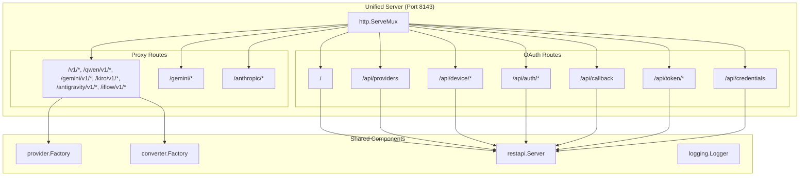
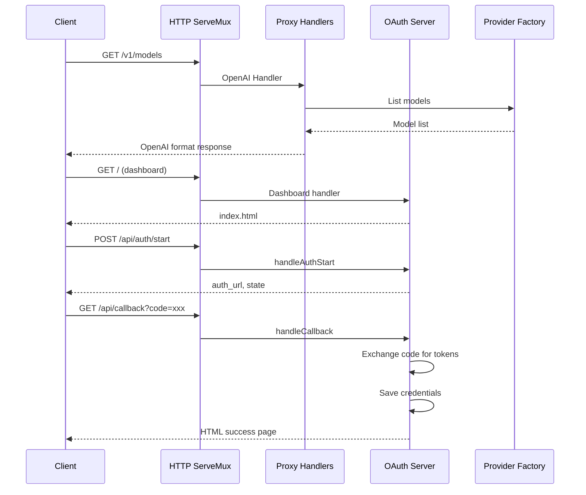

# OAuth REST API and Dashboard Integration Design

## Document Information

| Field | Value |
|-------|-------|
| Project | qwencoder-proxy |
| Date | 2026-01-23 |
| Version | 1.0 |
| Author | Architect Mode Analysis |

---

## Executive Summary

This document outlines the integration design for adding OAuth REST API and dashboard functionality to the existing qwencoder-proxy server. The design follows the KISS principle - minimal changes, simple implementation, leveraging existing code without duplication.

**Key Insight**: The OAuth REST API server ([`restapi/rest_api.go`](restapi/rest_api.go:1)) already includes dashboard serving functionality. The integration primarily involves:
1. Creating a unified server entry point
2. Merging route handlers from both proxy and OAuth API
3. Running everything on a single port (8143)

---

## 1. Current Architecture Analysis

### 1.1 Proxy Server Components

The proxy server functionality is distributed across handler files:

| Component | Location | Purpose |
|-----------|-----------|---------|
| **OpenAI Handler** | [`proxy/openai_handler.go`](proxy/openai_handler.go:1) | Handles `/v1/*` and provider-specific `/qwen/v1/*`, `/gemini/v1/*`, etc. routes |
| **Gemini Handler** | [`proxy/gemini_handler.go`](proxy/gemini_handler.go:1) | Handles native Gemini routes `/gemini/*` |
| **Anthropic Handler** | [`proxy/anthropic_handler.go`](proxy/anthropic_handler.go:1) | Handles native Anthropic routes `/anthropic/*` |
| **Common Functions** | [`proxy/common.go`](proxy/common.go:1) | Shared streaming and conversion utilities |
| **Provider Factory** | [`provider/factory.go`](provider/factory.go:1) | Manages provider instances and model routing |

**Current Status**: The proxy handlers exist but there is NO main entry point that starts a unified proxy server. The README mentions `cmd/qwencoder-proxy/main.go` but this file does not exist in the current codebase.

### 1.2 OAuth REST API Server

| Component | Location | Purpose |
|-----------|-----------|---------|
| **REST API Server** | [`restapi/rest_api.go`](restapi/rest_api.go:1) | OAuth endpoints and dashboard serving |
| **Provider Registry** | [`restapi/provider_registry.go`](restapi/provider_registry.go:1) | OAuth provider configurations |
| **State Manager** | [`restapi/state_manager.go`](restapi/state_manager.go:1) | In-memory OAuth state management |
| **Middleware** | [`restapi/middleware.go`](restapi/middleware.go:1) | CORS, logging, error handling |
| **Entry Point** | [`cmd/oauth-server/main.go`](cmd/oauth-server/main.go:1) | Standalone OAuth server (port 8080) |

**Current Status**: Runs as a separate server with its own entry point.

### 1.3 Dashboard

| Component | Location | Purpose |
|-----------|-----------|---------|
| **Dashboard UI** | [`web/dashboard/index.html`](web/dashboard/index.html:1) | Single-page OAuth management interface |

**Current Status**: Already integrated into OAuth REST API server via [`rest_api.go:116-142`](restapi/rest_api.go:116-142).

### 1.4 Configuration

The [`config/config.go`](config/config.go:1) file defines:

```go
type Config struct {
    Server      ServerConfig      // Port: "8143" (default)
    HTTPClient  HTTPClientConfig
    Logging     LoggingConfig
    OAuthServer OAuthServerConfig // Port: "8080" (default)
}
```

---

## 2. Integration Design

### 2.1 Design Principles

1. **KISS**: Minimal code changes, leverage existing implementations
2. **Single Port**: All functionality on port 8143
3. **No Duplication**: Reuse existing OAuth REST API code
4. **Backward Compatible**: Existing proxy routes remain unchanged
5. **Clean Separation**: Proxy routes and OAuth routes use distinct path prefixes

### 2.2 Proposed Architecture



### 2.3 Route Structure

| Path Prefix | Type | Handler Location | Description |
|-------------|-------|------------------|-------------|
| `/` | Dashboard | OAuth Server | Serves [`index.html`](web/dashboard/index.html:1) |
| `/v1/` | Proxy API | OpenAI Handler | General OpenAI-compatible routes |
| `/{provider}/v1/` | Proxy API | OpenAI Handler | Provider-specific OpenAI routes |
| `/gemini/` | Proxy API | Gemini Handler | Native Gemini routes |
| `/anthropic/` | Proxy API | Anthropic Handler | Native Anthropic routes |
| `/api/providers` | OAuth API | OAuth Server | List OAuth providers |
| `/api/device/` | OAuth API | OAuth Server | Device code flow |
| `/api/auth/` | OAuth API | OAuth Server | Authorization code flow |
| `/api/callback` | OAuth API | OAuth Server | OAuth callback handler |
| `/api/token/` | OAuth API | OAuth Server | Token management |
| `/api/credentials` | OAuth API | OAuth Server | Credentials management |

**Route Conflict Resolution**: 
- `/` serves dashboard (exact match only)
- `/api/*` serves OAuth endpoints (takes precedence over `/v1/` due to more specific prefix)
- `/v1/*` and other proxy routes handle all other requests

---

## 3. Implementation Plan

### 3.1 File Structure Changes

```
qwencoder-proxy/
├── cmd/
│   └── qwencoder-proxy/          # NEW: Main unified server entry point
│       └── main.go
├── config/
│   └── config.go                # MODIFIED: Update default port for OAuth
├── proxy/
│   ├── openai_handler.go         # EXISTING: No changes needed
│   ├── gemini_handler.go         # EXISTING: No changes needed
│   ├── anthropic_handler.go      # EXISTING: No changes needed
│   └── common.go               # EXISTING: No changes needed
├── restapi/
│   ├── rest_api.go              # EXISTING: No changes needed (already has dashboard serving)
│   ├── provider_registry.go      # EXISTING: No changes needed
│   ├── state_manager.go         # EXISTING: No changes needed
│   └── middleware.go           # EXISTING: No changes needed
├── web/
│   └── dashboard/
│       └── index.html          # EXISTING: No changes needed
└── ... (other existing files)
```

### 3.2 New Main Entry Point

Create [`cmd/qwencoder-proxy/main.go`](cmd/qwencoder-proxy/main.go:1) with the following structure:

```go
package main

import (
    "fmt"
    "os"
    "os/signal"
    "syscall"

    "github.com/sunbankio/qwencoder-proxy/config"
    "github.com/sunbankio/qwencoder-proxy/converter"
    "github.com/sunbankio/qwencoder-proxy/logging"
    "github.com/sunbankio/qwencoder-proxy/provider"
    "github.com/sunbankio/qwencoder-proxy/proxy"
    "github.com/sunbankio/qwencoder-proxy/restapi"
)

func main() {
    // Load configuration
    cfg := config.DefaultConfig()
    
    // Override OAuth server port to match proxy port
    cfg.OAuthServer.Port = cfg.Server.Port
    cfg.OAuthServer.CallbackBaseURL = "http://localhost:" + cfg.Server.Port
    
    // Initialize logger
    logger := logging.NewLogger()
    if cfg.Logging.IsDebugMode {
        logger.DebugLog("Debug mode enabled")
    }
    
    // Initialize provider factory
    factory := provider.NewFactory()
    
    // Register all providers
    // (provider registration code from existing implementation)
    
    // Populate model-to-provider mapping
    ctx := context.Background()
    if err := factory.PopulateModelProviders(ctx); err != nil {
        logger.ErrorLog("Failed to populate model providers: %v", err)
    }
    
    // Initialize converter factory
    convFactory := converter.NewFactory()
    
    // Create HTTP multiplexer
    mux := http.NewServeMux()
    
    // Register proxy routes
    proxy.RegisterOpenAIRoutes(mux, factory, convFactory)
    proxy.RegisterProviderSpecificRoutes(mux, factory, convFactory)
    proxy.RegisterGeminiRoutes(mux, factory)
    proxy.RegisterAnthropicRoutes(mux, factory)
    
    // Create OAuth REST API server
    oauthConfig := &restapi.Config{
        Port:            cfg.Server.Port,
        CallbackBaseURL: cfg.OAuthServer.CallbackBaseURL,
        StateTTL:        cfg.OAuthServer.StateTTL,
        DeviceCodeTTL:   cfg.OAuthServer.DeviceCodeTTL,
        EnableCORS:      cfg.OAuthServer.EnableCORS,
        AllowedOrigins:  cfg.OAuthServer.AllowedOrigins,
    }
    oauthServer := restapi.NewServer(oauthConfig, logger)
    
    // Register OAuth routes
    oauthServer.RegisterRoutes(mux)
    
    // Apply middleware
    var handler http.Handler = mux
    if cfg.OAuthServer.EnableCORS {
        handler = restapi.CORS(cfg.OAuthServer.AllowedOrigins)(handler)
    }
    handler = restapi.Logging(logger)(handler)
    
    // Start server
    addr := ":" + cfg.Server.Port
    logger.InfoLog("Starting qwencoder-proxy on %s", addr)
    logger.InfoLog("Dashboard available at http://localhost:%s", cfg.Server.Port)
    logger.InfoLog("OAuth API available at http://localhost:%s/api", cfg.Server.Port)
    
    // Handle graceful shutdown
    sigChan := make(chan os.Signal, 1)
    signal.Notify(sigChan, os.Interrupt, syscall.SIGTERM)
    
    go func() {
        <-sigChan
        logger.InfoLog("Shutting down...")
        os.Exit(0)
    }()
    
    if err := http.ListenAndServe(addr, handler); err != nil {
        logger.ErrorLog("Server error: %v", err)
        os.Exit(1)
    }
}
```

### 3.3 Configuration Changes

Modify [`config/config.go`](config/config.go:1):

```go
// In DefaultConfig(), update OAuthServer default port:
OAuthServer: OAuthServerConfig{
    Port:            "8143",  // Changed from "8080" to match proxy port
    CallbackBaseURL: "http://localhost:8143",  // Changed from "http://localhost:8080"
    StateTTL:        10 * time.Minute,
    DeviceCodeTTL:   15 * time.Minute,
    EnableCORS:      false,
    AllowedOrigins:  []string{"*"},
},
```

### 3.4 OAuth Server Modifications

Modify [`restapi/rest_api.go`](restapi/rest_api.go:1):

**Change 1**: Add `RegisterRoutes` method to allow external mux registration

```go
// RegisterRoutes registers OAuth API routes with an external http.ServeMux
// This allows the OAuth server to be integrated into a larger server
func (s *Server) RegisterRoutes(mux *http.ServeMux) {
    // Resolve dashboard directory
    dashboardDir, err := s.resolveDashboardDir()
    if err != nil {
        s.logger.ErrorLog("Failed to resolve dashboard directory: %v", err)
        dashboardDir = "web/dashboard"
    } else {
        s.logger.InfoLog("Dashboard directory: %s", dashboardDir)
    }

    // Handle root path - serve index.html
    mux.HandleFunc("/", func(w http.ResponseWriter, r *http.Request) {
        if r.URL.Path == "/" {
            filePath := filepath.Join(dashboardDir, "index.html")
            if _, err := os.Stat(filePath); os.IsNotExist(err) {
                http.Error(w, "File not found", http.StatusNotFound)
                return
            }
            http.ServeFile(w, r, filePath)
            return
        }
        // For other paths starting with /, serve from dashboard directory
        filePath := filepath.Join(dashboardDir, r.URL.Path)
        http.ServeFile(w, r, filePath)
    })

    // OAuth API routes
    mux.HandleFunc("/api/providers", s.handleProviders)
    mux.HandleFunc("/api/providers/", s.handleProviderConfig)
    mux.HandleFunc("/api/device/start", s.handleDeviceStart)
    mux.HandleFunc("/api/device/status/", s.handleDeviceStatus)
    mux.HandleFunc("/api/auth/start", s.handleAuthStart)
    mux.HandleFunc("/api/callback", s.handleCallback)
    mux.HandleFunc("/api/token/", s.handleToken)
    mux.HandleFunc("/api/credentials", s.handleCredentials)
}
```

**Note**: The `Start()` method can remain for standalone OAuth server usage, but `RegisterRoutes()` allows integration.

---

## 4. Integration Flow Diagram



---

## 5. Benefits of This Design

1. **Single Server**: One binary, one port, simplified deployment
2. **No Code Duplication**: OAuth REST API code is reused as-is
3. **Minimal Changes**: Only one new file ([`main.go`](cmd/qwencoder-proxy/main.go:1)) and minor modifications
4. **Backward Compatible**: Existing proxy routes remain unchanged
5. **Clean Separation**: `/api/*` prefix clearly distinguishes OAuth endpoints
6. **Dashboard Included**: OAuth dashboard automatically available at root path

---

## 6. Migration Path

### Phase 1: Create Unified Server
- Create [`cmd/qwencoder-proxy/main.go`](cmd/qwencoder-proxy/main.go:1)
- Implement route registration for both proxy and OAuth
- Test all proxy endpoints
- Test all OAuth endpoints

### Phase 2: Update Configuration
- Modify [`config/config.go`](config/config.go:1) defaults
- Update OAuth server to use proxy port

### Phase 3: Update Documentation
- Update README with new build/run instructions
- Document unified server capabilities
- Update OAuth API documentation to reflect new base URL

### Phase 4: Deprecation (Optional)
- Mark standalone `cmd/oauth-server/main.go` as deprecated
- Update build scripts to prioritize unified server

---

## 7. Testing Strategy

### 7.1 Proxy Functionality Tests
- Test `/v1/models` endpoint
- Test `/v1/chat/completions` (streaming and non-streaming)
- Test provider-specific routes (`/qwen/v1/*`, `/gemini/v1/*`, etc.)
- Test native provider routes (`/gemini/*`, `/anthropic/*`)

### 7.2 OAuth Functionality Tests
- Test dashboard loads at `/`
- Test provider discovery at `/api/providers`
- Test device code flow for Qwen
- Test authorization code flow for Gemini/iFlow
- Test token refresh
- Test token revocation

### 7.3 Integration Tests
- Verify both proxy and OAuth work simultaneously
- Verify no route conflicts
- Verify CORS settings work correctly
- Verify graceful shutdown

---

## 8. Security Considerations

1. **Route Isolation**: OAuth endpoints at `/api/*` are clearly separated from proxy routes
2. **CORS Configuration**: Existing CORS middleware applies to all routes
3. **State Management**: OAuth state remains in-memory with proper cleanup
4. **Credential Storage**: Existing file-based credential storage with proper permissions
5. **PKCE Support**: Existing PKCE implementation for device and auth code flows

---

## 9. Configuration Options

| Environment Variable | Default | Description |
|-------------------|-----------|-------------|
| `PORT` | `8143` | Server port (applies to both proxy and OAuth) |
| `OAUTH_CALLBACK_BASE` | `http://localhost:8143` | OAuth callback base URL |
| `OAUTH_ENABLE_CORS` | `false` | Enable CORS for OAuth endpoints |
| `DEBUG` | `false` | Enable debug logging |

---

## 10. Deployment Impact

### Before Integration
- Two separate binaries: `oauth-server.exe` and (hypothetical) `qwencoder-proxy`
- Two ports: 8080 (OAuth) and 8143 (proxy)
- Dashboard at `http://localhost:8080`
- Proxy API at `http://localhost:8143`

### After Integration
- Single binary: `qwencoder-proxy`
- Single port: 8143
- Dashboard at `http://localhost:8143`
- Proxy API at `http://localhost:8143`
- OAuth API at `http://localhost:8143/api`

---

## 11. Open Questions

1. **Provider Registration**: The main.go needs to instantiate and register all providers (Qwen, Gemini, Kiro, Antigravity, iFlow). Where is the provider registration code currently located?

2. **Build Process**: Update build instructions to create `qwencoder-proxy` binary from [`cmd/qwencoder-proxy/main.go`](cmd/qwencoder-proxy/main.go:1).

3. **Backward Compatibility**: Should the standalone OAuth server ([`cmd/oauth-server/main.go`](cmd/oauth-server/main.go:1)) be kept for users who only need OAuth functionality?

---

## Appendix A: Quick Reference

### Build Command
```bash
go build -o qwencoder-proxy.exe cmd/qwencoder-proxy/main.go
```

### Run Command
```bash
./qwencoder-proxy.exe
# Or with environment variables
PORT=8143 OAUTH_ENABLE_CORS=true ./qwencoder-proxy.exe
```

### Endpoints Summary

| Category | Endpoint | Handler |
|-----------|-----------|----------|
| Dashboard | `GET /` | OAuth Server |
| Proxy | `GET /v1/models` | OpenAI Handler |
| Proxy | `POST /v1/chat/completions` | OpenAI Handler |
| Proxy | `GET /{provider}/v1/models` | OpenAI Handler |
| Proxy | `POST /{provider}/v1/chat/completions` | OpenAI Handler |
| Proxy | `GET /gemini/*` | Gemini Handler |
| Proxy | `GET /anthropic/*` | Anthropic Handler |
| OAuth | `GET /api/providers` | OAuth Server |
| OAuth | `POST /api/device/start` | OAuth Server |
| OAuth | `GET /api/device/status/{poll_id}` | OAuth Server |
| OAuth | `POST /api/auth/start` | OAuth Server |
| OAuth | `GET /api/callback` | OAuth Server |
| OAuth | `GET /api/token/{provider}` | OAuth Server |
| OAuth | `POST /api/token/{provider}/refresh` | OAuth Server |
| OAuth | `DELETE /api/token/{provider}` | OAuth Server |
| OAuth | `GET /api/credentials` | OAuth Server |
| OAuth | `DELETE /api/credentials` | OAuth Server |
