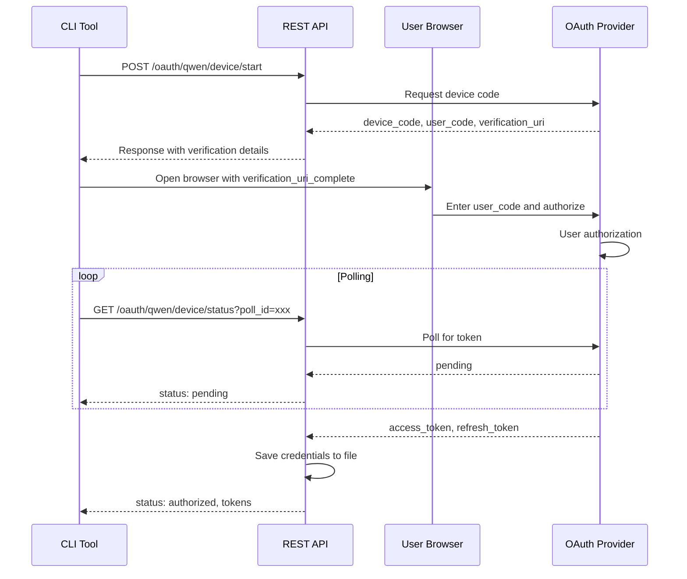
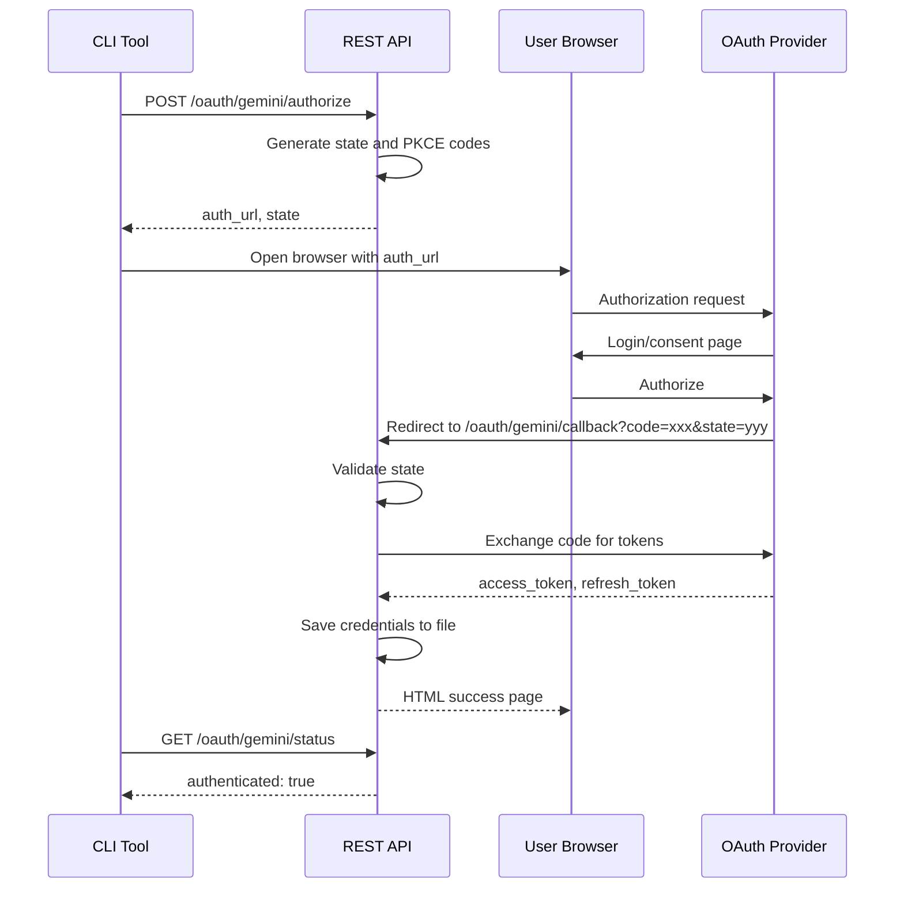
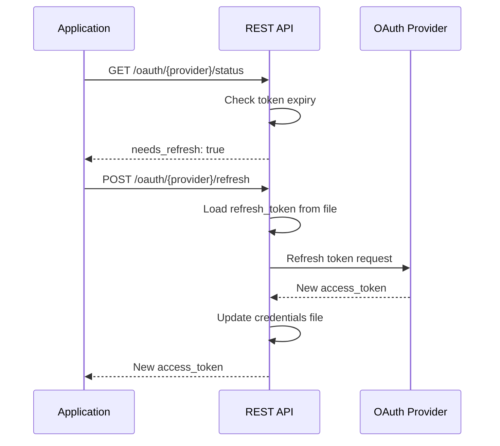

# OAuth2 REST API Architecture Design

## Document Information

| Field | Value |
|-------|-------|
| Project | qwencoder-proxy |
| Date | 2025-01-23 |
| Version | 1.0 |
| Author | Architect Mode Analysis |

---

## Executive Summary

This document outlines a minimal REST API architecture for OAuth2 authentication flows in the qwencoder-proxy project. The design follows the KISS principle, avoiding over-engineering and unnecessary middleware while supporting both CLI tools (programmatic access) and web-based interaction.

---

## 1. Analysis of Existing OAuth Implementations

### 1.1 Supported Providers

| Provider | OAuth Flow | Storage Location | Key Features |
|-----------|-------------|-----------------|--------------|
| **Qwen** | Device Code Flow | `~/.qwen/qwenproxy_creds.json` | PKCE, browser auto-open |
| **Gemini** | Authorization Code Flow | `~/.gemini/oauth_creds.json` | Local callback server (port 8085) |
| **iFlow** | Authorization Code Flow | `~/.iflow/oauth_creds.json` | PKCE, API key derivation |
| **Kiro** | AWS SSO (pre-existing) | `~/.aws/sso/cache/kiro-auth-token.json` | Uses IDE credentials |
| **Antigravity** | (To be determined) | (To be determined) | Not yet fully analyzed |

### 1.2 Current Authentication Patterns

#### 1.2.1 Device Code Flow (Qwen)
- Generates PKCE code verifier and challenge
- Opens browser with verification URL
- Polls for token completion
- Stores credentials with file locking

#### 1.2.2 Authorization Code Flow (Gemini, iFlow)
- Generates random state for CSRF protection
- Starts local HTTP server for callback
- Generates authorization URL with PKCE
- Exchanges code for tokens
- Fetches additional data (user info, API keys)

#### 1.2.3 Token Management
- 30-minute buffer before refresh (`TokenRefreshBufferMs = 1800000`)
- Automatic refresh via `oauth2.TokenSource`
- Credentials stored as JSON in home directory
- File locking for concurrent access

### 1.3 Configuration Structure

```go
type Config struct {
    Server     ServerConfig
    HTTPClient HTTPClientConfig
    Logging    LoggingConfig
}
```

OAuth constants are hardcoded in `auth/constants.go`:
- Client IDs and secrets
- Token and authorization URLs
- Scopes

---

## 2. REST API Architecture Design

### 2.1 Design Principles

1. **KISS**: Keep It Simple, Stupid - minimal abstractions
2. **Single Responsibility**: Each endpoint does one thing well
3. **Stateless**: Server doesn't store session state (state in URL/cookies)
4. **Provider Agnostic**: Generic endpoints with provider parameter
5. **Backward Compatible**: Existing file-based auth continues to work

### 2.2 Base URL Structure

```
http://localhost:8143/api/v1/oauth
```

### 2.3 API Endpoints

#### 2.3.1 Provider Discovery

```http
GET /api/v1/oauth/providers
```

**Response:**
```json
{
  "providers": [
    {
      "id": "qwen",
      "name": "Qwen",
      "flow": "device_code",
      "auth_url": "https://chat.qwen.ai/api/v1/oauth2/device/code",
      "token_url": "https://chat.qwen.ai/api/v1/oauth2/token",
      "scopes": ["openid", "profile", "email", "model.completion"]
    },
    {
      "id": "gemini",
      "name": "Gemini (Google)",
      "flow": "authorization_code",
      "auth_url": "https://accounts.google.com/o/oauth2/v2/auth",
      "token_url": "https://oauth2.googleapis.com/token",
      "scopes": ["https://www.googleapis.com/auth/cloud-platform"],
      "callback_port": 8085
    },
    {
      "id": "iflow",
      "name": "iFlow",
      "flow": "authorization_code",
      "auth_url": "https://iflow.cn/oauth",
      "token_url": "https://iflow.cn/oauth/token",
      "scopes": ["openid", "email", "profile", "offline_access"],
      "callback_port": 11451
    },
    {
      "id": "kiro",
      "name": "Kiro (AWS SSO)",
      "flow": "external",
      "description": "Uses pre-existing AWS SSO credentials from Kiro IDE"
    }
  ]
}
```

#### 2.3.2 Initiate Device Code Flow (Qwen)

```http
POST /api/v1/oauth/{provider}/device/start
Content-Type: application/json

{
  "provider": "qwen"
}
```

**Response:**
```json
{
  "device_code": "MDAwNjJmOGItNDU4Zi00ZjU...",
  "user_code": "ABCD-EFGH",
  "verification_uri": "https://chat.qwen.ai/device",
  "verification_uri_complete": "https://chat.qwen.ai/device?user_code=ABCD-EFGH&client=qwen-code",
  "expires_in": 900,
  "interval": 5,
  "poll_id": "uuid-1234-5678-90ab"
}
```

#### 2.3.3 Poll Device Code Status

```http
GET /api/v1/oauth/{provider}/device/status?poll_id={poll_id}
```

**Response (Pending):**
```json
{
  "status": "pending",
  "expires_in": 845
}
```

**Response (Authorized):**
```json
{
  "status": "authorized",
  "access_token": "ya29.a0AfH6SMB...",
  "refresh_token": "1//0g...",
  "token_type": "Bearer",
  "expires_in": 3600,
  "expiry_date": 1737644800000,
  "resource_url": "https://portal.qwen.ai/v1"
}
```

**Response (Error):**
```json
{
  "status": "error",
  "error": "access_denied",
  "error_description": "User denied authorization"
}
```

#### 2.3.4 Initiate Authorization Code Flow

```http
POST /api/v1/oauth/{provider}/authorize
Content-Type: application/json

{
  "provider": "gemini",
  "redirect_uri": "http://localhost:8085/callback"
}
```

**Response:**
```json
{
  "auth_url": "https://accounts.google.com/o/oauth2/v2/auth?client_id=...&redirect_uri=http://localhost:8085/callback&response_type=code&scope=https://www.googleapis.com/auth/cloud-platform&access_type=offline&prompt=consent&state=abc123xyz",
  "state": "abc123xyz",
  "expires_at": 1737641200000
}
```

#### 2.3.5 OAuth Callback Handler

```http
GET /api/v1/oauth/{provider}/callback
```

**Query Parameters:**
- `code` (required): Authorization code
- `state` (required): CSRF state token
- `error` (optional): Error code if authorization failed
- `error_description` (optional): Error description

**Response (Success - HTML):**
```html
<!DOCTYPE html>
<html>
<head><title>Authorization Successful</title></head>
<body>
  <h1>Authorization Successful!</h1>
  <p>You can close this window and return to your application.</p>
  <script>
    // Optional: Notify parent window if in popup
    if (window.opener) {
      window.opener.postMessage({type: 'oauth_success', provider: 'gemini'}, '*');
    }
    setTimeout(() => window.close(), 2000);
  </script>
</body>
</html>
```

**Response (Error - HTML):**
```html
<!DOCTYPE html>
<html>
<head><title>Authorization Failed</title></head>
<body>
  <h1>Authorization Failed</h1>
  <p>Error: access_denied</p>
  <p>Please try again.</p>
</body>
</html>
```

#### 2.3.6 Exchange Code for Tokens

```http
POST /api/v1/oauth/{provider}/token
Content-Type: application/json

{
  "code": "4/0AX4XfWh...",
  "redirect_uri": "http://localhost:8085/callback",
  "code_verifier": "dBjftJeZ4CVP-mB92K27uhbUJU1p1r_wW1gFWFOEjXk"
}
```

**Response:**
```json
{
  "access_token": "ya29.a0AfH6SMB...",
  "refresh_token": "1//0g...",
  "token_type": "Bearer",
  "expires_in": 3600,
  "expiry_date": 1737644800000,
  "scope": "https://www.googleapis.com/auth/cloud-platform",
  "resource_url": "https://portal.qwen.ai/v1",
  "api_key": "iflow-api-key-xyz"  // iFlow specific
}
```

#### 2.3.7 Refresh Token

```http
POST /api/v1/oauth/{provider}/refresh
Content-Type: application/json

{
  "refresh_token": "1//0g..."
}
```

**Response:**
```json
{
  "access_token": "ya29.a0AfH6SMB...",
  "refresh_token": "1//0g...",
  "token_type": "Bearer",
  "expires_in": 3600,
  "expiry_date": 1737644800000
}
```

#### 2.3.8 Get Token Status

```http
GET /api/v1/oauth/{provider}/status
```

**Response:**
```json
{
  "authenticated": true,
  "expires_at": 1737644800000,
  "expires_in": 1800,
  "needs_refresh": false,
  "token_type": "Bearer",
  "scope": "openid profile email model.completion"
}
```

#### 2.3.9 Get Current Token

```http
GET /api/v1/oauth/{provider}/token
```

**Response:**
```json
{
  "access_token": "ya29.a0AfH6SMB...",
  "token_type": "Bearer",
  "expires_in": 1800
}
```

#### 2.3.10 Revoke Token

```http
DELETE /api/v1/oauth/{provider}/token
```

**Response:**
```json
{
  "success": true,
  "message": "Token revoked successfully"
}
```

#### 2.3.11 Clear Credentials

```http
DELETE /api/v1/oauth/{provider}/credentials
```

**Response:**
```json
{
  "success": true,
  "message": "Credentials cleared successfully"
}
```

---

## 3. OAuth Flow Diagrams

### 3.1 Device Code Flow (Qwen)



### 3.2 Authorization Code Flow (Gemini, iFlow)



### 3.3 Token Refresh Flow



---

## 4. State Management Strategy

### 4.1 In-Memory State (Short-lived)

```go
type OAuthState struct {
    StateID        string
    Provider       string
    CodeVerifier   string  // PKCE
    RedirectURI    string
    ExpiresAt      time.Time
    CreatedAt      time.Time
}

// Global state store with cleanup
var stateStore = struct {
    sync.RWMutex
    states map[string]*OAuthState
}{
    states: make(map[string]*OAuthState),
}
```

### 4.2 Device Code Polling State

```go
type DevicePollState struct {
    PollID         string
    Provider       string
    DeviceCode     string
    ExpiresAt      time.Time
    Interval       time.Duration
    Status         string  // pending, authorized, error
    Tokens         *OAuthCreds
    LastPolledAt   time.Time
}
```

### 4.3 State Lifecycle

| State Type | TTL | Cleanup Method |
|------------|-----|---------------|
| OAuth State | 10 minutes | Background goroutine every 5 minutes |
| Device Poll | 15 minutes | Background goroutine every 5 minutes |
| Callback Data | Immediate | After callback processing |

### 4.4 State Validation

1. **State Parameter**: Random 16-byte base64-encoded string
2. **PKCE Code Verifier**: 32-byte random string
3. **Expiry Check**: Reject expired states
4. **One-time Use**: Delete state after use

---

## 5. Configuration Requirements

### 5.1 New Configuration Fields

```go
type OAuthConfig struct {
    // Server settings
    BaseURL          string
    CallbackBaseURL  string  // e.g., "http://localhost:8143"

    // Provider-specific ports
    GeminiCallbackPort    int
    IFlowCallbackPort    int

    // Security settings
    StateTTL            time.Duration
    DeviceCodeTTL        time.Duration
    EnableCORS          bool
    AllowedOrigins       []string

    // Rate limiting
    MaxPollsPerMinute   int
    MaxAuthAttempts     int
}
```

### 5.2 Environment Variables

| Variable | Default | Description |
|----------|----------|-------------|
| `OAUTH_BASE_URL` | `http://localhost:8143/api/v1/oauth` | Base URL for OAuth endpoints |
| `OAUTH_CALLBACK_BASE` | `http://localhost:8143` | Base URL for callbacks |
| `OAUTH_STATE_TTL` | `10m` | OAuth state TTL |
| `OAUTH_DEVICE_TTL` | `15m` | Device code TTL |
| `OAUTH_ENABLE_CORS` | `false` | Enable CORS for web clients |
| `OAUTH_ALLOWED_ORIGINS` | `*` | CORS allowed origins |

### 5.3 Provider Configuration Registry

```go
type ProviderConfig struct {
    ID              string
    Name            string
    Flow            string  // device_code, authorization_code, external
    ClientID        string
    ClientSecret    string
    AuthURL         string
    TokenURL        string
    DeviceAuthURL   string  // for device flow
    Scopes          []string
    CallbackPort    int
    CredsDir        string
    CredsFile       string
}

var providerConfigs = map[string]*ProviderConfig{
    "qwen": {
        ID:            "qwen",
        Name:          "Qwen",
        Flow:          "device_code",
        ClientID:      "f0304373b74a44d2b584a3fb70ca9e56",
        TokenURL:      "https://chat.qwen.ai/api/v1/oauth2/token",
        DeviceAuthURL: "https://chat.qwen.ai/api/v1/oauth2/device/code",
        Scopes:        []string{"openid", "profile", "email", "model.completion"},
        CredsDir:      ".qwen",
        CredsFile:     "qwenproxy_creds.json",
    },
    "gemini": {
        ID:           "gemini",
        Name:         "Gemini",
        Flow:         "authorization_code",
        ClientID:     "681255809395-oo8ft2oprdrnp9e3aqf6av3hmdib135j.apps.googleusercontent.com",
        ClientSecret: "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",
        AuthURL:      "https://accounts.google.com/o/oauth2/v2/auth",
        TokenURL:     "https://oauth2.googleapis.com/token",
        Scopes:       []string{"https://www.googleapis.com/auth/cloud-platform"},
        CallbackPort: 8085,
        CredsDir:     ".gemini",
        CredsFile:    "oauth_creds.json",
    },
    // ... other providers
}
```

---

## 6. Security Considerations

### 6.1 CSRF Protection

- **State Parameter**: Random 16-byte string generated per auth request
- **State Validation**: Verify state matches before exchanging code
- **One-time Use**: State deleted after successful callback

### 6.2 PKCE (Proof Key for Code Exchange)

- **Code Verifier**: 32-byte random string
- **Code Challenge**: SHA-256 hash of verifier, base64url encoded
- **Challenge Method**: S256 (SHA-256)

### 6.3 Token Storage

- **File Permissions**: 0600 (read/write by owner only)
- **Directory Permissions**: 0700 (rwx by owner only)
- **File Locking**: Use `flock` for concurrent access
- **Location**: User home directory under provider-specific subdirectory

### 6.4 Rate Limiting

| Endpoint | Limit | Period |
|----------|-------|--------|
| `/device/start` | 5 requests | 1 minute |
| `/device/status` | 12 requests | 1 minute |
| `/authorize` | 10 requests | 1 minute |
| `/token` | 10 requests | 1 minute |
| `/refresh` | 5 requests | 1 minute |

### 6.5 Input Validation

- **Provider ID**: Validate against known provider list
- **State**: Base64-encoded, 16-32 characters
- **Code**: Alphanumeric, length varies by provider
- **Redirect URI**: HTTPS or localhost only
- **Poll ID**: UUID format

### 6.6 Error Handling

| Error Code | HTTP Status | Description |
|------------|--------------|-------------|
| `invalid_provider` | 400 | Unknown provider ID |
| `invalid_state` | 400 | State mismatch or expired |
| `invalid_code` | 400 | Invalid authorization code |
| `access_denied` | 403 | User denied authorization |
| `expired_code` | 400 | Authorization code expired |
| `rate_limit_exceeded` | 429 | Too many requests |
| `server_error` | 500 | Internal server error |

### 6.7 CORS (Optional)

If enabling CORS for web clients:

```go
headers := map[string]string{
    "Access-Control-Allow-Origin":  config.AllowedOrigins[0],
    "Access-Control-Allow-Methods": "GET, POST, DELETE, OPTIONS",
    "Access-Control-Allow-Headers": "Content-Type, Authorization",
    "Access-Control-Max-Age":     "86400",
}
```

---

## 7. Implementation Structure

### 7.1 New Package Structure

```
auth/
├── oauth.go                    # Existing (keep)
├── oauth2_device.go            # Existing (keep)
├── gemini_auth.go             # Existing (keep)
├── iflow_auth.go              # Existing (keep)
├── kiro_auth.go               # Existing (keep)
├── constants.go               # Existing (keep)
├── rest_api.go               # NEW: REST API handlers
├── state_manager.go          # NEW: State management
├── provider_registry.go      # NEW: Provider config registry
└── middleware.go            # NEW: Rate limiting, validation
```

### 7.2 Key Components

#### 7.2.1 REST API Handler (`rest_api.go`)

```go
package auth

type OAuthAPI struct {
    config      *OAuthConfig
    stateMgr    *StateManager
    providers   map[string]OAuthProvider
    rateLimiter *RateLimiter
}

func NewOAuthAPI(config *OAuthConfig) *OAuthAPI
func (api *OAuthAPI) RegisterRoutes(mux *http.ServeMux)
func (api *OAuthAPI) handleProviders(w http.ResponseWriter, r *http.Request)
func (api *OAuthAPI) handleDeviceStart(w http.ResponseWriter, r *http.Request)
func (api *OAuthAPI) handleDeviceStatus(w http.ResponseWriter, r *http.Request)
func (api *OAuthAPI) handleAuthorize(w http.ResponseWriter, r *http.Request)
func (api *OAuthAPI) handleCallback(w http.ResponseWriter, r *http.Request)
func (api *OAuthAPI) handleToken(w http.ResponseWriter, r *http.Request)
func (api *OAuthAPI) handleRefresh(w http.ResponseWriter, r *http.Request)
func (api *OAuthAPI) handleStatus(w http.ResponseWriter, r *http.Request)
func (api *OAuthAPI) handleGetToken(w http.ResponseWriter, r *http.Request)
func (api *OAuthAPI) handleRevoke(w http.ResponseWriter, r *http.Request)
func (api *OAuthAPI) handleClearCredentials(w http.ResponseWriter, r *http.Request)
```

#### 7.2.2 State Manager (`state_manager.go`)

```go
package auth

type StateManager struct {
    states map[string]*OAuthState
    polls  map[string]*DevicePollState
    mu     sync.RWMutex
}

func NewStateManager() *StateManager
func (sm *StateManager) CreateState(provider, codeVerifier, redirectURI string) (string, error)
func (sm *StateManager) ValidateAndConsume(state string) (*OAuthState, error)
func (sm *StateManager) CreatePoll(provider, deviceCode string, interval time.Duration) (string, error)
func (sm *StateManager) UpdatePoll(pollID string, status string, tokens *OAuthCreds) error
func (sm *StateManager) GetPoll(pollID string) (*DevicePollState, error)
func (sm *StateManager) CleanupExpired()
func (sm *StateManager) StartCleanupRoutine()
```

#### 7.2.3 Provider Registry (`provider_registry.go`)

```go
package auth

type ProviderRegistry struct {
    configs map[string]*ProviderConfig
}

func NewProviderRegistry() *ProviderRegistry
func (pr *ProviderRegistry) GetConfig(providerID string) (*ProviderConfig, error)
func (pr *ProviderRegistry) ListProviders() []ProviderInfo
func (pr *ProviderRegistry) RegisterProvider(config *ProviderConfig)
```

#### 7.2.4 Middleware (`middleware.go`)

```go
package auth

func RateLimit(handler http.HandlerFunc, maxRequests int, window time.Duration) http.HandlerFunc
func ValidateProvider(handler http.HandlerFunc, registry *ProviderRegistry) http.HandlerFunc
func CORS(handler http.HandlerFunc, allowedOrigins []string) http.HandlerFunc
func Logging(handler http.HandlerFunc, logger *logging.Logger) http.HandlerFunc
```

### 7.3 Integration with Existing Code

```go
// In main.go or server initialization
func main() {
    // Load existing config
    cfg := config.LoadConfig()

    // Initialize OAuth API
    oauthConfig := &auth.OAuthConfig{
        BaseURL:         "http://localhost:" + cfg.Server.Port + "/api/v1/oauth",
        CallbackBaseURL: "http://localhost:" + cfg.Server.Port,
        StateTTL:       10 * time.Minute,
        DeviceCodeTTL:   15 * time.Minute,
    }
    oauthAPI := auth.NewOAuthAPI(oauthConfig)

    // Register routes
    mux := http.NewServeMux()
    oauthAPI.RegisterRoutes(mux)

    // Start server
    server := &http.Server{
        Addr:    ":" + cfg.Server.Port,
        Handler: mux,
    }
    server.ListenAndServe()
}
```

---

## 8. Client Integration Examples

### 8.1 CLI Tool Integration (Device Flow)

```bash
# 1. Start device flow
curl -X POST http://localhost:8143/api/v1/oauth/qwen/device/start \
  -H "Content-Type: application/json" \
  -d '{"provider": "qwen"}'

# Response includes verification_uri_complete
# 2. Open browser (automatically by CLI)
# 3. Poll for completion
poll_id="uuid-from-step-1"
while true; do
  response=$(curl -s "http://localhost:8143/api/v1/oauth/qwen/device/status?poll_id=$poll_id")
  status=$(echo "$response" | jq -r '.status')
  if [ "$status" = "authorized" ]; then
    echo "Authorized!"
    echo "$response" | jq '.access_token'
    break
  elif [ "$status" = "error" ]; then
    echo "Error: $(echo "$response" | jq -r '.error')"
    break
  fi
  sleep 5
done
```

### 8.2 Web Application Integration (Authorization Code Flow)

```javascript
// 1. Initiate authorization
async function startAuth(provider) {
  const response = await fetch(`http://localhost:8143/api/v1/oauth/${provider}/authorize`, {
    method: 'POST',
    headers: { 'Content-Type': 'application/json' },
    body: JSON.stringify({ provider })
  });
  const data = await response.json();
  
  // Open popup or redirect
  window.open(data.auth_url, 'oauth', 'width=500,height=600');
  
  // Listen for success message
  window.addEventListener('message', (event) => {
    if (event.data.type === 'oauth_success') {
      checkAuthStatus(provider);
    }
  });
}

// 2. Check authentication status
async function checkAuthStatus(provider) {
  const response = await fetch(`http://localhost:8143/api/v1/oauth/${provider}/status`);
  const data = await response.json();
  
  if (data.authenticated) {
    console.log('Authenticated!');
  }
}

// 3. Get token for API calls
async function getAccessToken(provider) {
  const response = await fetch(`http://localhost:8143/api/v1/oauth/${provider}/token`);
  const data = await response.json();
  return data.access_token;
}
```

### 8.3 Direct Token Usage

```bash
# Get current token
curl http://localhost:8143/api/v1/oauth/gemini/token

# Use token with provider API
curl https://cloudcode-pa.googleapis.com/v1internal:generateContent \
  -H "Authorization: Bearer $(curl -s http://localhost:8143/api/v1/oauth/gemini/token | jq -r '.access_token')"
```

---

## 9. Error Response Format

All error responses follow this format:

```json
{
  "error": {
    "code": "invalid_state",
    "message": "The provided state parameter is invalid or has expired",
    "details": {
      "provided_state": "abc123",
      "expected_state": "xyz789"
    }
  }
}
```

---

## 10. Testing Strategy

### 10.1 Unit Tests

- State manager CRUD operations
- Provider registry lookups
- Token validation logic
- PKCE code generation

### 10.2 Integration Tests

- Full device code flow
- Full authorization code flow
- Token refresh
- State expiration handling

### 10.3 Security Tests

- CSRF state validation
- PKCE challenge verification
- Rate limiting enforcement
- Invalid provider rejection

---

## 11. Future Enhancements

1. **Webhook Support**: Notify clients when authorization completes
2. **Session Management**: Server-side sessions for web applications
3. **Token Introspection**: Validate tokens with providers
4. **Multi-Provider Auth**: Simultaneous authentication with multiple providers
5. **Admin UI**: Web interface for managing OAuth credentials
6. **Audit Logging**: Track all authentication events

---

## 12. Migration Path

### Phase 1: Add REST API (Non-Breaking)
- Implement new endpoints alongside existing auth
- Existing CLI tools continue to work
- New tools can use REST API

### Phase 2: Deprecate Direct CLI Auth
- Mark direct auth functions as deprecated
- Update documentation to recommend REST API

### Phase 3: Remove Direct CLI Auth
- Remove direct auth entry points
- All auth goes through REST API

---

## Appendix A: Quick Reference

### Endpoint Summary

| Method | Path | Description |
|--------|------|-------------|
| GET | `/oauth/providers` | List all providers |
| POST | `/oauth/{provider}/device/start` | Start device code flow |
| GET | `/oauth/{provider}/device/status` | Poll device code status |
| POST | `/oauth/{provider}/authorize` | Start authorization code flow |
| GET | `/oauth/{provider}/callback` | OAuth callback handler |
| POST | `/oauth/{provider}/token` | Exchange code for tokens |
| POST | `/oauth/{provider}/refresh` | Refresh access token |
| GET | `/oauth/{provider}/status` | Get auth status |
| GET | `/oauth/{provider}/token` | Get current access token |
| DELETE | `/oauth/{provider}/token` | Revoke token |
| DELETE | `/oauth/{provider}/credentials` | Clear credentials |

### HTTP Status Codes

| Code | Meaning |
|------|----------|
| 200 | Success |
| 202 | Accepted (async operation) |
| 400 | Bad Request |
| 401 | Unauthorized |
| 403 | Forbidden |
| 404 | Not Found |
| 429 | Too Many Requests |
| 500 | Internal Server Error |

### Provider Flow Types

| Flow | Providers | Description |
|------|-----------|-------------|
| `device_code` | Qwen | No redirect URI, user enters code on separate device |
| `authorization_code` | Gemini, iFlow | Redirect to provider, callback to local server |
| `external` | Kiro | Uses pre-existing credentials, no OAuth flow |
