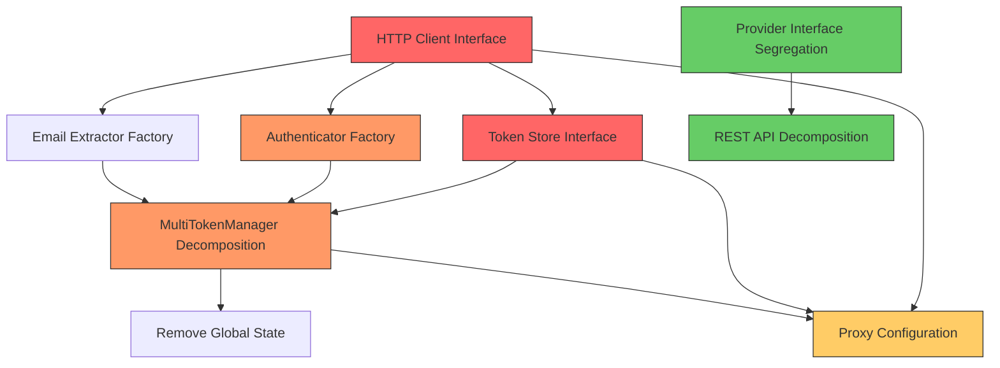

# SOLID Principles Architectural Analysis Report

**Project**: qwencoder-proxy  
**Analysis Date**: 2026-01-26  
**Purpose**: Deep architectural analysis focused on SOLID principles adherence and opportunities for introducing abstractions and interfaces

---

## Executive Summary

This analysis identifies significant SOLID principle violations throughout the codebase, with the most critical issues being:

1. **Dependency Inversion Principle (DIP)**: Extensive violations with concrete dependencies throughout
2. **Single Responsibility Principle (SRP)**: Several components handle multiple concerns
3. **Interface Segregation Principle (ISP)**: Existing interfaces are overly broad
4. **Open/Closed Principle (OCP)**: Limited extensibility in key areas
5. **Liskov Substitution Principle (LSP)**: Generally well-adhered with minor concerns

The most impactful refactoring opportunities center around introducing HTTP client, token store, and authenticator factory interfaces, which would significantly improve testability and support the upcoming proxy-per-token feature.

---

## 1. Dependency Inversion Principle (DIP) Analysis

### 1.1 High-Level Modules Depending on Low-Level Modules

#### Critical Violations:

**A. HTTP Client Dependencies**
- **Location**: Throughout the codebase
- **Issue**: High-level modules directly depend on `*http.Client` concrete type
  - [`provider/qwen/qwen.go:36`](provider/qwen/qwen.go:36) - `httpClient *http.Client`
  - [`provider/gemini/gemini.go:39`](provider/gemini/gemini.go:39) - `httpClient *http.Client`
  - [`restapi/rest_api.go:83`](restapi/rest_api.go:83) - `httpClient *http.Client`
  - [`auth/multi_token_manager.go:39`](auth/multi_token_manager.go:39) - `httpClient *http.Client`
  - [`auth/email_extraction.go:31,78,148,203`](auth/email_extraction.go:31) - All email extractors have `*http.Client`
  - [`auth/token_refresh.go:390,448,528,628`](auth/token_refresh.go:390) - All refreshers have `*http.Client`

- **Impact**: High - Prevents mocking HTTP behavior in tests, couples code to standard library implementation

**B. Token Store Dependencies**
- **Location**: [`auth/multi_token_manager.go`](auth/multi_token_manager.go:29)
- **Issue**: [`MultiTokenManager`](auth/multi_token_manager.go:28) directly creates and manages `*MultiTokenStore` concrete types
  - Line 166: `store = NewMultiTokenStore(providerID, credsPath, mtm.logger)`
  - Lines 174, 241: Direct instantiation and management
  
- **Impact**: Medium - Limits ability to swap storage implementations (e.g., in-memory for tests, cloud storage)

**C. Authenticator Dependencies**
- **Location**: Provider implementations
- **Issue**: Providers directly instantiate authenticators
  - [`provider/qwen/qwen.go:124`](provider/qwen/qwen.go:124): `NewQwenAuthenticator(nil, logging.NewLogger())`
  - [`provider/gemini/gemini.go:46-48`](provider/gemini/gemini.go:46): `auth.NewGeminiAuthenticator(nil)`
  - Similar patterns in other providers

- **Impact**: High - Tight coupling between providers and authenticators, no factory pattern for authenticator creation

**D. REST API Component Instantiation**
- **Location**: [`restapi/rest_api.go`](restapi/rest_api.go:78)
- **Issue**: [`Server`](restapi/rest_api.go:78) directly creates all components without dependency injection
  - Lines 100-116: Direct instantiation of [`MultiTokenManager`](auth/multi_token_manager.go:28), [`ProviderRegistry`](restapi/provider_registry.go:38), [`StateManager`](restapi/state_manager.go)
  
- **Impact**: High - Makes testing difficult, prevents configuration swapping

**E. Global State Dependencies**
- **Location**: [`auth/oauth.go:158`](auth/oauth.go:158)
- **Issue**: `defaultMultiTokenManager` global variable accessed throughout codebase
  - Lines 162-174: Global getter/setter pattern
  
- **Impact**: High - Violates DIP, creates implicit dependencies, makes testing difficult

### 1.2 Concrete Implementations Instead of Abstractions

**A. Logger Dependencies**
- **Issue**: While `*logging.Logger` is passed around, it's a concrete type
- **Impact**: Low - Logger is a stable dependency, but could benefit from interface

**B. Converter Dependencies**
- **Location**: [`proxy/stream_converter.go:19`](proxy/stream_converter.go:19)
- **Issue**: [`StreamConverter`](proxy/stream_converter.go:17) depends on concrete `converter.Converter` interface (good), but factory returns concrete types
- **Impact**: Low - Factory pattern is used, which is good DIP practice

### 1.3 Evaluation of Existing Interfaces

**Provider Interface** ([`provider/provider.go:31`](provider/provider.go:31))
- **Strengths**: 
  - Well-defined contract for LLM providers
  - Used by factory pattern ([`provider/factory.go`](provider/factory.go:24))
  - Supports both streaming and non-streaming operations

- **Weaknesses**:
  - 8 methods, potentially violating ISP (see section 2)
  - No interface for provider initialization (optional capability via type assertion at [`factory.go:155`](provider/factory.go:155))

**Authenticator Interface** ([`provider/provider.go:63`](provider/provider.go:63))
- **Strengths**:
  - Clear contract for authentication operations
  - Used by providers

- **Weaknesses**:
  - 5 methods, reasonable for the responsibility
  - No factory interface for creating authenticators (tight coupling)

### 1.4 HTTP Client Usage Assessment

**Current Pattern**:
- Each component creates its own `*http.Client` with custom timeouts
- No centralized HTTP client configuration
- No ability to intercept/mock HTTP calls

**Issues**:
1. Scattered timeout configurations (30s, 5min, 30s variations)
2. No retry logic at HTTP client level
3. No request/response logging middleware
4. Cannot mock for testing without significant refactoring

### 1.5 Token Storage Implementation Assessment

**Current Pattern**:
- [`MultiTokenStore`](auth/multi_token_store.go:44) is a concrete struct with file-based persistence
- Direct file I/O operations mixed with business logic
- No abstraction for storage backend

**Issues**:
1. Cannot swap storage implementations (e.g., database, cloud storage)
2. File I/O tightly coupled to token management logic
3. Difficult to test without file system

---

## 2. Interface Segregation Principle (ISP) Analysis

### 2.1 Provider Interface Evaluation

**Current Interface** ([`provider/provider.go:31-60`](provider/provider.go:31)):
```go
type Provider interface {
    Name() ProviderType
    Protocol() ProtocolType
    SupportedModels() []string
    SupportsModel(model string) bool
    GenerateContent(ctx context.Context, model string, request interface{}) (interface{}, error)
    GenerateContentStream(ctx context.Context, model string, request interface{}) (io.ReadCloser, error)
    ListModels(ctx context.Context) (interface{}, error)
    GetAuthenticator() Authenticator
    IsHealthy(ctx context.Context) bool
}
```

**ISP Violations**:

**A. Mixed Streaming and Non-Streaming Capabilities**
- **Issue**: All providers must implement both streaming and non-streaming methods
- **Impact**: Medium - Some providers may only support one mode, but must implement both
- **Example**: A hypothetical provider that only supports non-streaming would need stub implementations

**B. Mixed Query and Operation Capabilities**
- **Issue**: Interface mixes metadata queries (`Name()`, `Protocol()`, `SupportedModels()`, `IsHealthy()`) with operations (`GenerateContent`, `GenerateContentStream`, `ListModels`)
- **Impact**: Low - This is a common pattern but could be segregated

**C. Authentication Coupling**
- **Issue**: `GetAuthenticator()` couples provider to authentication mechanism
- **Impact**: Medium - Prevents providers without authentication or with different auth patterns

### 2.2 Authenticator Interface Evaluation

**Current Interface** ([`provider/provider.go:63-78`](provider/provider.go:63)):
```go
type Authenticator interface {
    Authenticate(ctx context.Context) error
    GetToken(ctx context.Context) (string, error)
    IsAuthenticated() bool
    GetCredentialsPath() string
    ClearCredentials() error
}
```

**ISP Analysis**:
- **Status**: Well-segregated
- **Rationale**: All methods are cohesive around authentication concerns
- **No significant violations identified**

### 2.3 Segregation Opportunities

**A. Provider Capability Segregation**

**Proposed Interfaces**:

```go
// Provider metadata (query operations)
type ProviderInfo interface {
    Name() ProviderType
    Protocol() ProtocolType
    SupportedModels() []string
    SupportsModel(model string) bool
}

// Health check capability
type HealthChecker interface {
    IsHealthy(ctx context.Context) bool
}

// Model discovery capability
type ModelLister interface {
    ListModels(ctx context.Context) (interface{}, error)
}

// Content generation (non-streaming)
type ContentGenerator interface {
    GenerateContent(ctx context.Context, model string, request interface{}) (interface{}, error)
}

// Content generation (streaming)
type ContentStreamGenerator interface {
    GenerateContentStream(ctx context.Context, model string, request interface{}) (io.ReadCloser, error)
}

// Authentication provider
type AuthProvider interface {
    GetAuthenticator() Authenticator
}
```

**Benefits**:
- Providers can implement only needed capabilities
- Easier to test individual capabilities
- Supports providers with limited feature sets
- Better adherence to ISP

**B. Email Extractor Segregation**

**Current Interface** ([`auth/email_extraction.go:19-26`](auth/email_extraction.go:19)):
```go
type EmailExtractor interface {
    ExtractEmail(ctx context.Context, tokenResponse map[string]interface{}, accessToken string) (string, error)
    ProviderID() string
    UserInfoURL() string
}
```

**ISP Analysis**:
- **Status**: Well-segregated
- **Rationale**: Focused on single responsibility (email extraction)
- **No violations identified**

---

## 3. Single Responsibility Principle (SRP) Analysis

### 3.1 Components with Multiple Responsibilities

**A. MultiTokenManager** ([`auth/multi_token_manager.go:28`](auth/multi_token_manager.go:28))

**Current Responsibilities**:
1. Token store management (creating, retrieving stores)
2. Token manager management (creating, retrieving managers)
3. Refresher registration and management
4. Scheduler management
5. Email extractor management
6. Health tracker management
7. Strategy factory management
8. Initialization lifecycle
9. Start/stop orchestration
10. Token selection orchestration
11. Token saving orchestration
12. Email extraction orchestration
13. Provider listing
14. Token counting
15. Token removal
16. Health reporting

**SRP Violation**: **Critical**
- **Rationale**: The manager handles at least 16 distinct responsibilities
- **Impact**: High - Difficult to test, maintain, and extend

**Proposed Separation**:
```go
// Orchestrator - coordinates lifecycle
type MultiTokenOrchestrator struct {
    storeManager      *StoreManager
    tokenManager     *TokenManagerFactory
    refreshManager   *RefreshManager
    emailManager     *EmailManager
}

// Individual managers for each concern
type StoreManager struct { ... }      // Token store lifecycle
type TokenManagerFactory struct { ... } // Token manager creation
type RefreshManager struct { ... }     // Refresh coordination
type EmailManager struct { ... }       // Email extraction
```

**B. REST API Server** ([`restapi/rest_api.go:78`](restapi/rest_api.go:78))

**Current Responsibilities**:
1. HTTP server lifecycle (Start, Stop)
2. Route registration
3. OAuth flow handling (device code, authorization code)
4. Token management (get, delete, refresh)
5. Credentials management
6. Dashboard file serving
7. Provider configuration serving
8. State management
9. HTML response generation
10. PKCE code generation
11. Token exchange
12. Email extraction orchestration
13. Settings management

**SRP Violation**: **Critical**
- **Rationale**: The server handles HTTP concerns, OAuth flows, file serving, and business logic
- **Impact**: High - Difficult to test, violates separation of concerns

**Proposed Separation**:
```go
// HTTP server only
type HTTPServer struct {
    router      *Router
    middlewares []Middleware
}

// OAuth handlers
type OAuthHandler struct {
    stateManager   *StateManager
    tokenManager   *TokenManager
    emailExtractor *EmailExtractor
}

// Dashboard handler
type DashboardHandler struct {
    dashboardDir string
}

// Token management handlers
type TokenHandler struct {
    tokenManager *TokenManager
}
```

**C. Provider Implementations**

**Gemini Provider** ([`provider/gemini/gemini.go:36`](provider/gemini/gemini.go:36))
- **Responsibilities**:
  1. Content generation (streaming/non-streaming)
  2. Model listing
  3. Project initialization
  4. Health checking
  5. Authentication coordination
  6. Token refresh handling (embedded in GenerateContent)

- **SRP Violation**: **Medium**
- **Rationale**: Project initialization is complex and could be separated

**D. Email Extractors**

**QwenEmailExtractor** ([`auth/email_extraction.go:29`](auth/email_extraction.go:29))
- **Responsibilities**:
  1. Email extraction from token response
  2. Email fetching from user info endpoint
  3. Retry logic
  4. Logging

- **SRP Violation**: **Low-Medium**
- **Rationale**: Retry logic could be extracted to a separate concern

### 3.2 Provider Implementations Analysis

**Qwen Provider** ([`provider/qwen/qwen.go:34`](provider/qwen/qwen.go:34))
- **Status**: Good SRP adherence
- **Rationale**: Clear separation between provider and authenticator

**Gemini Provider** ([`provider/gemini/gemini.go:36`](provider/gemini/gemini.go:36))
- **Status**: Medium SRP violation
- **Rationale**: Project initialization logic (lines 152-314) is complex and embedded in provider

---

## 4. Open/Closed Principle (OCP) Analysis

### 4.1 Areas Requiring Modification for New Functionality

**A. Adding New Providers**

**Current Pattern** ([`provider/factory.go`](provider/factory.go:24)):
- Factory uses map to store providers
- New providers require modifying factory registration logic
- **Status**: **Well-adhered to OCP** - Factory pattern allows extension

**B. Adding New Email Extractors**

**Current Pattern** ([`auth/multi_token_manager.go:93-96`](auth/multi_token_manager.go:93)):
```go
mtm.emailManager.RegisterExtractor(NewQwenEmailExtractor(mtm.httpClient, mtm.logger))
mtm.emailManager.RegisterExtractor(NewGeminiEmailExtractor(mtm.httpClient, mtm.logger))
mtm.emailManager.RegisterExtractor(NewKiroEmailExtractor(mtm.httpClient, mtm.logger))
mtm.emailManager.RegisterExtractor(NewIFlowEmailExtractor(mtm.httpClient, mtm.logger))
```

- **Issue**: Hard-coded registration in [`Initialize()` method
- **OCP Violation**: **Medium**
- **Impact**: Adding new email extractor requires modifying [`MultiTokenManager.Initialize()`](auth/multi_token_manager.go:79)

**C. Adding New Token Refreshers**

**Current Pattern** ([`auth/token_refresh.go`](auth/token_refresh.go:34)):
- Refreshers registered via [`RegisterRefresher()`](auth/token_refresh.go:271)
- **Status**: **Well-adhered to OCP** - Registration pattern allows extension

**D. Adding New Selection Strategies**

**Current Pattern** ([`auth/token_selection.go:334`](auth/token_selection.go:334)):
```go
func (sf *StrategyFactory) CreateStrategy(name string) (SelectionStrategy, error) {
    switch name {
    case "random":
        return NewRandomSelectionStrategy(), nil
    case "round_robin":
        return NewRoundRobinSelectionStrategy(), nil
    case "least_used":
        return NewLeastUsedSelectionStrategy(), nil
    default:
        return nil, fmt.Errorf("%w: %s", ErrUnknownStrategy, name)
    }
}
```

- **Issue**: Switch statement requires modification for new strategies
- **OCP Violation**: **Medium**
- **Impact**: Adding new strategy requires modifying [`StrategyFactory`](auth/token_selection.go:335)

**E. Adding New Converters**

**Current Pattern** ([`converter/converter.go:28`](converter/converter.go:28)):
```go
func NewFactory() *Factory {
    f := &Factory{
        converters: make(map[provider.ProtocolType]Converter),
    }
    f.Register(NewOpenAIConverter())
    f.Register(NewGeminiConverter())
    f.Register(NewiFlowConverter())
    f.Register(NewQwenConverter())
    return f
}
```

- **Issue**: Hard-coded registration in factory constructor
- **OCP Violation**: **Medium**
- **Impact**: Adding new converter requires modifying [`NewFactory()`](converter/converter.go:29)

### 4.2 Factory Pattern Extensibility

**Provider Factory** ([`provider/factory.go`](provider/factory.go:24)):
- **Status**: **Excellent OCP adherence**
- **Rationale**: 
  - Registration-based pattern
  - No modification needed for new providers
  - Dynamic model-to-provider mapping

**Converter Factory** ([`converter/converter.go`](converter/converter.go:24)):
- **Status**: **Medium OCP adherence**
- **Rationale**: 
  - Has registration method ([`Register()`](converter/converter.go:42))
  - But hard-codes registrations in constructor
  - Could be improved with external registration

### 4.3 Token Refresh Mechanism Extensibility

**Current Pattern** ([`auth/token_refresh.go`](auth/token_refresh.go:34)):
- **Status**: **Excellent OCP adherence**
- **Rationale**:
  - [`ProviderRefresh`](auth/token_refresh.go:35) interface allows new refreshers
  - [`RefreshCoordinator`](auth/token_refresh.go:43) manages refreshers via registration
  - No modification needed for new refreshers

---

## 5. Liskov Substitution Principle (LSP) Analysis

### 5.1 Provider Implementation Substitutability

**Evaluation Criteria**:
1. All providers implement all interface methods
2. Method contracts are consistent
3. No unexpected behavior variations
4. Error handling is consistent

**Analysis**:

**A. Qwen Provider** ([`provider/qwen/qwen.go:34`](provider/qwen/qwen.go:34))
- **Status**: **LSP Compliant**
- **Rationale**: 
  - Implements all [`Provider`](provider/provider.go:31) methods
  - Consistent error handling
  - No contract violations

**B. Gemini Provider** ([`provider/gemini/gemini.go:36`](provider/gemini/gemini.go:36))
- **Status**: **LSP Compliant**
- **Rationale**:
  - Implements all [`Provider`](provider/provider.go:31) methods
  - Consistent error handling
  - Token refresh on 401 is an enhancement, not a violation

**C. Other Providers**
- **Status**: **LSP Compliant**
- **Rationale**: All registered providers implement the interface correctly

### 5.2 Authenticator Implementation Substitutability

**A. QwenAuthenticator** ([`provider/qwen/qwen.go:41`](provider/qwen/qwen.go:41))
- **Status**: **LSP Compliant**
- **Rationale**: Implements all [`Authenticator`](provider/provider.go:63) methods correctly

**B. GeminiAuthenticator**
- **Status**: **LSP Compliant**
- **Rationale**: Implements all [`Authenticator`](provider/provider.go:63) methods correctly

### 5.3 Potential LSP Concerns

**A. ListModels Return Type**
- **Issue**: Returns `interface{}` which requires runtime type assertions
- **Impact**: Low - Common pattern in Go, but reduces type safety
- **Not an LSP violation**, but a design consideration

**B. IsHealthy Behavior Variations**
- **Issue**: Different providers may have different health check implementations
- **Impact**: Low - Expected variation, but could be documented

---

## 6. Specific Interface Introduction Opportunities

### 6.1 HTTP Client Interface

**Current State**:
- All components use `*http.Client` concrete type
- Scattered timeout configurations
- No ability to mock or intercept

**Proposed Interface**:
```go
type HTTPClient interface {
    Do(req *http.Request) (*http.Response, error)
}
```

**Benefits**:

**Testability**:
- **High Impact**: Can create mock HTTP client for testing
- Eliminates need for integration tests for HTTP-dependent code
- Enables deterministic testing of error scenarios

**Flexibility**:
- **Medium Impact**: Can swap implementations (e.g., with retry logic, caching, logging)
- Supports different HTTP clients (standard, custom, with middleware)

**Modularity**:
- **Medium Impact**: Decouples HTTP concerns from business logic
- Centralizes HTTP configuration

**Proxy-Per-Token Feature**:
- **High Benefit**: Each token could use different HTTP client configuration
- Enables per-token proxy settings, timeouts, and retry policies

**Implementation Considerations**:
1. `*http.Client` already satisfies the interface (single method)
2. Can create wrapper types for additional functionality (retry, logging)
3. Existing code requires minimal changes (type substitution)

### 6.2 Token Store Interface

**Current State**:
- [`MultiTokenStore`](auth/multi_token_store.go:44) is concrete with file-based persistence
- Direct file I/O mixed with business logic
- No abstraction for storage backend

**Proposed Interface**:
```go
type TokenStore interface {
    // Token CRUD operations
    AddToken(token ProviderToken) error
    GetToken(tokenID string) (*ProviderToken, error)
    RemoveToken(tokenID string) error
    UpdateToken(tokenID string, updateFunc func(*ProviderToken)) error
    
    // Query operations
    ListTokens() []ProviderToken
    GetValidTokens() []ProviderToken
    GetTokenCount() int
    GetValidTokenCount() int
    
    // Validation
    IsTokenValid(token ProviderToken) bool
    MarkTokenHealthy(tokenID string) error
    MarkTokenUnhealthy(tokenID string, error error)
    
    // Settings
    GetSettings() StoreSettings
    SetSettings(settings StoreSettings) error
    
    // Persistence
    Load() error
    Save() error
}
```

**Benefits**:

**Testability**:
- **High Impact**: Can create in-memory token store for tests
- Eliminates file system dependencies in unit tests
- Faster test execution

**Flexibility**:
- **High Impact**: Can swap storage backends
  - File-based (current)
  - In-memory (for testing)
  - Database (for production)
  - Cloud storage (for distributed systems)

**Modularity**:
- **High Impact**: Separates storage concerns from token management logic
- Clear contract for storage operations

**Proxy-Per-Token Feature**:
- **High Benefit**: Each token can have associated proxy configuration in store
- Enables per-token settings storage
- Supports token-specific proxy routing

**Implementation Considerations**:
1. [`MultiTokenStore`](auth/multi_token_store.go:44) already implements most methods
2. Need to extract interface and make store implement it
3. [`MultiTokenManager`](auth/multi_token_manager.go:28) depends on concrete store - needs refactoring
4. Can provide factory for creating different store implementations

### 6.3 Authenticator Factory Interface

**Current State**:
- Providers directly instantiate authenticators
- No factory pattern for authenticator creation
- Tight coupling between providers and authenticators

**Proposed Interface**:
```go
type AuthenticatorFactory interface {
    CreateAuthenticator(providerID string, config interface{}) (Authenticator, error)
    RegisterAuthenticator(providerID string, factory AuthenticatorFactory) error
}
```

**Benefits**:

**Testability**:
- **High Impact**: Can mock authenticator factory for testing providers
- Eliminates dependency on concrete authenticator implementations

**Decoupling**:
- **High Impact**: Providers no longer need to know authenticator implementation details
- Authenticators can be registered dynamically

**Modularity**:
- **Medium Impact**: Clear separation between provider and authentication concerns
- Authenticator implementations can be in separate packages

**Proxy-Per-Token Feature**:
- **Medium Benefit**: Authenticators can be configured per-token
- Supports different authentication flows for different tokens

**Implementation Considerations**:
1. Need to refactor provider constructors to accept factory
2. Factory would need configuration for each provider
3. Existing authenticator implementations can be reused

### 6.4 Proxy Configuration Interface

**Current State**:
- No proxy configuration abstraction
- Proxy settings would need to be added to multiple components

**Proposed Interface**:
```go
type ProxyConfig interface {
    GetProxyURL(tokenID string) (string, error)
    SetProxyURL(tokenID string, url string) error
    GetProxyCredentials(tokenID string) (username, password string, err error)
    SetProxyCredentials(tokenID string, username, password string) error
    ClearProxy(tokenID string) error
}

type ProxyAwareHTTPClient interface {
    HTTPClient
    SetProxy(config ProxyConfig) error
    GetProxy() ProxyConfig
}
```

**Benefits**:

**Proxy-Per-Token Feature**:
- **Critical Benefit**: Enables the core feature
- Each token can have its own proxy configuration
- Supports different proxy types per token

**Flexibility**:
- **High Impact**: Can support various proxy configurations
  - HTTP proxies
  - SOCKS proxies
  - Authenticated proxies
  - No proxy (direct connection)

**Testability**:
- **Medium Impact**: Can mock proxy configuration for testing

**Implementation Considerations**:
1. Need to integrate with HTTP client interface
2. Proxy configuration needs to be stored (in TokenStore)
3. HTTP client implementation needs to apply proxy settings

### 6.5 Email Extractor Factory Interface

**Current State**:
- Email extractors are instantiated directly in [`MultiTokenManager.Initialize()`](auth/multi_token_manager.go:79)
- Hard-coded registration for each provider
- No factory pattern

**Proposed Interface**:
```go
type EmailExtractorFactory interface {
    CreateExtractor(providerID string, httpClient HTTPClient, logger *logging.Logger) (EmailExtractor, error)
    RegisterExtractor(providerID string, factory EmailExtractorFactory) error
}
```

**Benefits**:

**Decoupling**:
- **High Impact**: [`MultiTokenManager`](auth/multi_token_manager.go:28) no longer needs to know extractor implementations
- Extractors can be registered dynamically

**Extensibility**:
- **High Impact**: Adding new email extractor doesn't require modifying [`MultiTokenManager`](auth/multi_token_manager.go:28)
- Third-party extractors can be registered

**Testability**:
- **Medium Impact**: Can mock factory for testing email extraction

**Implementation Considerations**:
1. Refactor [`MultiTokenManager.Initialize()`](auth/multi_token_manager.go:79) to use factory
2. Factory can have built-in extractors or accept registrations
3. Existing extractor implementations can be reused

### 6.6 Stream Converter Interface

**Current State**:
- [`StreamConverter`](proxy/stream_converter.go:17) is a concrete type
- Uses [`converter.Converter`](converter/converter.go:9) interface (good)
- Factory pattern exists for converters

**Proposed Enhancement**:
```go
type StreamConverter interface {
    Convert(reader io.Reader, writer io.Writer, model string, logger *logging.Logger) error
    SetConverter(conv converter.Converter) error
}

type StreamConverterFactory interface {
    CreateConverter(protocol provider.ProtocolType) (StreamConverter, error)
}
```

**Benefits**:

**Flexibility**:
- **Medium Impact**: Different conversion strategies can be plugged in
- Supports custom conversion logic for new protocols

**Testability**:
- **Medium Impact**: Can mock converter for testing streaming

**Proxy-Per-Token Feature**:
- **Low-Medium Benefit**: Different tokens might need different conversion strategies
- Enables per-token stream handling

**Implementation Considerations**:
1. Current [`StreamConverter`](proxy/stream_converter.go:17) is already well-designed
2. Factory pattern already exists for converters
3. Main benefit would be in testing and extensibility

---

## 7. Prioritized Refactoring Action Plan

### Priority Matrix

| Priority | Refactoring | Impact on Testability | Complexity | Risk | Benefit to Proxy-Per-Token | Overall Architectural Improvement |
|----------|-------------|----------------------|------------|------|---------------------------|----------------------------------|
| P1 | HTTP Client Interface | High | Low | Low | High | High |
| P1 | Token Store Interface | High | Medium | Medium | High | High |
| P2 | Authenticator Factory | High | Medium | Medium | Medium | High |
| P2 | MultiTokenManager Decomposition | High | High | High | Medium | High |
| P3 | Provider Interface Segregation | Medium | Medium | Medium | Low | Medium |
| P3 | REST API Decomposition | High | High | High | Low | High |
| P4 | Email Extractor Factory | Medium | Low | Low | Low | Medium |
| P4 | Strategy Factory OCP | Low | Low | Low | Low | Low |
| P5 | Converter Factory OCP | Low | Low | Low | Low | Low |
| P5 | Remove Global State | Medium | Medium | Medium | Medium | High |

### Priority 1: Critical Foundations

#### 1.1 HTTP Client Interface

**Description**: Introduce `HTTPClient` interface and refactor all components to use it

**Implementation Steps**:
1. Create `HTTPClient` interface in `http/client.go` (new package)
2. Create wrapper types:
   - `StandardHTTPClient` wrapping `*http.Client`
   - `RetryHTTPClient` with retry logic
   - `LoggingHTTPClient` with request/response logging
3. Refactor all components to accept `HTTPClient` interface:
   - [`provider/qwen/qwen.go`](provider/qwen/qwen.go:36)
   - [`provider/gemini/gemini.go`](provider/gemini/gemini.go:39)
   - [`provider/kiro/kiro.go`](provider/kiro/kiro.go)
   - [`provider/iflow/iflow.go`](provider/iflow/iflow.go)
   - [`provider/antigravity/antigravity.go`](provider/antigravity/antigravity.go)
   - [`auth/email_extraction.go`](auth/email_extraction.go:31)
   - [`auth/token_refresh.go`](auth/token_refresh.go:390)
   - [`restapi/rest_api.go`](restapi/rest_api.go:83)
4. Update constructors to accept `HTTPClient` parameter
5. Create factory for HTTP client creation

**Dependencies**: None (foundational change)

**Estimated Impact**:
- Files modified: ~15
- Lines changed: ~100
- Test files affected: ~20

**Risk Assessment**: **Low**
- `*http.Client` already satisfies the proposed interface
- Type substitution is straightforward
- Can be done incrementally

---

#### 1.2 Token Store Interface

**Description**: Extract `TokenStore` interface and refactor [`MultiTokenManager`](auth/multi_token_manager.go:28) to use it

**Implementation Steps**:
1. Create `TokenStore` interface in `auth/store.go` (new file)
2. Make [`MultiTokenStore`](auth/multi_token_store.go:44) implement the interface
3. Create alternative implementations:
   - `InMemoryTokenStore` for testing
   - `DatabaseTokenStore` (placeholder for future)
4. Refactor [`MultiTokenManager`](auth/multi_token_manager.go:28) to accept `TokenStore` interface
5. Update [`MultiTokenManager`](auth/multi_token_manager.go:28) constructor to accept store factory or store instance
6. Update all store usage to use interface methods
7. Add factory for creating stores

**Dependencies**: HTTP Client Interface (for store implementations that need HTTP)

**Estimated Impact**:
- Files modified: ~5
- New files: 3
- Lines changed: ~200
- Test files affected: ~10

**Risk Assessment**: **Medium**
- [`MultiTokenStore`](auth/multi_token_store.go:44) is used extensively
- Need to ensure all methods are properly abstracted
- File I/O logic needs careful extraction

---

### Priority 2: High-Value Decoupling

#### 2.1 Authenticator Factory

**Description**: Create factory interface for authenticator creation and decouple providers from authenticator instantiation

**Implementation Steps**:
1. Create `AuthenticatorFactory` interface in `auth/factory.go` (new file)
2. Create `AuthenticatorFactoryImpl` with built-in authenticator creators
3. Refactor provider constructors to accept factory:
   - [`provider/qwen/qwen.go:NewProvider()`](provider/qwen/qwen.go:122)
   - [`provider/gemini/gemini.go:NewProvider()`](provider/gemini/gemini.go:46)
   - Other providers
4. Update [`MultiTokenManager`](auth/multi_token_manager.go:28) to use authenticator factory
5. Remove direct authenticator instantiation from providers

**Dependencies**: None

**Estimated Impact**:
- Files modified: ~8
- New files: 1
- Lines changed: ~150
- Test files affected: ~15

**Risk Assessment**: **Medium**
- Authenticator implementations have different constructor signatures
- Need to standardize authenticator creation
- Providers need refactoring

---

#### 2.2 MultiTokenManager Decomposition

**Description**: Break down [`MultiTokenManager`](auth/multi_token_manager.go:28) into focused managers for each concern

**Implementation Steps**:
1. Create `StoreManager` for token store lifecycle
2. Create `TokenManagerFactory` for token manager creation
3. Create `RefreshManager` for refresh coordination
4. Create `EmailManager` for email extraction
5. Create `MultiTokenOrchestrator` to coordinate all managers
6. Migrate methods from [`MultiTokenManager`](auth/multi_token_manager.go:28) to appropriate managers
7. Update [`restapi/rest_api.go`](restapi/rest_api.go:100) to use orchestrator
8. Deprecate old [`MultiTokenManager`](auth/multi_token_manager.go:28) (keep for backward compatibility)

**Dependencies**: Token Store Interface, HTTP Client Interface

**Estimated Impact**:
- Files modified: ~3
- New files: 6
- Lines changed: ~500
- Test files affected: ~25

**Risk Assessment**: **High**
- [`MultiTokenManager`](auth/multi_token_manager.go:28) is used extensively
- Complex refactoring with many moving parts
- High chance of introducing bugs
- Requires comprehensive testing

---

### Priority 3: Interface Segregation

#### 3.1 Provider Interface Segregation

**Description**: Split [`Provider`](provider/provider.go:31) interface into capability-based interfaces

**Implementation Steps**:
1. Create segregated interfaces:
   - `ProviderInfo` for metadata
   - `HealthChecker` for health checks
   - `ModelLister` for model discovery
   - `ContentGenerator` for non-streaming
   - `ContentStreamGenerator` for streaming
   - `AuthProvider` for authentication
2. Create composite interface for backward compatibility:
   - `Provider` embeds all above interfaces
3. Update provider implementations to implement segregated interfaces
4. Update [`provider/factory.go`](provider/factory.go:24) to work with segregated interfaces
5. Update [`proxy/common.go`](proxy/common.go) to use appropriate interfaces

**Dependencies**: None

**Estimated Impact**:
- Files modified: ~10
- Lines changed: ~200
- Test files affected: ~20

**Risk Assessment**: **Medium**
- Interface changes affect all providers
- Need to ensure all implementations are updated
- Backward compatibility needs careful handling

---

#### 3.2 REST API Decomposition

**Description**: Separate [`restapi.Server`](restapi/rest_api.go:78) into focused handlers

**Implementation Steps**:
1. Create `HTTPServer` for server lifecycle
2. Create `OAuthHandler` for OAuth flows
3. Create `DashboardHandler` for dashboard serving
4. Create `TokenHandler` for token management
5. Create `CredentialsHandler` for credentials management
6. Create `Router` to route requests to handlers
7. Migrate methods from [`Server`](restapi/rest_api.go:78) to appropriate handlers
8. Update main application to use new structure

**Dependencies**: None

**Estimated Impact**:
- Files modified: ~2
- New files: 6
- Lines changed: ~800
- Test files affected: ~30

**Risk Assessment**: **High**
- [`Server`](restapi/rest_api.go:78) is large (1600+ lines)
- Complex refactoring with many handlers
- Route registration needs careful handling
- High chance of introducing bugs

---

### Priority 4: Low-Risk Improvements

#### 4.1 Email Extractor Factory

**Description**: Create factory for email extractor creation

**Implementation Steps**:
1. Create `EmailExtractorFactory` interface
2. Create factory implementation with built-in extractors
3. Refactor [`MultiTokenManager.Initialize()`](auth/multi_token_manager.go:79) to use factory
4. Allow dynamic registration of extractors

**Dependencies**: HTTP Client Interface

**Estimated Impact**:
- Files modified: ~2
- New files: 1
- Lines changed: ~50
- Test files affected: ~5

**Risk Assessment**: **Low**
- Simple factory pattern
- Existing code already has registration mechanism
- Low complexity

---

#### 4.2 Strategy Factory OCP

**Description**: Improve [`StrategyFactory`](auth/token_selection.go:335) to support registration

**Implementation Steps**:
1. Add `RegisterStrategy()` method to [`StrategyFactory`](auth/token_selection.go:335)
2. Remove hard-coded strategy creation from [`CreateStrategy()`](auth/token_selection.go:343)
3. Register default strategies in factory initialization
4. Update [`NewFactory()`](auth/token_selection.go:338) to register defaults

**Dependencies**: None

**Estimated Impact**:
- Files modified: ~1
- Lines changed: ~30
- Test files affected: ~5

**Risk Assessment**: **Low**
- Simple change
- Well-contained in single file
- Low complexity

---

#### 4.3 Converter Factory OCP

**Description**: Improve [`converter.Factory`](converter/converter.go:24) to support registration

**Implementation Steps**:
1. Ensure [`Register()`](converter/converter.go:42) is exported
2. Remove hard-coded registrations from [`NewFactory()`](converter/converter.go:29)
3. Register default converters externally
4. Update package initialization to register defaults

**Dependencies**: None

**Estimated Impact**:
- Files modified: ~1
- Lines changed: ~20
- Test files affected: ~3

**Risk Assessment**: **Low**
- Simple change
- Registration mechanism already exists
- Low complexity

---

#### 4.4 Remove Global State

**Description**: Eliminate `defaultMultiTokenManager` global variable

**Implementation Steps**:
1. Remove `defaultMultiTokenManager` from [`auth/oauth.go`](auth/oauth.go:158)
2. Remove `SetDefaultMultiTokenManager()` and `GetDefaultMultiTokenManager()` functions
3. Update all usages to use dependency injection
4. Update [`restapi/rest_api.go`](restapi/rest_api.go:100) to pass manager explicitly

**Dependencies**: MultiTokenManager Decomposition

**Estimated Impact**:
- Files modified: ~5
- Lines changed: ~100
- Test files affected: ~10

**Risk Assessment**: **Medium**
- Global state is used in multiple places
- Need to trace all usages
- Some usages may be in external code

---

### Priority 5: Proxy Configuration (Feature-Specific)

#### 5.1 Proxy Configuration Interface

**Description**: Create interfaces for proxy configuration and integrate with HTTP client

**Implementation Steps**:
1. Create `ProxyConfig` interface
2. Create `ProxyAwareHTTPClient` interface
3. Implement proxy support in HTTP client wrapper
4. Add proxy configuration to `TokenStore` interface
5. Update token storage to include proxy settings
6. Update HTTP client creation to apply proxy settings

**Dependencies**: HTTP Client Interface, Token Store Interface

**Estimated Impact**:
- Files modified: ~10
- New files: 3
- Lines changed: ~300
- Test files affected: ~20

**Risk Assessment**: **Medium**
- New feature implementation
- Integration with multiple components
- Complex proxy configuration handling

---

## 8. Dependencies Between Refactoring Tasks



**Dependency Analysis**:

1. **HTTP Client Interface** is a foundational dependency for most other refactorings
2. **Token Store Interface** depends on HTTP Client Interface (for store implementations)
3. **MultiTokenManager Decomposition** depends on both HTTP Client and Token Store interfaces
4. **Proxy Configuration** depends on HTTP Client and Token Store interfaces
5. **Provider Interface Segregation** and **REST API Decomposition** are relatively independent

**Recommended Implementation Order**:
1. HTTP Client Interface (P1)
2. Token Store Interface (P1)
3. Authenticator Factory (P2)
4. Email Extractor Factory (P4)
5. MultiTokenManager Decomposition (P2)
6. Remove Global State (P5)
7. Proxy Configuration (P5)
8. Provider Interface Segregation (P3)
9. REST API Decomposition (P3)
10. Strategy Factory OCP (P4)
11. Converter Factory OCP (P4)

---

## 9. Risk Assessment for Each Proposed Change

### 9.1 HTTP Client Interface

| Risk Factor | Assessment | Mitigation |
|------------|------------|------------|
| Breaking Changes | Low | Interface is already satisfied by `*http.Client` |
| Performance Impact | Low | No performance overhead (type substitution) |
| Test Coverage | Medium | Need to update tests to use mock HTTP client |
| Migration Effort | Low | Simple type substitution |

**Overall Risk**: **Low**

---

### 9.2 Token Store Interface

| Risk Factor | Assessment | Mitigation |
|------------|------------|------------|
| Breaking Changes | Medium | Interface extraction may expose missing methods |
| Performance Impact | Low | No performance overhead |
| Test Coverage | High | Need comprehensive tests for all store operations |
| Migration Effort | Medium | Need to update all store usages |

**Overall Risk**: **Medium**

---

### 9.3 Authenticator Factory

| Risk Factor | Assessment | Mitigation |
|------------|------------|------------|
| Breaking Changes | Medium | Need to update all provider constructors |
| Performance Impact | Low | No performance overhead |
| Test Coverage | Medium | Need tests for factory and updated providers |
| Migration Effort | Medium | Multiple files need updates |

**Overall Risk**: **Medium**

---

### 9.4 MultiTokenManager Decomposition

| Risk Factor | Assessment | Mitigation |
|------------|------------|------------|
| Breaking Changes | High | Major refactoring of core component |
| Performance Impact | Low | May improve performance due to better separation |
| Test Coverage | High | Need comprehensive integration tests |
| Migration Effort | High | Complex refactoring with many moving parts |

**Overall Risk**: **High**

---

### 9.5 Provider Interface Segregation

| Risk Factor | Assessment | Mitigation |
|------------|------------|------------|
| Breaking Changes | Medium | All providers need updates |
| Performance Impact | Low | No performance overhead |
| Test Coverage | Medium | Need tests for all interfaces |
| Migration Effort | Medium | Multiple files need updates |

**Overall Risk**: **Medium**

---

### 9.6 REST API Decomposition

| Risk Factor | Assessment | Mitigation |
|------------|------------|------------|
| Breaking Changes | High | Major refactoring of large component |
| Performance Impact | Low | May improve performance due to better separation |
| Test Coverage | High | Need comprehensive integration tests |
| Migration Effort | High | Complex refactoring with many handlers |

**Overall Risk**: **High**

---

### 9.7 Email Extractor Factory

| Risk Factor | Assessment | Mitigation |
|------------|------------|------------|
| Breaking Changes | Low | Simple factory addition |
| Performance Impact | Low | No performance overhead |
| Test Coverage | Low | Minimal test changes needed |
| Migration Effort | Low | Simple change |

**Overall Risk**: **Low**

---

### 9.8 Strategy Factory OCP

| Risk Factor | Assessment | Mitigation |
|------------|------------|------------|
| Breaking Changes | Low | Adding registration method |
| Performance Impact | Low | No performance overhead |
| Test Coverage | Low | Minimal test changes needed |
| Migration Effort | Low | Simple change |

**Overall Risk**: **Low**

---

### 9.9 Converter Factory OCP

| Risk Factor | Assessment | Mitigation |
|------------|------------|------------|
| Breaking Changes | Low | Exposing registration method |
| Performance Impact | Low | No performance overhead |
| Test Coverage | Low | Minimal test changes needed |
| Migration Effort | Low | Simple change |

**Overall Risk**: **Low**

---

### 9.10 Remove Global State

| Risk Factor | Assessment | Mitigation |
|------------|------------|------------|
| Breaking Changes | Medium | Need to update all usages |
| Performance Impact | Low | May improve performance (no locking) |
| Test Coverage | Medium | Need to trace all usages |
| Migration Effort | Medium | Multiple files need updates |

**Overall Risk**: **Medium**

---

### 9.11 Proxy Configuration

| Risk Factor | Assessment | Mitigation |
|------------|------------|------------|
| Breaking Changes | Medium | New feature, but affects multiple components |
| Performance Impact | Medium | Proxy adds overhead |
| Test Coverage | High | Need comprehensive proxy tests |
| Migration Effort | Medium | Integration with multiple components |

**Overall Risk**: **Medium**

---

## 10. Conclusion and Recommendations

### 10.1 Summary of Findings

The codebase demonstrates good use of interfaces in some areas ([`Provider`](provider/provider.go:31), [`Authenticator`](provider/provider.go:63), [`Converter`](converter/converter.go:9), [`EmailExtractor`](auth/email_extraction.go:19)) but has significant SOLID principle violations:

**Critical Issues**:
1. **Dependency Inversion**: Extensive use of concrete types (`*http.Client`, `*MultiTokenStore`)
2. **Single Responsibility**: [`MultiTokenManager`](auth/multi_token_manager.go:28) and [`Server`](restapi/rest_api.go:78) handle too many concerns
3. **Global State**: `defaultMultiTokenManager` creates implicit dependencies

**Moderate Issues**:
1. **Interface Segregation**: [`Provider`](provider/provider.go:31) interface is too broad
2. **Open/Closed**: Some areas require modification for extension

**Strengths**:
1. Factory patterns are well-used (provider, converter, strategy)
2. Strategy pattern for token selection is well-designed
3. Refresh mechanism is extensible via interfaces

### 10.2 Recommended Implementation Path

**Phase 1: Foundations (High Priority, Low Risk)**
1. HTTP Client Interface
2. Token Store Interface

**Phase 2: Decoupling (High Priority, Medium Risk)**
3. Authenticator Factory
4. Email Extractor Factory
5. Remove Global State

**Phase 3: Decomposition (High Priority, High Risk)**
6. MultiTokenManager Decomposition

**Phase 4: Segregation (Medium Priority, Medium Risk)**
7. Provider Interface Segregation
8. REST API Decomposition

**Phase 5: Improvements (Low Priority, Low Risk)**
9. Strategy Factory OCP
10. Converter Factory OCP

**Phase 6: Feature-Specific (Medium Priority, Medium Risk)**
11. Proxy Configuration (for proxy-per-token feature)

### 10.3 Strategic Recommendations

**For Proxy-Per-Token Feature**:
The proxy-per-token feature will benefit most from:
1. **HTTP Client Interface** (P1) - Enables per-token HTTP client configuration
2. **Token Store Interface** (P1) - Enables storing proxy configuration per token
3. **Proxy Configuration Interface** (P5) - Provides abstraction for proxy settings

**For Testability**:
The biggest testability improvements come from:
1. **HTTP Client Interface** - Mock HTTP calls
2. **Token Store Interface** - In-memory stores for tests
3. **Authenticator Factory** - Mock authenticator creation

**For Architectural Quality**:
The most impactful architectural improvements are:
1. **MultiTokenManager Decomposition** - Separates concerns properly
2. **REST API Decomposition** - Separates HTTP, OAuth, and business logic
3. **Remove Global State** - Eliminates implicit dependencies

### 10.4 Risk Mitigation Strategy

For high-risk refactorings (MultiTokenManager Decomposition, REST API Decomposition):
1. Implement incrementally with backward compatibility
2. Create comprehensive test suites before refactoring
3. Use feature flags to enable new implementations gradually
4. Maintain old implementations alongside new ones during transition
5. Document migration path clearly

For medium-risk refactorings (Token Store Interface, Authenticator Factory, Provider Interface Segregation):
1. Start with interface definition and implementation
2. Update consumers one at a time
3. Add tests for new interfaces
4. Remove old implementations after validation

---

**End of Analysis Report**
