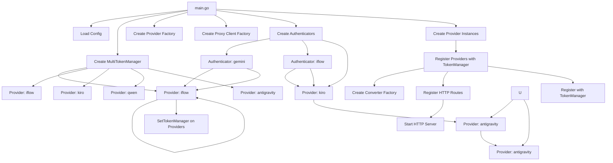
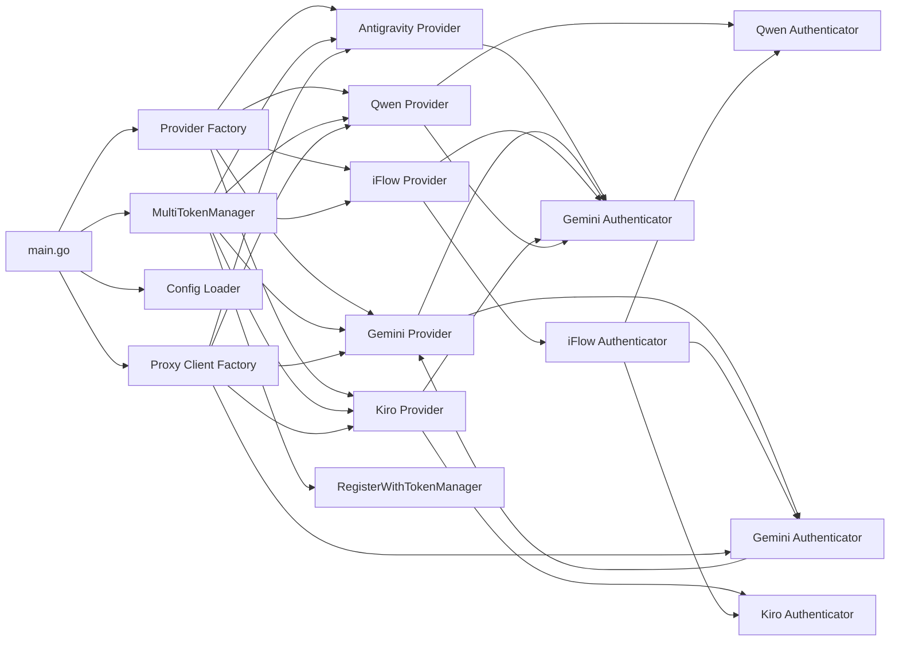

# Implementation Plan: Fix "Token Manager Not Initialized" Authentication Error

## Executive Summary

This plan addresses the root cause of the "token manager not initialized" error by creating a proper main server entry point (`cmd/qwencoder-proxy/main.go`) that correctly initializes provider instances with token manager injection using `factory.RegisterWithTokenManager()`.

## Root Cause Analysis

The error occurs because:
1. The chat completion endpoint uses providers from a `provider.Factory`
2. These providers are created **without** token manager injection
3. When `gemini.Provider.GenerateContent()` is called, it tries to use `p.tokenManager.SelectTokenWithClient()`
4. Since `p.tokenManager` is `nil`, it falls back to the authenticator which fails

**Key Finding**: The `multiTokenManager` IS initialized in `restapi/rest_api.go:NewServer()` (lines 101, 104), but it's never passed to the provider factory or used to create provider instances.

## File Structure Changes

```
cmd/qwencoder-proxy/
├── main.go                    # NEW: Main server entry point
```

## Architecture Overview



## 1. Main Server Entry Point

### File: `cmd/qwencoder-proxy/main.go`

#### Configuration Loading

The server will load configuration from:
1. Environment variables (via `config.LoadConfig()`)
2. Command-line flags for overrides

#### Key Configuration Parameters

| Parameter | Environment Variable | Default | Description |
|-----------|-------------------|---------|-------------|
| `PORT` | `PORT` | `8143` | HTTP server port |
| `DEBUG` | `DEBUG` | `false` | Enable debug logging |
| `CREDENTIALS_DIR` | `CREDENTIALS_DIR` | `.credentials` | Directory for token storage |

#### Pseudocode

```go
package main

import (
    "context"
    "flag"
    "fmt"
    "net/http"
    "os"
    "os/signal"
    "syscall"
    
    "github.com/sunbankio/qwencoder-proxy/auth"
    "github.com/sunbankio/qwencoder-proxy/config"
    "github.com/sunbankio/qwencoder-proxy/converter"
    "github.com/sunbankio/qwencoder-proxy/logging"
    "github.com/sunbankio/qwencoder-proxy/provider"
    "github.com/sunbankio/qwencoder-proxy/proxy"
)

func main() {
    // Parse command-line flags
    port := flag.String("port", "", "Server port (default: 8143)")
    debug := flag.Bool("debug", false, "Enable debug logging")
    flag.Parse()
    
    // Load configuration from environment
    cfg := config.LoadConfig()
    
    // Override with command-line flags
    if *port != "" {
        cfg.Server.Port = *port
    }
    if *debug {
        cfg.Logging.IsDebugMode = true
    }
    
    // Initialize logger
    logger := logging.NewLogger()
    if cfg.Logging.IsDebugMode {
        logger.DebugLog("Debug mode enabled")
    }
    
    // Create multi-token manager
    multiTokenMgr := auth.NewMultiTokenManager(logger)
    if err := multiTokenMgr.Initialize(); err != nil {
        logger.ErrorLog("Failed to initialize multi-token manager: %v", err)
        os.Exit(1)
    }
    
    // Start refresh schedulers
    if err := multiTokenMgr.Start(); err != nil {
        logger.ErrorLog("Failed to start multi-token manager: %v", err)
        os.Exit(1)
    }
    
    // Set credentials directory
    multiTokenMgr.SetCredentialsDir(cfg.CredentialsDir)
    
    // Create proxy client factory for proxy-aware HTTP clients
    proxyClientFactory := config.NewProxyAwareHTTPClientFactory(
        config.HTTPClientConfig,
        logger,
    )
    
    // Create provider factory
    providerFactory := provider.NewFactory()
    
    // Create converter factory
    converterFactory := converter.NewFactory()
    
    // Initialize providers with token manager injection
    if err := initializeProviders(providerFactory, multiTokenMgr, proxyClientFactory, logger); err != nil {
        logger.ErrorLog("Failed to initialize providers: %v", err)
        os.Exit(1)
    }
    
    // Create HTTP mux and register routes
    mux := http.NewServeMux()
    
    // Register OpenAI-compatible routes
    proxy.RegisterOpenAIRoutes(mux, providerFactory, converterFactory)
    
    // Register provider-specific routes
    proxy.RegisterProviderSpecificRoutes(mux, providerFactory, converterFactory)
    
    // Register native provider routes
    registerNativeRoutes(mux, providerFactory)
    
    // Register OAuth REST API routes (for token management UI)
    registerOAuthRoutes(mux, multiTokenMgr, logger)
    
    // Apply middleware (CORS, logging)
    handler := applyMiddleware(mux, logger, cfg)
    
    // Create server address
    addr := ":" + cfg.Server.Port
    
    // Setup graceful shutdown
    sigChan := make(chan os.Signal, 1)
    signal.Notify(sigChan, os.Interrupt, syscall.SIGTERM)
    
    // Start server in goroutine
    errChan := make(chan error, 1)
    go func() {
        defer func() {
            if r := recover(); r != nil {
                logger.ErrorLog("Panic recovered: %v", r)
            }
        }()
        errChan <- http.ListenAndServe(addr, handler)
    }()
    
    // Wait for shutdown or error
    select {
    case err := <-errChan:
        logger.ErrorLog("Server error: %v", err)
        os.Exit(1)
    case sig := <-sigChan:
        logger.InfoLog("Received signal %v, shutting down...", sig)
        multiTokenMgr.Stop()
        os.Exit(0)
    }
}
```

## 2. Provider Initialization

### Provider Initialization Function

```go
func initializeProviders(
    factory *provider.Factory,
    multiTokenMgr *auth.MultiTokenManager,
    proxyClientFactory *config.ProxyAwareHTTPClientFactory,
    logger *logging.Logger,
) error {
    // Register provider configurations with multi-token manager
    if err := registerProviderConfigs(multiTokenMgr); err != nil {
        return fmt.Errorf("failed to register provider configs: %w", err)
    }
    
    // Create and register Gemini provider
    geminiAuth := auth.NewGeminiAuthenticator(nil)
    geminiAuth.SetMultiTokenManager(multiTokenMgr)
    geminiProvider := gemini.NewProvider(geminiAuth)
    factory.RegisterWithTokenManager(geminiProvider, multiTokenMgr.GetTokenManager("gemini"))
    
    // Create and register iFlow provider
    iflowAuth := auth.NewIFlowAuthenticator(nil)
    iflowAuth.SetMultiTokenManager(multiTokenMgr)
    iflowProvider := iflow.NewProvider(iflowAuth)
    factory.RegisterWithTokenManager(iflowProvider, multiTokenMgr.GetTokenManager("iflow"))
    
    // Create and register Kiro provider
    kiroAuth := auth.NewKiroAuthenticator(nil)
    kiroAuth.SetMultiTokenManager(multiTokenMgr)
    kiroProvider := kiro.NewProvider(kiroAuth)
    factory.RegisterWithTokenManager(kiroProvider, multiTokenMgr.GetTokenManager("kiro"))
    
    // Create and register Qwen provider
    qwenProvider := qwen.NewProviderWithTokenManager(
        multiTokenMgr.GetTokenManager("qwen"),
        logger,
    )
    factory.RegisterWithTokenManager(qwenProvider, multiTokenMgr.GetTokenManager("qwen"))
    
    // Create and register Antigravity provider
    antigravityAuth := auth.NewGeminiAuthenticator(nil)
    antigravityAuth.SetMultiTokenManager(multiTokenMgr)
    antigravityProvider := antigravity.NewProvider(antigravityAuth)
    factory.RegisterWithTokenManager(antigravityProvider, multiTokenMgr.GetTokenManager("antigravity"))
    
    // Populate model-to-provider mappings
    ctx := context.Background()
    if err := factory.PopulateModelProviders(ctx); err != nil {
        logger.WarningLog("Failed to populate model providers: %v", err)
        // Continue anyway - providers have hardcoded models
    }
    
    logger.InfoLog("All providers initialized successfully")
    return nil
}
```

### Provider Configuration Registration

```go
func registerProviderConfigs(multiTokenMgr *auth.MultiTokenManager) error {
    // Register Gemini provider config
    multiTokenMgr.RegisterProvider("gemini", auth.ProviderConfig{
        ID:     "gemini",
        Name:   "Google Gemini CLI",
        Flow:   "device_code",
        Scopes: []string{
            "https://www.googleapis.com/auth/cloud-platform",
            "https://www.googleapis.com/auth/userinfo.email",
            "https://www.googleapis.com/auth/userinfo.profile",
            "openid",
        },
    })
    
    // Register iFlow provider config
    multiTokenMgr.RegisterProvider("iflow", auth.ProviderConfig{
        ID:     "iflow",
        Name:   "iFlow",
        Flow:   "device_code",
        Scopes: []string{
            "openid",
            "email",
            "profile",
        },
    })
    
    // Register Kiro provider config
    multiTokenMgr.RegisterProvider("kiro", auth.ProviderConfig{
        ID:     "kiro",
        Name:   "Kiro (Claude)",
        Flow:   "manual", // Kiro uses pre-existing AWS SSO credentials
        Scopes: []string{},
    })
    
    // Register Qwen provider config
    multiTokenMgr.RegisterProvider("qwen", auth.ProviderConfig{
        ID:     "qwen",
        Name:   "Qwen",
        Flow:   "device_code",
        Scopes: []string{
            "openid",
            "email",
            "profile",
        },
    })
    
    // Register Antigravity provider config
    multiTokenMgr.RegisterProvider("antigravity", auth.ProviderConfig{
        ID:     "antigravity",
        Name:   "Google Antigravity",
        Flow:   "device_code",
        Scopes: []string{
            "https://www.googleapis.com/auth/cloud-platform",
            "https://www.googleapis.com/auth/userinfo.email",
            "https://www.googleapis.com/auth/userinfo.profile",
            "openid",
        },
    })
    
    return nil
}
```

### Provider Constructor Parameters

| Provider | Constructor | Authenticator Type | Token Manager Required |
|----------|-------------|---------------------|------------------------|
| **Gemini** | `gemini.NewProvider(authenticator *auth.GeminiAuthenticator)` | Yes |
| **iFlow** | `iflow.NewProvider(authenticator *auth.IFlowAuthenticator)` | Yes |
| **Kiro** | `kiro.NewProvider(authenticator *auth.KiroAuthenticator)` | Yes |
| **Qwen** | `qwen.NewProviderWithTokenManager(tokenManager, logger)` | Yes (custom) |
| **Antigravity** | `antigravity.NewProvider(authenticator *auth.GeminiAuthenticator)` | Yes |

## 3. Route Registration

### Route Registration Function

```go
func registerNativeRoutes(mux *http.ServeMux, factory *provider.Factory) {
    // Register Gemini native routes
    geminiProvider, err := factory.Get(provider.ProviderGeminiCLI)
    if err == nil {
        mux.Handle("/gemini/", proxy.NewGeminiHandler(geminiProvider.(*gemini.Provider)))
    }
    
    // Register Anthropic/Kiro native routes
    kiroProvider, err := factory.Get(provider.ProviderKiro)
    if err == nil {
        mux.Handle("/anthropic/", proxy.NewAnthropicHandler(kiroProvider.(*kiro.Provider)))
    }
    
    // Register Qwen native routes (if needed)
    qwenProvider, err := factory.Get(provider.ProviderQwen)
    if err == nil {
        mux.Handle("/qwen/", proxy.NewQwenHandler(qwenProvider.(*qwen.Provider)))
    }
    
    // Register Antigravity native routes
    antigravityProvider, err := factory.Get(provider.ProviderAntigravity)
    if err == nil {
        mux.Handle("/antigravity/", proxy.NewAntigravityHandler(antigravityProvider.(*antigravity.Provider)))
    }
}
```

### Route Registration with Token Manager Support

The existing `proxy.RegisterGeminiRoutesWithTokenManager()` method should be used:

```go
// Instead of:
mux.Handle("/gemini/", proxy.NewGeminiHandler(geminiProvider))

// Use:
mux.Handle("/gemini/", proxy.NewGeminiHandlerWithTokenManager(
    geminiProvider,
    multiTokenMgr.GetTokenManager("gemini"),
))
```

## 4. Configuration Integration

### Environment Variable Configuration

The existing `config.LoadConfig()` function already handles environment variables. We should extend it to support:

| New Variable | Description | Default |
|--------------|-------------|---------|
| `CREDENTIALS_DIR` | Directory for token storage | `.credentials` |
| `PROXY_CACHE_SIZE` | Max proxy client cache size | `50` |

### Extended Config Structure

```go
type ServerConfig struct {
    Port            string
    CredentialsDir   string  // NEW: Directory for token storage
}

type HTTPClientConfig struct {
    // ... existing fields ...
}

type Config struct {
    Server      ServerConfig
    HTTPClient  HTTPClientConfig
    Logging     LoggingConfig
    OAuthServer OAuthServerConfig
    // Note: OAuthServer config is separate for the REST API server
}
```

## 5. Error Handling

### Initialization Error Handling

```go
func initializeProviders(...) error {
    // ... provider creation code ...
    
    // Log and handle each provider initialization failure gracefully
    for _, providerInit := range []providerInit{
        {name: "gemini", init: func() error {
            auth := auth.NewGeminiAuthenticator(nil)
            auth.SetMultiTokenManager(multiTokenMgr)
            return nil
        }},
        {name: "iflow", init: func() error {
            auth := auth.NewIFlowAuthenticator(nil)
            auth.SetMultiTokenManager(multiTokenMgr)
            return nil
        }},
        // ... etc ...
    } {
        if err := providerInit.init(); err != nil {
            logger.ErrorLog("Failed to initialize %s provider: %v", providerInit.name, err)
            // Continue with other providers
        }
    }
    
    // Ensure at least one provider initialized
    providerTypes := factory.ListTypes()
    if len(providerTypes) == 0 {
        return fmt.Errorf("no providers initialized successfully")
    }
    
    return nil
}
```

### Runtime Error Handling

```go
// In HTTP handlers, check for nil token manager
if p.tokenManager == nil {
    logger.ErrorLog("[Provider] Token manager not initialized for %s", p.Name())
    http.Error(w, "Internal server error: Token manager not initialized")
    return
}
```

### Graceful Degradation

If a provider fails to initialize:
- Log the error
- Continue with other providers
- Return 503 Service Unavailable for requests to that provider
- Allow manual re-authentication via OAuth REST API

## 6. Testing Strategy

### Unit Tests

#### Test File: `cmd/qwencoder-proxy/main_test.go`

```go
func TestMainInitialization(t *testing.T) {
    // Test configuration loading
    cfg := config.LoadConfig()
    assert.NotNil(t, cfg)
    
    // Test multi-token manager creation
    logger := logging.NewLogger()
    multiTokenMgr := auth.NewMultiTokenManager(logger)
    assert.NoError(t, multiTokenMgr.Initialize())
    
    // Test provider factory creation
    factory := provider.NewFactory()
    assert.NotNil(t, factory)
    
    // Test provider initialization
    err := initializeProviders(factory, multiTokenMgr, nil, logger)
    assert.NoError(t, err)
    
    // Verify token managers are set
    for _, providerType := range []provider.ProviderType{
        provider.ProviderGeminiCLI,
        provider.ProviderIFlow,
        provider.ProviderKiro,
        provider.ProviderQwen,
        provider.ProviderAntigravity,
    } {
        provider, _ := factory.Get(providerType)
        if tokenAware, ok := provider.(provider.TokenManagerAware); ok {
            // This is a compile-time check, we can't test the internal state
            // But we can verify the provider exists
            assert.NotNil(t, provider)
        }
    }
}
```

### Integration Tests

#### Test File: `tests/token_manager_integration_test.go`

```go
func TestTokenManagerInjection(t *testing.T) {
    // Create test server with token manager
    logger := logging.NewLogger()
    multiTokenMgr := auth.NewMultiTokenManager(logger)
    
    // Initialize multi-token manager
    assert.NoError(t, multiTokenMgr.Initialize())
    defer multiTokenMgr.Stop()
    
    // Add a test token
    testToken := auth.ProviderToken{
        ID:           "test-token-1",
        AccessToken:  "test-access-token",
        RefreshToken: "test-refresh-token",
        TokenType:    "Bearer",
        ExpiryDate:   time.Now().Add(1 * time.Hour).UnixMilli(),
        Email:        "test@example.com",
        Healthy:       true,
        HealthScore:   1.0,
        LastUsed:      time.Now().UnixMilli(),
        CreatedAt:     time.Now().UnixMilli(),
        ErrorCount:    0,
    }
    
    // Register provider config
    multiTokenMgr.RegisterProvider("gemini", auth.ProviderConfig{
        ID:     "gemini",
        Name:   "Google Gemini CLI",
        Flow:   "device_code",
        Scopes: []string{
            "https://www.googleapis.com/auth/cloud-platform",
        },
    })
    
    // Save token
    store, _ := multiTokenMgr.GetTokenStore("gemini")
    assert.NoError(t, store.AddToken(testToken))
    
    // Create provider with token manager
    geminiAuth := auth.NewGeminiAuthenticator(nil)
    geminiAuth.SetMultiTokenManager(multiTokenMgr)
    geminiProvider := gemini.NewProvider(geminiAuth)
    
    // Verify token manager is set
    assert.NotNil(t, geminiProvider.tokenManager)
    
    // Test that token manager is accessible
    retrievedToken, err := geminiProvider.tokenManager.SelectToken()
    assert.NoError(t, err)
    assert.Equal(t, testToken.ID, retrievedToken.ID)
}
```

### End-to-End Tests

Create a test that simulates a chat completion request:

1. Start the test server with token manager
2. Add a test token via OAuth REST API
3. Send a chat completion request
4. Verify the request succeeds without "token manager not initialized" error

## 7. Implementation Order

### Phase 1: Core Infrastructure (Foundation)
1. Extend `config/config.go` with `CredentialsDir` field
2. Extend `config/loader.go` to load `CREDENTIALS_DIR` from environment

### Phase 2: Main Entry Point
3. Create `cmd/qwencoder-proxy/main.go` with:
   - Configuration loading
   - Multi-token manager initialization
   - Provider factory creation
   - Provider initialization with token manager injection
   - Route registration

### Phase 3: Provider Initialization
4. Implement `initializeProviders()` function
5. Implement `registerProviderConfigs()` function
6. Create provider instances with proper authenticators
7. Use `factory.RegisterWithTokenManager()` for all providers

### Phase 4: Route Registration
8. Implement `registerNativeRoutes()` function
9. Register OpenAI-compatible routes
10. Register provider-specific routes
11. Register native provider routes

### Phase 5: Error Handling
12. Add initialization error handling
13. Add runtime nil checks in providers
14. Implement graceful degradation

### Phase 6: Testing
15. Create unit tests for initialization
16. Create integration tests for token manager injection
17. Create end-to-end test for chat completion

### Phase 7: Documentation
18. Update README.md with new entry point
19. Document environment variables
20. Add troubleshooting section for token manager issues

## 8. Dependencies Between Components



## 9. Potential Edge Cases

### Edge Case 1: Provider Initialization Failure
**Scenario**: One provider fails to initialize (e.g., config error)
**Handling**:
- Log the error
- Continue with other providers
- Return 503 for requests to failed provider
- Allow manual re-authentication via OAuth REST API

### Edge Case 2: Token Manager Not Available
**Scenario**: Token manager returns error during provider initialization
**Handling**:
- Log the error
- Initialize provider without token manager (degraded mode)
- Provider will fall back to authenticator (backward compatibility)
- Log warning about degraded functionality

### Edge Case 3: No Valid Tokens
**Scenario**: All tokens are expired or missing
**Handling**:
- Provider will fail with authentication error
- Return 401 Unauthorized to client
- Include `WWW-Authenticate` header with `Bearer` realm
- Client should trigger re-authentication flow

### Edge Case 4: Proxy Connection Failure
**Scenario**: Proxy configured but connection fails
**Handling**:
- Provider detects proxy error via `isProxyError()`
- Updates proxy health via `tokenManager.UpdateProxyHealth()`
- Returns structured error response with proxy details
- Token health score decreases
- Next request may use different token

### Edge Case 5: Multiple Tokens Available
**Scenario**: Multiple tokens configured for a provider
**Handling**:
- Token manager selects based on configured strategy (round-robin, least-used, etc.)
- Failed requests mark token as unhealthy
- Healthy tokens get higher priority
- Automatic failover to healthy tokens

## 10. Configuration Examples

### Example `.env` File

```bash
# Server Configuration
PORT=8143
DEBUG=false
CREDENTIALS_DIR=.credentials

# HTTP Client Configuration
MAX_IDLE_CONNS=50
MAX_IDLE_CONNS_PER_HOST=50
IDLE_CONN_TIMEOUT_SECONDS=180
REQUEST_TIMEOUT_SECONDS=300
STREAMING_TIMEOUT_SECONDS=900
READ_TIMEOUT_SECONDS=45
```

### Example Command-Line Usage

```bash
# Start server with default configuration
./qwencoder-proxy

# Start server with custom port
./qwencoder-proxy --port=9000

# Start server with debug logging
./qwencoder-proxy --debug
```

## 11. Migration Path

### From Current State

The current system has:
- `restapi/rest_api.go` - OAuth REST API server (port 8080)
- No main entry point for the proxy server
- Providers created without token manager injection

### To New State

The new system will have:
- `cmd/qwencoder-proxy/main.go` - Main proxy server entry point (port 8143)
- Proper provider initialization with token manager injection
- Unified server handling both proxy and OAuth REST API

### Migration Strategy

1. **Backward Compatibility**: Keep `restapi/rest_api.go` for OAuth REST API
2. **New Entry Point**: Create `cmd/qwencoder-proxy/main.go` for proxy server
3. **Gradual Migration**:
   - Initially, both servers can run
   - Eventually, consolidate into single server
4. **Configuration**: Use environment variables to control which server runs

### Migration Steps

1. Create `cmd/qwencoder-proxy/main.go` (this plan)
2. Update README.md to document new entry point
3. Update CI/CD to build new binary
4. Test both servers independently
5. Plan consolidation timeline

## 12. Verification Checklist

After implementation, verify:

- [ ] `cmd/qwencoder-proxy/main.go` compiles without errors
- [ ] All providers are created with `factory.RegisterWithTokenManager()`
- [ ] Token managers are properly injected into providers
- [ ] `gemini.Provider.tokenManager` is not nil after initialization
- [ ] Chat completion request succeeds without "token manager not initialized" error
- [ ] Proxy-aware client selection works correctly
- [ ] Token health tracking updates on proxy errors
- [ ] Graceful shutdown stops multi-token manager
- [ ] Unit tests pass for initialization logic
- [ ] Integration test passes for token manager injection
- [ ] README.md documents new entry point
- [ ] `.env.example` file shows configuration options

## 13. Troubleshooting

### Issue: "Token manager not initialized" Error

**Symptoms**:
- Chat completion requests fail with error
- Log shows: "token manager not initialized"

**Diagnosis**:
1. Check if `cmd/qwencoder-proxy/main.go` exists
2. Verify providers are created with `factory.RegisterWithTokenManager()`
3. Verify multi-token manager is initialized before provider creation
4. Check that `multiTokenMgr.Start()` is called

**Solution**:
1. Ensure `cmd/qwencoder-proxy/main.go` is being used (not `restapi/rest_api.go`)
2. Check environment variables are set correctly
3. Verify provider initialization order:
   - Multi-token manager must be initialized first
   - Then provider configs must be registered
   - Then providers must be created with token managers
   - Then providers must be registered with token managers

### Issue: Proxy Connection Failures

**Symptoms**:
- Requests fail with proxy-related errors
- Token health scores decrease

**Diagnosis**:
1. Check proxy configuration in token metadata
2. Verify proxy server is accessible
3. Check proxy credentials are correct
4. Review logs for specific error type

**Solution**:
1. Remove or fix proxy configuration for failing tokens
2. Test proxy server connectivity
3. Consider using direct connection if proxy is unreliable

### Issue: Provider Not Responding

**Symptoms**:
- Requests timeout or return 500 errors
- No specific error message

**Diagnosis**:
1. Check provider logs for errors
2. Verify provider is healthy using `/v1/models` endpoint
3. Check token is not expired
4. Test with provider-specific route

**Solution**:
1. Restart server
2. Check multi-token manager logs
3. Verify token is valid and not expired
4. Try alternative provider if available
